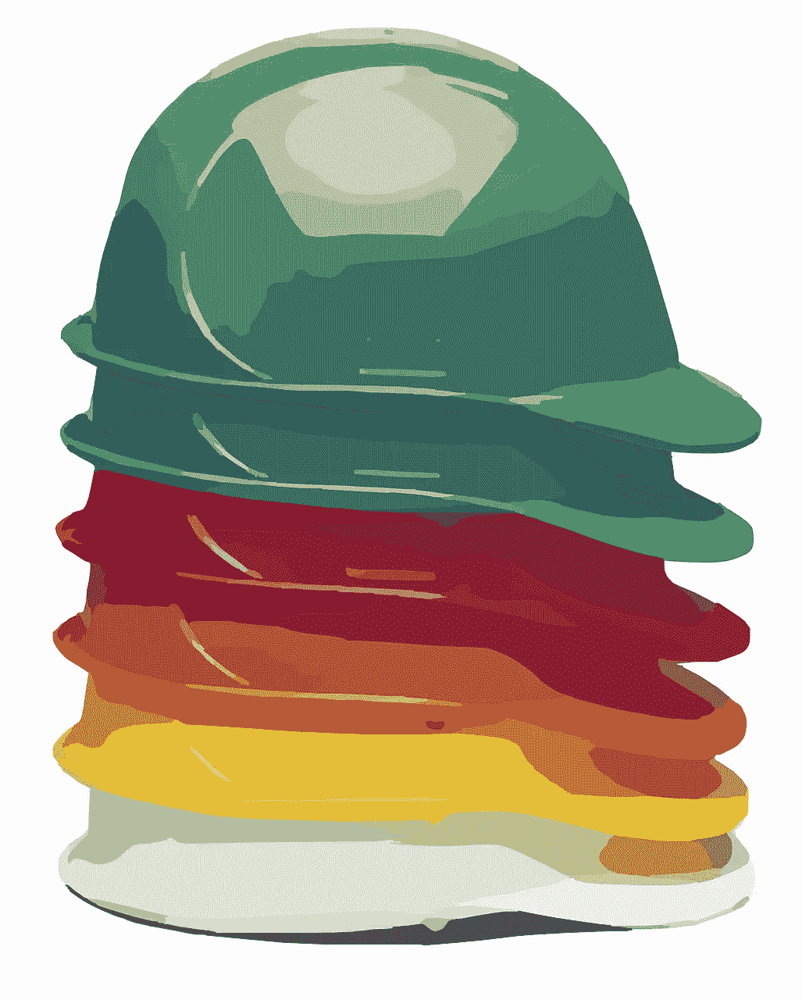
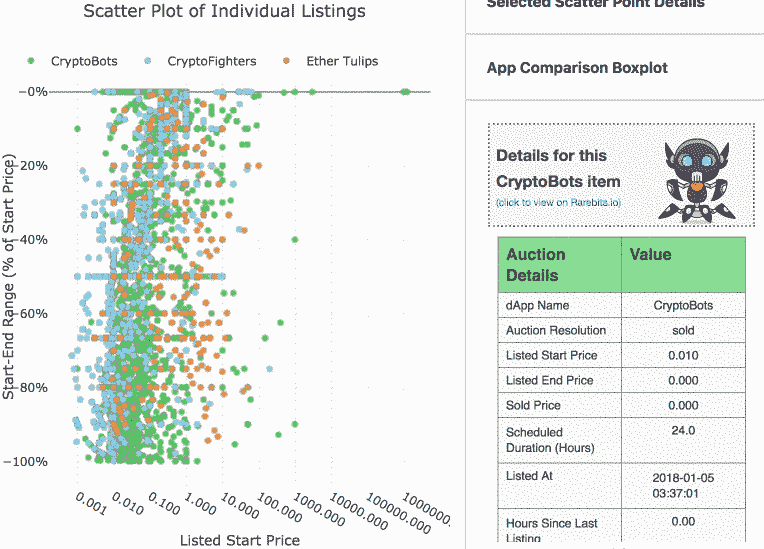

# 发酵数据可视化:自学 Python 的一个夏天

> 原文：<https://towardsdatascience.com/fermenting-data-visualization-a-summer-of-self-directed-python-learning-7d78dfd10462?source=collection_archive---------14----------------------->

我已经烤面包八年了。在那段时间里，我在食谱上画了一个非常宽泛的路线。但在我的创作中，无论是奶油蛋卷、芋头面包还是 focaccia，有一个重要的不变因素是我使用了活性干酵母。而且理由很充分！商业脱水酵母不油腻，反应灵敏，使烘焙成为一天的活动。

脱水酵母的主要替代品是培养活酵母培养物，也称为发酵剂。对我来说，这是一个令人生畏的复杂性飞跃。与耐储存的干酵母不同，发酵剂是一种活的、动态的微生物群落，需要定期喂食以保持活力。用活菌烘焙可以将你的烘焙周期从三个小时增加到三十个小时——整整一个数量级！

My winsome loaf

但是一片新鲜的酸面团是有嚼劲的，扑鼻的，美味的。今年夏天，当我发现自己有多余的空闲时间时，我决定尝试一下酸奶。[抓了野生曲](https://www.localharvest.org/blog/18258/entry/sourdough_starter_from_scratch_capturing)，自学面团水合，买了[醒发筐](https://www.thekitchn.com/bakers-tools-proofing-baskets-55238)。这是一个耗费时间的过程，但我在这个过程中学到了很多，最终的产品也不算太差。

然而，ourdough 并不是我唯一的暑期项目！在同一时期，我也为自己设定了一个目标，用[Python 编程语言](https://en.wikipedia.org/wiki/Python_(programming_language))来发展自己的技能。Python 是数据科学事实上的脚本语言，这也是我目前的工作领域。就像我对脱水酵母的依赖一样，我过去一直避免使用 Python，而是倾向于使用简单的[业务](https://products.office.com/en-us/excel) [智能](https://www.tableau.com/) [工具](https://www.periscopedata.com/)(与[结构化查询语言](https://en.wikipedia.org/wiki/SQL)协同使用)来展现、可视化和发布见解。必要性和好奇心偶尔会促使我偶尔涉足 Python，通常是为了执行传统 BI 工具根本不可行的任务，例如访问 API 和管理不同的数据源。但是，总的来说，我很难证明花时间在 Python 中进行分析项目是合理的，否则利用现有的技术资源可以更有效地完成这些项目。

但就像烘焙酸面团一样，对我的领域有更基本了解的前景一直吸引着我。最大的障碍是找时间去追求它。同样，一个自由的夏天给了我这个机会。

# 构建方法

项目需要时间。更大的项目需要大量的时间。但是时间本身并不足以成功。对于自我指导的项目来说尤其如此，在那里陷阱可能很多。不切实际的目标会让你无法到达终点。定义不当的过程会让你原地打转。非目标导向的任务会只见树木不见森林。为了避免这些陷阱，我需要扩展我的关注点，而不仅仅是提高我的编程技能:我还需要兼职项目管理、冲刺规划、产品策略等等。

That’s a lot of hats!

为了驾驭这些职责，我选择借鉴一下科技行业围绕[目标设定](https://www.inc.com/michael-schneider/everyone-hates-setting-goals-heres-how-google-makes-it-easier-for-their-employees.html)的最佳实践。具体来说，我挑战自己说出我对这个项目的最高目标。以下是我想要完成的目标:

*   **学习:**特别是**，**我想学习 Python 编程语言的基础[分析](https://en.wikipedia.org/wiki/NumPy) [库](https://en.wikipedia.org/wiki/Pandas_(software))
*   学习之后，我想将这些知识应用到一个完全原创的项目制作中，让更多的观众感兴趣
*   最后，我希望自己能够成功地申请到一份需要这些技能的工作，并在这份工作中表现出色

除了帮助我让自己保持在正确的轨道上，这些目标有望为在此过程中做出的任何低级决策提供一些清晰度。从理论上讲，任何一项任务都应该服务于这三个目标中的至少一个；如果不是，我很可能偏离了轨道！

既然我已经陈述了我的目标，我需要想出如何实现它们。这需要一点耐心、研究和计划，但最终将有助于保持我的诚实和正确。概括地说，我开发了以下路线图。：

1.  一个准备阶段，在这个阶段我将遵循一个有指导的学习课程。这样做有助于我的学习目标。
2.  一个**项目**阶段，在这个阶段，我将把我的知识应用到一个自我构思的、原创的任务中。除了巩固我的**知识**，这个阶段也将满足我的**建设**目标。
3.  一个**出版**阶段，在这个阶段，我会考虑将我的作品分发给观众的最佳方式。这有望推进我的职业目标。

# **1。准备阶段**

为了构建我的项目，我首先需要学习*如何*构建它。在实践中，这意味着进行线性的、基于课程计划的学习，这在学术界很常见。谢天谢地，这种资源在互联网上随处可见。我的主要工具是[以锻炼为重点的在线课程](https://www.dataquest.io/)、[技术手册](http://shop.oreilly.com/product/0636920050896.do)，以及我发现自己正在努力解决的特定主题的博客/视频博客。

My other study desk

我不会把我的清单作为一个说明性的清单——每个人都有自己喜欢的学习方式。事实上，我优先考虑的甚至不是找到最好的资源。相反，我想找到最能让我顺利完成**项目**阶段的资源，而不会筋疲力尽。就这一点而言，如果你是那种长时间坐在电脑显示器前会感到疲惫的人，我强烈建议你买一本实体书。确实有一些时候，我认为我学习累坏了，但事实上我只是需要走出家门，在公园的长椅上继续我的学习。呼吸新鲜空气可以创造奇迹！

在许多方面，这一阶段是三个阶段中最直接的。这种方法的结构化和规定的本质意味着我的日常目标通常很简单，比如“花四个小时做 Python 练习”我所有的决定都是战术性的(“我如何应用这个 lambda 函数”)，而不是战略性的(“我下一步做什么？”)，这是我经常欣赏的。

也就是说，一种预定的、僵化的学习方法也有其缺点。在最糟糕的日子里，我感觉自己就像跑步机上的老鼠。从严格的功利主义角度来看，我发现这些练习的价值随着远离学科的基础而减少。像定制函数和 IO 管理这样的基本概念可能与我最终从事的项目密切相关。相比之下，花一个下午的时间对 Matplolib 图表应用自定义样式就更不合理了。

在这一点上，我将提供一个重要的建议:b **你一定要监控自己的疲劳程度**！实现一个特定的目标可能有很多方法，尝试不同的方法可能是突破和崩溃的区别。

# 2.项目阶段

与其他学科相比，从物质的角度来看，编程是非常容易理解的。理论和应用之间几乎没有逻辑障碍。出于这个原因，人们可以相当快地进入基于项目的学习。我决定，当我超越 Python 的中级功能和它的核心分析库时，我将停止系统化的学习，并将我的重点放在特定项目的开发上。以下是我这样做的主要原因:

*   动机:我认为一个目标导向的、专注的项目是完美的动机助推器。我已经陷入了“被动学习疲劳”的单调沉闷状态，足以知道什么时候改变是合适的。
*   **重复:**我不擅长媒体的重复消费。我很少重新看电影，我不重新阅读书籍，我可能不会喜欢重温相同的编码练习。但我也知道重复是巩固知识的重要工具。鉴于我对死记硬背的厌恶，我将一个项目视为一种不错的方式，来欺骗自己在不同媒介的伪装下重温以前的概念。
*   **陈述:**我希望我的过程能够以总结和体现我所有的学习成果而告终。虽然理论上一个课程证书可以满足这个目的，但是我相信一些更独特的东西将会提供一个生动的，容易理解的表现。

One of the earliest known Python applications

当然，这种方法说起来容易做起来难。为一个项目想出一个好主意可能很难，尤其是如果你希望它与一套特定的应用知识重叠的话。也不能保证每个项目都会成功。此外，项目的真实范围可能很难衡量，因此很难预算必要的时间和精力(可能比你想象的要多)。但是，正是这些挑战的存在，使得一个令人印象深刻的项目在投资组合中更加有价值:它的存在本身就可以证明你的奉献精神、创造力和毅力。

对于有抱负的数据鼓吹者来说，有大量的在线资源可以从中找到灵感和材料资源。 [Kaggle](https://www.kaggle.com/) 是一个特别丰富的公共数据集库，包含了人们如何使用它们的例子。

就我个人而言，我有机会利用来自 [Rarebits](http://www.rarebits.io) 的好人的数据集，它包含 Etherium 平台上[加密收藏品拍卖数据的标准化表示。虽然我通过交易进行数据分析，但我很快意识到我个人对加密拍卖分类账的兴趣有限，相反，我更感兴趣的是如何在这个数据集上促进***分析。有了这些知识，我决定使用***](https://coincentral.com/future-of-erc-721-and-unique-assets/) ***[Potly 的 Dash 库](https://plot.ly/products/dash/)来创建一个在线数据可视化仪表板。Dash 库为 web 浏览器中的交互式数据可视化提供了一种高度可定制、易于发布且以 Python 为中心的方法。***

***[你可以在这里看到输出](https://github.com/rosswait/dapp-plotly-dash)。***

******

***Interactive scatter visualization of crypto asset auction details***

# ***3.出版阶段***

***随着我的项目本身的完成，我的重点从编码转向了通信。具体来说，我需要思考谁是我的受众，以及我如何才能最有效地与他们沟通。我大致看到了四个可能对我的仪表板感兴趣的主要群体:Python 数据可视化社区、潜在雇主、密码收集爱好者和对自我导向学习感兴趣的人(尤其是围绕编码和数据分析主题)。这些观众中的每一个都有不同的兴趣。***

***Python 数据爱好者:这些观众最感兴趣的是我的作品的可访问性和可复制性。我想给他们提供干净的、公开的、文档完整的代码。***

*****潜在雇主**:除了技术能力的展示，潜在雇主可能会对诸如沟通、项目管理和战略思维等软技能感兴趣。***

*****自我导向的学习者**:这些观众主要对我对过程本身的观点和方法感兴趣。对他们来说，项目本身对于产生它的组织上层建筑来说可能是次要的。***

***加密爱好者:我与这些观众的主要目标是开发一个有趣的工具——也许是实用的。出于时间考虑，我不得不放弃对区块链本身的研究，因此我降低了对专业知识的标准，即“不要听起来像个白痴”***

***考虑到这些因素，我采取了以下步骤来从我的项目中获得最大的潜在效用:***

*   ***我使用谷歌应用引擎在网上发布了我的最终产品。这确保了不需要安装 Python 库和下载我的代码，人们可以简单地导航到网站来看我的最终产品。***
*   *****我把我的代码上传到 Github** 。这使得其他程序员(和有抱负的程序员)可以看到我是如何创建我的项目的。我广泛使用了[代码注释](https://en.wikipedia.org/wiki/Comment_(computer_programming))来帮助提供我的编码选择的上下文。***
*   *****我写了一个“自述”描述我的项目**。这份文档[，你可以在 Github 页面](https://github.com/rosswait/dapp-plotly-dash)上看到，为任何可能好奇的人提供了该项目的简要概述。除了技术上的考虑，我还提出了一点来提供数据集本身的背景。***
*   ***我接触了我的观众。我在 [Plotly 的 Dash 库](https://community.plot.ly/t/show-and-tell-blockchain-digital-good-auctions/12099)和 [Reddit 的 Etherium 开发社区的论坛上分享了我的项目。](https://www.reddit.com/r/ethdev/comments/95rec4/data_visualization_of_erc721_auctions/)通过这样做，我精心制作了一份针对特定受众的简短的定制信息。***

# ***下一步是什么？***

***现在这个项目已经成为过去，我可以很舒服地说，我对这个过程的进展很满意。在我分配给自己的时间范围内，我设法学习了相当多的 Python，制作了一个项目，我为自己的投资组合中有这个项目而自豪，甚至发现了一两件关于自我导向学习的事情。至于我的找工作……嗯，我刚刚开始着手这个过程。如果事情不顺利，我可以把我的职业生涯转向烘焙。***