# 更少的航班，更大的延误和 JetBlue 糟糕的一年:2017 年美国航空业的 17 张图表

> 原文：<https://towardsdatascience.com/fewer-flights-bigger-delays-and-a-bad-year-for-jetblue-17-charts-on-the-u-s-d718f867b351?source=collection_archive---------11----------------------->

美国航空公司这几年过得多姿多彩。随便看看头条:[拖客、](https://www.cnn.com/2017/04/10/travel/passenger-removed-united-flight-trnd/index.html)爆发动机、[大合并](https://www.usatoday.com/story/travel/flights/todayinthesky/2018/04/24/virgin-america-alaska-airlines-merger/546812002/)。

但是标题只是故事的一部分。为了更全面地了解美国航空旅行的现状，我们查阅了数据，并检查了超过 500 万次航班的记录。

这是我们的发现。

# 1.按城市划分的飞行痛苦

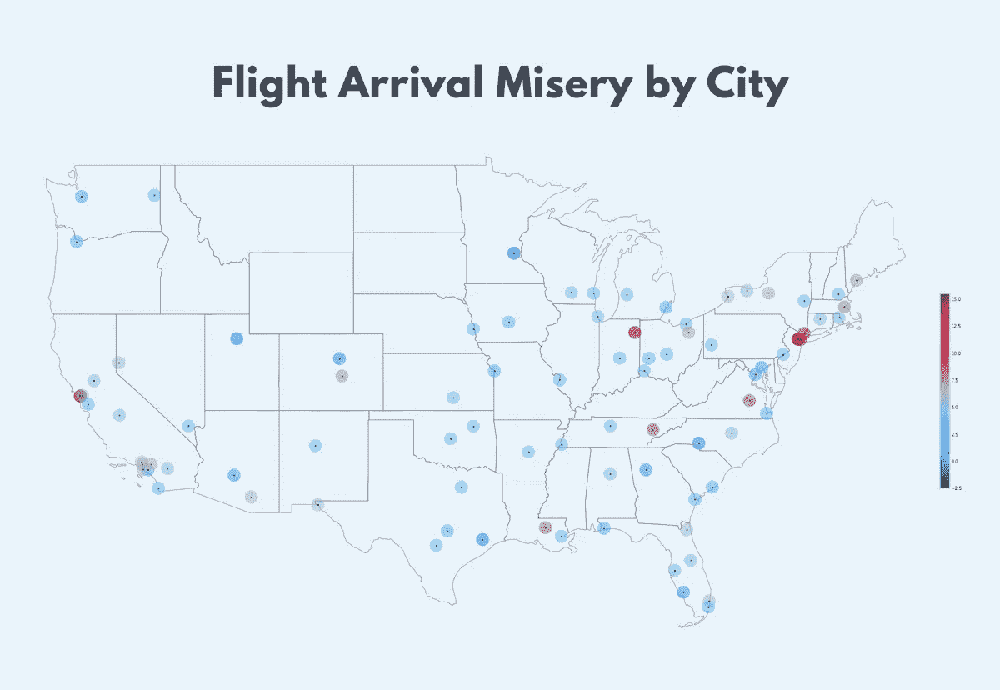

就晚点出发和到达时间而言，往返旅行最糟糕的城市是新泽西州的纽瓦克，其次是纽约和旧金山。同时，准时出发和到达的最佳城市是阿拉斯加的安克雷奇。

虽然有人会认为航班量与晚点的出发和到达密切相关，但实际上仍有一些航班量低的城市表现不佳。例如，印第安纳州韦恩堡的航班量不到纽约的 3%，但准点到达率却比纽约更低。路易斯安那州的巴吞鲁日和纽约州的怀特普莱恩斯也是如此；这两个城市的航班量都很低，但准点率却是所有城市中最低的。

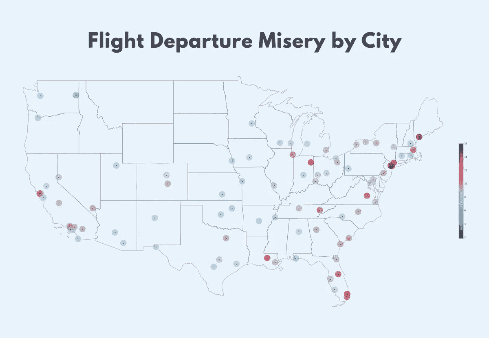

# 2.航班减少

如果 2018 年旅行感觉比以前更糟糕，那不仅仅是你的怀旧之言。自 2010 年以来，航空旅客可乘坐的航班数量每年减少 100 多万次[，而乘客数量却在增加](https://www.bts.gov/newsroom/2017-semi-annual-and-june-us-airline-traffic-data)。

这些数字是怎么加起来的？从好的方面来看，航空公司在填满所有座位方面做得更好了。2008 年，美国航空公司在国内航班上的座位里程达到了 79.74%。到 2017 年底，[这个数字已经上升到 84.57%](https://www.transtats.bts.gov/Data_Elements.aspx?Data=5) 。这意味着你不像 10 年前那样喜欢空着的中间座位。

但是还有另一个潜在的因素在起作用；航空公司缩小座位以增加载客量。当你把更多的乘客和托运行李费结合在一起，鼓励顾客把他们所有的东西都装进他们的随身行李时，难怪头顶行李箱空间的耗尽已经成为[一个常见的旅行头痛](https://www.marketwatch.com/story/your-airline-overhead-bins-may-now-be-treated-like-parking-spaces-2018-01-26)。

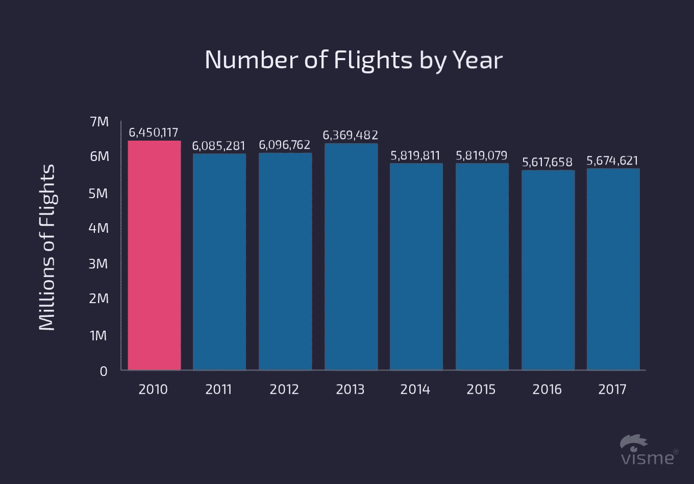

# 3.和更多的延迟

快速浏览一下航班准点性能统计，总体延误(蓝条)似乎自 2010 年以来一直保持相对稳定，2013 年和 2014 年有所上升。但是这种乐观的景象得益于[时间表填充](http://www.latimes.com/business/la-fi-airlines-padding-flight-times-20151125-story.html)——航空公司有意计划航班晚点以提高准点率的做法。据《华尔街日报》报道，达美航空[自 2009 年以来每年都在增加其日程安排。因此，许多航班提前到达。](https://www.wsj.com/articles/which-airlines-pad-their-schedules-the-most-1498662950)

当你把所有的早班航班都视为准点到达时，一个不好的模式出现了:实际延误(绿色条)在过去八年中呈上升趋势。

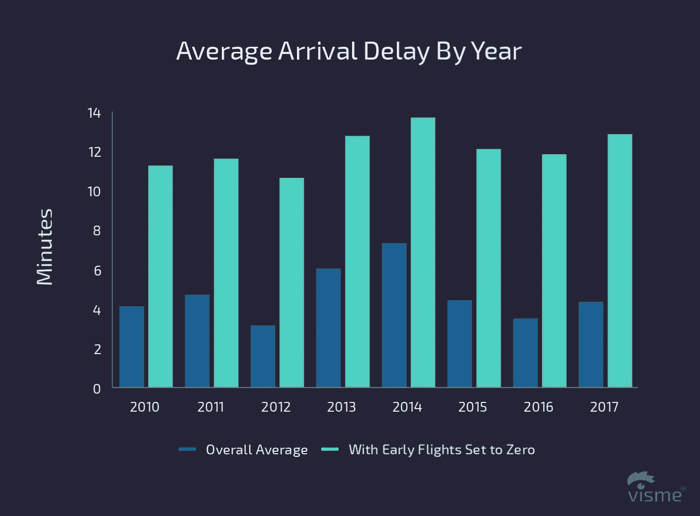

# 4.价格减免？

乍一看，整合时代似乎压低了美国主要航空公司旅客的平均票价。但是读一下小字。运输统计局的这一数据“只包括购票时支付的价格，不包括行李费等可选服务的费用。”

这是一个很大的警告，特别是在主要航空公司 2017 年近 30%的利润来自行李费的情况下。2016 年[的行李费为 42 亿美元](http://money.cnn.com/2017/05/02/news/companies/airline-baggage-fees/index.html)，2015 年[的行李费为 38 亿美元](https://thepointsguy.com/2016/05/airline-baggage-fees-2015/)，相比之下，这一数字达到了 46 亿美元。航空公司也找到了其他新颖的收费方式向消费者收费。在 2015 年第四季度，达美航空[销售“舒适+”座位赚了 1.25 亿美元，西南航空一年内在提前检票费用上赚了大约 2.6 亿美元](http://time.com/money/4501949/airlines-41-billion-fees/)。

因此，虽然节俭的旅行者可以找到比以前更好的交易，但普通旅行者会支付更多。

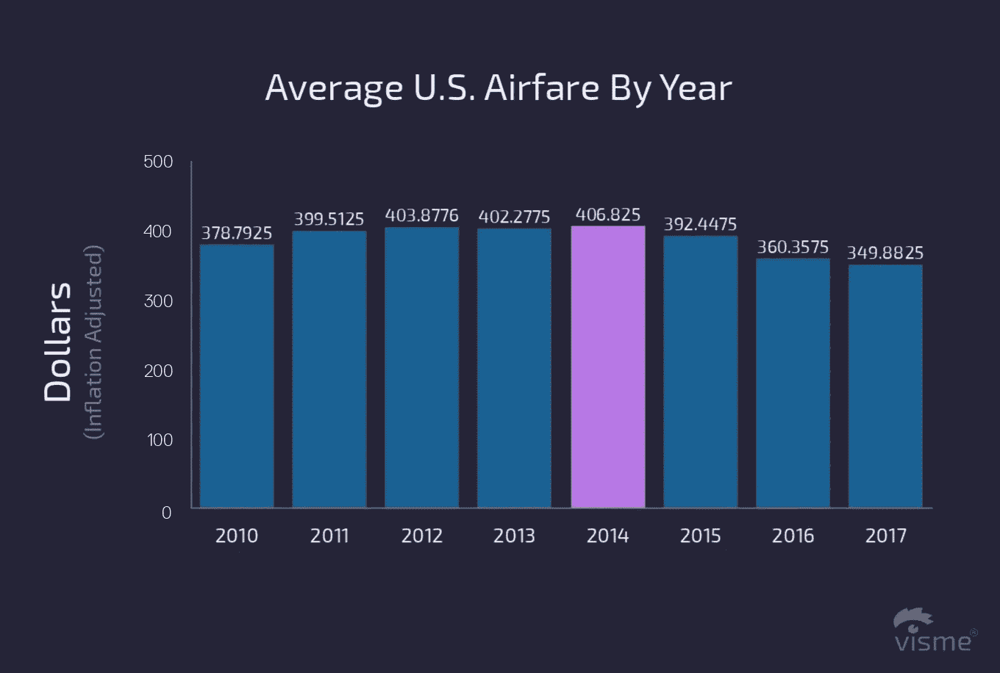

# 5.捷蓝航空经历了糟糕的 2017 年

唯一一家航班延误和取消统计数据比捷蓝航空更糟糕的航空公司是维珍美国航空公司[和已经不存在的维珍美国航空公司](https://www.usatoday.com/story/travel/flights/todayinthesky/2018/04/24/virgin-america-alaska-airlines-merger/546812002/)。即便如此，它至少在让飞机准时起飞方面做得更好。

另一方面，看看联合航空和达美航空的准点飞行数据。他们的起飞延误与大多数其他航空公司相似，但他们学会了如何在混乱中留下足够的缓冲。虽然批评调度填充是对系统的游戏是公平的，但达美航班在 2017 年有 85%的时间按时或提前到达，胜过除夏威夷航空公司以外的所有其他主要航空公司，夏威夷航空公司的网络更容易管理。

# 6.不，事实上捷蓝航空的 2017 年非常糟糕

根据 JetBlue 航班的规模和整个行业的平均取消率，JetBlue 应该有大约 950 次因运营商方面的问题而取消的航班。相反，该航空公司的人数几乎是这个数字的两倍(1805 人)。

情况变得更糟。航空公司还对天气和国家航空系统的延误进行过采样，这些延误有时是伪装的承运人延误。

雪上加霜的是，在所有仍在运营的美国主要航空公司中，捷蓝航空的准点率最低，在一个受欢迎的年度航空公司排名系统中，其排名下降了四位。

# 7.星期二=无机场忧郁日

如果你能灵活安排旅行时间，就准时到达和离开而言，周二和周六是一周中最可靠的日子。周五的延误最严重，其次是周一。

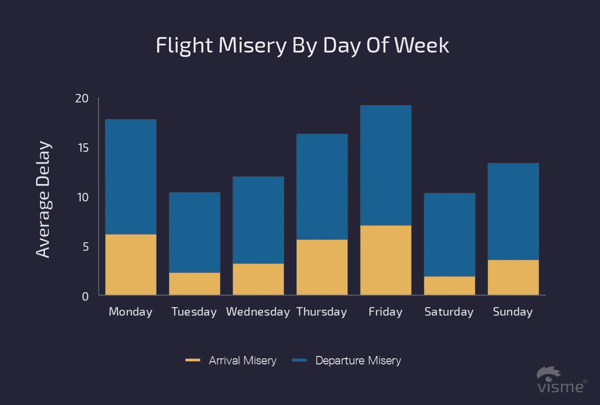

# 8.早走=少头疼

平均来说，航班起飞的时间越晚，延误越严重。这里的机械问题和那里的天气延迟一整天都在发生。但是，早点飞，一切运行良好。平均而言，午夜至早上 8 点之间起飞的航班往往会提前到达。

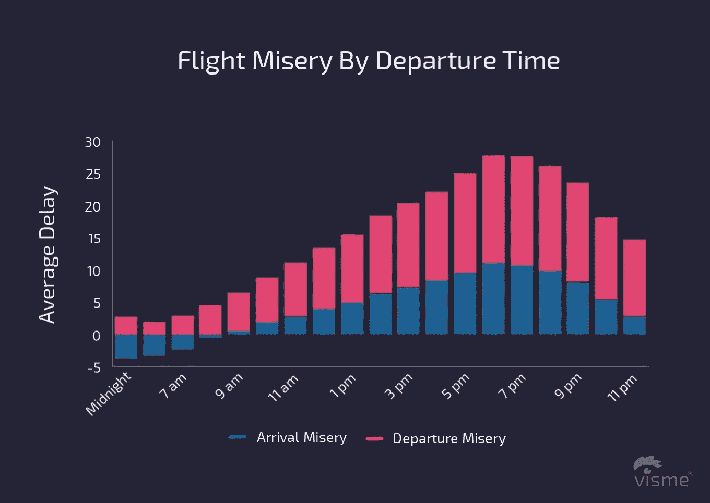

# 9.红眼航班准时到达

爱他们也好，恨他们也罢，凌晨降落的深夜航班一般都是准点的。平均而言，早上 6 点到 10 点之间的航班实际上会提前到达。

# 10.不要怪航班量

看一下按小时划分的延误图表，很容易将当天晚些时候延误增加归咎于航班量，但数据并没有证实这一点。虽然下午 5 点是最繁忙的时段，但机场交通在早上 8 点至晚上 7 点之间相对稳定，晚上 9 点时段的累积痛苦排名第四，到达或离开的航班数量排名第五。

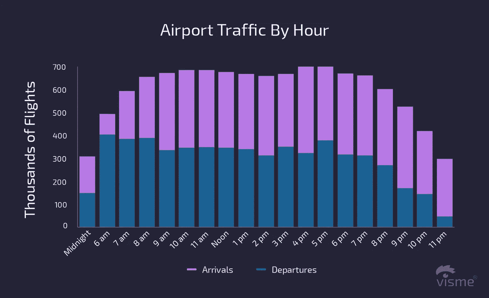

# 11.航空公司非常重视感恩节

看看航班准点性能统计，你会发现航班延误在暑假期间最严重，在 11 月最好，这个月包括一年中最繁忙的旅行日之一。

11 月是 2017 年航班晚点率最低的月份。这可能是日程安排的产物，但是 11 月份的航班实际上提前到达了*。*

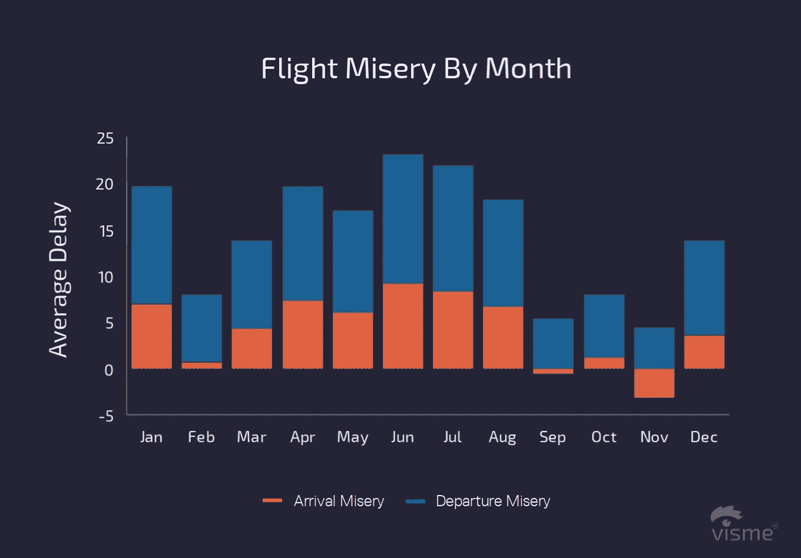

# 12.你从未听说过美国第四大航空公司。

就航班数量而言，美国第四大航空公司是 SkyWest。没听说过他们？那是因为他们是一家白标航空公司，经营阿拉斯加、美国、达美和联合航空的业务。

# 13.洛杉矶和旧金山的空中交通在美国名列前茅

2017 年，旧金山和洛杉矶之间的空中高速公路的原始交通量超过了美国其他地区——而且差距很大。洛杉矶和旧金山以 47%的得票率超过排名第十的洛杉矶和芝加哥。

# 14.繁忙的天空=更大的延误

在前 200 条最繁忙的航线中，洛杉矶和旧金山也有一些最严重的到达延误。

总的来说，随着航线容量的增加，航班延误越来越严重，但也有一些值得注意的异常值。从纽约到芝加哥的航班平均来说非常准时。相比之下，从佛罗里达到纽瓦克的航班比预计时间晚了很多。

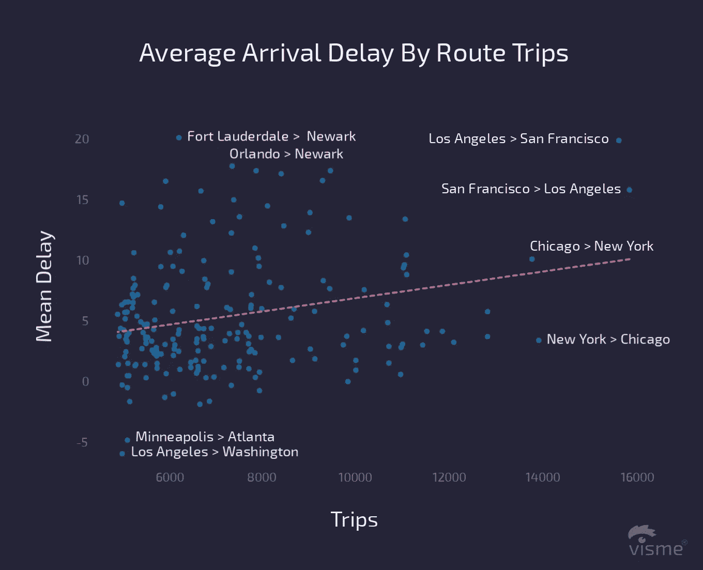

# 15.为什么不能直飞，第一部分

如果你要去美国最大的城市之一，或者它的主要枢纽之一，你可以很容易地搭乘直达航班。但是如果你想从迈阿密到得梅因，你可能需要在芝加哥停留。

2017 年出行量排名前 200 的航班只连接了 43 个城市，不到美国有机场城市的 14%。

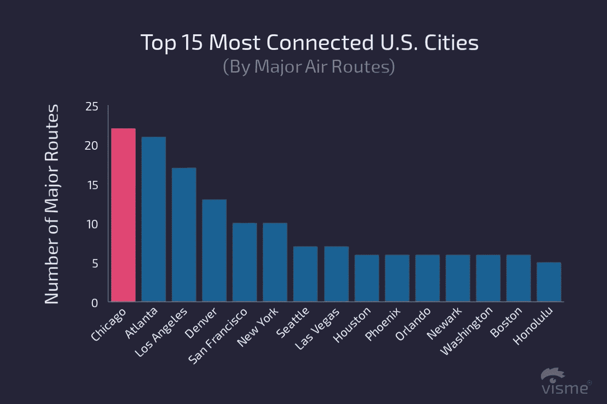

# 16.为什么你不能乘坐直达航班，第二部分

当你包括所有的航线时，这幅图看起来很不一样。洛杉矶从第 3 位跌至第 13 位。波士顿、华盛顿和奥兰多等主要目的地完全跌出了榜单。与此同时，达拉斯/沃斯堡——在主要路线的连接上甚至没有进入前 15 名——跃升至第 4 名。

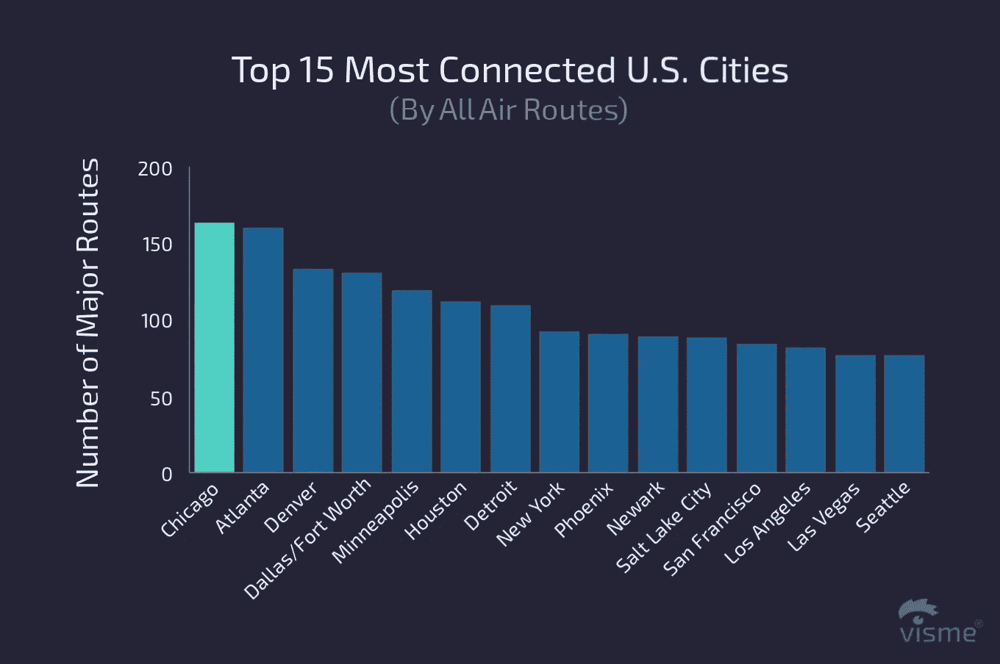

# 17.你不能从这里到达那里

交通统计局在 2017 年的航班和航班延误统计数据中列出了 312 个有机场的城市，但你只能在一家主要航空公司找到其中的 205 个。要到达 107 中的任何一个，你都需要一架私人飞机或一家小型地区性航空公司。

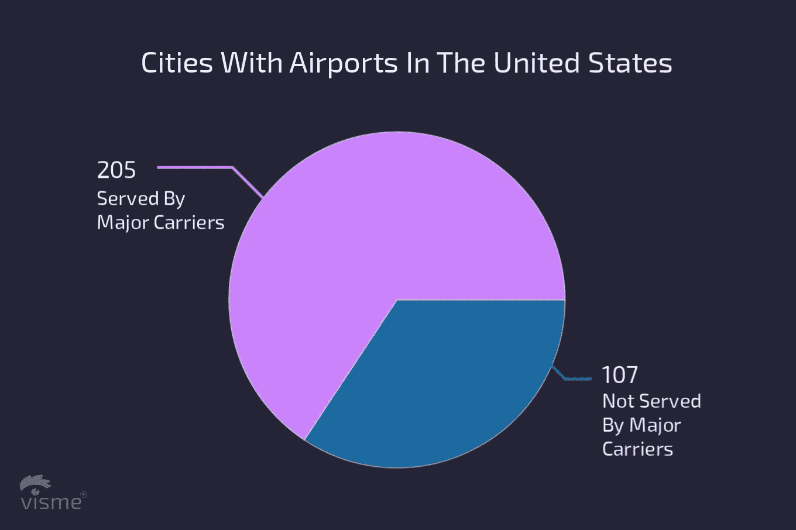

# 18.垃圾进，垃圾出

总的来说，机场是他们网络的受害者。如果你检查航班准点性能数据，你会发现在机场的平均到达延误和平均离开延误之间有接近 1:1 的关系。但是有些特别糟糕。从好的方面来说，任何从玛莎葡萄园岛或楠塔基特岛旅行的人可能都处于一种放松的心态。

在过去的一年里，飞行给你带来了怎样的变化？你有什么不好的经历想分享吗？欢迎在下面的评论区给我留言。

*本帖* [*原版*](http://blog.visme.co/flight-on-time-performance/) *最早出现在 Visme 的* [*视觉学习中心*](http://blog.visme.co/) *。*