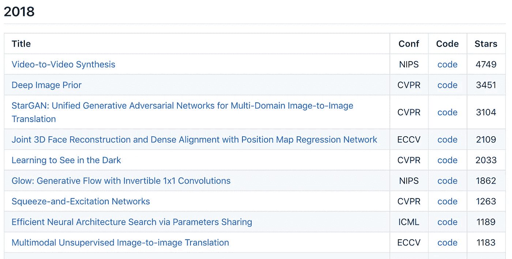
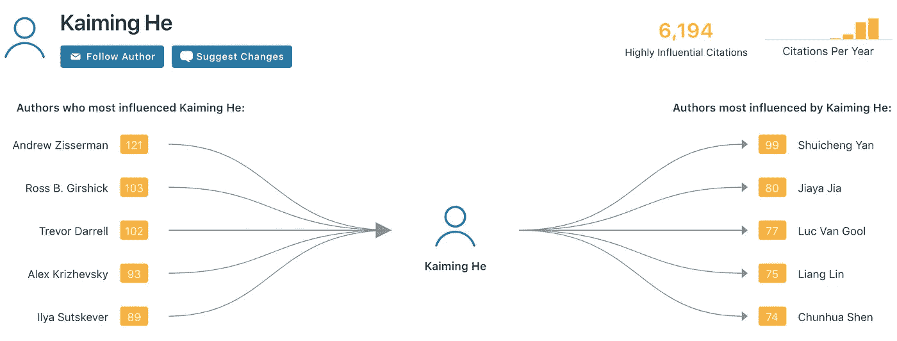
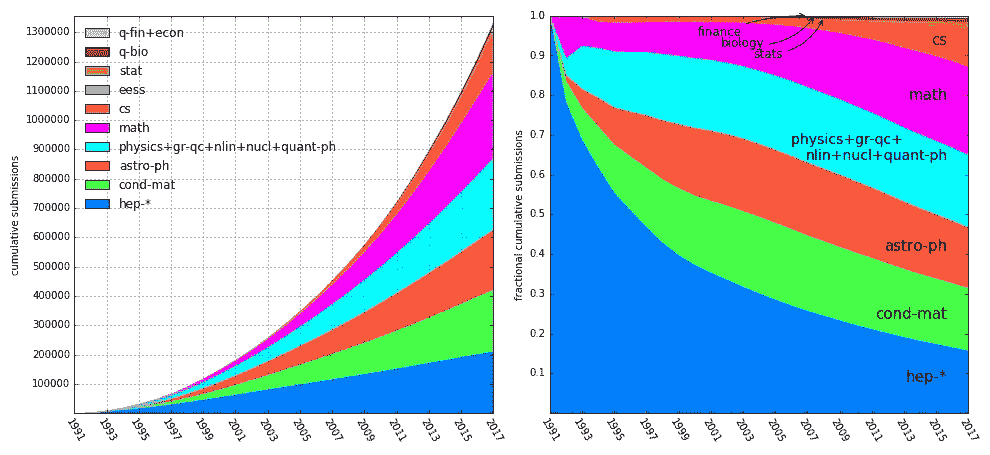

# 查找和管理研究论文:工具和产品调查

> 原文：<https://towardsdatascience.com/finding-and-managing-research-papers-a-survey-of-tools-and-products-9151810d1b4d?source=collection_archive---------12----------------------->

***在本帖末尾你可以找到一个 TL；博士与我的建议，最有用的工具，以改善您的工作流程与科学论文。***

**重大更新(2020):
我们发布了一个可视化查找和探索学术论文的工具。请看我们的** [**发布博文**](https://medium.com/connectedpapers/announcing-connected-papers-a-visual-tool-for-researchers-to-find-and-explore-academic-papers-89146a54c7d4?sk=eb6c686826e03958504008fedeffea18) **获取** [**连接论文**](https://www.connectedpapers.com/) **！**

作为研究人员，特别是在(过度)多产的领域，如深度学习，我们经常发现自己被大量的论文淹没，无法阅读和跟踪我们的工作。我认为其中一个很大的原因是没有充分利用现有的工具和服务，这些工具和服务的目的是让我们的生活更轻松。另一个原因是缺乏一个真正好的产品，在一个界面下满足我们所有的需求，但这是另一篇文章的主题。

最近，我进入了 ML 的一个新的子领域，并对优先排序、阅读和管理相关文件的过程感到非常沮丧……我最终寻找工具来帮助我处理这一过载，并希望与您分享我发现的产品和服务。我们的目标是改善任何从事科学论文工作的人的工作流程和生活质量。

我将主要关注纸张消耗(相对于写作)并涵盖:

1.  参考管理者(又名纸质图书馆)
2.  分享知识的社交平台
3.  自动论文分析以获得额外的元数据(关键词、相关数据集、重要引用等)

# 参考管理者(又名纸质图书馆)

在这些平台上，你可以**创建和组织你过去和未来阅读的清单，添加个人笔记，并与一个小组分享。图书馆与云端同步，这意味着你的论文可以在任何地方查阅。认为 [goodreads](https://www.goodreads.com/) ，但是对于论文。选择以下选项之一:**

1.  门德利:这不是最好看的产品，但它有一个免费增值的商业模式，并支持多种平台，包括 web、PC、Mac 和移动设备。除了一般的纸质笔记，您还可以直接注释和突出显示 pdf。你要为额外的云存储付费(几百篇论文之后必须的)。
2.  [Paperpile](https://paperpile.com) :付费订阅(没有免费版)，但是看起来感觉很现代。很容易从其他服务中导入你的库。图书馆与你自己的谷歌硬盘同步，这是一个优势。目前只适用于 chrome 浏览器。
3.  [Zotero](https://www.zotero.org/) :一个免费增值和开源的实现，你需要为额外的云存储付费。与门德利相似，但用途较少。

还有[更多](https://en.wikipedia.org/wiki/Comparison_of_reference_management_software) [选项](https://guides.library.pdx.edu/c.php?g=474937&p=3249933)，不过这些都是我试过的，都没问题。如果我不得不选择一个，它将是 Mendeley 的平台通用性和免费增值。

Mendeley’s Interface

# ArXiv 增强剂

ArXiv 从 1991 年开始出现，在过去的十年里变化很小，而出版量却急剧增加[1]。很自然，今天我们有不同的要求和需求，从我们的主要仓库的文件。**我们想要执行论文分析的算法，我们想要找到实现论文的代码，我们想要一个可以共享信息的社交层，也许我们不想看双栏 pdf。**

在互联网上搜索现有的解决方案时，我发现了许多这样的工具:

## 社会阶层

1.  [Shortscience](http://www.shortscience.org/) :分享论文摘要的平台；目前超过 1000 摘要和增长。适用于任何具有 DOI 的纸张(因此，比 arXiv 更适用)。
2.  [OpenReview](https://openreview.net/) :一个透明的论文审核流程，也对公众审核开放，目前仅适用于选定的会议，如 NIPS 和 ICLR。除了官方评论之外，最近许多论文都有来自原作者的积极回应。
3.  [Scirate](https://scirate.com/) :在 arXiv 的克隆体上添加 like (ehh，“scite”)按钮。添加注释部分。大多不活跃。

## 寻找论文的代码实现

1.  [代码为](https://paperswithcode.com)的论文:自动将论文连接到实现它们的 github 库，并按 github stars 排序。每篇论文可以有多个未合并的条目。
2.  Github pwc :一种极简主义的方法，自动(？)将 papers 连接到一个代码实现，显示为一个简单的表格。
3.  [GitXiv](http://www.gitxiv.com) :合作策划项目 feed。每个项目方便地呈现为 arXiv + Github + Links + Discussion。不幸的是这个项目[不再维护](https://github.com/samim23/GitXiv)。

Some links from [Github pwc](https://github.com/zziz/pwc)

## 其他的

1.  arXiv-sanity :给 arXiv 改头换面，提供公开的摘要、论文预览和非常基本的社交和图书馆功能。Andrej Karpathy 在业余时间大胆尝试将上述许多想法结合在一起。想法都在那里，但在我看来，实现不够好，不足以成为研究人员的首选工具，而且该项目在过去一年中并不活跃。
2.  [arXiv-vanity](https://www.arxiv-vanity.com/) :将来自 [arXiv](https://arxiv.org/) 的学术论文呈现为可响应的网页，这样你就不必斜眼看 PDF 了。

# 论文搜索和分析

1.  [Google scholar](https://scholar.google.co.il/) :当今搜索论文、查看论文统计以及引用和参考文献、通过关注作者或论文为新论文设置提醒，以及保留自动推荐的基本库。
2.  [IBM 科学摘要器](https://dimsum.eu-gb.containers.appdomain.cloud/):摘要是通过分析论文的内容，以及它们的结构、章节、段落和关键术语而生成的。它并不总是工作得很好，但它在不断改进，非常适合快速浏览文章。
3.  [语义学者](https://www.semanticscholar.org/):外部素材聚合的论文语义分析。功能包括:暴露引用和参考文献并衡量其影响，显示论文数字，自动生成关键词(主题)，分析作者，在互联网上查找其他资源(例如相关的 youtube 视频)并建议推荐论文。
    AI2 支持的新的伟大努力。最近他们对上面提到的 Paperswithcode 和 arXiv 本身做了一个小的集成。).

Semantic Scholar: author profile page

# 作者工具

1.  [背页](https://www.overleaf.com/):协作、在线 LaTeX 编辑器。想想写论文的谷歌文档。执行得非常好。
2.  [Authorea](https://www.authorea.com):21 世纪在线合作撰写论文的一种方式，旨在大部分情况下放弃 LaTeX，支持现代的 WYSIWYG 编辑器。支持内联代码和数据的可复制性、内联公共注释和其他非常有意义的特性。
3.  [代码海洋](https://codeocean.com/):基于云的计算再现平台。我的理解是，你上传你的研究作为 Jupyter 环境代码，在线运行它，并复制作者得到的相同的图形/输出。这里有一个[的例子](https://codeocean.com/2018/05/18/deep-supervised-learning-for-hyperspectral-data-classification-through-convolutional-neural-networks/metadata)(按右上方的 Run)。

# ***Tl；dr —我的推荐***

*   **管理你的阅读图书馆:** [门德利](https://mendeley.com)
*   **读写论文评论:** [短科学](http://shortscience.org)和[开放评论](https://openreview.net)
*   **将论文匹配到 github 库:** [论文，代码](https://paperswithcode.com)和[普华永道](https://github.com/zziz/pwc)
*   **论文及作者分析:** [语义学者](https://semanticscholar.org)
*   **写论文:** [背页](https://www.overleaf.com/)

我希望这篇文章至少向你介绍了一种可以改善你工作流程的服务。如果你知道这篇文章中没有提到的有用的工具，请在下面分享给大家。

[1]截至 2016 年 10 月，提交率已增长至每月 10，000 多份。[https://en.wikipedia.org/wiki/ArXiv](https://en.wikipedia.org/wiki/ArXiv)，

arXiv submission by Topic, from their [statistics page](https://arxiv.org/help/stats/2017_by_area/index)