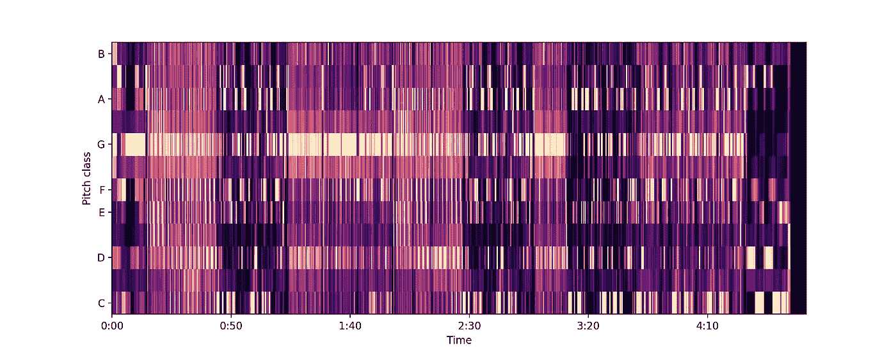
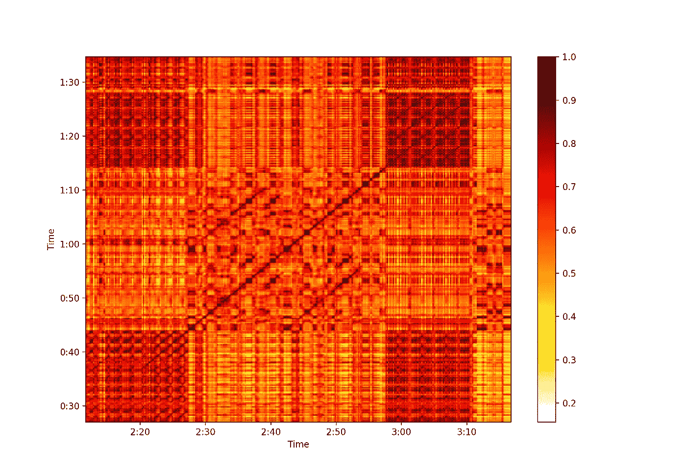
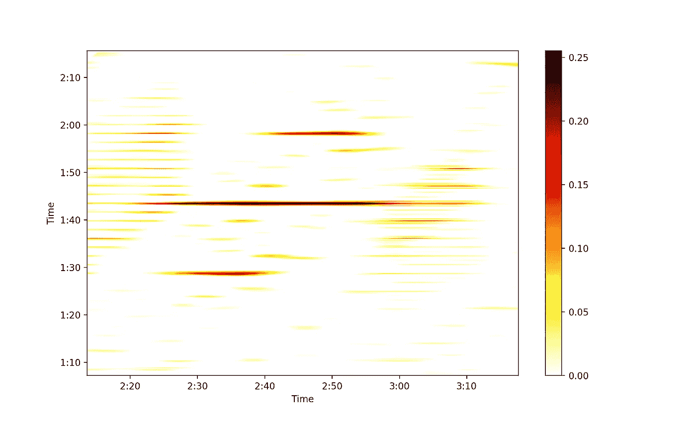
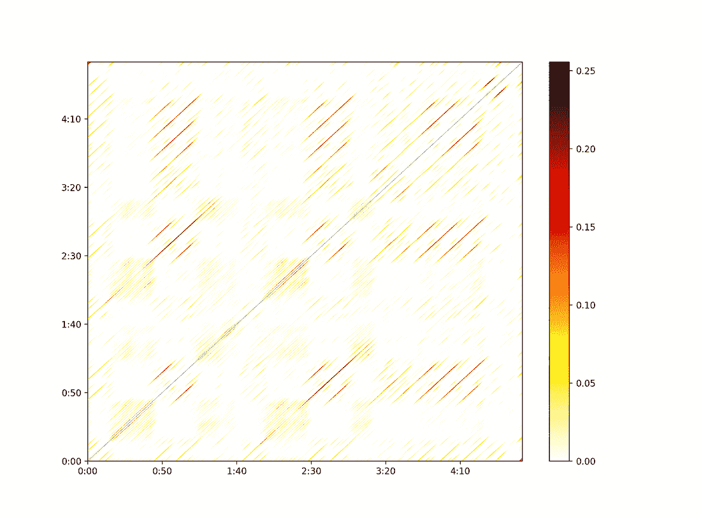
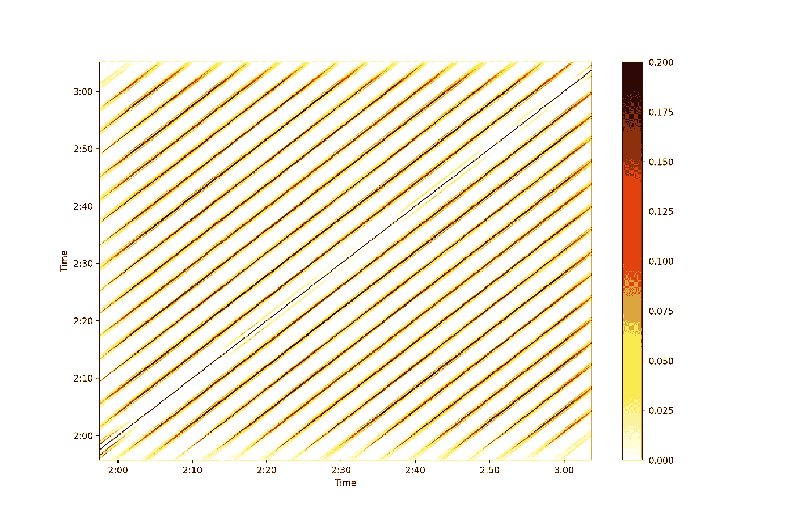
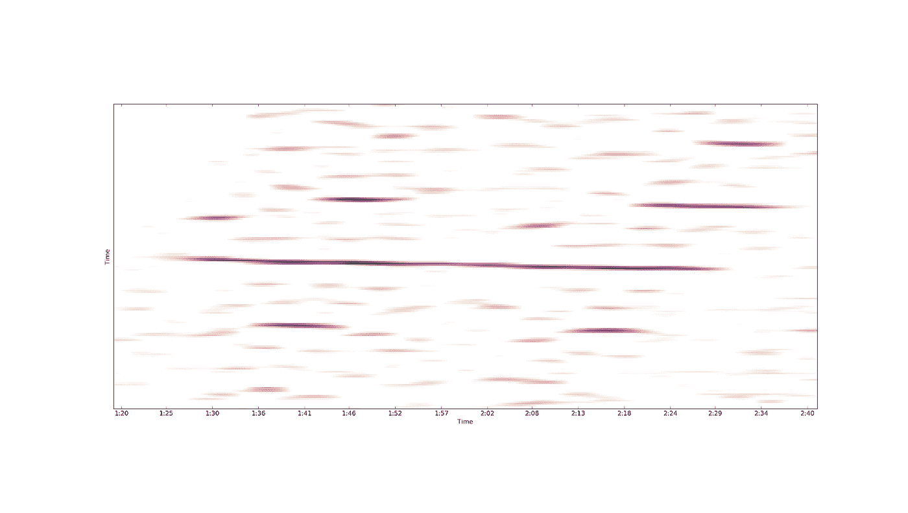

# 用 Python 查找歌曲中的合唱

> 原文：<https://towardsdatascience.com/finding-choruses-in-songs-with-python-a925165f94a8?source=collection_archive---------4----------------------->

如何使用一些非常简单的模式识别找到音乐中的合唱


Popular Song Structure

你有没有觉得现在的歌曲重复了很多遍？

我甚至没有谈论像蠢朋克的[这样围绕着单词](https://www.youtube.com/watch?v=yca6UsllwYs)的歌曲，其中相同的 4 个小节基本上重复了 7 分钟(尽管它超级朗朗上口)。在多种流派中，似乎一旦你录制了一首独唱和合唱，你可以复制/粘贴几次，然后*瞧，*你就有了一首完整的歌曲。*独唱—合唱—独唱—合唱—桥听起来像合唱—合唱的结构*一如既往的受欢迎。

事实上，歌曲中的重复是分析它们的一个很有价值的工具。这是我最近在研究用机器学习寻找歌曲结构时偶然看到的一篇论文的主题。这个想法非常简单，而且效果非常好，我认为它值得探索。

大致来说，歌曲结构指的是识别*引子-独唱-合唱-桥梁*等。当我们听一首歌的时候，我们会自然地认出这些部分。在这篇文章中，我们将特别考虑如何找出歌曲的哪些部分包含副歌或叠句，这是一个比找出整个结构更简单的问题。这有许多应用程序，例如为 iTunes/Google Play 选择歌曲预览，为像 [songpop](https://en.wikipedia.org/wiki/SongPop) 这样的琐事游戏选择可识别的剪辑，甚至自动生成 DJ 提示点。

这是即将到来的一个小小的预览。您可以跳到结果部分获得更多输出:

## 算法概述

在高层次上，由于副歌是通常重复次数最多的部分，我们试图找到歌曲中重复次数最多的部分。算法大致如下

1.  找出歌曲中任何时刻正在播放的音符
2.  将歌曲的短部分与其他部分进行比较，看哪里有重复的部分
3.  寻找那些重复多次且连续重复之间有很大间隔的长片段

让我们深入研究一下实现，看看这是如何做到的。假设有一些编程和音乐理论的基础知识，所有代码都可以在[https://github.com/vivjay30/pychorus](https://github.com/vivjay30/pychorus)找到并安装

```
pip install pychorus
```

# 正在演奏什么音符

我们需要做的第一件事是把歌曲的 1 和 0 变成有用的东西。最简单的方法是使用频率，因为频率告诉我们存在什么音符(例如，A 是 440 赫兹)。将原始声音信号转换成频率涉及到大量的数学运算，但幸运的是，我们有库来为我们做这件事。为了这篇文章我选了一首经典的流行歌曲， [*尖叫和呼喊*](https://www.youtube.com/watch?v=kYtGl1dX5qI) 靠意志。这绝对是我高中时的最爱。

```
import pychorus
chroma, _, _, _ = pychorus.create_chroma("scream_and_shout.mp3")
```

这主要是一个 [librosa](https://github.com/librosa/librosa) 库的包装器，做两件事。首先，它使用傅立叶变换将原始波形转换成频率。然后，它使用不同八度的音符频率知识(不同八度的 A 为 440hz、880hz、1760hz 等)来了解任何时刻正在播放的音符。歌曲中任何时刻播放的音符列表称为色谱图。

也许你已经可以从频谱中看出一些歌曲结构了。


Frequencies present at any moment of the song



Notes present at any moment. Lighter means more of that note

最简单的思考方式就像视频帧。声音是连续的，但计算机处理的是离散的数据。这个色谱图每秒大约有 5 帧，每一帧告诉我们在 0.2 秒的音乐片段中播放了什么音符。因为在西方音阶中有 12 个音符，所以每个帧是 12 个元素的向量，其中每个值在 0 和 1 之间。例如，如果我们正在听一个纯音符 A，向量将是[0，0，0，0，0，0，0，0， **1 【T7，0，0]，如果音乐完全无声，那么它将全为零。对于一个 4 宋敏，这给出了一个 1200×12 的矩阵。**

尽管查看原始频率是可行的，但出于几个原因，我们将其转换为音符。首先，它对不同合唱中的乐器变化提供了更强的鲁棒性。例如，如果最后一个合唱团有一个额外的吉他或更多的鼓，频率可能会非常不同，但实际的音符和和弦将是相似的。此外，处理音符允许我们在更低维度的空间中工作(12 个可能的音符与人类可以听到的 5000 个不同的频率)。

# 寻找相似之处

现在让我们考虑如何找到长的重复部分。

听听这首歌中的两个不同的合唱部分。我们将专注于检测这些特定的合唱。

First chorus, 0:44–1:00 in the song

Second chorus, 2:30–2:45 in the song

这些部分听起来是一样的，但是我们如何测量呢？

因为我们的歌曲是每个 12 个音符的帧的集合，所以我们需要一个相似性函数来比较任何给定的歌曲帧。如果 V₁和 V₂是歌曲中任意两个实例的 12 个音符矢量，那么我们将使用下面的相似度函数:


直觉:我们首先求向量的差，然后看范数。如果演奏相同的音符，那么差异的范数将接近于 0，如果音符不同，那么这个范数将很大。我们除以√12 使得结果总是在 0 和 1 之间，我们从 1 中减去使得相似的音符得到高分，反之亦然。

我们现在需要做的是迭代所有可能的歌曲帧对，看看哪些是相似的，并寻找具有相似的连续帧的两个区域。形式上，我们可以创建一个矩阵 *M* ，其中*M[x][y]=相似性(x，y)* ，使用上面的相似性函数*。*这叫时间-时间相似度矩阵。请参见下面生成它的示例代码。实际上，我们可以用 numpy 广播更快地做到这一点，但是较慢的例子更容易理解

完整的时间-时间矩阵如下图所示。注意一些属性

1.  它关于对角线对称，因为帧 *x* 和 *y* 之间的相似性与帧 *y* 和帧*x*:*M[x][y]= M[y][x]*之间的相似性相同
2.  对角线全是 1，因为每一帧听起来都完全像它自己:具体来说 *M[x][x]=1*


Time-Time similarity matrix for the entire song

现在让我们来看看这些合唱部分相交的地方



Time-Time Similarity for a repeated chorus

请注意 x 轴上从 2:30 到 3:00 延伸的黑色对角线，y 轴上从 0:45 到 1:15。这对应于上面播放的第一和第二合唱之间的匹配。

直观地说，如果 0:45–1:15 的片段与 2:30–3:00 的片段相似，那么这意味着 0:45 的帧应该与 2:30 的帧匹配，0:46 的帧与 2:31 的帧匹配，直到 1:15 的帧与 3:00 的帧匹配。希望你能看到重复的部分总是用对角线表示。

> “重复部分是时间-时间相似性矩阵中的对角线”

## 时滞相似矩阵

不幸的是，检测矩阵中的对角线比检测垂直线或水平线更加困难和缓慢。正因为如此，我们可以应用一个简单的线性变换，使重复的和弦显示为水平线，而不是对角线，使以后的处理更容易。这是通过创建时间*滞后*相似性矩阵来完成的。如果时间-时间矩阵测量帧 x 和 y 之间的相似性，那么时间滞后矩阵测量帧 x 和 y 秒前发生的帧之间的相似性。形式上，时滞矩阵*T[x][y]= M[x][x-y]=相似度(x，x-y)。*

让我们来看看之前看到的那场合唱比赛。


Time Lag matrix zoomed into the match between first and second chorus

我们的对角线现在变成了水平线。x 轴是一样的，但是现在这条线在 1:45 左右有一个恒定的 y 值。由于 2:30–3:00 的第二次合唱与 0:45–1:15 的合唱相似，所以这条线告诉我们，2:30 的帧与 1:45 之前的帧相似。2:31 的画面与 1:45 前的画面相似…3:00 的画面与 1:45 前的画面相似

综上所述，2:30–3:00 的音乐与歌曲中发生在 1:45 之前的部分相似。这就是为什么我们在 y 坐标 1:45 处有一条从 2:30 到 3:00 的线。

> “重复部分是时间滞后相似矩阵中的水平线”

因为我们知道我们正在寻找水平线，我们可以做一些很好的一维去噪和平滑技术来隔离这些线。这基本上是现在的计算机视觉，去噪后可以看到那个合唱交集的结果。



从这个去噪矩阵中，我们可以通过迭代每一行并使用最小检测分数和最小线长度的阈值来容易地识别线(重复部分)。

为了简单明了，我们将在时间-时间空间(对角线)中演示算法的其余部分，但实际上，为了速度和更容易实现，该算法是在时间滞后空间(水平线)中实现的。

## 计算所有重复的部分

现在我们有了检测歌曲中重复部分的方法，我们需要一种方法来计算合唱重复的次数。理论上，如果合唱在歌曲中出现了 n 次，我们应该有 n 条*线代表所有可能的交叉点。我们很少能探测到所有的合唱，但只有少数几个是必要的，以了解合唱团在哪里。请参见下面的动画来计算行数。*



Example of finding 9 line segments for 3 choruses in the time-time diagram

在这个例子中，我们显示了 9 条对角线，对应于 3 个彼此匹配的合唱。事实上，有超过 3 个合唱团，你可能会看到不止 9 个突出线。

注意所有检测到的线是如何水平或垂直匹配的。对于每个线段，我们只需在水平和垂直方向寻找其他线段，并根据我们相交的其他线段的数量来得分。为了输出合唱，我们可以选择任何重复的合唱部分，但我们将选择具有最强相似性得分的最多交叉点的部分。(同样，理论上它们都有相同数量的交集，但实际上总有一个交集的相似性得分更高)。

## 结果

现在是有趣的部分！我们一边寻找至少 15s 的合唱，一边看看算法输出的是什么样的小节。

为了表明它不仅适用于流行音乐，下面是著名的富尔·伊利斯钢琴曲的合唱部分:

为了好玩，我决定在世界各地的蠢朋克上运行它。老实说，一个随机数生成器也会找到这首歌的副歌部分。

这是世界各地时间-时间相似性矩阵的一部分。记住对角线是重复的部分。是的，这是很多重复，尤其是一个 1 分钟的剪辑。



Section of time-time similarity matrix for Around the World

# 缺点和今后的工作

一个主要的问题是，这种方法对于以不一致的速度录制的音乐不起作用。例如，很多旧音乐，如摇滚，通常是在没有节拍器的情况下录制的，但鼓手会跟上节奏。如果一个合唱比另一个快或慢，那么它通常不会被拾取。

以下是披头士*黄色潜水艇在时滞空间的重复合唱。*



这条线应该是水平的。然而，第二次合唱明显比第一次慢，这导致线明显向下倾斜。这意味着我们的水平线检测器没有拾取重复，并且我们没有合唱检测。

取而代之，我们采用一种方法，其中我们对矩阵进行阈值处理，并且寻找在 x 轴上具有足够大跨度的连通分量。这只有在我们知道这首歌是在没有节拍器的情况下录制的情况下才能做到。开始时，我们可以使用节拍检测器，查看节拍之间的标准偏差。对于严格定时的歌曲，标准差基本为 0，而自由录制的歌曲标准差要大得多。

这项功能尚未发布，是其他变化中的计划功能，例如可以选择输出哪个合唱团(而不仅仅是得分最高的一个)。

# 结论

我们从观察到歌曲会自我重复开始，最后用一种快速简单的方法来检测合唱。

这种方法的主要优点之一是，它可以在几秒钟内在 cpu 上运行一首完整长度的歌曲，这与需要更多计算或 gpu 的神经网络方法相反。尽管机器学习模型几乎肯定会做得更好，但这种算法很容易理解，也是对信号处理和音乐模式识别的很好介绍。

我鼓励你尝试在一些歌曲上运行源代码，看看你会得到什么样的结果！

如果有任何问题，也可以随时联系[我](http://www.vivekjayaram.com/)，或者在 twitter 上关注我在【https://twitter.com/vivjay30】T4 的更多项目和更新！我总是很乐意与对人工智能和音乐感兴趣的人交谈和合作。