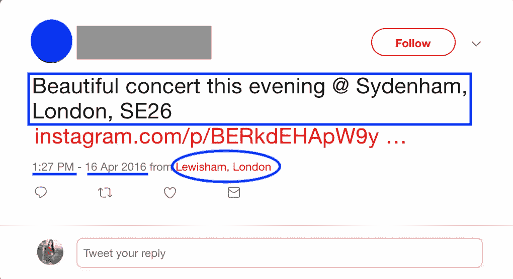
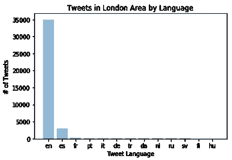
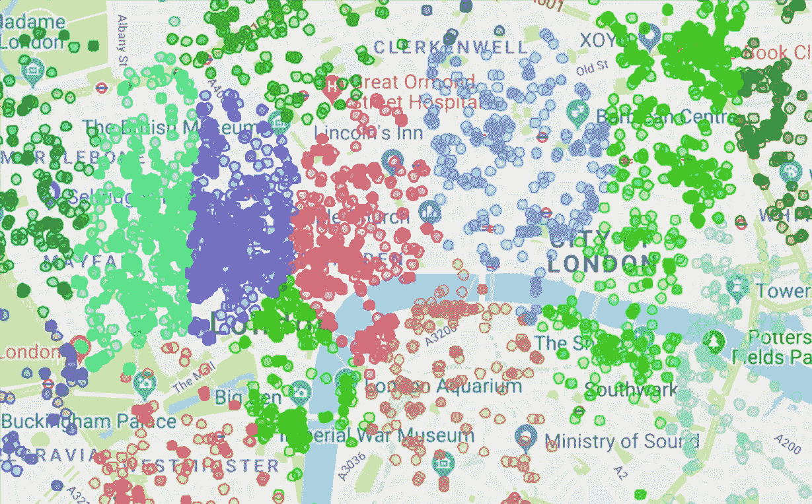
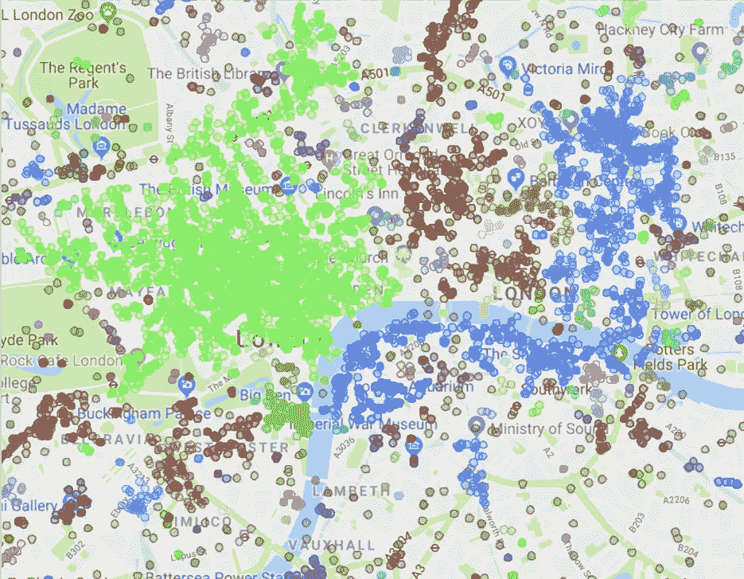
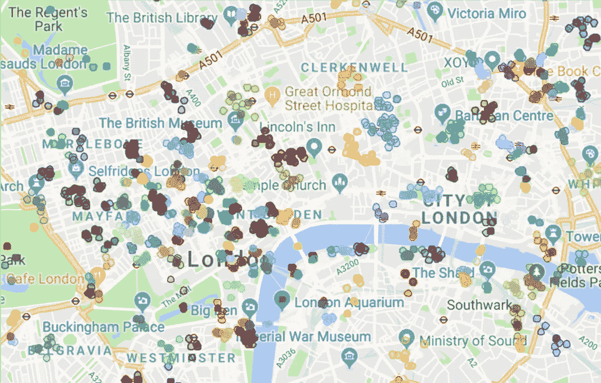
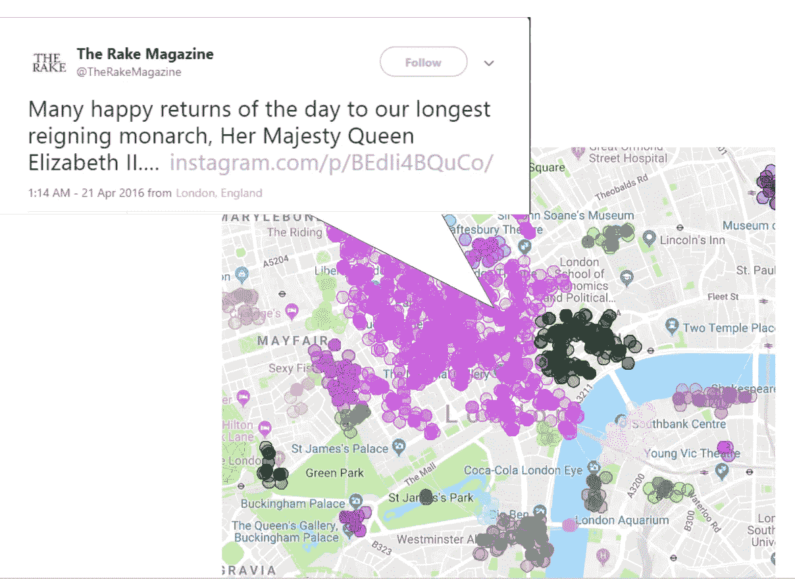

# 使用 Twitter 数据查找本地事件

> 原文：<https://towardsdatascience.com/finding-local-events-using-twitter-data-18298f03ead6?source=collection_archive---------12----------------------->

Photo by [Giammarco](https://unsplash.com/@giamboscaro?utm_source=medium&utm_medium=referral) on [Unsplash](https://unsplash.com?utm_source=medium&utm_medium=referral)

无人监督的学习

*陈亦飞、阿什温·古普塔、Shruthi Krish、Raghav Prakash、王巍的项目*

Twitter 是一个社交媒体平台，数百万用户用它来分享自己的生活更新。通常，这些推文是关于用户周围发生的本地事件。尽管新闻机构报道当地的事件，但是新闻机构了解、调查和报道事件所花费的时间是相当长的，尤其是与事件的持续时间相比。相比之下，用户对可能发生的事件的解释会实时上传到 Twitter 上，他们的 Twitter 订阅源的追随者可以在新闻机构广播信息之前了解到事件。

在这个项目中，我们分析来自给定地理区域的推文，以确定某个事件是否已经发生。然后，我们报告与该事件相关的最具描述性的推文。解决这一问题将是一种快速提醒用户其所在区域可能发生事故的方法。我们的方法将数据分成位置桶，识别推文活动中的峰值，然后根据相似性对推文进行聚类。

# 一.项目概述

*   **目标:**给定带地理标签的 Twitter 数据，识别一个本地事件
*   **应用:**如果实时完成，用户可以在新闻媒体报道之前得到当地事件的通知。确切的应用因确定的事件类型而异。例如，如果检测到交通延迟，用户可以通过选择替代路线来避免延迟。我们的系统也将能够向新闻站提供信息，以便他们能够进一步调查。

## 方法概述

1.  获取并预处理特定区域的推文
2.  将推文分成位置桶
3.  发现异常
4.  定义重大事件
5.  相应地选择一个标题

这个项目的代码可以在 [GitHub](https://github.com/davidzchen-ut/TwitterEvents) 上找到。

东京大学的 Muhammad Khan 和 Danushka Bollegala 进行了使用 tweets 识别事件的研究。台湾国立高雄应用科技大学的钟李洪也进行了类似的研究。

# 二。数据

## 背景

在我们的项目中，我们需要在短时间内获得带有地理标签的推文。由于计算上的限制，我们选择分析某个特定地理区域的推文。我们最初的想法是使用 Twitter 搜索 API 从纽约大都市地区收集数据。然而，考虑到我们的时间限制和 Twitter API 的速率限制，收集所需数量的数据是不可能的。我们选择在互联网上找到一个具有以下特征的现有数据集。

## **相关特征**

*   所有的推文需要来自世界上同一个地区。
*   我们需要访问每条推文的**正文**、**日期**、**发布**和**时间**、**发布**。
*   每条 tweet 都必须有一个相关联的**地理标签**，指定**纬度**和**经度**。

Required information from each tweet. All tweets used in our project are public on Twitter, but this user’s information has been masked for privacy. (Source: Twitter)

## 我们的数据集

在寻找适合我们项目的数据集时，我们发现绝大多数推文都没有地理标记。这使得找到满足我们所有要求的数据集变得更加困难。然而，经过大量搜索，我们找到了一个来自英国的带有地理标签的推文的数据集。这些推文在 2016 年 4 月的活动中持续了 9 天。

该数据集最初包含大约 170，000 条具有上述特征的地理标记推文。

## 初始预处理

由于伦敦是英国最大的大都市，我们决定将我们的数据仅限于伦敦及其周边地区发布的推文。我们首先根据纬度和经度缩小数据范围，重点关注在纬度范围 51.3794444 到 51.6275813 和经度范围-0.4598808 到 0.0994444 发布的推文。

在查看了我们的推文的语言分布后，我们从数据集中删除了所有非英语推文。因为我们五个人都非常熟悉英语，所以用其他语言来验证一个事件是否被正确地检测到是很困难的。也有一些 tweets 缺少经度值，因此我们通过用该地区的平均经度填充这些值来完成初始预处理阶段。

# 三。学习和建模

## 将推文分成位置桶

在完成数据的初始预处理后，下一步是按位置将数据划分成簇。这些集群是设置推文基线活动的基础。我们希望聚类足够大以包含多个 tweets，但又足够小以用于识别“本地”事件。为此，我们尝试了许多不同的模型，包括 k-means、层次聚类、DBSCAN 和 HDBSCAN。

K-means 的工作方式是首先随机选取 K 个起始点来调用中心点，然后根据哪些点最接近定义的中心来迭代计算新的中心点。这一直持续下去，直到中心点不再移动，并且每个点都在它的最终分区中。在我们的例子中，K-means 没有很好地工作，因为它对噪声没有弹性，并且需要我们指定聚类的数量。此外，k-means 更喜欢绘制直线来划分点，而不是动态绘制形状来聚集点，这对于我们的项目来说并不理想。下面的地图显示了 k-means 如何划分我们的数据，其中每个点代表一条推文，不同的颜色代表不同的聚类。

K-means location clusters

DBSCAN 通过遍历每个点并将预设ε距离内的点添加到同一个聚类中来生成聚类。在找到所有聚类之后，任何小于预定最小值的聚类都被作为噪声丢弃。DBSCAN 解决了 k-means 的两个最大问题，因为它对噪声具有鲁棒性，并且不需要预定义的聚类数。然而，DBSCAN 仍然不是完美的，因为它不能很好地处理变化的密度。运行 DBSCAN 时，伦敦市中心将是一个巨大的集群，而周围地区将有非常稀疏的集群，如下所示。伦敦市中心可能会举办许多当地活动，所以我们希望在市中心内外都能找到较小的集群。

DBSCAN location clusters

HDBSCAN 的工作方式与 DBSCAN 非常相似，但它不需要用户定义的 epsilon，而是根据不同区域的密度分层选择 epsilon。最后，我们决定使用 HDBSCAN，因为它对噪声具有很强的鲁棒性，并且可以处理可变密度的集群。下图显示了伦敦市中心包含至少 20 条推文的集群。这些聚类比 k-means 和 DBSCAN 发现的聚类更集中。

HDBSCAN location clusters

## 检测异常

使用位置聚类，下一个目标是识别能够反映事件发生高概率的推文集。对于每一个单独的位置桶，我们想要识别具有代表事件的高概率的推文组。在这一步中，我们将连续的时间间隔离散化为特定位置集群的每小时 tweet 活动组。接下来，我们计算每个位置聚类的统计数据，例如每小时推文的平均值和标准差。

下一步是为每小时的推文率建立基于标准差的阈值，以标记包含潜在事件的时间。由于我们想要标记与正常小时数有很大不同的小时数，我们使用平均值的两个标准偏差的阈值(假设正态分布，95%的数据位于两个标准偏差内)。当查看阈值的上限时，使用 0.025 的 alpha 级别，我们能够发现不同位置群集的推文中的尖峰，潜在地对应于给定群集中的事件。下图显示了特定集群位置的每小时 tweet 数据以及阈值。

## 在一个峰值内找到相似的推文

在检测到 tweets 数量的峰值后，我们首先确定峰值是否是由事件引起的。如果尖峰是由某个事件引起的，那么我们希望找到哪些导致尖峰的推文构成了该事件。峰值可能是由同时发送的不相关的推文引起的，但我们不想将此归类为一个事件。此外，一个事件可能正在发生，但可能有一些不相关的推文充当噪音，不能定义该事件。我们的目标是输出几组 tweet，其中每组对应一个事件，一组中的每条 tweet 代表检测到的事件。

为了做到这一点，我们通过删除 URL、提及、转发和标签来清理每条推文的正文。然后我们对每条推文进行词干分析和标记。接下来，我们将每条 tweet 转换为一个向量，每个词有一个维度，并用字数填充这个维度。然后，我们通过文档词频(TF-IDF)对每个向量进行归一化。最后，使用 DBSCAN 对相似的 tweets 进行聚类。由于每个集群都有属于它的最少数量的推文，所以不是所有的推文都会加入集群。如果聚类后在同一个聚类中有点，我们从结果聚类中选择最大的聚类。这可以确保有足够多的推文是关于同一个主题的，还可以找到哪些推文在内容上是相似的。

Example cluster of tweets defining a potential event

最初，为 DBSCAN 找到合适的ε参数是困难的，因为没有定量地定义找到合适的聚类。经过一番努力，我们决定尝试 HDBSCAN，因为它会根据密度自动找到合适的 epsilon 参数。这种算法执行得不是很好，因为它倾向于将具有相似内容的推文分开，这是有意义的，因为许多推文在 TF-IDF 向量空间中将倾向于靠得很近。最后，我们决定通过观察不同值输出的集群来调整 epsilon 参数。在我们的例子中，值 1.2 似乎工作得很好，但并不完美。我们如何检测事件的细节可以在下面的结果部分找到。

## 选择摘要推文

我们项目的最后一步是，给定一组与事件相关的推文，确定哪条推文提供了关于事件的简明而有用的信息。为了做到这一点，我们首先对每条推文进行标记化(分割成一个单词列表),并从每条推文中找到内容单词。然后，我们使用评分标准(术语频率-逆文档频率)找到最能概括事件的推文。

为了对 tweets 集进行标记，我们尝试了 NLTK 库中的 Twitter 专用标记器和 spaCy 标记器。Twitter 特定标记器在拆分推文上具有更好的准确性。然而，出于性能原因，我们使用默认的 spaCy tokenizer。更具体地说，由于我们需要使用 spaCy 的实体标记功能(下面解释)，使用 spaCy 标记 tweet 更有意义，这样我们就可以直接访问这些功能。

要找到实词，重要的是定义什么是实词。一个快速而非正式的实词定义是一个传达高度信息的词。在 2015 年的一篇论文中。al 指出了三种传达高度信息的实体:数字、名词和主要动词。因此，我们使用 spaCy 的命名实体识别功能来查找标记，并在我们的标记化 tweets 列表中将它们设置为内容词。

在为每条推文找到我们的内容词之后，我们现在需要找到包含最高信息密度的推文。为了做到这一点，我们使用一种称为术语频率-逆文档频率(TF-IDF)分数的度量来对单词进行评分。我们使用这个标准来确定可能的实词列表中的词的“有用性”。由于我们已经在上一节中去除了候选推文中的大部分噪声，我们可以根据内容词在我们的集合中的频率对其进行评分，以找到包含可能对我们的用户有帮助的附加信息的推文。

在对我们的内容词进行评分后，我们就可以找到最大化内容词密度的推文了。本质上，我们试图解决一个优化问题:(1)我们希望找到具有最高内容分数的推文，给定约束条件(2)我们希望最小化用于获得最高内容分数的字数，以及(3)推文不应超过 150 个字。这类优化问题也称为整数规划，是 NP 完全的。为了解决这个整数规划问题，我们使用整数线性规划(ILP ),它使用一个叫做 pymprog 的数学建模库。这个库使得在 Python 中建模、求解、分析、修改和操作线性程序变得简单而高度灵活。

在解决了这个整数规划问题之后，我们得到了一个整数数组，该数组对应于选择了哪些 tweets 来最大化内容分数密度。上一步中显示的集群的最终输出是“Muse rocking the O2！！！@氧气。”

# 四。结果

确定如何评估准确性很困难，因为数据集没有标记，事件是主观定义的。为了了解我们的项目执行得有多好，我们仔细检查了数据，找到了数据集中发生的所有事件。然后，我们将此与我们的项目发现的事件进行了比较。本质上，我们标记数据集是为了验证的目的。

在强制要求 tweet 峰值必须由至少 10 个事件组成后，我们的模型发现了 26 个潜在事件。6 个尖峰被正确分类为事件，15 个尖峰被正确拒绝，因为它们不对应于事件。我们的模型错误地将四个尖峰分类为事件，并且意外地拒绝了一个尖峰作为事件。

我们正确识别的事件的一个例子是 O2 竞技场的 Muse 音乐会。

我们发现的一个更大规模的事件是女王的生日。

# 动词 （verb 的缩写）结论

我们这个项目的目标是使用地理标记的推文来识别当地事件。使用现有的数据集，我们将推文分成位置桶，使用 DBSCAN 定义重要事件，并选择最能代表每个事件的标题推文。我们能够识别出一些事件，比如在伦敦 O2 竞技场举行的音乐会和女王的生日。

在这个过程中，我们学到了很多东西；最重要的是我们需要更多的数据！有了更多的数据，我们可以减少噪音，并有希望找到更多的事件，减少错误分类率。除此之外，我们还假设推文通常会被用来报道某种类型的事件。然而，随着越来越多的人使用该平台进行简单的个人更新，情况并非如此。从机器学习的角度来看，我们发现评估无监督问题的性能是具有挑战性的，因为通常没有量化的措施来验证。

## 未来的工作

将来，我们将从收集更多的数据开始。理想情况下，我们会希望收集更密集区域和不同位置的数据。我们也有办法改进识别异常的方法。我们可以查看基于时间的推文密度，以识别不同长度的事件，让我们有机会区分每小时和一整天的事件。我们还可以尝试改变位置群集的大小。这可以突出显示在不同地理区域发生的事件。

此外，为了报告更好的摘要推文，我们可以通过将与事件相关的所有推文的重要方面拼凑在一起，而不是从现有推文中选择最佳的一个，来找出如何生成新的标题。最后，实时处理推文和定义事件将是这个项目产生有意义的商业影响的最终目标。