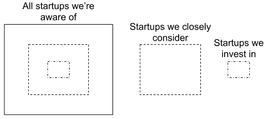

# 寻找创业公司——在早期风险投资基金中担任新数据科学家的工作笔记

> 原文：<https://towardsdatascience.com/finding-startups-notes-on-work-as-a-new-data-scientist-in-an-early-stage-vc-fund-7e994c8f390e?source=collection_archive---------18----------------------->

*(合著* [*【保罗·迈因豪森】*](https://medium.com/@PMeins?source=post_header_lockup) *)*

上个月，我作为一名数据科学家加入了早期风险投资基金 [Montane Ventures](http://montaneventures.com/) ，在班加罗尔工作。我加入 Montane 是因为有机会与几家伟大的初创公司一起研究有趣的数据和技术问题，也因为我喜欢早期初创公司与小团队一起开发产品时的信噪比。

我的一部分时间将花在 Montane 已经投资(或正在合作投资)的初创公司上；帮助他们提升数据科学成果和能力。我还会花时间做风险投资分析师更传统的工作:帮助寻找和识别投资的创业前景。

风险投资通常是为了支持那些以雄心勃勃和创新的方式使用技术的公司。Montane Ventures 的团队认为，风险投资本身的工作可以通过雄心勃勃的创新技术得到改善。随着技术和数据科学的使用在过去几十年中以各种方式发展，如果我们以二三十年前投资者的方式确定有前途的投资，那将是奇怪的。这是我被雇佣的很大一部分原因；这是我将与团队紧密合作的事情。

让数据科学软件成为风险投资的有效工具本身就雄心勃勃且困难重重(世界上还有其他几个基金或多或少地公开参与了类似的努力)。在 Montane，我们正在探索将数据科学融入风险投资的多种方式。这篇文章是为了追踪我们的一些想法，特别是关于使用数据科学来帮助我上面确定的第二个主要职责所涉及的内容:**确定投资的初创公司。**

在这篇文章的剩余部分，我将

1.  解释风险投资如何受益于数据科学，
2.  描述我们使用的数据为什么以及如何产生。
3.  概述数据科学可以应用的两个主要领域，以及
4.  分享我们关于数据科学将如何增加价值的一些具体假设

## 投资不容易

那么为什么需要数据科学来寻找创业公司进行投资呢？从外面看，风险投资似乎很容易:投资者有资本；大多数(全部？)创业公司要资本；投资者只需要选择谁得到它，然后进行投资。

只是没那么简单。想象一下，投资者有一定的时间来完成他们所有的工作。现在减去他们筹集新资本、管理基金以及与已经投资的公司合作所需的时间。我们剩下的时间让他们去寻找新的投资项目。用这种基本方式来表达有助于明确我们的目标:有效利用时间。我们甚至可以把它变成一个非常简单的等式:

> I = T — (R+P)

*其中:
I 是分配给对初创公司进行新投资的时间，
T 是可用的总时间，
R 是行政管理基金和筹集新资本所需的时间，
P 是与基金的投资组合合作并支持该投资组合(已投资的初创公司)所需的时间。*

该基金需要在寻找投资的初创企业中进行分配。比方说，如果每年有 10 家初创公司准备融资，那么你可以为每家初创公司分配大约 10%的时间(或更少)，决定支持哪家，然后专注于你选择的 1 或 2 家初创公司。有超过 10 家初创公司在寻求投资。有几百或几千个。创业公司的数量是造成这一分配问题的部分原因。

图片是澄清问题的另一个有用的工具。下图从概念上将投资决策过程建模为一系列依次更小的子集:

由于被投资的创业公司是你所知道的创业公司的一个子集，最终投资子集的质量受到初始群体质量的制约。

现在要澄清的是，没有人知道一个生态系统中初创公司总数的准确规模(让我们以印度为例——我们暂且不谈生态系统本身的流动性和难以划分的问题)。但是我们可以把理论上的总人口看作是我们分配问题的数据集。第一个挑战是收集我们的数据集(并保持其最新)，它将保持真实人口总数的样本，并希望尽可能接近它。我们将这部分问题称为**扫描**。

继续说印度的创业生态系统，[这一估计](https://www.firstpost.com/tech/startup/india-ranks-third-in-the-world-for-most-number-of-startups-in-technology-3726255.html)认为印度的科技创业公司数量约为 4750 家。我们将以这个数字为起点。由于市场的不断变化，初创公司是一个有趣的库存问题。他们只在特定的时间点筹集资金，如果你是一个专注于特定阶段的基金，那么你真的只能在每个初创公司作为初创公司存在的时间子集(他们筹集资金的间歇时间段)的子集(例如 A 轮)投资该初创公司。

我们希望我们的数据集中有尽可能多的创业公司，因为这是我们要从中选择的样本。如果有一些我们应该考虑投资的初创公司不在我们的初始人口数据集中，我们就会遇到数据收集和样本偏差的问题。

> 如果有一些我们应该考虑投资的初创公司不在我们的初始人口数据集中，我们就会遇到数据收集和样本偏差的问题。

下一步是选择我们将花时间仔细考虑的创业公司子集。我们将这部分问题称为**过滤**。我们希望我们的过滤功能尽可能好:避免误报(我们让初创公司通过了过滤，然后花太多时间考虑它们是否很适合我们的基金)和漏报(没有通过过滤但实际上具有良好投资潜力的初创公司)。

接下来的两节概述了扫描和过滤问题。

## 扫描

为 VC 开发数据科学软件并不是为了自动化 VC(先明确一点！).投资者做的很多事情不会被机器取代。投资者在长期任期内培养的个人关系会带来内向推荐，这通常是老牌风险投资基金的一大优势。总的来说，内向流量(联系投资者而不是相反的创业公司)是风险投资渠道的重要组成部分。除了个人推荐之外，入站流量还受到来自在线和离线媒体的一般声誉的驱动，如故事、采访和资金公告。正是风险投资的在线存在，使得基金能够被寻找投资的初创公司发现。

我们不想取代以上任何一个。我们只是认为，将过滤数据集局限于入站会给我们留下一个有缺陷的数据集——一个不包含和不具有代表性的实际创业人口样本。

除了通过集客活动寻找创业公司，互联网和在线资源已经是任何投资者寻找过程的重要组成部分。局限性在于，对许多投资者来说，搜索过程大多是手动的。投资者会阅读创业新闻和社交媒体等，并发现他们决定跟进以进行进一步调查的创业公司，或者指派分析师或合伙人进行跟进。数据科学可以帮助建立一个补充的搜索过程，使我们的过滤数据集尽可能全面。

收集数据的互联网来源可以分为几类。

*   **聚合网站**是最直接、最重要的来源。他们以结构化的格式呈现数据，并努力做到尽可能全面和详细。更开放的两个最著名的网站是 [Crunchbase](https://www.crunchbase.com/) 和 [Angellist](http://angel.co/) 。像 [Tracxn](https://tracxn.com/) 这样的网站是付费/订阅网站和服务的好例子。
*   资金公告是另一个强大的来源。这些网站没有聚合网站那么结构化，但通常是融资活动的第一份公开文件。印度的 VCCircle 是一个发布半结构化融资公告的网站。[你的故事](https://yourstory.com/category/funding-investments)又是一个。
*   **加速器/孵化器**是早期创业公司的良好来源。如果只有一两个，您可以很容易地手动跟踪它们。然而[有很多这样的](https://inc42.com/datalab/active-accelerators-in-india/)并且他们每隔几个月就有新的一批；理想情况下，你不希望每隔几个月就必须记得手动检查每个网站，以找到关于一家初创公司的信息。

并非所有信息都可以在网上获得。然而，初创公司会在网上分享自己的信息有三个原因，我们可以在网上高效地找到这些信息:

1.  他们需要筹集资金，他们希望投资者找到他们
2.  他们需要招聘，他们希望员工找到他们；
3.  他们需要销售，他们希望顾客找到他们

任何新公司都会在这三个动机中的至少两个下运作。

## 过滤

一旦我们有了未来 6(或 N)个月内可能成为投资目标的所有初创公司的数据集，下一个任务就是筛选它们。

投资的大部分筛选和最终决策都必须借助人类投资者的专业知识和洞察力来完成。我们不期望让软件来做投资的最终决定。因此，我们的目标应该更加明确。我们制定了两个，我们仍然认为假设，而不是结论性的目标:

1.  能够对创业公司进行更系统的比较，而不是对每一家创业公司进行简单的是或否的决定。
2.  在投资过程的早期，要注意危险信号或需要密切关注的领域。

*1。在初创公司之间进行更系统的比较，而不是对单个初创公司做出孤立的是或否的决定，是有价值的。*

这第一个目标是我们通过反思我们的投资经验而制定的。每个初创企业的投资过程通常看起来是有序和分散的。在你没有深入投资尽职调查过程的时候，你会定期会见和评估初创公司。一旦你决定一家初创公司看起来很有趣，你通常会开始花更多的时间和他们在一起，考虑他们的论点和商业模式。随着你花更多的时间在一家初创公司上，你有更少的时间进行介绍会议和对其他初创公司的探索性评估。你在一家初创公司呆的时间越长，它就越偏离另类投资，比较就变得不那么频繁和有用。

这可以被建模为一种隧道过程，你越深入隧道，就越难与其他创业公司进行比较；因为你在考虑这个创业公司的所有细节和背景。

这种方法有一些缺陷，因为投资者并没有真正做出是否投资的决定。他们已经筹集到了资金，人们认为他们会进行投资。真正的问题是，是投资(时间和注意力以及最终的资本)创业公司 E 还是创业公司 F(或者创业公司 G……)。这总是一个权衡。虽然你必须评估所有支持和反对投资创业公司 E 的理由，但分析应该尽最大可能包括对现有的替代投资进行明确和系统的比较。在整个投资过程中，这种比较应该尽早、定期地进行。

*2。在投资过程中尽早意识到危险信号或需要密切关注的领域。*

当我们发展了我们的假设和建立了我们的原型过程，我们喜欢识别非常真实的、具体的和特定的例子来说明我们可以给投资过程增加的价值。对于我们的第二个假设，我们将分享一个在班加罗尔真实创业的例子。请注意，这并不是要谴责或批评某个特定的创业公司。只是有时候学习来源于明确承认和关注不幸的故事。

2015 年和 2016 年是许多金融科技初创公司在印度成立和获得资金的时期。那个时期的创业公司之一是班加罗尔的一家名为 Finomena 的公司。他们受到了很多关注，并得到了活跃在印度的一家主要全球风险投资基金的支持，有一段时间，他们被认为是该领域最知名的初创公司之一。到 2018 年，他们已经关闭了。虽然 Finomena 关闭的确切原因并不为公众所知，但在社区内部，人们认为存在领导问题以及资本和财务管理问题。当风投决定投资一家公司时，这是他们渴望避免的结果。

那么，数据科学如何在收集和识别信息方面发挥作用，而这些信息可以通过分析来帮助及早发现这些问题呢？举个例子，Finomena 的[员工在 Glassdoor](https://www.glassdoor.com/Reviews/Finomena-Reviews-E1198152_P5.htm) 上的评论表明了管理层的问题，也可能是公司文化的问题。在评估中，前员工和管理层之间不断提出同样的抱怨和反复的争论是一个警告信号。一旦你的数据管道建立起来，这是一个简单的步骤，自动扫描 Glassdoor 的数据集中的任何公司，并快速过滤危险信号。

提醒一下，不是所有的危险信号都会出现在任何特定的地方。初创公司可以在网上的个别地方人为粉饰自己的形象。尽管有操纵公众形象的能力，但仍有一个很好的理由来系统地、定期地扫描网上信息来源，并将这些信息纳入你的决策过程。

## 结论

在 Montane，我们仍处于开发这一领域工作的早期阶段。我们很高兴能成为其中的一员，并将数据科学的工具和方法带入 VC 的世界。我们将继续发展我们的思维，并通过这些帖子分享我们的工作实例。因此，如果你有兴趣将技术和数据科学引入风险投资，请继续关注！