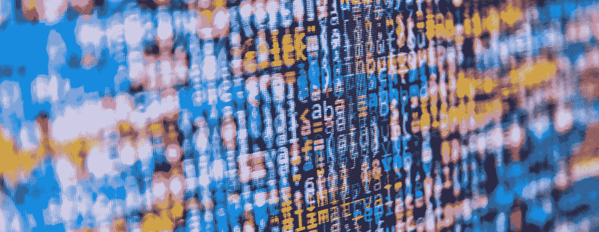

# 2017 年金融科技交易所将重点放在数据上

> 原文：<https://towardsdatascience.com/fintech-exchange-2017-puts-the-focus-on-data-db2ee3b9cfa1?source=collection_archive---------6----------------------->

上周，包括我在内的数百名金融和科技专业人士齐聚芝加哥，参加 Barchart 第三届年度金融科技交易所(FinTech Exchange)会议。该活动专注于专门针对市场和交易的技术。每年的主题都在演变，以反映及时的主题。正如 Barchart 首席执行官 Mark Haraburda 在 [John Lothian 新闻简报](http://www.johnlothiannews.com/2017/05/fintech-exchange-haraburda-says-alternative-data-next-step/)中分享的那样，今年的内容是“关注数据、数据交付方式、数据存储方式、数据分析和可视化方式以及替代数据空间中的新型数据。”

虽然与会者和演讲者来自各地，但芝加哥的存在是最强的——不仅因为会议在那里举行，还因为芝加哥已经成为金融科技创新的中心。

如果人们需要一个提醒，说明芝加哥已经在全球金融科技领域取得了重要地位，他们马上就能得到。哈拉布尔达在欢迎辞中指出，德勤最近将芝加哥列为全球金融科技中心的第五名。这是芝加哥第一次上榜，这是一个强大的首次亮相，这座风城的排名领先于除纽约、硅谷、伦敦和新加坡之外的所有城市。

如果这一事实不足以让与会者相信 TT 的家乡是金融科技领域的“en fuego ”,来自芝加哥的闪电圆桌会议主持人提供了大量证据。虽然他们代表了从全球交易所到软件初创公司的各种公司，但他们都专注于为我们的行业提供数据相关的创新。

但是并不是所有的演讲者都来自芝加哥。总部位于西雅图的 Tableau 的 Vaidy Krishnan 的开场主题演讲重点关注大数据。根据 Krishnan 的说法，虽然构建将数据带到最前沿的仪表板很重要，但当你深入表面之下并问“为什么？”时，数据的真正价值才显现出来他断言，是这个简单的问题，而不是数据本身，激发了新的见解。但他警告说，大多数分析工具并不是为了让你探索下一层问题而设计的。他的建议是:选择一个具有仪表板功能的分析平台，该平台将挖掘其所在位置的数据，并超越仪表板指标来回答那些意想不到的问题。

来自 CME Group 的 Julie Menacho 谈到了交易所的几项数据相关计划，特别是应用程序和数据中心服务，以及专注于 CME 数据业务和市场数据分发的合作伙伴关系。最引人注目的是，她描述了该交易所新推出的基于云的数据服务。从 1970 年开始，超过 450 的历史数据以及来自非传统来源的替代数据(如卫星、信用卡交易和社交媒体)现在可以通过云轻松访问，从而为投资决策提供信息。

来自 Enova 的肖恩·奈史密斯(Sean Naismith)教授了另一个与数据相关的话题:预测分析。奈史密斯表示，自 Enova 于 2004 年成立以来，分析一直是这家在线贷款公司的“心脏和灵魂”，Enova 自称是芝加哥最早的金融科技公司之一。他讲述了客户对即时答案的需求如何推动该公司建立了一个名为 Colossus 的实时决策管理系统。他解释说，这样一个系统需要三个组成部分——业务规则、预测模型和优化例程——并分享了 Enova 在建造 Colossus 时学到的六个值得注意的经验。其中包括:深刻理解客户体验及其留下的数据。

Vertex Analytics 的吉姆·奥斯汀获得了最具娱乐性演示奖。Vertex 的平台通过提供扫描和利用实时和交易后交易数据的工具，帮助交易公司管理当今监管环境的复杂性和雷区。奥斯汀利用了金融科技交流恰逢带孩子上班日这一事实。他让一群学龄儿童和他一起上台，扮演场内交易者和电子交易者的角色。他赢得了当天最大的笑声和推特上的大量喜爱。干得好，吉姆。

DataRobot 的贾斯汀·迪克森(Justin Dickerson)给数据主题又增加了一层。他专注于自动机器学习(AML)，这属于更大的(也是人们谈论最多的)人工智能(AI)类别。DataRobot 通过利用云使分析建模变得更加容易。迪克森透露，在这家成立五年的公司基于云的机器学习平台上，已经建立了超过 1.3 亿个预测模型。他的信息很有说服力:你最好关心机器学习。这不仅仅是因为它能够快速识别业务问题/趋势，具有大规模“学习”的内在能力，并且几乎每天都在变化，还因为您的竞争对手将会使用它。

最后两位演讲者，Nadex 的 Tim McDermott 和 TopstepTrader 的 Michael Patak，来自非常不同的公司。Nadex 是一个受监管的交易所，提供二元期权交易，而 TopstepTrader 的使命是为新交易者提供资金。尽管这两家公司乍看之下几乎没有相似之处，但麦克德莫特和帕塔克传达了一个共同的信息。两人都断言，交易的未来在于零售。麦克德莫特说，该交易所正在努力吸引散户投资者，解决他们对成本和恐惧的担忧，调整市场时间和其他时间框架，并使新交易者更容易进入市场。Patak 说“所有的眼睛都盯着零售”，他的重点是通过教育扩大公司的用户群。看看他们的预测能否实现将会很有趣。

感谢 FinTech Exchange 2017，我现在变得更聪明了，对专注于数据的技术和公司也更加好奇了。我们的行业产生和消耗的数据量可能是巨大的，但芝加哥和其他地方正在发生创新爆炸，可以帮助以更高效和更有利可图的方式处理和管理这些数据。我希望 2017 年的许多演讲者明年将带着更新返回 FinTech Exchange。

要了解更多金融科技交易所的关键信息，请查看 Twitter 上的 [@FinTechChicago](https://twitter.com/fintechchicago) 和 [#FTX17](https://twitter.com/search?q=%23FTX17) 流。