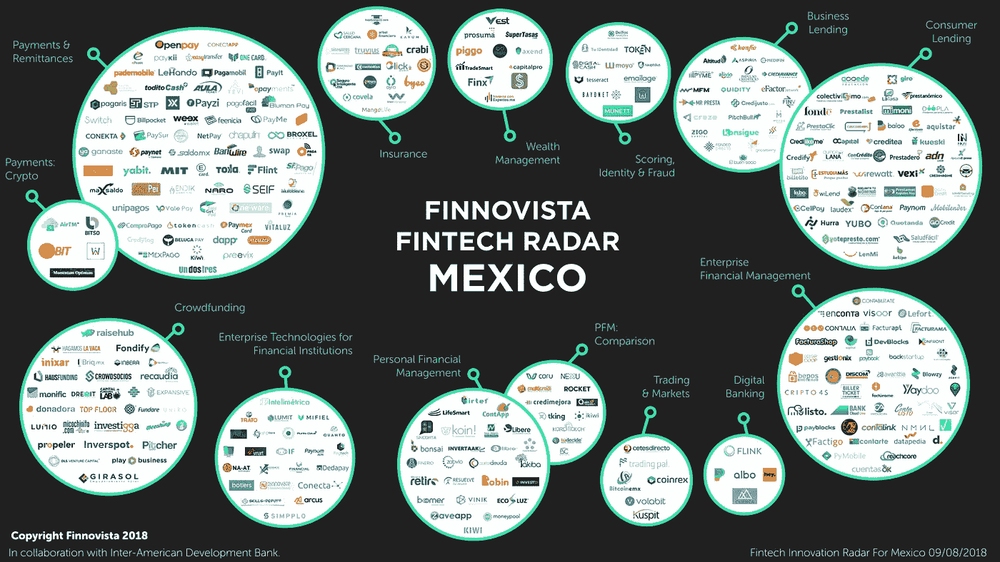
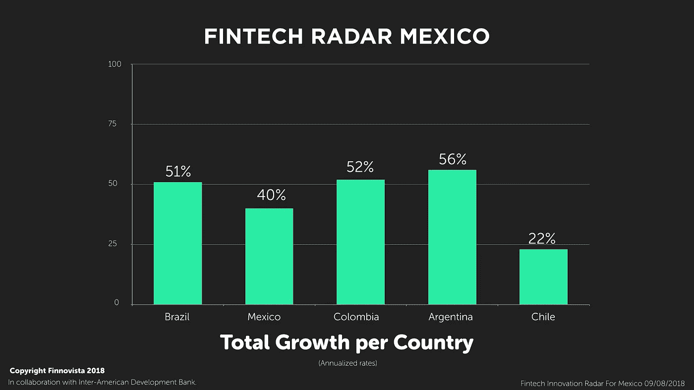
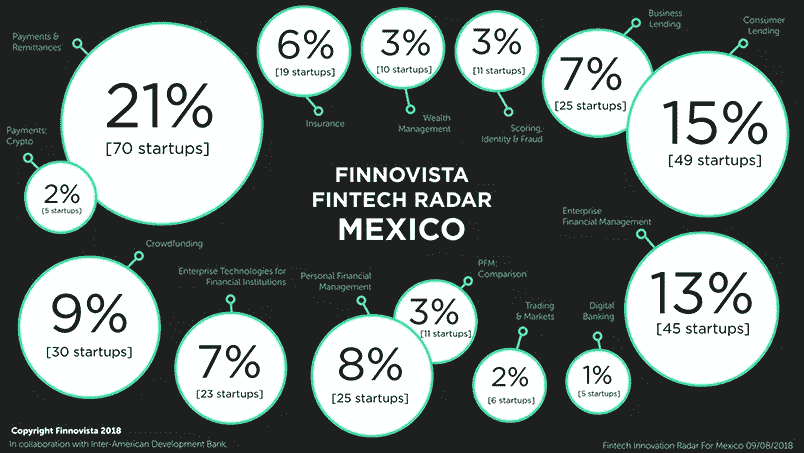
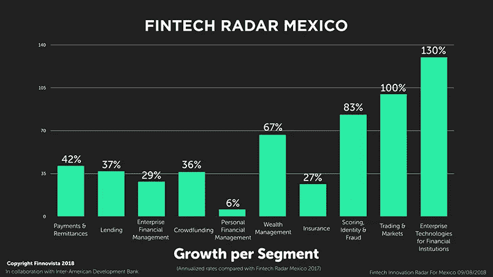
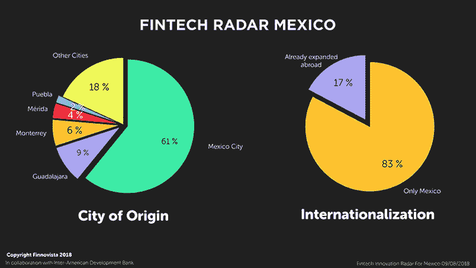
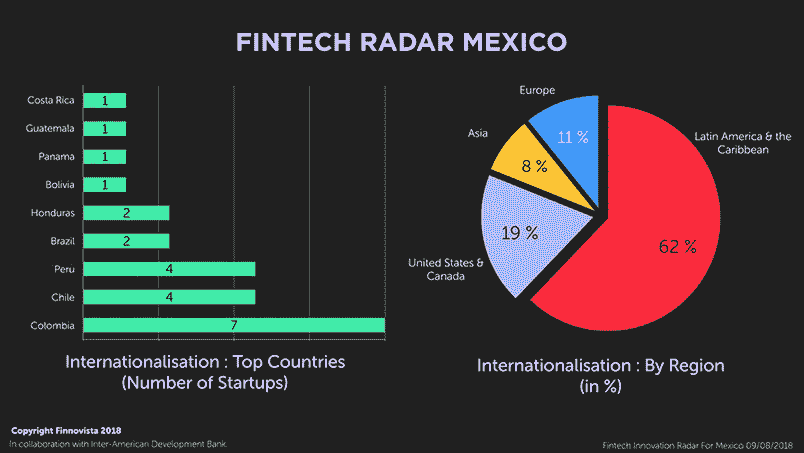
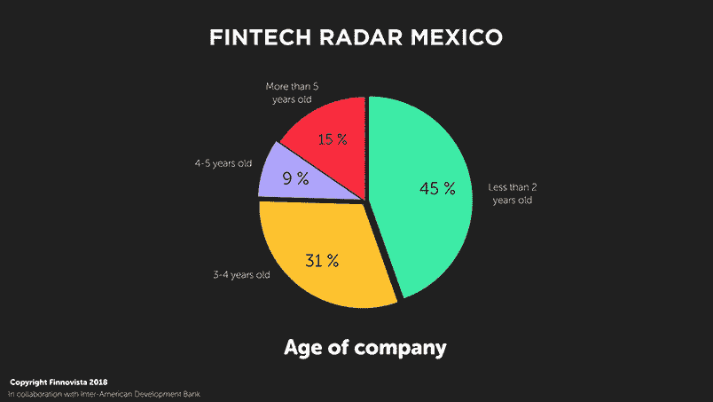
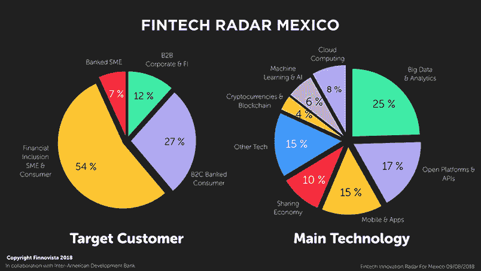
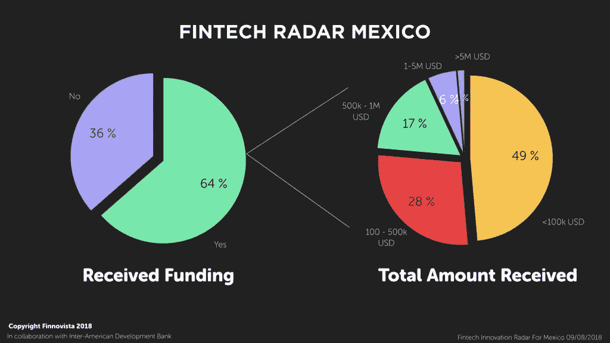
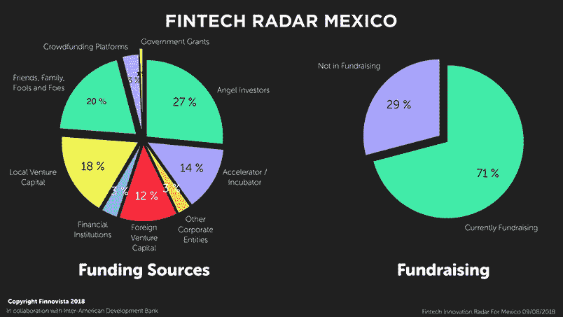

# 2018 年的金融科技——墨西哥浪潮

> 原文：<https://towardsdatascience.com/fintech-in-2018-the-mexican-wave-f1ef59e7cc84?source=collection_archive---------10----------------------->

## 席卷拉丁美洲的工业革命

> 墨西哥超过了 300 家金融科技初创公司的门槛，巩固了其作为拉丁美洲第二大金融科技生态系统的地位

**仅在 12 个月内，125 家新的金融科技创业公司在墨西哥诞生，巩固了墨西哥作为拉丁美洲地区主要金融科技生态系统之一的地位，主要受以下领域增长的驱动:金融机构的企业技术、交易&资本市场、财富管理和替代评分、身份和欺诈。**

金融部门目前正处于深刻的变革和创新过程中，这一过程的主要特点是使用新技术。这种颠覆性的浪潮始于伦敦或新加坡等稳固而成熟的市场，在过去几年中已经扩展到几乎全世界，在拉丁美洲，它正在迅速发展，并正在改变我们所知的金融世界。

Finnovista 之前对拉丁美洲主要金融科技生态系统进行的**研究结果证明了该地区金融部门的稳固转型。在过去几年中，我们见证了该地区大多数金融科技生态系统的增长率约为 50%。迄今为止，芬诺维斯塔已经发表了对 [**【阿根廷】**](https://www.finnovista.com/actualizacion-fintech-radar-argentina-2018/?lang=en)**[**巴西**](https://www.finnovista.com/actualizacion-fintech-radar-brasil-2018/)**[**智利**](https://www.finnovista.com/fintech-radar-chile/)**[**哥伦比亚**](https://www.finnovista.com/fintech-radar-colombia/)**[**厄瓜多尔**](https://www.finnovista.com/fintech-radar-ecuador/)**[**西班牙**的研究 以及关于在拉丁美洲运营的外国创业公司的特定雷达(****](https://www.finnovista.com/actualizacion-fintech-radar-spain/) ****[**Fintech Radar 外国创业公司**](https://www.finnovista.com/fintechradarforeignstartupslatam2018/?lang=en) )和关于金融普惠[(**fin tech for Inclusion Radar**)](https://www.finnovista.com/fintechforinclusionradarlatam/?lang=en))。 当前的分析代表了 Fintech Radar Mexico 与 [**泛美开发银行**](https://www.iadb.org/en) 合作的更新，其第一版于 2017 年 7 月****发表。********************

过去几个月，墨西哥采取了重大举措来推动金融科技创新生态系统，并将自己定位为潜在的全球金融科技中心之一。仅在一年前，在该分析的第一个版本中，该国成为该地区最大的金融科技生态系统，拥有 238 家初创公司。在新版 Fintech Radar 中，墨西哥的 Fintech 生态系统增长到了 **334 家 Fintech 初创公司**，这使得该国落后于巴西，根据 2018 年 6 月发布的上一份[**Fintech Radar Brazil**](https://www.finnovista.com/actualizacion-fintech-radar-brasil-2018/)，巴西是该地区最大的 fin tech 生态系统，有 377 家初创公司。因此，墨西哥巩固了其作为拉丁美洲第二大金融科技生态系统和该地区金融创新主要驱动力之一的地位。墨西哥的生态系统目前比哥伦比亚大 2.5 倍，哥伦比亚是该地区第三大金融科技生态系统，有 124 家创业公司，比阿根廷大 3 倍多，比智利大 4 倍多。

这表明在过去的 12 个月中，墨西哥金融科技生态系统中的创业公司数量增长了 96 家，年增长率为 40% ，略低于该地区其他主要生态系统的年增长率，如巴西增长了 48%，哥伦比亚增长了 52%，阿根廷增长了 56%，尽管高于智利去年增长的 22%。然而，与其他国家相比，墨西哥的死亡率较高，为 12%，而巴西为 14%。这反映出墨西哥有 29 家创业公司在过去几年中停止了运营，因此，同期该国出现了 125 家新的创业公司。与其他金融科技生态系统相比，较低的增长率以及较低的死亡率也可能反映了该国金融科技行业的整合阶段，更多处于更高级发展阶段的创业公司正在整合其商业模式。

目前，墨西哥的六个主要细分市场是:

*   支付和汇款，占 75 家初创公司总额的 23%
*   贷款，占 74 家创业公司总数的 22%
*   企业财务管理，占 45 家初创企业总数的 13%
*   个人理财，占总数的 11%，有 36 家初创公司
*   众筹，有 30 家初创公司，占总数的 9%
*   面向金融机构的企业技术，占总数的 7%，有 23 家初创公司。

在这项分析中，其余五个新兴领域都不到已识别初创企业总数的 6%:

*   保险，占总额的 6%
*   财富管理，占总额的 3%
*   替代得分、身份和欺诈，也占总数的 3%
*   交易和资本市场，占总数的 2%
*   数字银行，占总数的 1%。

如果我们将这些结果与前一版的 Fintech Radar Mexico 进行比较，我们会发现主要 Fintech 细分市场之间的微小变化。支付和汇款、贷款、企业财务管理、个人财务管理和众筹仍然是创业公司数量中最重要的部分。唯一的区别是，这一次，支付和汇款部门成为美国最大的金融科技部门，有 75 家初创公司，贷款部门略有落后，有 74 家初创公司。

然而，当查看所有金融科技细分市场在过去 12 个月中的增长率时，我们可以看到增长率最高的细分市场通常不是该国创业公司数量最多的细分市场。在这个新版本中，以下部分经历了特别强劲的增长:

*   金融机构的企业技术，从 10 家增加到 23 家，增长了 130%
*   交易和资本市场，从 3 到 6 家初创公司增长了 100%
*   另类评分、身份和欺诈，从 6 家增加到 11 家，增长了 83%
*   财富管理，从 6 到 10 家初创公司增长了 67%。

与此同时，墨西哥四大金融科技生态系统在过去 12 个月中也经历了超过 30%的高增长率:支付和汇款(增长 42%)、贷款(37%)、众筹(36%)和企业财务管理(29%)。尽管在美国的 11 个金融科技领域中，没有任何一个领域出现负增长，但我们确实发现了两个领域的增长速度比其他领域慢:保险，增长率为 27%，个人金融管理，在过去 12 个月中增长了 6%。

另一方面，值得注意的是，数字银行领域出现了 5 家金融科技初创公司，因为在上一期墨西哥金融科技雷达中，该领域没有初创公司。正如我们在巴西已经观察到的那样，该细分市场在一年内增长了 147%，多达 16 家初创公司，我们不断发现更多的数字银行解决方案，试图适应新的市场需求，从而接近新一代。

如果我们将墨西哥金融科技细分市场的分布与拉丁美洲的其他两个主要生态系统(巴西和哥伦比亚)进行比较，我们会发现这三个国家拥有相同的主要金融科技细分市场，但略有不同:支付和汇款、贷款和企业财务管理。支付和汇款现在是这三个国家中最大的部分，这反映了我的移动设备在进行交易时变得越来越重要。在其他两个细分市场中观察到了细微的差异，因为贷款细分市场是墨西哥和哥伦比亚的第二大生态系统，而在巴西则位于第三位，这可能是受该国该细分市场面临的**监管限制的影响。**

**我们认为，在过去 12 个月里，墨西哥和巴西在金融科技领域的增长趋势方面存在重大差异。正如我们已经提到的，面向金融机构的企业技术这一细分市场在墨西哥的增长率最高，有 13 家初创公司，而在巴西，这一细分市场一年内只有 5 家新的初创公司，这可能反映了墨西哥金融机构对将金融科技解决方案纳入其业务的开放程度更高。另一方面，保险部门的增长率差异也值得注意，因为在巴西，该部门在 12 个月内增长了 73%，而在墨西哥，该部门的增长率限制在 27%，这表明该部门在墨西哥处于早期发展阶段，这可能是受 WeeCompany 首席执行官 [**Jesús Hernández**](https://www.eleconomista.com.mx/sectorfinanciero/Las-insurtech-tomaran-fuerza-en-seguros-20180116-0128.html) 指出的“不愿意冒太大风险”的保守形象的影响。这种较慢的增长率反映了墨西哥保险技术部门的停滞，而此时该部门正在经历世界其他地区的增长和转型过程。墨西哥显然需要高效且无处不在的创新保险服务，因此墨西哥最具创新性的保险公司将利用这一机会整合 InsurTech 创新，无论是墨西哥还是外国的解决方案，正如西班牙初创公司[**【Bdeo】**](http://www.bdeo.es/en/)**，**已经与墨西哥重要的保险公司一起推出了视频理赔工具。**

**为了对墨西哥的金融科技生态系统进行更深入的分析，对该国 110 家金融科技初创公司进行了一项关于不同业务方面的调查。**

****

**收集的信息表明，墨西哥城是大多数墨西哥金融科技初创公司的创办城市，有 61%的人提到了它们的起源城市，其次是瓜达拉哈拉，9%，蒙特雷，6%，梅里达，4%，普埃布拉，2%。关于国际化，83%的公司声称只在墨西哥运营，而 17%的公司确认在国外运营。我们发现，与该地区最大的金融科技生态系统巴西相比，墨西哥的国际化率较低，巴西的国际化率为 30%，仍远远低于该地区国际化率最高的阿根廷的 48%。**

****

**当分析已经开始国际化进程的初创公司的主要目的地国家时，我们观察到 62%的国际扩张发生在拉丁美洲和加勒比海地区，38%的墨西哥金融科技初创公司已经扩张到该地区以外，是巴西的两倍。**

**哥伦比亚成为墨西哥金融科技初创公司的主要目的地，其中 30%在该国运营，其次是智利和秘鲁，每个国家都是 17%墨西哥金融科技初创公司的目的地，以及巴西，其中 9%的墨西哥金融科技初创公司已经扩张。另一方面，我们还观察到洪都拉斯、巴拿马或哥斯达黎加等加勒比国家是主要目的地，这反映了墨西哥金融科技初创公司如何将其业务国际化到仍处于早期发展阶段的生态系统，因此在开发较少的市场中寻找机会。**

**除了拉丁美洲和加勒比海地区，美国和加拿大是墨西哥金融科技初创公司的下一个目的地，这些公司决定将活动扩展到其他大陆，因为 19%的公司已经在这里运营。与此同时，11%的金融科技初创公司在欧洲运营，8%的墨西哥金融科技初创公司已经扩展到亚洲。**

****

**墨西哥金融科技雷达的这一新版本展示了关于墨西哥金融科技生态系统成熟度的重要结果，因为我们观察到，78%的受访金融科技初创公司已经处于高级阶段，超过了巴西注册的 66%。具体来说，31%的人声称已经处于增长和扩张阶段，而 47%的人表示已经准备好进行扩展。其余 22%仍处于早期阶段，主要是准备用于商业发布的测试版本，因为 16%的受访金融科技初创公司声称处于这一阶段。**

**然而，尽管墨西哥的金融科技生态系统处于高度成熟的阶段，并且正如我们在巴西等该地区其他重要生态系统中所看到的那样，大多数接受调查的初创公司在员工数量方面仍然很小，因为其中 54%的公司声称拥有 1 至 10 名员工，而只有 8%的公司拥有 50 名以上的员工。**

****

**从公司的年龄来看，墨西哥的 Fintech 生态系统主要由年轻的创业公司组成，因为 85%的公司不到 5 年。具体来说，45%不到 2 岁，31%出生于 3 至 4 年前，9%出生于 4 至 5 岁。与此同时，只有 15%的被调查创业公司成立超过 5 年**

****

**根据 [**世界银行**](https://globalfindex.worldbank.org/sites/globalfindex/files/countrybook/Mexico.pdf) 的数据，37%的墨西哥成年人口拥有官方银行账户，这意味着墨西哥的银行化率约为 63%，高于该地区的平均水平(51%)。然而，我们可以再次看到，银行服务不足和没有银行服务的消费者和中小企业市场仍然是墨西哥金融科技初创公司的主要目标市场，这是我们 Finnovista 称为金融科技包容性的细分市场。具体而言，54%的墨西哥金融科技初创公司将他们的产品和/或服务瞄准了这一细分市场，这一比例自 2017 年以来有所增加，当时 46%的墨西哥金融科技初创公司被确定将他们的服务瞄准了这一细分市场。另一方面，有趣的是，要强调的是，这一比例高于该地区其他主要金融科技生态系统，因为在巴西，35%的初创公司将其解决方案瞄准金融科技领域，哥伦比亚为 45%，阿根廷为 41%，智利为 40%。**

**当被问及用于创建其产品和服务的主要技术时，墨西哥 Fintech 初创公司最常用的三种技术是:大数据和分析(25%)、API 和开放平台(17%)以及移动和应用(15%)。我们再次看到开放银行在不同实体的产品和服务之间的联系方面获得的重要性，所有参与者都在利用传统金融实体拥有的大量数据和信息，另一方面，金融科技方面的技术创新能力也在改善他们的客户服务。这一过程反映了金融实体如何与行业中的新参与者进行更深入的合作，这些新参与者通过适应消费者的新需求来获得市场份额。**

****

**在回答融资问题的 110 家墨西哥金融科技初创公司中，64%的公司声称过去获得过第三方公司的资金，这表明了外部资金来源在该国创业项目发展中的重要性。然而，墨西哥金融科技初创公司仍在筹集少量外部资金，40%的公司表示收到的资金不到 10 万美元，而只有 7%的公司声称筹集了超过 100 万美元，低于巴西注册的金额，巴西 13%的金融科技初创公司筹集了超过 100 万美元。然而，在过去几年中，我们已经看到墨西哥金融科技初创公司的重要投资轮次，例如由贷款平台 Konfio 筹集的[**8900 万美元**](https://www.forbes.com.mx/fintech-konfio-levanta-1700-mdp-en-ronda-de-inversion/) 轮次，由 Vostok Emerging Finance 牵头；th**e**[**700 万美元**](https://www.prnewswire.com/news-releases/comparagurucom-secures-usd-7-million-series-a-investment-from-leading-investors-to-help-mexican-consumers-save-time-and-money-on-their-financial-products-300477749.html) 由 Curu 募集，QED 投资人领投；或者是由 ePesos 融资的[**600 万美元**](http://paymentsjournal.com/santander-innoventures-leads-usd-6-million-round-mexican-startup-epesos-advance-financial-inclusion/) 轮，由 Santander Innoventures 牵头。**

****

**当在墨西哥金融科技初创公司中确定主要资金来源时，正如在巴西发生的那样，天使投资者成为最重要的资金渠道，因为同意分享这些信息的初创公司中有 27%通过这些方式筹集了资金。与其他生态系统不同，大多数墨西哥金融科技初创公司(20%)仍在转向封闭的资金来源，即所谓的**3f**:*朋友、家人和傻瓜*。另一方面，加速和孵化计划也是墨西哥金融科技初创公司的重要替代资金来源，因为其中 14%的公司声称参与了类似的计划。具体来说，在墨西哥，我们发现加速计划 [**Startupbootcamp FinTech 墨西哥城**](https://www.startupbootcamp.org/accelerator/fintech-mexico-city/) ，以及规模计划[**startup boot camp Scale fin tech**](https://www.startupbootcamp.org/accelerator/scale-fintech-mexico-city/)，两者都由 Finnovista 运营。最后，还值得注意的是风险投资公司在墨西哥金融科技生态系统中的重要性，因为 18%的墨西哥初创公司声称从当地基金筹集了资金，12%来自外国基金。**

**最后，当被问及他们的融资计划时，墨西哥 71%的金融科技初创公司表示他们目前正在寻找资金，其中 71%在这个过程中提供股权，20%通过收购债务来实现。**

## **最终外卖**

**正如我们在 Finnovista 之前进行的研究中看到的那样，金融科技创新浪潮现在是一种全球现象，据估计，银行业面临着因金融科技初创公司而损失高达 4.7 万亿美元收入的潜在风险。拉丁美洲也未能幸免于这场革命，过去在一些市场上是孤立的创新，现在是整个地区的普遍趋势。这一波金融创新在这个 51%的人口仍然没有银行账户的地区尤其重要，换句话说，他们被排除在正规金融系统之外，因为金融科技解决方案通过提供从汇款平台或数字支付到智能手机的各种解决方案，将自己定位为这部分人口的替代者。**

**然而，为了实现该行业的稳定增长、发展和接受，仍有一些关键因素必须考虑和解决，例如在监管或行业开放方面所做的努力。从这个意义上说，在 2018 年 3 月通过监管金融科技机构的法律(通常称为金融科技法)成为该地区第一部法律和全球参考后，墨西哥成为了先锋。这项新法律的目标是通过一个立法框架来监管所有被称为金融科技机构(FTI)的平台，从而提供更大的法律确定性，并创建一个法律框架，确保金融科技初创公司与传统金融和银行机构之间的公平竞争。**

**金融科技行业存在适当和量身定制的监管是该国行业大多数主要参与者所接受的必要性，因为正如在伦敦或新加坡等其他整合生态系统中所看到的那样，它增加了该行业的清晰度，从而推动了创新解决方案的进一步增长和整合。然而，我们面临着这些新法规的风险，如墨西哥的金融科技法，导致过度监管的市场，从而减缓甚至阻碍更大的金融创新。在墨西哥，新的法律规定，电子支付机构必须通过独立的第三方评估遵守“这些机构根据上述规定必须遵守的关于信息、电子手段的使用和持续运作的安全措施”的情况。这一过程高度依赖区块链技术，因此高度依赖提供这些技术要求的外国公司，这些技术要求在墨西哥和该地区其他地方尚未被广泛采用。**

**最后，因为我们发现自己正处于技术金融全球化的时代，所以新的监管不应该局限于一个国家的情况。拉丁美洲国家必须考虑到国际领域，学习其他国家的最佳做法，以及最终阻碍进一步创新和新商业模式的主要障碍。通过这种方式，该地区将能够在国际市场上实现更大程度的整合，同时将拉丁美洲国家定位为外国公司的目的地生态系统，并将为该地区的初创公司打开扩张之门。**

# **参考**

**见原帖:[芬兰人](https://www.finnovista.com/actualizacion-finnovista-fintech-radar-mexico-agosto-2018/)**