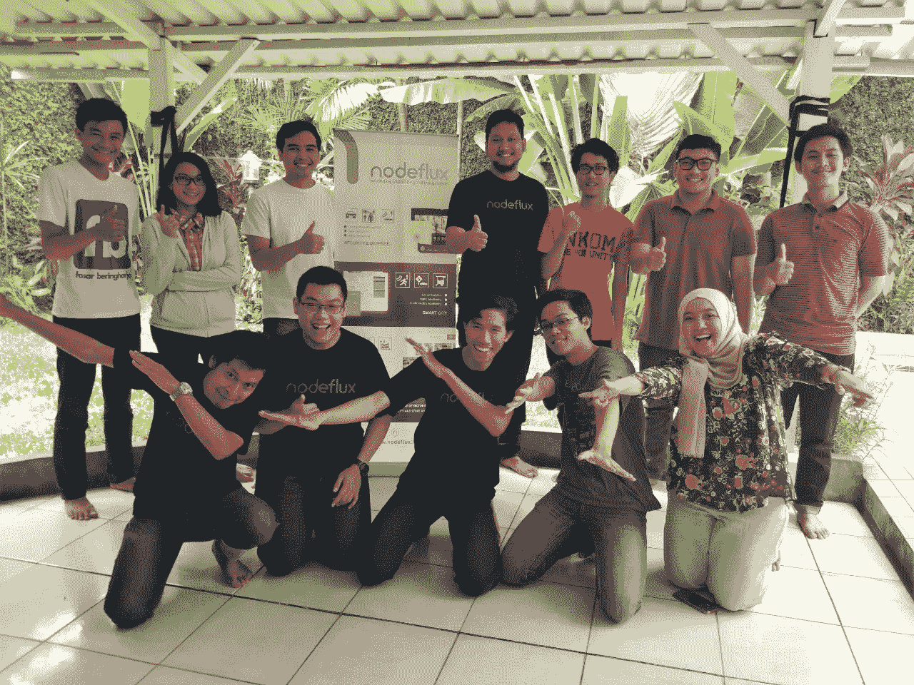
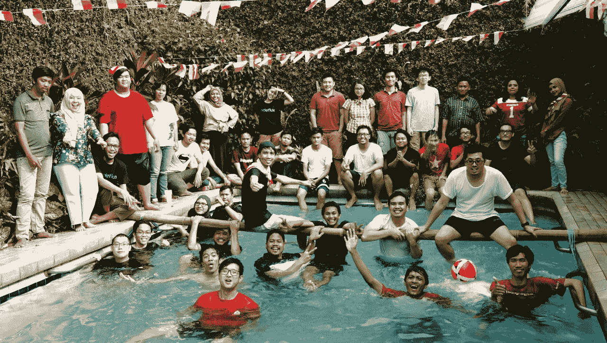

# 在 Nodeflux 作为人工智能研究科学家的第一次实习

> 原文：<https://towardsdatascience.com/first-internship-as-ai-research-scientist-at-nodeflux-ea4a339d03f?source=collection_archive---------10----------------------->

> 大二学生实习的机会很少，至少在我家附近是这样。我的动机是获得新的经验，了解校园生活是什么样的。通过这篇文章，我将讲述我自己，Nodeflux，以及我作为数据科学家的实习经历，后来从注册到最后经过 2 个月的实习，我的实习经历修改为人工智能研究科学家。

# **我的一般背景**

我的名字是丹迪·瑙法尔迪。在我写这篇文章的时候，我即将开始我在 ITS 信息学系的第三年。我的高中背景是一个喜欢学习数学和物理的书呆子。大概我选择信息学专业就是为了避开生物和化学。在校园里，我总是有兴趣学习新的东西，这可能是我决定不再继续竞争编程 lol 后的“数据科学”之旅的开始。

# **Nodeflux**

你可能从未听说过 Nodeflux。这是一家非常年轻的初创公司，位于雅加达，专注于智能视频分析服务。利用各种知识，你可以从中央电视台的视频流。他们的一些产品是高速公路休息区的车辆计数器，在' mudik '期间确实帮助了很多人，使用人脸识别技术的员工考勤机，以及 2018 年亚运会的视频监控系统也使用人脸识别技术。他们的口号是“扩展视野，超越想象”。检查他们的[网页](http://nodeflux.io)。

# **实习前:我如何到达这里**

在我的第四个学期，我决定我必须在我的下一个假期实习，以获得新的经验和知识。于是，我开始主要在 IT 创业上寻找实习信息。我在寻找软件工程师的职位。有一次，我 2012 届的学长 Mas Fika 在我的部门脸书小组分享了关于 Nodeflux 实习机会的信息。我不太了解 Nodeflux，之前我只知道 2013 届的 Mas Rizok 不是我们系唯一在 Nodeflux 工作的校友。我只知道他们做 AI 的东西，专注于计算机视觉技术。当时，Nodeflux 面向软件工程师、web 开发人员和 devops 工程师开放职位。我只是认为这是一个机会，我必须申请这一个。

首先，我只是把我的简历发到海报中提供的邮箱。接下来是技术任务。它包括一些与不同领域相关的问题，就像职位空缺一样。所以有一些面向对象的问题，CSS 和 Javascript 的东西，linux 的理解，和机器学习的东西。有很多问题要在 3 天的期限内完成。除了一些我以前从未听说过的 devops 之外，它们都很简单。之后，被选中的候选人将与 Nodeflux 的一些工程师进行在线面试。最初的几个问题之一是我对什么职位感兴趣。我一片空白，忘了有哪些职位空缺。我只是说我对软件工程和机器学习的东西感兴趣*(他们的海报里没有发表，lol)* 。问了一些问题后，问题开始聚焦在 web 开发和数据科学上。有人问我更喜欢 web dev 还是 data scientist，我选择了 data scientist，因为这家公司的专长是人工智能，我认为这将是扩展我知识的一个非常好的机会。几周后，我得到了这个职位。耶！！

# **日常实习**

首先，你需要知道这里的数据科学家不是那种以商业为导向的工作。我们更像人工智能工程师或人工智能研究科学家或机器学习工程师，他们专注于使用人工智能来创造产品或增强产品。有趣的事实是，这里没有数据科学家职位的员工，只有人工智能工程师和人工智能研究科学家。在我实习期间，我有 2 个导师，Mas Rizok(人工智能工程师)和 Mas Alvin(人工智能研究科学家)。第一天，我被要求学习容器概念和 Docker，因为它在这里被大量用于容器化开发环境和产品部署。然后，我得到了一个在整个实习期间要完成的项目，就是制作一个能够从一个人的正面照片预测年龄和性别的模型。查看我的项目[这里](https://github.com/dandynaufaldi/Agendernet)

With one of my mentor, Mas Rizok (Informatics ITS 2013)

我做这个项目的过程是起起伏伏的。挑战之一是处理这种“脏”数据集，即 IMDB-Wiki 数据集。它包含大量标签错误数据。我花了大约 3 天时间浏览了 20，000 张图片(只有全部*部分清理过的*数据集的 1/10 ),并设法丢弃了其中的 2000 张，而这实际上只是全部数据的一小部分。让我开心的一件事是获得大量的计算能力。起初，我获得了使用 2 个 GTX 1080Ti + 2 个 16 核英特尔至强的服务器的权限，然后更改为使用 Tesla V100 的 AWS 实例。它们真的很快，我从来没有机会使用这么大的计算能力。

我在这里学到了很多新的技术和方法。它们是人脸检测、人脸对齐、制作双输出模型、多重处理和多线程。在我实习之前，我从来没有处理过这种不适合内存的数据，有一天，我刚刚用完了所有 60 GB 的可用内存，因为我的笨脑袋，然后我学会了如何根据需要加载数据，并通过多处理最小化 I/O 开销。这个项目也是我的第一个项目，我给了很多文件。我试图让其他人也能复制它。在这里，我也熟悉自己阅读论文作为参考，因为他们真的是很好的参考。我在这里学到了很多新东西，直到我可以说我的大部分代码对我来说都是新事物。

后来，当我完成了模型的制作。我的导师要求我建立一个端到端的系统，以实时视频流作为输入来推断模型。在那里，我学会了如何在线程中分离作业，以实现实时视频处理。我还集成了排序跟踪器，后来我知道它使用卡尔曼滤波器作为其主要结构。研究了一下卡尔曼滤波器，我意识到我的线性代数和统计&概率课是值得的。是的，我在实习期间学到的很多新东西实际上是我在校园里所学的东西的实现(操作系统课程、线性代数课程、统计&概率课程，还有其他一些)。

# **值**

在这里，我形成了一些价值观，它们真的帮助我度过了第一次实习。它们是:

*   **好奇心**:永远要有学习新事物的精神，让它们引导你克服你真正的问题。多搜索，多阅读
*   自信:新的挑战总会向你走来，你必须确保你能做到。坚强的意志真的有帮助。
*   耐心:在你的旅程中可能会遇到障碍，你必须有耐心保持在你的轨道上并始终如一。以后你将能够克服这些问题。

*With some of other intern, CEO, and employee. From top left to bottom right: Guntara (SE Intern), Atina (SE Intern), Kak Ilham (SE), Kak Meidy (CEO), Chasni (Web Dev Intern), Dani (AI Intern), Nanda (DevOps Intern), Adi (DevOps Intern), Kevin (SE Intern), Daniel (SE Intern), Me, Kak Anggun (Talent Management)*

# **结论**

在实习期间，我得到了所有我想要的东西。我学到了新的东西，认识了伟大的人，向最优秀的人学习，并且能够与他人讨论我的想法。Nodeflux 是一家年轻的初创公司，发展非常迅速。我会把它推荐给任何喜欢体验新事物，解决挑战，当然也想了解更多人工智能的人。这里所有的人都是伟大的人，他们热爱自己的工作，热爱自己的工作。我想感谢 Nodeflux 给我这个好机会，因为这是我的第一次实习，真的很有趣。

Our “Agustusan” event