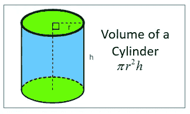

# Python 数据科学的第一步— NumPy

> 原文：<https://towardsdatascience.com/first-step-in-data-science-with-python-numpy-5e99d6821953?source=collection_archive---------2----------------------->


我读到过学习的最好方法是写博客。既然我学习数据科学已经有一段时间了，我想为什么不试一试呢。这就是了。我的第一篇博客。

现在，网上有很多优秀的资源，人们可以从中学习。但是，当您刚刚开始时，可用资源的数量会让您有些不知所措。特别是在数据科学领域，你可以找到所有这些热门词汇，如数据科学、人工智能、机器学习、深度学习等等。它变得令人困惑——从哪里开始呢？

如果你像我一样，你会发现一些使用数据科学或人工智能的很酷的应用程序，你会迫不及待地开始自己构建这些应用程序。你将开始学习基础知识，但很快就无法决定如何将它们整合在一起，最终会感到沮丧。我对任何新手的建议是要有耐心。不要看得太远，只关注眼前的事情。一般来说，数据科学或编程是一门艺术，你需要一步一步来。我还没到，但我在努力。

> 最重要的是开始；第二重要的是坚持下去。

毫无疑问，学习基础知识很重要。但是如果你不能解决任何真正的问题，学习又有什么意义呢？我相信无论你何时学习，你都必须有一个最终目标。我在这篇文章中的目标是尝试解决问题；非常简单的问题，但仍然是问题。从问题到解决方案，分享数据科学第一步的一些基础知识——NumPy。

# 等等，什么是 NumPy？

NumPy 代表数字 Python。正如[文档](http://www.numpy.org/)所述，NumPy 是使用 Python 进行科学计算的基础包。它用于对数组执行数值运算。NumPy 在大小、速度和功能性方面都优于 python list。关于 python list 和 NumPy 数组比较的详细描述可以在[这个链接](https://webcourses.ucf.edu/courses/1249560/pages/python-lists-vs-numpy-arrays-what-is-the-difference)中找到。

在开始使用 NumPy 之前，它需要安装在您的系统中。您可以使用 pip 或 anaconda 安装它。本文中的代码使用 Python3 和随 anaconda 安装的 NumPy。我不会对安装进行详细说明。如何安装 NumPy 见[此链接](https://anaconda.org/)。

## 说够了。让我们进入正题。

你可以在下面的链接中找到这篇文章的完整代码。

[](https://github.com/bajracharya-kshitij/numpy) [## bajracharya-kshitij/numpy

### numpy -在解决问题的同时学习 numpy 基础知识

github.com](https://github.com/bajracharya-kshitij/numpy) 

在我们开始使用 NumPy 或任何其他包执行任何种类的计算之前，第一步总是导入包。所以，还是导入 NumPy 吧。

```
import numpy as np
```

这里，我们给 NumPy 取一个更短的名字— np。这就是所谓的混叠。从今以后，每当我们需要从 NumPy 包中访问任何方法时，我们将使用' np '来这样做。参见[此链接](https://www.digitalocean.com/community/tutorials/how-to-import-modules-in-python-3#aliasing-modules)了解更多关于混叠的信息。

## 我们不是要解决问题吗？

是的。现在我们已经导入了 NumPy，我们可以用它来执行各种计算。那么，现在让我们来定义第一个问题。

# 问题 1

给你 5 个不同半径和高度的圆柱形容器，高度从 5 厘米到 25 厘米不等。找出
a)每个容器可以容纳的水的体积，
b)所有容器可以容纳的水的总体积，
c)哪个容器可以容纳的最高体积和多少，
d)哪个容器可以容纳的最小体积和多少，
e)容器可以容纳的水的体积的平均值、中间值和标准偏差是多少？

## 这是基本的算术。我不需要 NumPy 来解决这个问题。

你当然不知道。Python 包是为解决更复杂的问题而构建的，并且能够解决更复杂的问题。但是这里的目的只是给出 NumPy 如何工作的一个基本概念，以便这些技术以后可以应用于更大规模的问题。我只是不想吓跑那些新手。

# 解决方案 1

首先，我们需要 5 个圆柱形容器的半径和高度。半径和高度的值被定义为在 5 和 25 cm 之间。我们先用变量来定义这些。

```
no_of_items = 10
lower_limit = 5
upper_limit = 25
```

项目的数量是 10，因为我们需要 5 个容器中的每一个都有 2 个值——一个是半径，另一个是高度。

稍微提个醒。与网上其他关于 NumPy 的资源不同，这些资源遵循特定的模式或不同属性或方法引入的顺序，本文不会这样做。因为我们的目标是解决手头的问题，所以我们将向前推进，按照有助于我们解决问题的顺序引入概念。所以，这一切都是随机的。说到这里，我们来生成一些随机数。

```
np.random.seed(0)
values = np.random.randint(lower_limit, upper_limit, no_of_items)
```

上面有三个参数——下限 5、上限 25 和项目数 10。这个执行的结果是`values`将被分配一个由 5 到 25 之间的 10 个随机数组成的 NumPy 数组。这是创建 NumPy 数组的一种方法。注意，这里下限是包含性的，上限是排他性的。所以，25 永远不会出现在数组中。`np.random.seed`是一种有趣的方法。它有一个参数(上面的 0 ),它的作用是返回一组随机数。有趣的是，不管你什么时候执行上面的代码块——现在，午饭后或者一年后——你总是得到相同的随机数集合。相比之下，如果从上面的代码块中删除`np.random.seed`，每次执行都会得到不同的随机数集合。我在这里使用 0 作为种子，但是您可以使用任何整数；你得到的只是一组不同于我的随机数。

**注**:也有其他方法产生随机数。`np.random.randint`生成整数。如果需要浮点数，可以用`np.random.rand`和`np.random.randn`。这些你可以自己去探索。

如果你现在打印出`values`，你会得到这样一个 NumPy 数组

```
array([17, 20,  5,  8,  8, 12, 14, 24, 23,  9])
```

这里我们可以看到，有一个单独的开始和结束方括号。这说明`values`是一个一维数组。为了进一步验证这一点，您可以使用`values.ndim`，它返回值`1`，表示`values`是 1D。现在，为了验证数组中实际上有 10 个条目，我们可以使用`values.size`，它返回数组的长度`10`。此外，要找出列表中包含什么类型的值，您可以使用`values.dtype`，在这种情况下，它将返回`dtype('int64')`，表示数组包含整数。

接下来，我们通过使用返回`(10,)`的`values.shape`来看看这个数组的形状。这里逗号分隔每个维度上的项目数。由于`values`是 1D，逗号后面没有数字。这些只是熟悉 NumPy 的一些属性。让我们回到问题上来。

所以，我们需要圆柱体的半径和高度，但是现在我们只有一个简单的数字数组。让我们重新组织一下，使数字成对出现，每个气缸一个。为此，我们使用`reshape`方法。

```
no_of_rows = 5
no_of_columns = 2
containers = values.reshape(no_of_rows, no_of_columns)
```

reshape 方法将 NumPy 数组的形状更改为我们指定的任何维度；唯一的要求是沿着每个维度的项目数的乘积等于项目总数。在这里，我们将`values`转换成一个 5 行(每个容器一行)2 列(一列表示半径，另一列表示高度)的 2D 数组，并将其存储在`containers`中。现在，如果你打印出`containers`，你会看到如下所示。

```
array([[17, 20],
       [ 5,  8],
       [ 8, 12],
       [14, 24],
       [23,  9]])
```

正如我们所见，有两个左右方括号，所以这是一个 2D 数组。使用`containers.ndim`验证这一点。现在形状也变了。试试`containers.shape`，你会看到它返回`(5,2)`。

现在我们有一个 2D 数组，让我们分开半径和高度数组。为此，我们将使用切片。这里我们只处理两列，所以切片会非常简单。关于切片的深入细节，请参见本教程。

假设第一列代表半径，第二列代表高度。我们来切片`containers`。

```
radius = containers[:,0]
```

这定义了我们只取所有的行(:)和第一列(0)。同样，对于高度，我们取所有的行(:)，只取第二列(1)。

```
height = containers[:,1]
```

现在我们有了半径和高度的所有值，我们终于可以计算圆柱体的体积了。你可能知道，圆柱体的体积可以这样计算:



```
volume = np.pi*(radius**2)*height
```

如果我们现在打印`volume`，它会返回一个数组，如下所示

```
array([18158.40553775,   628.31853072,  2412.74315796, 14778.05184249,14957.12262374])
```

只用一行代码，它就计算出了所有 5 个圆柱体的体积。这里，我们只取了一个包含 5 个元素的 1D 数组。NumPy 能够快速高效地执行多维数组计算，每个维度上有成百上千个项目。这就是 NumPy 的力量。

现在，为了找到所有圆柱体中包含的水的总体积，我们可以简单地将上述数组中所有圆柱体的体积相加。

```
total_volume = volume.sum()
```

总容积也可以用另一种方法计算，不用计算单个气缸的容积。方法是计算半径和高度的点积。

```
radius_squared = np.square(radius)
dot_product = np.dot(radius_squared, height)
total_volume_by_dot_product = np.pi*dot_product
```

`total_volume`和`total_volume_by_dot_product`都给出相同的结果。点积在这里有效，因为半径平方和高度都是一维的。对于二维矩阵，它必须满足第一个矩阵的列数必须等于第二个矩阵的行数的要求。因此，如果两个 2D 矩阵具有相同的维数，在执行点积之前，有必要使用`np.transpose()`方法找到其中一个矩阵的转置。

现在，要找到哪个圆柱体能容纳最大体积的水，我们可以使用`max`方法，这个圆柱体在数组中的索引可以通过使用`argmax`方法找到。

```
max_volume = volume.max()
index_of_max_volume = volume.argmax()
```

类似地，我们可以使用`min`方法来查找最小体积，使用`argmin`方法来查找圆柱体在数组中的索引。

```
min_volume = volume.min()
index_of_min_volume = volume.argmin()
```

最后，我们可以计算圆柱体体积的平均值、中间值和标准偏差。

```
volume_mean = np.mean(volume)
volume_median = np.median(volume)
volume_standard_deviation = np.std(volume)
```

# 问题 2

从 1 到 25 的 25 张牌随机平均分配给 5 个人。找出每个人的纸牌总数，这样对于第一个人来说，总数是第一张纸牌的价值减去其余纸牌的总数；对于第二个人，总和是第二张牌的值减去其余牌的总和，依此类推。纸牌总数最大的人将获胜。找出赢家。

# 解决方案 2

这次我们需要从 1 到 25 的 25 个数字。在问题 1 中，我们通过使用`np.random.randint`方法生成了一个 NumPy 数组。现在，让我们看看生成 NumPy 数组的第二种方法。这次我们将使用`arange`方法。请注意，这是一个安排，而不是安排。

```
numbers = np.arange(1,26)
```

和`np.random.randint`方法一样，下限是包含性的，上限是排他性的。如果没有定义下限，将导致 NumPy 数组从 0 开始。我们还有一个用于`arange`的`step`参数，如果定义的话，它将在开始和结束限制之间产生`step`的倍数。此时，如果您选中`numbers`，您将得到下面的数组。

```
array([ 1, 2, 3, 4, 5, 6, 7, 8, 9, 10, 11, 12, 13, 14, 15, 16, 17, 18, 19, 20, 21, 22, 23, 24, 25])
```

现在我们有了从 1 到 25 的卡片，让我们在分发之前洗一下。为此，我们使用`np.random.shuffle`。

```
np.random.shuffle(numbers)
```

现在，如果我们看一下`numbers`，我们将得到一个类似这样的数组。

```
array([12, 22, 20, 19, 3, 23, 21, 17, 11, 1, 4, 5, 16, 9, 14, 10, 6, 18, 15, 8, 25, 2, 13, 7, 24])
```

这只是可能的方式之一。这是因为`shuffle`方法在每次运行时都会改变`numbers`的顺序。你的将会完全不同。

太好了。我们已经洗牌了。现在让我们把它们平均分配给 5 个人，每人 5 张卡片。

```
reshaped_numbers = numbers.reshape(5,5)
```

看起来像这样。

```
array([[12, 22, 20, 19,  3],
       [23, 21, 17, 11,  1],
       [ 4,  5, 16,  9, 14],
       [10,  6, 18, 15,  8],
       [25,  2, 13,  7, 24]])
```

5 张卡片，每张 5 个人，排列成 2D 矩阵。完美。现在，我们需要做的就是找出每个人的总数。为此，添加对角线元素并减去其他元素。因此，第一个人的总和将是`12-22-20-19-3`，第二个人的总和将是`-23+21-17-11-1`，以此类推。要做到这一点，我们需要一个矩阵，它的对角线元素和上面的一样，但是其他元素都是无效的。首先，让我们用单位矩阵得到对角线。

## 对“我”的一只眼睛使整个世界变瞎。嗯，除了对角线。

为了生成一个单位矩阵`I`，我们使用了`eye`方法。由于`I`是方阵，我们只需要一个自变量。在这种情况下，我们需要一个 5x5 的矩阵。

```
I = np.eye(5)
```

这会生成下面的单位矩阵。

```
array([[1., 0., 0., 0., 0.],
       [0., 1., 0., 0., 0.],
       [0., 0., 1., 0., 0.],
       [0., 0., 0., 1., 0.],
       [0., 0., 0., 0., 1.]])
```

现在，如果我们将`reshaped_numbers`与`I`相乘，一个元素接一个元素的乘法将只保留对角线元素，并删除所有其他元素。

```
diagonal_matrix = np.multiply(reshaped_numbers,I)
```

所以，`diagonal_matrix`看起来会像下面这样。

```
array([[12.,  0.,  0.,  0.,  0.],
       [ 0., 21.,  0.,  0.,  0.],
       [ 0.,  0., 16.,  0.,  0.],
       [ 0.,  0.,  0., 15.,  0.],
       [ 0.,  0.,  0.,  0., 24.]])
```

接下来，我们需要否定的非对角线元素。要做到这一点，我们只需要一个对角线上为 0，其他地方为-1 的矩阵。如果我们从单位矩阵`I`中减去一个单位矩阵`U`就可以得到。`U`是全 1 的矩阵。`U`不需要是一个正方形矩阵，所以我们需要定义行数和列数。

```
U = np.ones((5,5))
```

所以，`U`现在看起来像

```
array([[1., 1., 1., 1., 1.],
       [1., 1., 1., 1., 1.],
       [1., 1., 1., 1., 1.],
       [1., 1., 1., 1., 1.],
       [1., 1., 1., 1., 1.]])
```

请注意，`ones`的参数是一个元组(5，5 ),而不像`reshape`和其他方法那样只有 5，5。还有一个类似的`zeros`方法，生成一个给定形状的全零矩阵。现在，让我们生成我们需要的矩阵。

```
I_minus_U = I - U
```

当我们从单位矩阵中推导出单位矩阵时，我们得到下面的矩阵。

```
array([[ 0., -1., -1., -1., -1.],
       [-1.,  0., -1., -1., -1.],
       [-1., -1.,  0., -1., -1.],
       [-1., -1., -1.,  0., -1.],
       [-1., -1., -1., -1.,  0.]])
```

对角线是 0，其余是-1。我们再次执行`reshaped_numbers`与`I_minus_U`的逐元素乘法，以获得我们需要的矩阵。

```
negative_diagonal_matrix = np.multiply(reshaped_numbers,I_minus_U)
```

`negative_diagonal_matrix`现在看起来是这样的。

```
array([[  0., -22., -20., -19.,  -3.],
       [-23.,   0., -17., -11.,  -1.],
       [ -4.,  -5.,   0.,  -9., -14.],
       [-10.,  -6., -18.,   0.,  -8.],
       [-25.,  -2., -13.,  -7.,   0.]])
```

现在，我们需要做的就是使用`add`方法将`diagonal_matrix`和`negative_diagonal_matrix`结合起来。

```
combined_matrix = np.add(diagonal_matrix, negative_diagonal_matrix)
```

元素相加的结果是`combined_matrix`看起来像这样。

```
array([[ 12., -22., -20., -19.,  -3.],
       [-23.,  21., -17., -11.,  -1.],
       [ -4.,  -5.,  16.,  -9., -14.],
       [-10.,  -6., -18.,  15.,  -8.],
       [-25.,  -2., -13.,  -7.,  24.]])
```

最后，剩下要做的就是对`combined_matrix`执行逐行加法。

```
sum_matrix = combined_matrix.sum(axis=1)
```

这里，`axis=1`执行逐行加法。如果需要按列添加，请使用`axis=0`。

最后，您将得到一个矩阵，其中包含每个人的总和，如下所示。

```
array([-52., -31., -16., -27., -23.])
```

数字最高的就是赢家。为了找到赢家的指数，我们使用`argmax`。

```
winner = np.argmax(sum_matrix)
```

## 更新:

正如@ [Payal Bhatia](https://medium.com/@payalbhatia.ece?source=post_info_responses---------4---------------------) 在她的回复中提到的，上述内容在技术上是**列方式的添加**，而不是**行方式的添加**。乍看之下，我们似乎在做逐行加法，而这正是我们想要的。但是，NumPy sum 的工作方式比这要复杂一些。点击下面的链接可以更直观地了解 NumPy sum 是如何工作的。

[](/understanding-numpy-sum-1587eec69527) [## 理解数字总和

### 如果你不清楚 NumPy 是什么或者它是如何工作的，请先看看这篇文章。

towardsdatascience.com](/understanding-numpy-sum-1587eec69527) 

# 问题 3

给你一根 5 米长的绳子。将绳子分成 9 段，每段长度相等。

# 解决方案 3

我们需要在等距离的点切断绳子，这样就有 9 个部分。所以，除了`start`和`end`点，我们还需要 8 点；一共 10 分。

```
start = 0
end = 5
no_of_points = 10
```

为了找到等距点，我们使用`linspace`方法。

```
np.linspace(start, end, no_of_points)
```

这将为我们提供下面的数组。

```
array([0\.        , 0.55555556, 1.11111111, 1.66666667, 2.22222222,
       2.77777778, 3.33333333, 3.88888889, 4.44444444, 5\.        ])
```

所以，除去数组中的第一个和最后一个条目，剩下的就是绳子必须被切断的点，这样我们就有 9 个等长的部分。

`linspace`常与`arange`混淆。`arange`通过使用第三个参数作为一个步骤，生成一个从头到尾(排除)的 NumPy 数组。`linspace`通过使用第三个参数作为两端之间要计算的点数，生成一个 NumPy 数组，该数组包含从开始到结束(包括)的等距点。

## 我想做很酷的东西，不是这个。

当然，这篇文章没有包含任何花哨的可视化效果，也没有介绍任何可以展示的酷模型。但是，NumPy 是所有即将出现的酷东西的基本构件。此外，这篇文章并没有涵盖所有关于 NumPy 的知识。但是现在你很擅长自己探索。这是这篇文章的结尾，但也是数据科学中其他一切的开始。

在下一篇文章中，我们将关注数据科学中的另一个基础包——熊猫。

[](/beginning-to-walk-the-data-science-road-part-1-pandas-series-920e2237c336) [## 开始走数据科学之路(上) :熊猫系列

### 既然我们已经迈出了数据科学的第一步，

towardsdatascience.com](/beginning-to-walk-the-data-science-road-part-1-pandas-series-920e2237c336)