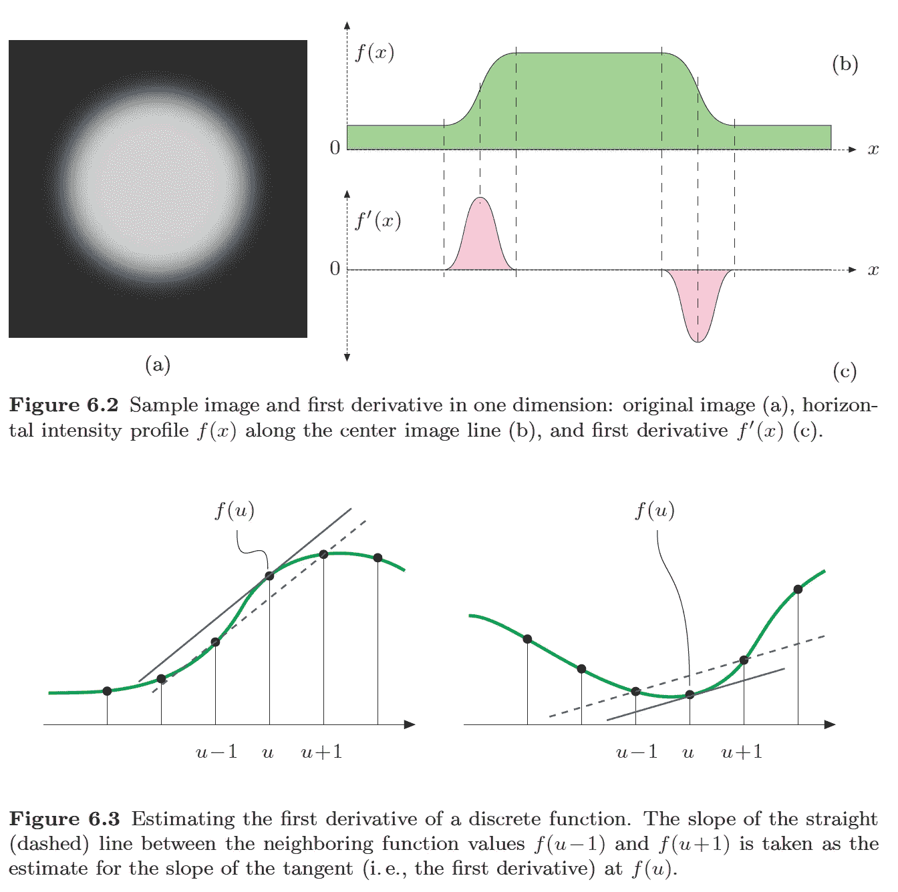
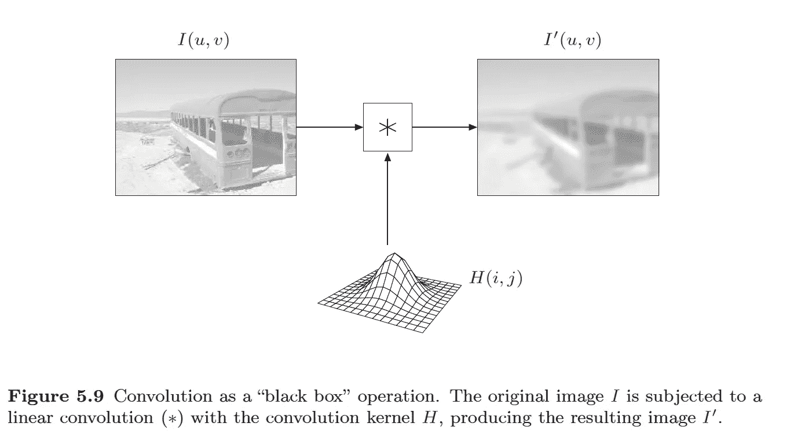
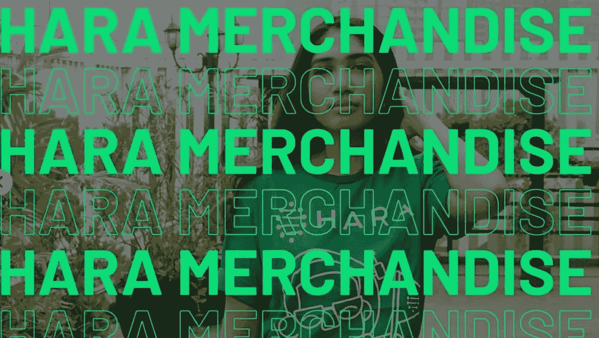

# 我在 HARA 大学数据科学实习的五个教训

> 原文：<https://towardsdatascience.com/five-lessons-learned-from-my-data-science-internship-at-hara-f9a5bcb53a51?source=collection_archive---------12----------------------->

对于社会影响来说，还有什么比数据科学更酷的呢？不多，但通过基于区块链的数据交换的数据授权，将印度尼西亚农业置于聚光灯下，已经足够接近了。介绍 HARA。

Okay the screen capture doesn’t do justice for all the coolness here: [https://haratoken.io](https://haratoken.io), or read HARA Token’s medium here: [https://medium.com/@HARAToken](https://medium.com/@HARAToken)

给我印象最深的是 HARA 是如何以创业的心态和精力应对经济发展的宏伟使命的:

> HARA 的使命是创造一个繁荣的农业经济，让数据成为农业的新商品。通过智能合约使用区块链，HARA 透明和可追踪的数据交换确保每个参与者都有动力提供可靠的数据。

实习是我第一次接触到与其他数据科学家和软件工程师一起在初创公司工作。我有了一个最酷的机会，在 Dattabot 的 HARA 数据科学团队工作了六周，从事一个计算机视觉项目。以下是我在研究数据、区块链科技对社会的影响以及新兴经济体中的初创企业生态系统时学到的一些经验。

# 1.各种景点

计算机视觉和数字图像处理对我来说是新的领域——我以前从来没有把图像当作数据。我们怎么可能使用面向对象编程来分析一幅图像呢？我们如何在分解数据后综合洞察？什么样的数据会被编码并对我们人类有用？

我被存储在数字图像处理基础中的数学优雅和严谨惊呆了。直方图表示图像强度，矩阵表示过滤器，梯度向量表示边缘。一个非常有趣的概念是边缘和轮廓，这对我们人类的视觉系统非常重要。其主要思想是，人类可以通过其轮廓明确地分辨出一个物体:我们可以通过一阶导数的概念(梯度)，通过沿特定方向的局部强度变化来描述边缘，一阶导数是相对于空间距离的变化量。

Gradient based image detection, a fundamental concept to HOG-based algorithm I implemented for my custom object detector

另一个令人兴奋的时刻是当我看到关于**线性卷积**的一节时，它是图像处理中线性滤波器的基础。我在概率论中彻底研究过卷积，在信号处理中也听说过，但从没听说过它在数字图像处理中的应用。我在独立随机变量和的上下文中理解卷积，从两个或多个简单的求和/积分中梳理出一个更困难的求和/积分，或者更一般地说，**是两个函数在一个扫过另一个时有多少重叠的度量**。

Watch here: [https://www.youtube.com/watch?v=N-zd-T17uiE](https://www.youtube.com/watch?v=N-zd-T17uiE)

我一点也不知道卷积可以用来消除“噪声”像素，并为图片创建平滑效果。

From convolving random variables to convolving image pixels

正如首席数据科学家马斯·维斯努(Mas Wisnu)用他自己的话说:“数学主义”。

我花了几个小时来分析数字图像处理中的微积分和线性代数，这真的给了“一张图片胜过千言万语”这句话另一层含义。我现在看数字图像，我看到数据。

# 2.学习如何学习

HARA 数据科学团队中的每个人都有数学背景，但背景非常多样化。所以我们有很多关于数学的辩论，但更多的时候，我是从失败的一方开始。我有一些同事的行业经验和数学知识，我想迎头赶上。我需要找到一种在工作中融入主动学习的方法。

作为一名数学专业的学生，我通过经典的教科书路线学习数学:指定阅读、习题集、讨论。在我的整个实习期间，**我接受了挑战，要采取一种不同的学习方法，一种更加以问题为导向和好奇心驱动而不是理论驱动的方法**。我同时阅读了几本不同的教科书，搜索了 Stack Overflow、Math StackExchange、YouTube 教程……我的任务要求我研究新的、前沿的方法和算法，并从那时起解构其背后的数学。我的重点是从里到外研究相关的主题——基础和微妙之处——尽可能高效地解决我遇到的问题。理解工具背后的数学原理与调整或定制它们以适应我的项目是相关的。

此外，通过我们随意的交谈和辩论，我遇到了许多其他感兴趣的话题。这真的很有趣——我没有机会谈论频率主义者与贝叶斯统计、股票市场和金融工程、天体物理学、数据科学的高尚应用(以及许多其他有趣的话题！)日常。这些讨论让我保持头脑清醒，缩短了工作时间。

# 3.数据民主化

当我读到 Dattabot 和 HARA 时，给我留下最深印象的是该公司民主化数据的愿景:“通过一次一个字节的数据赋予数十亿人权力”。

我支持开放数据，开源项目，让每个人都可以访问数据。今天，在你的个人电脑上设置 Python、R、C++和用几行代码编写机器学习程序很容易。随着物联网的兴起，生成数据、用云存储存储数据以及其他许多简化数据收集的技术进步也变得更加容易。

然而，数据项目始于我们人类为解决问题或学习洞察力而强加的问题。**人们将数据和工具转化为信息和知识**。像 HARA 这样的平台激励人们(数据提供者、数据鉴定者、数据购买者……)接受以数据为中心的决策和操作，是引领数据民主化革命的关键。

> 帮助每个人访问和理解数据的想法被称为数据民主化。数据民主化意味着打破孤岛，随时随地提供所需的数据访问。
> 
> -创新企业

今天，数据民主化的想法听起来可能是乌托邦和理想主义的，但我认为 HARA 及其平台可以通过迎合相关利益攸关方的激励，推动印度尼西亚食品和农业产业向正确的方向发展。

# 4.弄脏你的手和脚。一路。

在夏初，我告诉自己，我想在数据科学方面有所建树。夏末，我感觉自己一头扎进了数据科学的流沙中。从好的方面来说。

我带着 2 个小时的 Python 经验来到我的办公桌前，我立即被分配了一个项目，为印度尼西亚国民身份证创建自定义对象检测器。然后，该探测器将用于帮助验证农民从 HARA 移动应用程序提交给数据交换的照片。

第一周，我一头扎进了数字成像和机器学习的教科书和论文中，在我的浏览器上一直有至少一百个标签。我专注于逐步解决 bug 和问题，并快速获得正确的答案，以跟上其他团队成员(参见第 2 课！)，到最终独立推进项目。

对我来说，被我周围的人才吓倒太容易了，但是我已经学会了接受一种对我的工作不自私的心态。最重要的是，**我希望项目和我的团队取得成功，为此我不怕弄脏自己的手。**

# 5.STEM 中的女性(不存在)

Haha, I do two kinds of modeling for HARA

HARA 工程团队主要是男性。我是数据科学团队中唯一的女性。在决定从事 STEM 职业后，我已经熟悉了女性在该领域的代表性不足。我从事的每一项数据科学工作，对我来说这个问题都变得更加真实。我参与的每一项任务都成为我争取 STEM 平等机会的机会。我的个人使命是通过我的个人工作倡导科学、技术、工程和数学领域的女性，并帮助其他女性在科学、技术、工程和数学领域增强自身能力。更多关于这个话题的内容，期待另一篇中型文章！

今年夏天，我非常幸运地参加了两次实习，每次实习都让我学到了关于数据科学对社会影响的有意义的课程。这很困难；有些日子，我不得不在周末或在家工作，不得不牺牲闲暇时间，一天中的大部分时间我都在学习等等。然而，每一次奋斗都证明是值得的，我也越来越喜欢我所做的事情。

参考资料:

"介绍卷积:直觉+卷积定理."*介绍卷积:直觉+卷积定理*，YouTube，2018 年 4 月 21 日，【www.youtube.com/watch?v=N-zd-T17uiE. 

麦凯、伊恩等人*数字图像处理的原理:基本技术*。斯普林格伦敦，2009 年。

潘纳曼，埃利奥特。"初学者指南:数据民主化|文章|首席数据官."*文章|创新|创新企业*，2016 年 9 月 1 日，channels . the Innovation Enterprise . com/Articles/初学者-数据民主化指南。

PT Mediatrac 系统。"基于区块链的全球透明数据交换."*haratoken.io/. HARA 令牌*