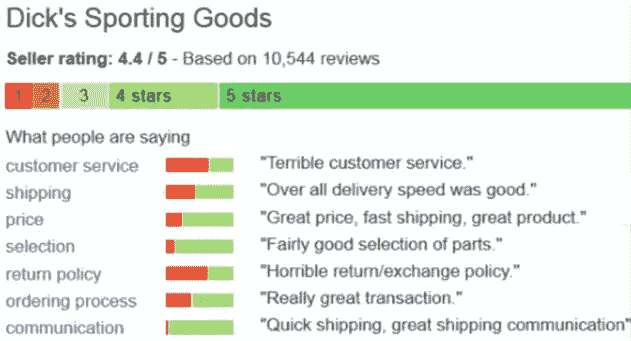

# NPS 客户情感分析的五个实际应用案例

> 原文：<https://towardsdatascience.com/five-practical-use-cases-of-customer-sentiment-analysis-for-nps-a3167ac2caaa?source=collection_archive---------0----------------------->

玛娅·安杰洛曾经说过:

> “人们会忘记你说过的话，会忘记你做过的事，但人们永远不会忘记你带给他们的感受。”

麦肯锡最近的一项研究结果表明这对企业意味着什么:在积极的客户体验之后，超过 85%的客户购买了更多。在一次消极的经历之后，超过 70%的人减少了购买。因此，弄错这一点可能会被证明是一项代价高昂的工作。

与其依赖假设，企业如何确切地知道是什么让客户感觉他们正在接受优质服务？

答案在于对客户情绪的深度分析。如果客户关于如何提高指标的反馈没有被战略性地用来做出积极的改变，那么跟踪 NPS ( [净推广者得分](https://www.netpromoter.com/know/))这样的简单指标是毫无意义的，即使与收入有直接的[联系。在这篇文章中，我们揭示了客户情绪分析不仅仅是分配一个积极/消极的标签。此外，我们解释了如何深化这一分析，并从结果中实际受益。](http://www.philips.com/b-dam/corporate/about-philips/investors/financial-results/q-results/archive-q-results/2009/q2-2009/presentation_2Q09.pdf)

# NPS 还不够吗？

NPS 等原始指标提供了某种程度的客户情绪意识。然而,[研究表明](http://www.quirks.com/articles/2010/20101006.aspx)NPS 过于宽泛，遗漏了许多关于顾客感受的有用细节。甚至在调查客户不高兴的具体原因之前，许多诋毁者仍然可以积极地谈论他们所接受的服务的要素。推销者可以详述他们不喜欢的元素，尽管他们整体上喜欢这项服务。

通过更准确地分析情绪，特别是发现人们真正不高兴的事情，你可以更专注于什么会有所不同。一个贬低他人但积极表达的人不太可能告诉全世界他们的问题。热情的人会。

# 什么是情感分析？

最常见的情感分析指的是给一段文本分配一个度量，该度量详细描述了所述文本是积极的还是消极的。这个度量也被称为**极性**，因为它返回一个范围从+1(极正)到-1(极负)的一维值。通过使用阈值，可以将评论分成定义好的类别:正面、负面或中性。无论情绪是否受到抑制，分数都需要标准化，以消除人们表达自己的方式的特殊性。

一个算法是如何做到这一点的？最简单的算法使用字典来查找哪个单词或短语表示哪个情感。如果一条短信说“你所需要的是**爱**”，它会将其标记为积极的。如果一条短信说“我**仍然**没有找到我要找的东西”，它就标记为否定。这种字典或基于知识的方法在某种程度上是有效的。然而，使用机器学习的高级算法可以捕捉细微差别。例如,“血腥的”如果用在短语“血腥的优秀”中，实际上可能是一个积极的指示。这些算法从大型数据集学习，这些数据集通常已经由人们根据什么构成积极和消极进行了分级。

> *使用机器学习的高级算法可以捕捉细微差别，例如“血腥”实际上可能是一个积极的指标，如果用在短语“血腥的优秀”中*

使用相同的原理，基于字典和机器学习的方法也可以确定更具体的情绪，如沮丧、愤怒或快乐。

准确性取决于测试数据集与用于开发字典或机器学习模型的数据集的相似程度。如果数据集之间没有什么共同点，那么两者的表现都会很差。

# 客户情绪分析为什么不一样？

将情感分析应用到客户所说的话上有点困难，原因有两个:他们说了多少，以及他们如何说话。

第一个区别很容易理解:评论和 NPS 评论通常是简短的文本片段。这意味着每段文本在决定其分类时只提供了很少的信息。大多数算法被设计成处理像新闻文章这样的大块文本。他们可能不做顾客评论。

第二，客户写支持票的方式与他们回复调查或给朋友写脸书帖子的方式不同。在支持票的情况下，它们将(希望)更真实，而脸书邮报将是非正式的，不太具体。如果使用相同的分析，那么分配给每个人的情感将会不太准确。重要的是使分析适合于介质。

# 为什么顾客情绪的各个方面很重要？

客户情绪本身并不总是有用的，因为它并没有描述为什么客户会有这种感觉。客户对什么特别满意或不满意？为了找到答案，企业需要识别顾客评论的*方面*。例如，在酒店中，这些方面可能是“客户服务”、“房间大小”或“清洁度”。

**如何在代码框架中使用方面和情感分析类别的示例**

更深入的分析也能发现具体的反复出现的主题。比如‘早餐面包不够’或者‘客房服务太慢’。这些很重要，因为它们更容易理解和执行。确定这些主题是可操作的洞察力的圣杯。它将有针对性地有效改善客户服务。

方面和主题提取的困难在于识别人们可能引用同一事物的许多不同方式。例如，当谈到“酒店房间的清洁度”时，顾客可能会使用“干净”、“整洁”、“肮脏”、“满是灰尘”等词语，以及“看起来像垃圾场”、“可以在地板上吃东西”等短语。一个有效的客户情绪分析练习不仅要捕捉情绪，还要捕捉企业收到的每条客户反馈的各个方面和主题。

# 客户情绪分析有哪些用例？

你对收集情感感兴趣，你能用它做什么？这里有 5 个用例，将增强您的客户体验战略。

**Google Shopping 使用的一个示例界面，用于显示客户评论中各方面的观点。**

## 1.以个人为目标来改善他们的服务

通过抓住对你的产品或服务有强烈负面感觉的客户，客户服务可以有针对性地处理他们的问题。想象一下一个顾客留下了一个负面评价 **-0.95** 的愤怒。无论是通过个人接触还是通过优先处理他们的票证，行动都有助于缓和局势。如果 Dick 's Sporting Goods 能够识别那些在退货过程中真正有问题的人，他们就能确保客户服务优先考虑他们。

## 2.随着时间的推移跟踪客户情绪

跟踪与业务特定方面相关的客户情绪比只跟踪 NPS 更有效。分析可以解释为什么 NPS 评分发生了变化；或者如果分数没变，可能在哪些方面发生了变化。在上面的迪克体育用品的例子中，值得跟踪的具体方面是“客户服务”和“退货政策”。

## 3.确定特定的客户群是否对你的公司有更强烈的感觉

当与人口统计和其他定量数据配对时，就有可能细分客户群并孤立地观察他们的情绪。例如，消费较少的顾客感觉更消极(因此这是他们增加消费的障碍)还是退货政策问题来自迈阿密的顾客而不是纽约的顾客？

## 4.跟踪产品或服务的变化如何影响客户的感受

随着业务的变化，客户情绪也在变化。发布营销活动或新闻稿，改变产品的界面或价格结构都会产生影响。跟踪客户情绪可以衡量这一点。

分数的变化可以表明变化是否在情感上引起了客户的共鸣并且是成功的。跟踪情绪会帮助你迅速改正任何错误。

如果你知道每个回应的方面和主题，你也可以回答这样的问题:人们对产品价格上涨的负面反应持续了多久，或者他们真的喜欢增加的新功能吗？如果迪克体育用品公司推出一项以竞争性价格为重点的活动，他们会清楚地看到人们是否反应良好。

# 5.确定你的关键推动者和诋毁者

客户可能会对你业务的许多方面发表评论，但是哪些方面会影响你的 NPS 分数呢？一点点数据科学会帮你回答这个问题。通过将方面与促进者和贬低者相关联，可以显示哪一个对原始 NPS 分数的影响更大。

# 深信不疑？以下是你可以开始的方法

希望现在，你已经在问如何将情感分析应用到你自己的客户反馈中。第一件也是最重要的事情是收集数据。虽然有很多公司专门收集客户反馈，但即使是像通过[调查猴子](http://www.surveymonkey.com/)进行调查或使用 [Zendesk](http://www.zendesk.com/) 等客户服务软件的内置功能这样简单的事情也能产生大量有趣的数据。

接下来是分析:为每个评论分配情感分数并确定关键方面。您可以通过手动阅读和编码评论，或者通过使用专注于客户情绪分析的软件或产品来实现这一点。

最后，使用分析结果来实施我们关于如何改善客户体验的五条建议。仪表板和报告可用于将这些新信息呈现给需要查看的人。