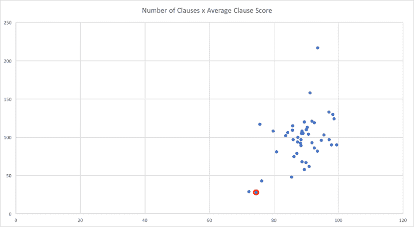
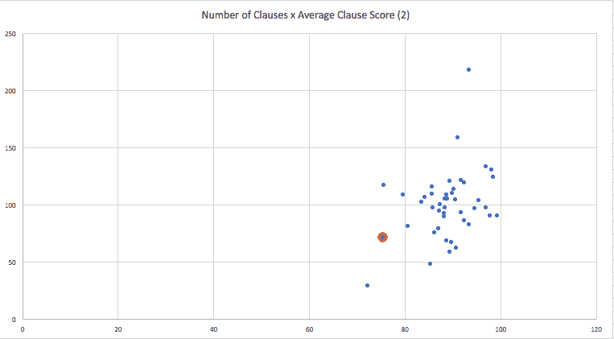

# 使用法律数据改进起草工作的五个步骤

> 原文：<https://towardsdatascience.com/five-steps-for-using-legal-data-to-improve-drafting-e84497ebe986?source=collection_archive---------5----------------------->

法律数据非常有价值。在保险领域，关于保单条款平均相似性得分的数据(衡量一个条款相对于一组旨在实现相同功能的其他类似条款的相对相似性或差异)可用于即时显示一个保单与另一个保单的对比情况。关于网络政策构成的数据可以用来揭示某项政策可能遗漏了哪些条款或信息。

然而，为了释放这些数据的价值，法律专业人士需要了解如何正确利用这些数据。这样做的一个最直接的背景是起草法律语言。我认为，这里的关键是让数据在基本层面上易于消化。

几个月前，我有幸有机会在 KC Cyber 的一个小组上发言，这是一个当地的网络安全会议，讨论管理网络风险的经济有效的策略。我们的小组特别寻求回答有关信息安全和网络责任保险之间的相互作用的问题。然而，活动结束后，一位观众提出的一个问题一直困扰着我，也是这篇文章的灵感来源。问题是，“*网络责任保险政策的基本组成部分是什么？”*这个问题之所以一直困扰着我，是因为它有助于将我长期以来一直纠结的一个问题联系起来——如何有效地使用政策数据，使起草法律文件的过程更有效、更容易理解。

*photo credit: Heather Otto*

我对这个问题的直接回答是参考了伍德夫、索耶和他的公司在网络风险核心组成部分上的一些[发现。在概念层面上，网络政策应该涵盖四种常见的网络风险:隐私、网络安全、错误&遗漏和媒体责任。学法律的我会说，这是一个实质多于形式的问题；这些一般风险概念的管理方式因组而异，但作为参考点，这些一般概念可作为数据驱动分析的一个步骤。在对需要管理的风险有了大致的了解之后，可以使用同一组数据来帮助确定更具体的政策语言，从而为组织提供更可靠的风险管理框架。](https://wsandco.com/cyber-liability/cyber-basics/)

然而，这些策略并不局限于网络责任保险。事实上，数据的使用——将众多政策、合同或文件与机器学习算法、自然语言处理和其他计算机科学技术相结合的最终结果——可以帮助识别任何一组文件中的缺失和分歧区域。

从更普遍的角度来看，我想提出一个策略，使用政策数据来识别不同的政策语言、缺失的覆盖部分，并为识别和理解网络风险的流程带来更高的透明度。

为了起草更全面的网络责任政策，承保人、律师和其他风险管理专业人员应该 1)列出需要管理的风险类型，2)列出政策的语言(列出存在的条款、不存在的条款、相似性得分和要管理的风险类型)，3)使用关于缺失条款和风险类型的数据将缺失条款添加到政策中，4)使用关于低相似性得分和要管理的风险类型的数据改进政策的薄弱环节，以及 5)根据政策的变化评估新的政策数据。

> 使用数据改进起草工作的 5 个步骤
> 1)风险清单
> 2)政策语言清单
> 3)使用缺失条款的数据匹配风险类型
> 4)使用得分较高条款的数据全面提高相似性得分
> 5)重新评估更新的政策

继续使用网络责任政策语言作为一个用例，让我们通过分析下面用红色圈出的政策[来浏览这些步骤并解释这在实践中是什么样子，Aviva 的工程产品“网络”扩展语言](https://broker.aviva.co.uk/document-library/files/cy/cyberengineeringenpbase.pdf)。在整个过程中需要注意的一个重要事实是，与其他法律文本一样，某些网络政策措辞可能是为了狭隘的目的而构建的，并被整合到一个更大的政策或一套文件中。

*风险清单*
从基础知识开始，让我们假设要涵盖的风险类型是 Woodruff、Sawyer 和 Co .概述的网络风险类型——隐私、网络安全、错误&遗漏和媒体责任。可以预见的是，根据风险清单的细微差别，这一步会更加稳健。

*保险单语言清单* 为了了解保险单所涵盖的风险类型，查看保险单的保险协议部分是有帮助的。保险协议部分是真正的核心政策。保单中的其他内容用于解释如何解释这些条款，定义保险协议条款中的词语，显示适用保险协议必须满足的条件，确定保险范围的除外责任，建立保险范围的限制，以及起草人可能决定添加或排除的任何其他内容。

查看前面提到的 Aviva 文档(网络扩展措辞),可以清楚地看到，这一特殊政策仅旨在确保与数据安全漏洞相关的事件管理，以及因某些个人数据丢失、被盗或意外泄露而导致的其他义务。例如，本文档中的保险协议部分涵盖了与“因保险期间发现的数据安全漏洞而产生的费用”相关的赔偿

*识别缺失条款*
在粒度级别上，有许多类型的条款可能在策略中缺失，并导致其成为异常值。不需要大量的统计知识就可以看出，平均的子句簇在 75 到 125 个子句之间，平均相似性分数在 85 左右。

然后，通过获取关于哪些政策得分较高、哪些条款对于得分较高的政策最常见以及哪些条款是异常值或出现频率较低的数据，起草者可以获得关于此类政策中通常会发现的其他条款的实时反馈。

作为一个购买政策的组织，了解这份具体的文件实际上可以作为英杰华网络电子媒体核心政策的延伸会有所帮助。通过合并两份文件的条款数量，并对英杰华电子媒体核心政策及其工程产品“网络”扩展词的新评分集进行平均，结果(上图中的红圈)是新政策在长度方面更符合行业内的其他政策，但与我们的网络指数的其余部分的平均相似度仍低于 80%。

考虑到上下文的其余部分，即该组合政策中确实没有完全涵盖隐私或媒体责任的内容，浏览条款库、找到这些部分的条款并继续构建涵盖我们通过风险清单确定的所有风险的更全面的政策并不困难。

*审查和修改低评分条款*
在简要查看文件中的低评分条款时，我确定了与网络责任市场的其他条款相比最薄弱的政策领域(排除—先前行为、排除—故意行为、排除—费用、罚款和罚金以及限额—可扣除)，并对其进行了更新，以包括不同政策中得分较高的政策语言。结果是整个策略的平均相似性得分从 76%上升到 78%。让我对这一分析感到兴奋的是，这一增长仅仅是通过改变 71 个条款中的 5 个来实现的。如果对其他 66 个条款进行审查和修改，那么与现有的其他政策相比，gains 可能会提高其排名。

*重新评估更新后的政策*
看看我在这个练习中所做的，在尝试创建一个强大的、通用的网络责任政策之前，我还想改变一些事情。例如，我想添加有关隐私、错误和遗漏的条款，并用其他得分较低的条款替换得分较高的条款。通过这样做，将相似性分数提高到 90%以上并拥有对许多人有价值和有用的东西并不是不可想象的。

在整个起草过程中持续使用和创建数据，将有助于以更加迭代、透明和开放的流程来审查和管理不同类型的风险。对于那些起草这类政策的人来说，它可以减少花在研究上的时间，并为缺乏经验的起草者提供一个衡量标准。对于那些希望了解实际应该有什么政策的人来说，数据可以成为一种工具，教人们什么时候适用某些条款或规定，以及在什么情况下其他条款或规定应该适用。