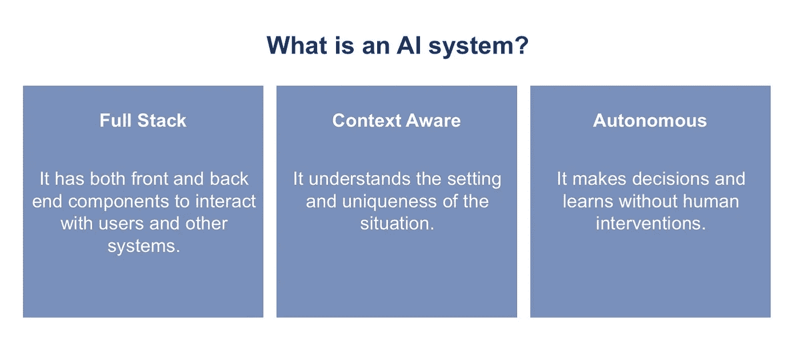
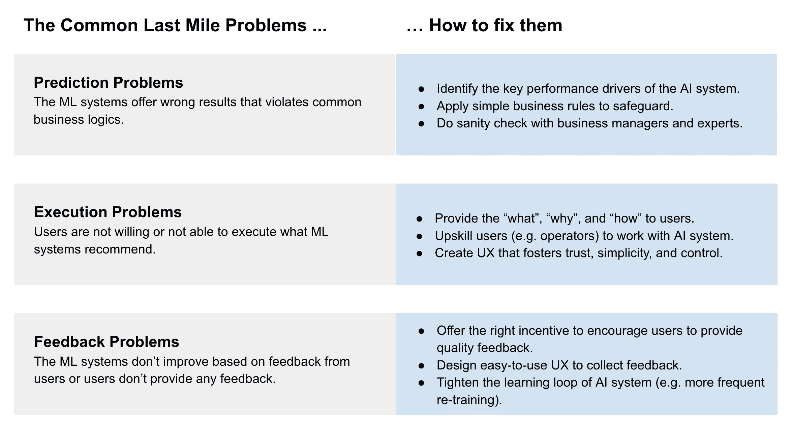
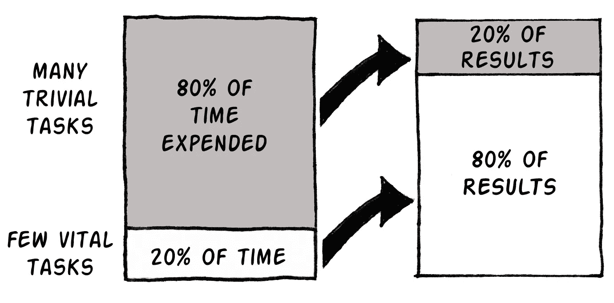

# 人工智能的最后一英里问题

> 原文：<https://towardsdatascience.com/fixing-the-last-mile-problems-of-deploying-ai-systems-in-the-real-world-4f1aab0ea10?source=collection_archive---------2----------------------->

## 三种类型的问题和五种战术解决方案

Photo by [Alberto Frías](https://unsplash.com/@albertohlfrias?utm_source=unsplash&utm_medium=referral&utm_content=creditCopyText) on [Unsplash](https://unsplash.com/s/photos/road?utm_source=unsplash&utm_medium=referral&utm_content=creditCopyText)

TLDR: 最后一英里的问题是实现人工智能承诺的价值的最后障碍。获得人工智能系统的好处需要的不仅仅是坚实的商业案例、执行良好的人工智能实现和强大的技术栈。它通常需要人工智能和人的协作，才能为客户提供正确的体验。但是，公司通常很难做到这一点。

许多分析从高管和数据科学家的角度强调了如何构建 AI 系统。相反，本案例研究使用个人轶事和新的视角来看待问题:通过一线员工和客户的视角。我讨论了各种实际的解决方案，例如人工智能中的 80-20 规则和机器与人类之间的平滑交接，以帮助团队克服现实世界中人工智能交付的最后一英里障碍。

**喜欢你读的书吗？**在[媒体](https://medium.com/@ianxiao)、 [LinkedIn](https://www.linkedin.com/in/ianxiao/) 或 [Twitter](https://twitter.com/ian_xxiao) 上关注我。还有，作为数据科学家要不要发展商业影响力？查看我的“[对机器学习的影响](https://www.bizanalyticsbootcamp.com/influence-with-ml-digital)”PDF 指南(2019 年 9 月 30 日提供)。订阅以便在它准备好的时候得到通知。

**首先，让我分享一个故事……**

最近，我和妻子 ess 去多伦多市中心的伊顿中心购物。Jess 心情非常好，因为她刚从公司组织的黑客马拉松(为期 3 天的构思和原型制作竞赛)回来。杰斯是多伦多一家银行的财务顾问。当我们在一个供应商摊位前停下来更新我的手机计划时，她正在描述所有的人工智能(AI)想法和原型是多么神奇(和不真实)。

一位名叫乔安妮的女士，大概 20 出头，欢迎我们并提出了几个不错的选择；我同意了她的一个建议。乔安妮在处理交易时，她转向杰斯说:“看起来有一个针对你的特别优惠，你想听听吗？”。

“当然！”杰斯说。

乔安妮*看了屏幕两秒钟*说:“我们愿意为你提供 10G 的数据，每月 75 美元。这是一笔了不起的交易！”

杰斯看上去很困惑，说道:“*这说不通啊*。我只需为同样数量的数据和服务支付 65 美元。”

我们都笑着化解尴尬。乔安妮回去完成我的交易。我们五分钟后离开。

在我们回家的路上，Jess 提到了人工智能是多么令人失望，并开玩笑说大公司是如何不能把它做好并错过销售机会的。她说，她在黑客马拉松上看到的人工智能原型要有能力得多。

我说:“嗯，这就是现实世界的 AI 和实验室的区别”。她最终对我说的话印象深刻。

在分解我们的经验来强调人工智能系统的几个常见问题之前，让我们先了解一下人工智能系统的背景和定义。如果你熟悉这个概念，可以跳过这个。

**杰斯的报价是怎么产生的？**在这个故事中，Joanne 提出的要约是由一个*推荐系统(RS)* 生成的。RS 通过分析客户行为和提供个性化的产品和服务来帮助推动销售。一些 RS 依靠一种叫做*协同过滤*的机器学习算法来决定对客户的最佳报价；一些 RS 依赖于更简单的算法，如逻辑回归或基于规则的方法，而一些 RS 使用更高级的算法，如深度强化学习。亚马逊和许多电子商务和数字公司是 rs 的早期采用者。许多传统企业(如电信和银行)紧随其后，开始了定义自己方式的旅程。

**什么是 AI 系统？RS 是人工智能系统的一个例子。更具体地说，人工智能系统是*全栈解决方案*(例如前端和后端)，通过使用*大数据*技术处理大量数据，并基于*自主*机器学习算法选择适当的交互，为用户提供*上下文感知*体验。**

人工智能系统和传统的软件解决方案有一些明显的区别。这是最重要的一点:人工智能系统基于自主和持续的学习和决策与用户互动，而不是遵循一套静态的和由设计师和工程师预先设计的规则。

Source: Author’s Analysis

L 在故事中，RS 意识到 Joanne *(最终用户)*正在与 Jess 和我讨论产品变更*(情境感知)*；它提供了一个 Joanne 可以分享的提议*(基于大数据和机器学习的交互)*。考虑到另一个客户和环境(例如，打电话投诉服务，而不是考虑产品变更)，报价可能会有所不同。RS 是一个*全栈*解决方案，因为它有一个与 Joanne 交互的前端接口和一个支持数据存储、机器学习和系统集成的后端。

还有许多其他人工智能系统的例子，如自动驾驶汽车、robo-advisor、Alpha-Go、Siri、波士顿动力公司的机器人、Roomba 等。

现在，怎么了？这个故事强调了人工智能系统在现实世界中失败的一些常见方式。我们来分解一下。

1.  **错误的互动**:让顾客为同样的服务额外支付 10 美元根本没有意义。我不相信任何营销和客户行为理论会支持这一提议。
2.  **糟糕的执行**:虽然乔安妮训练有素、能力出众、风度翩翩，但她显然不明白为什么这个提议是由人工智能系统提出的，因此无法正确执行这个提议(即使这意味着*而不是*执行)。
3.  **缺乏反馈循环:**在我们都意识到报价没有意义之后，Joanne 只是简单地完成了我的交易，没有向 AI 系统提供任何反馈来帮助它学习。质量反馈对于任何人工智能系统的长期成功都是至关重要的。

这个例子凸显了一个基本而普遍的问题:人类和人工智能系统之间的脱节。**人-AI 协作是 AI 系统的最后一公里问题。**

UX 的设计师可能会争辩说，这只是一个设计糟糕的典型解决方案。应用设计思维和界面设计的最佳实践应该可以解决这个问题。正确，但只是在某种程度上。自主交互的独特性要求我们进行更深入的思考。如果我们不能完全控制和理解人工智能系统的反应，我们如何预先设计用户交互的关键方面，如果不是全部的话？

**那么，有哪些解决办法呢？**在这里，我提出了一些战术解决方案，以帮助公司最大限度地实现人工智能系统的承诺。

Author’s Analysis, Updated on Feb. 23, 2020

## 1.从错误到正确(或更好)的互动

要求人工智能系统在 100%的时间里提供正确的答案是不可能的，无论是在数学上还是在实践中。所以，我们最好的目标是用合理的投资获得足够正确的答案。为此，我建议探索以下方法:

*   确定一个 80-20 人工智能救援计划。80–20 是一个众所周知的[概念](https://en.wikipedia.org/wiki/Pareto_principle)和商业公理；它强调了一个普遍的观察结果，即大约 20%的工作产生了 80%的结果。*使用 80-20 思维来简化解决方案至关重要；这样做可以帮助避免推出一个有缺陷的人工智能系统，并损害客户体验(Jess 的例子)。显然，当人工智能系统提供不合理的建议时，一些技术问题就被打破了。过于复杂的设计是一个常见的问题。一组数据科学家可以问:1)要达到 80%的准确率，最简单的设计是什么？2)结果是否足以交付承诺的商业价值？3)有哪些更先进的技术可以抓住下一个 2%、5%和 10%的市场份额？尽管围绕复杂的人工智能技术进行了大肆宣传，如深度和强化学习，但并不是每个人都需要在第一天使用它们。简单的数据挖掘技术，如关联规则，可能能够捕捉大多数客户动态，并在早期提供足够好的结果。*

Image Source: [link](https://byrslf.co/6-ways-to-apply-the-80-20-rule-debe27a11bca)

*   **应用业务规则进行保护。由于机器学习模型肯定会有错误，因此拥有一个额外的业务规则层对于质量保证来说是必不可少的。例如，基于业务领域知识的简单规则可以是这样的:1)不提供没有额外的有意义的服务的更昂贵的套餐，2)抑制可能导致收入损失的过度打折的报价。避免复杂的规则很重要。它们可能会破坏人工智能系统的目的，并最终影响性能。要确定这些规则，与经验丰富的业务经理和一线员工合作是关键。这就引出了下一个建议。**
*   **使用合适的专家进行健全性检查。商业高管和数据科学家经常设想人工智能系统。拥有拥有足够技术马力的顶级支持对于*推出*成功的人工智能系统至关重要。然而，当谈到*使用*旨在提供更好的客户互动的系统时，一线专家知道得最多，也有最深刻的观察。因此，尽管一线员工可能不是技术专家，但将他们包括在流程中是非常重要的。**

**2。从差到好的执行**

大多数人工智能系统依赖于人类员工在某些时候采取行动，良好的执行是实现承诺的商业价值的关键。良好的执行归结为一个要素:机器和人类之间的顺利交接。为了实现顺利移交，人工智能系统和人类都需要协同工作…

*   提供侧重于“是什么”、“为什么”和“如何”的说明。数据科学家花费大量时间微调算法，但往往忽略了提供必要的信息来帮助人类员工取得成功。关键是使人工智能系统能够解释为什么提供特定的建议，并分享简单的指令供人类员工遵循。一个简单的*什么-为什么-如何模板*可以做到这一点，见下面的例子；这个想法最初是由[西蒙·西内克](https://www.ted.com/talks/simon_sinek_how_great_leaders_inspire_action?language=en)在领导力激励演讲中提出的。
*   高技能员工与人工智能系统合作。能够使用技术是许多入职培训的重要组成部分。但是今天这还不够。例如，人工智能系统不同于传统的客户关系管理(CRM)应用程序。基于他们的学习和见解，人工智能系统可能会提供对员工来说不明显的建议。也就是说，人类员工需要在更高的认知水平上参与理解、消化和挑战(如果需要的话);工作人员不能也不应该盲目听从指示。员工应该将人工智能系统视为合作伙伴，他们应该与之合作、挑战和培养。

想象一下:RS 提供了三行简单的语句，Joanne 可以在不到 10 秒(甚至更短)的时间内理解并理解…

*   **做什么**:建议升级 10GB 的数据套餐，每月 70 美元的新手机返现
*   **为什么**你应该这么做:客户(Jess)使用我们的服务已经超过 10 年了；根据与她相似的客户资料，她可能会感兴趣，并且对每月储蓄反应良好
*   **如何接近:告诉 Jess 你很欣赏她 10 多年来的生意，你想提供一个其他忠实客户也欣赏的好交易；每月节省 25%(或者这可以是一个预先填充的脚本，但根据 Jess 的个人资料进行定制修改)**

与人工智能系统一起工作更复杂，但回报——物质商业利益和更投入、更受重视的员工——可能是值得的。

**3。从麻烦到参与反馈机制**

最后，人工智能系统的真正力量来自它们学习和改进的能力。然而，如果没有来自环境的有意义的反馈，他们就做不到，在这种情况下，他们是一线员工。*有意义的反馈是指描述客户行为原因的信息。*由于笨拙的用户界面和缺乏激励，许多一线员工忽略了获取和分享这些信息的机会。以下是一些简单的注意事项…

*   开发一个简单有趣的反馈用户界面。有两个关键的考虑因素。首先，用户界面需要简单，这样员工就可以轻松准确地输入信息，这样他们就不会抗拒这样做。要获取的最重要的信息是*为什么客户没有对建议做出*回应。其次，游戏化，如使用徽章和健康的同行竞争，有助于鼓励和推动员工提供高质量的反馈，而无需硬性强化。这就是 CRM 管理中的[传统技巧](https://www.bunchball.com/blog/post/774/7-crm-gamification-strategies-how-psychology-increases-sales)仍然有效的地方。
*   **鼓励输入质量反馈。现实地说，很难期望员工做出更多努力，因为许多人已经被日常工作的任务和目标压得喘不过气来。因此，制定具体的激励措施是推动行为改变的最佳解决方案。例如，团队可以为“本月人工智能培训师”设立排行榜和奖项，或者在年度绩效评估中正式确定一个目标。**

一旦反馈被捕获，数据科学团队需要将其与人工智能系统的学习机制联系起来。从技术角度来看，这很棘手，有很多关于处理时间的考虑。然而，一旦实施，人工智能系统可以从客户的独特信息中学习，修复系统学习中的缺陷，并持续自主地改进。更有意义的反馈导致更智能的人工智能系统，可以提供指数级的商业利益。

通过探索和实现这些考虑，**好处是增加 AI 系统的成功概率**，尤其是当它们在现实世界中与人类交互时。

**让我们总结一下……**

他的例子只是揭示了人工智能系统的一些有代表性的问题。随着人工智能的投资转化为现实世界的解决方案——许多人将与一线员工和客户密切互动——公司应该停下来，理智地检查他们对人-人工智能协作体验的想法。这里是断线经常发生的地方。此外，请记住，技术开发中的许多最佳实践仍然适用，例如“从小处着手，不断重复”和“以用户为中心”。

克服最后一英里的问题对于实现人工智能的温暖人心的承诺至关重要。有一个全面的诊断和手术修复是至关重要的。改善交互、执行和反馈机制的早期和轻量级解决方案可以帮助公司在现实世界中部署人工智能系统时避免重大挫折。

# 思想的果实

*   在使用人工智能系统时，你的团队面临哪些独特的运营挑战(例如，时间、技能和/或信任)？
*   人工智能系统如何通过简化流程(尤其是以前难以自动化的流程)来帮助您的企业削减成本？
*   人工智能系统如何让你的企业创造新的方式来提供产品和吸引客户？

喜欢你读的书吗？在[中](https://medium.com/@ianxiao)、 [LinkedIn](https://www.linkedin.com/in/ianxiao/) ，或者 [Twitter](https://twitter.com/ian_xxiao) 上关注我。还有，作为数据科学家要不要发展商业影响力？查看我的“[对机器学习的影响](https://www.bizanalyticsbootcamp.com/influence-with-ml-digital)”PDF 指南(2019 年 9 月 30 日提供)。订阅以便在它准备好的时候得到通知。

***免责声明*** :文中观点不代表作者雇主赞同。

你可能也会喜欢这些…

 [## 12 小时 ML 挑战

### 如何使用 Streamlit 和 DevOps 工具构建和部署 ML 应用程序

towardsdatascience.com](/build-full-stack-ml-12-hours-50c310fedd51)  [## 越狱

### 我们应该如何设计推荐系统

towardsdatascience.com](/how-to-design-search-engines-24e9e2e7b7d0)  [## 我们创造了一个懒惰的人工智能

### 如何为现实世界设计和实现强化学习

towardsdatascience.com](/we-created-a-lazy-ai-5cea59a2a749)  [## ML 和敏捷注定的联姻

### Udacity 的创始人巴斯蒂安·特龙毁了我的 ML 项目和婚礼

towardsdatascience.com](/a-doomed-marriage-of-ml-and-agile-b91b95b37e35)  [## 抵御另一个人工智能冬天的最后一道防线

### 数字，五个战术解决方案，和一个快速调查

towardsdatascience.com](/the-last-defense-against-another-ai-winter-c589b48c561)  [## 人工智能的最后一英里问题

### 许多数据科学家没有充分考虑的一件事是

towardsdatascience.com](/fixing-the-last-mile-problems-of-deploying-ai-systems-in-the-real-world-4f1aab0ea10)