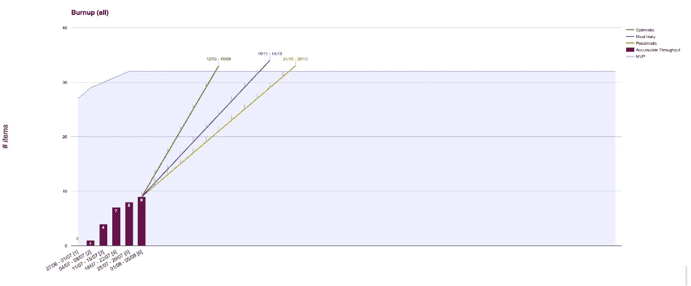
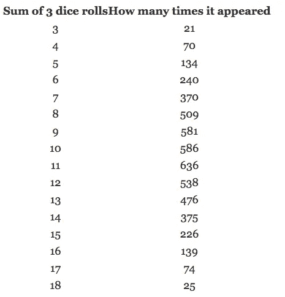
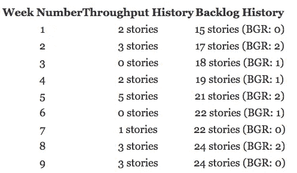

# 用蒙特卡罗模拟预测软件项目的完成日期

> 原文：<https://towardsdatascience.com/forecasting-software-projects-completion-date-through-monte-carlo-simulation-c1baa5bcf976?source=collection_archive---------6----------------------->

Photo by [Jonathan Petersson](https://unsplash.com/@grizzlybear?utm_source=medium&utm_medium=referral) on [Unsplash](https://unsplash.com?utm_source=medium&utm_medium=referral)

如今，我们正在使用一种比确定性方法更具概率性的方法来管理我们的过程。这意味着我们使用不同的统计方法来预测未来，而不是盲目的估计。但是等等…不可预测性难道不是让我们从瀑布式转变为敏捷的主要原因之一吗？

是的，不确定性是软件开发所固有的。例如，一个人不可能在一个项目的开始就预测一个系统的所有特性。

但是，如果我们能预测接下来几周的行为会怎样呢？

这就是我们试图通过收集指标并对其进行蒙特卡洛模拟来实现的目标。

要了解我们如何收集指标，我建议您阅读以下帖子:

*   [我们为什么喜欢度量标准？学习提前期](http://blog.plataformatec.com.br/2016/02/why-we-love-metrics-learning-with-lead-time/)
*   [我们为什么喜欢度量标准？吞吐量和燃耗图表](http://blog.plataformatec.com.br/2016/02/why-we-love-metrics-throughput-and-burnup-charts/)
*   [我们为什么喜欢指标？累积流程图](http://blog.plataformatec.com.br/2016/03/why-we-love-metrics-cumulative-flow-diagrams/)

大多数人不使用任何度量来管理他们的项目。你可以想象有多少人使用复杂的统计模型来预测项目的完成。然而，在你当前的项目中拥有这些知识将会帮助你更快更好的交付。

在本帖中，你将看到我们如何使用蒙特卡罗模拟从一个简单的预测方法到一个更加精确和稳健的方法。此外，我们将以简单明了的方式解释蒙特卡罗模拟是如何工作的，然后在这个简单的例子和我们的现实世界方法之间进行类比。知道你的项目什么时候可能结束可以帮助你管理项目的预算，给利益相关者更好的反馈，给你信心，你确实在控制你的项目。

# 为什么不是其他方法？

长期以来，我们一直在尝试其他的预测方法，但它们都有一些缺点。在这里，我们列出了其中的一些，以及我们如何和为什么选择使用蒙特卡洛。

# 平均吞吐量

你们中的一些人可能已经想到了一个简单的方法，我们将使用平均吞吐量来预测项目的结束。然而，正如你在这篇博文中看到的 [*指标的力量:不要用平均值来预测最后期限*](http://blog.plataformatec.com.br/2016/01/power-of-the-metrics-dont-use-average-to-forecast-deadlines/) ，那将是一个极其幼稚的方法，而且它不起作用。

# 线性回归方法

作为第一种方法，我们使用线性回归，基于我们累积的吞吐量，来预测项目何时结束:

但是，我们发现了两个不同的问题，我们在进行分析时没有考虑到:

*   我们必须保持待办事项列表中的项目数量不变，以便进行预测，这非常有偏差。
*   经过一些分析后，我们发现吞吐量和交付时间都不符合正态分布，因此计算线性回归是没有意义的(参见 [*以不同的方式看待交付时间*](http://blog.plataformatec.com.br/2016/03/looking-at-lead-time-in-a-different-way/) 和 [*线性回归*](http://www.statisticssolutions.com/assumptions-of-linear-regression/) 的假设)。

# 手动设置方法

首先，我们专注于避免第二个问题，我们开始使用一个更节俭的模型，它使用了我们知道有些倾斜的方法，但是我们可以更好地控制它们。

我们手动添加了吞吐量性能，这将导致每个不同的预测在某个日期到达积压。这种预测方法来自对我们吞吐量历史的百分位数的研究。

我们有了更好的结果，因为我们可以手动更改预测，因此可以根据项目的当前状态进行调整。但是第一个问题，事实上我们没有考虑到积压订单的变化，这让我们更进一步，尝试蒙特卡罗模拟。

# 蒙特 卡罗模拟

[维基百科将蒙特卡洛](https://en.wikipedia.org/wiki/Monte_Carlo_method)方法定义为

> 蒙特卡罗方法各不相同，但往往遵循一种特定的模式:
> 
> 定义可能输入的域。
> 
> 根据域内的概率分布随机生成输入。
> 
> 对输入执行确定性计算。
> 
> 汇总结果。

乍一看，这似乎很难或很复杂，但实际上比看起来要简单得多。你可以把它看作是预测的强力方法。我们将给出一个简单的例子，然后展示我们在现实世界中的表现。Larry Maccherone 做了一个很好的模拟，可以更好地解释这一点。

# 骰子游戏

假设你在玩一个骰子游戏，目标是用最少的掷数得到 12 点。这里最好的玩法是连续两次掷骰子，你都得到 6，最差的是 12 次掷骰子得到 1。我们要计算的是 N 次运行后结束博弈的概率。

考虑到每一次掷骰子有 6 种可能的结果，即骰子的 6 个面，那么在 1 次掷骰子中完成游戏的概率是多少？

零。因为如果骰子只到 6 点，你就不能到 12 点。

第二卷呢？

就是连续得到两个 6 的概率，这是基本统计:

第三卷呢？

现在你可以用很多方法达到 12 点，其中一些是:(3，3，6)，(3，4，5)，(3，5，4)，(3，4，6)，(5，5，2)，(4，4，4)等等。这个计算背后的统计数据并不简单，对吗？这就是蒙特卡罗模拟派上用场的时候。

蒙特卡洛模拟成千上万次掷骰子，然后分析结果。例如，要知道在第三轮完成游戏的概率，它将掷骰子三次，将点数相加并存储结果。之后，它将重复这些步骤 5000 次，并总结每一个点数总和得到的掷数:

现在它所做的是将所有产生大于 12 的和的事件相加，然后除以事件总数。在这种情况下:

同样的方式，我们做了第三轮，我们可以做第四，第五，等等。

# 现实世界

现实世界的解决方案非常类似于掷骰子的例子。唯一的区别是，我们也改变了目标(游戏场景中的 12 分)，以考虑待办事项中的变化。

所以现在每一轮的可能结果(骰子的两面)就是我们的吞吐量历史。同样，我们是吞吐量的“滚动骰子”,我们需要滚动积压的骰子，以便给它增长的机会。在这种情况下，可能的结果将是积压的增长率(BGR)。

让我们慢慢开始。假设我们的项目历史是这样的:

因此，我们每一轮的吞吐量可能是集合{2，3，0，2，5，0，1，3，3}，积压可能是{0，2，1，1，2，1，0，2，0}。我们不排除重复的数字，因为有了它们，我们可以保持拥有一个数字而不是其他数字的更高概率。

现在，我们可以将相同的基本原理应用到骰子游戏中。在第一周，总吞吐量达到积压量或更多的概率是多少？一些可能的结果如下:

然后，我们将运行许多这样的程序，看看有多少程序的吞吐量总和大于 backlog 总和，然后将结果除以运行次数。这样做，我们就有可能在第一周结束项目。在接下来的一周，我们将做同样的事情，但是每一轮掷骰子两次，然后对吞吐量和积压量求和。

这种方法的一个问题是，在项目开始时，backlog 的行为不同于在项目中间或结束时。在开始时，通常增长要快得多，因为我们更好地理解了我们项目的问题和细微差别，在最后，增长基本上来自于精炼的故事。

为了解决这个问题，我们不考虑整个 BGR 历史作为可能的结果，而只考虑积压的最后 10 个 bgr，这将使我们对积压最近的表现有更好的了解。

使用新的最后 10 个 BGR 方法得出的未来 10 周的结果显示在图表中:

如您所见，我突出显示了图表的三个不同区域，以说明我认为可以从图表中获得的信息:

*   第一个区域，红色的，是我们完成项目的概率低于 50%的几周。这意味着告诉项目的利益相关者你将在接下来的 4 周内完成它是非常危险的。
*   下一个区域，橙色区域，显示了我们完成项目的概率在 50%到 75%之间的几周。我要说的是，如果利益相关者向你施压，要求你快速交付，那么这几周，如果你有信心，你就能完成。
*   绿色区域是一个更无风险的区域，在那里你完成项目的概率大于 75%。我建议你总是优先考虑基于这个领域而不是其他领域来估计你的项目的结束，但是我们都知道我们不能总是那么安全。

我们在过去的项目中测试了蒙特卡洛模拟，它看起来工作得很好，但是，和任何其他统计方法一样，在项目中几周后，它比开始时好得多。

# 摘要

预测一个项目什么时候可能结束看起来太“胡说八道”了，但是这个方法真的很容易实现，并且让我们对我们的项目有更好的预测和理解。重要的是要弄清楚，这种方法是一种统计方法，因此它不是失败证明。主要目标是在我们的工具包中增加一个元素，让项目管理变得简单一点。

为了帮助你预测软件项目的完成日期，我们制作了一个简单版本的电子表格供你下载，这样你不用做太多工作就可以运行模拟。

要了解更多关于蒙特卡洛模拟的信息，我推荐以下参考资料:

*   Troy Magennis 的书— [预测和模拟软件开发项目:使用蒙特卡罗模拟对看板& Scrum 项目进行有效建模](http://focusedobjective.com/wp-content/uploads/2013/05/Modeling-and-Simulating-Software-Projects-Troy-Magennis.pdf)
*   丹尼尔·瓦坎蒂的网站、书籍和博客:[可操作的敏捷](https://www.actionableagile.com/)
*   [Joel Spolsky 关于循证计划的博客文章](https://www.joelonsoftware.com/2007/10/26/evidence-based-scheduling/)

*本文原载于*[http://blog . platafomatec . com . br/2016/08/forecasting-software-projects-completion-date-through-Monte-Carlo-simulation/](http://blog.plataformatec.com.br/2016/08/forecasting-software-projects-completion-date-through-monte-carlo-simulation/)*。*