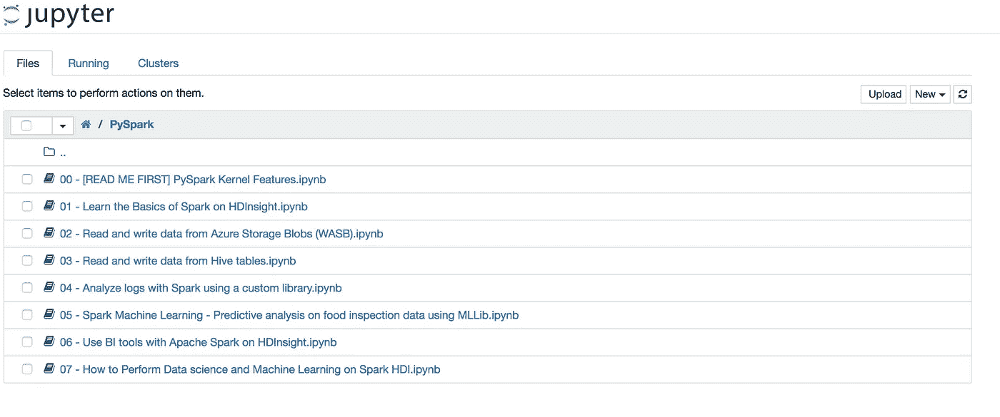
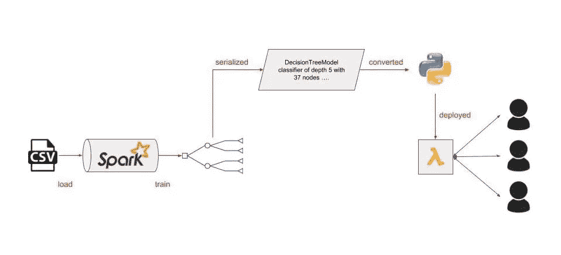
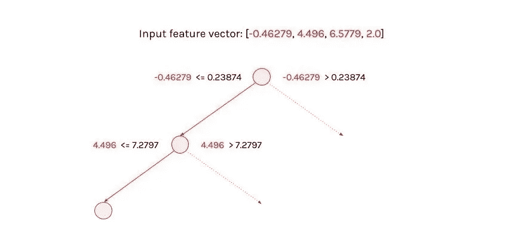
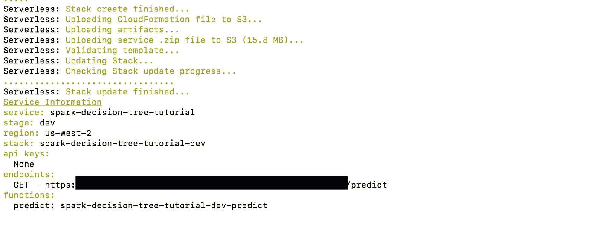

# 从大数据到微服务:如何通过 AWS lambdas 为 Spark 训练的模型提供服务

> 原文：<https://towardsdatascience.com/from-big-data-to-micro-services-how-to-serve-spark-trained-models-through-aws-lambdas-ebe129f4849c?source=collection_archive---------6----------------------->

*通过预先训练的 Spark 模型为端点供电的快捷方式*

## 介绍

> “我们选择它是因为我们要处理海量数据。另外，听起来真的很酷。”—拉里·佩奇

恭喜你！你用 Spark 训练了你的决策树，得到了一个很好的模型。现在呢？

你想利用你的模型来提供实时预测，但在 Spark 中没有简单的方法*来获得网站或应用程序所需的交互性:如果你正在构建，比如说，欺诈检测，在每个用户动作时，你都想触发实时预测并采取相应的行动——时间是关键！*

> 我们需要的是一种 ***快速简单*** 的方式，从我们的大数据模型转向一种微服务，一次只按需提供一个预测。

当然，可能会有更好的选项满足您的需求，并且味道更好:您可能事先知道测试集(在这种情况下，请参见[这里的](https://databricks.com/blog/2016/10/11/using-aws-lambda-with-databricks-for-etl-automation-and-ml-model-serving.html)中的示例)；您可能乐于处理传入的流数据，并定期访问缓存以进行接近实时的预测(例如，选项 B 在此处[详述](https://vimeo.com/217723073))；最后，你可能喜欢 JVM，并寻找一些完善的、现成的东西(在这种情况下，你应该完全检查一下 [Mleap](https://github.com/combust/mleap) )。

> 相反，我们在这里要做的是分享一个**纯 Pythonic 式的**端到端工作流，它将在几分钟内**让您从 Spark 中训练的模型到服务于预测的公共端点。**

我们的工作流程基于以下“原则”:

*   它是你所了解和喜爱的 Python，从头到尾(加上一个非常小的 *yml* 文件)；
*   这涉及到一些语言解析(在[也是如此](https://tooso.ai/)，我们*确实*热爱语言)；
*   它不会涉及部署服务器，甚至不会显式地编写端点(对于中等工作量也是免费的)；
*   我们将使用决策树来演示工作流，但同样的想法可以很容易地扩展到其他 Spark ML 算法。

不仅仅是一种部署 Spark 模型的方法(以及其他方法),我们将有机会看到一个真正的数据工程挑战，以及将一个模型规范从一种语言翻译成另一种语言是多么有趣(嗯，*如果*你喜欢这种事情)。

这是“懒于开发”系列的[上一篇文章](https://medium.com/tooso/serving-tensorflow-predictions-with-python-and-aws-lambda-facb4ab87ddd)的概念性续篇，那篇文章的特色是 AWS Lambdas(还有什么？)和 [Tensorflow 模型](https://github.com/jacopotagliabue/tensorflow_to_lambda_serverless)。

## 先决条件

在深入研究代码之前，请确保:

1.  有一个可用的 Spark 集群:为了方便，我们使用了由[微软 Azure](https://docs.microsoft.com/en-us/azure/hdinsight/spark/apache-spark-jupyter-spark-sql) 提供的 Linux Spark 2.2，但是当然我们所说的任何东西也可以很容易地应用于其他设置；
2.  设置一个 *AWS 帐户*，它将用于将我们的代码部署到 [AWS Lambda](https://aws.amazon.com/lambda/) 。
3.  设置*无服务器*，可以按照这里的说明[轻松安装](https://serverless.com/framework/docs/providers/aws/guide/installation/)(记住还要设置您的 AWS [凭证](https://serverless.com/framework/docs/providers/aws/guide/credentials/)！).

你可以在我们的公共 [GitHub repo](https://github.com/jacopotagliabue/spark_tree2lambda) 中找到所有代码:开始工作吧。

## 前传:在 Spark 中训练一个机器学习模型

Spark 机器学习库的内部工作不是本文的重点:如果你在这里，你可能已经知道如何训练你的模型——如果你知道，跳到下一节，因为我们唯一需要的是一个文本文件中训练模型的序列化版本。我们决定在 Spark 上包含一个小部分来共享一个端到端的、自包含的用例，所以我们只需要做最少的工作来获得一个经过训练并准备好使用的玩具模型。

*SPARK 初学者注意事项*:如果您已经为您的集群使用了 Azure 部署，您可以遵循微软的[指南](https://docs.microsoft.com/en-us/azure/hdinsight/spark/apache-spark-load-data-run-query)开始查询一些样本数据和/或花一些时间使用集群提供的示例笔记本。



The PySpark folder in Azure Jupyter contains several ready-made notebooks to get you started.

repo 中包含的 *decision_tree_training* 笔记本只包含加载一些数据并获得训练好的模型的基本步骤。我们使用的数据集是[钞票认证数据集](http://archive.ics.uci.edu/ml/datasets/banknote+authentication)的 csv 版本(此处[也有](https://drive.google.com/file/d/1BLNKLEbrLBYUaT6yJdRgRzFJmR-x3H4L/view?usp=sharing))，有四个连续变量作为预测变量，两个目标类，在数据集中用 1/0 标识:多亏了 Spark，我们可以用简单的 SQL 语法快速了解类的分布情况:


Notebooks will let you easily display basic statistics of your datasets, with tables and simple charts.

为了训练我们的决策树模型，我们只需要将数据转换为[标签点](https://spark.apache.org/docs/2.1.1/api/python/pyspark.mllib.html#module-pyspark.mllib.regression)，并将结果 RDD 馈送到机器学习库。

经过快速计算后，模型终于可以使用了！请记住，我们的目标是将我们在 Spark 上学到的知识转化为现成的无服务器端点，因此我们需要一种方法来提取我们在培训期间学到的数据知识，以便它可以在运行时应用于我们堆栈中的其他地方。幸运的是，决策树可以只用一行代码导出:

```
serialized_model = model.toDebugString()
```

*serialized_model* 包含在训练期间推断的决策规则列表，例如:

```
DecisionTreeModel classifier of depth 5 with 37 nodes
  If (feature 0 <= 0.23874)
   If (feature 1 <= 7.2797)
    If (feature 0 <= -0.36279)
     If (feature 2 <= 6.6779)
      If (feature 1 <= 5.496)
       Predict: 1.0
...
...
...
```

作为一个简单的 python 字符串，可以使用标准的 Spark 方法或通过简单的复制+粘贴将它导出到一个文本文件中(可以在 repo 中找到通过数据集训练生成的模型的副本)。

## 解决方案概述

下面详细介绍了我们快速而有效的解决方案。



Solution overview: from CSV to a lambda-powered endpoint.

从左至右:

*   我们从 Spark 读取一个 CSV 文件开始(当然，这里用您拥有的任何数据管道来代替)；
*   我们训练我们的 ML 模型(一个决策树)并使用 Spark 序列化选项来使它——可以说— *可移植*；
*   我们编写了一个 Python 函数(细节如下),它将读取序列化的模型，并生成模型的 Python-runnable 版本；
*   我们在 AWS 中部署了一个基本的 lambda 函数，它将加载 Python-runnable 模型，并利用 API Gateway 向外界公开它的预测。

很明显，所有的神奇之处在于将模型从其 Spark 表示“移植”到 Python 可运行的代码中。在下一节中，我们将看到如何以一种有原则且优雅的方式来完成它:输入 [DSL 解析](https://en.wikipedia.org/wiki/Domain-specific_language)。

## 作为形式语义学练习的模型转换

> “这些是我的原则。如果你不喜欢他们，好吧，我还有其他人。”—格劳乔·马克斯

主要的见解(也是大部分的乐趣——在 Tooso 我们做了*很多[语言相关的东西](https://medium.com/tooso/how-i-learned-to-stop-worrying-and-love-the-search-bar-fde3c3f63880)*！)是将问题视为一个语义挑战:我们有一种形式语言(Spark 序列化语言)，我们为它提供了一种模型理论意义上的解释，即我们需要找到一种系统的方法来将 Spark 模型的语法组件与 Python 数据结构配对，这样我们就可以通过这些结构运行预测，同时保留原始模型中的信息。听起来很难？让我们先用一个例子来建立我们的直觉(熟悉形式语义学思想的读者可以安全地跳过下一段)。

让我们拿正式的玩具语言 *L* 来说，这样定义:

*   字母表由整数 1、2 … 10 和运算符“+”组成
*   一个[良构公式](https://en.wikipedia.org/wiki/Well-formed_formula) (wff)是形式为 A + B 的任何符号序列，其中 A 和 B 是整数或 wff。

为了产生有效的句子，我们只需要应用(一次或多次)语言规则。例如，我们可以这样做:

```
A + B > 2 + B > 2 + 9
```

为了得到 wff‘2+9’，或者我们可以这样做:

```
A + B > 2 + B > 2 + A + C > 2 + 9 + C > 2 + 9 + 7
```

其中我们将第二步中的 B 展开为一个新的 wff‘A+C’，然后用整数填充公式得到‘2+9+7’。显然，在 *L* 中并不是所有的公式都是可以接受的:例如，下面这些都是无效的:

```
2 9 +
+ 2 9
2 9
12 + 2
```

*L* 是一种非常简单的语言，具有 *no* *的内在含义*:虽然人类不可避免地会认为‘2+9+7’是基于 *L* 的算术运算`2 + 9 + 7` (18)的表示，但是到目前为止 *L* 中并没有任何指定的东西可以证明这一结论(例如，很容易想象一个外星种族将`+`的含义与`*`互换:如果我们给他们的话)).为了赋予 *L-* 句子“自然”的算术含义，我们需要语义学家所说的模型(不要与*机器学习模型*混淆)，也就是说，我们需要以一种原则性的方式指定我们如何将“含义”附加到 *L* 句子上。由于“意义”是一个相当抽象的概念，我们将满足于更简单且对我们的教程直接有用的东西:我们将使用另一种正式语言 Python 来给出 *L.* 的解释

> 因此，我们的语义将是从 *L* 句子到 Python 指令的映射，这具有可操作性的非次要好处(这样我们就可以**用 *L* 句子做**运算)

我们的(粗略定义的)模型 *M* 可以如下:

*   整数 1，2 … 10 映射到 Python *int* 1，2 … 10
*   运算符“+”映射到 Python lambda `lambda x, y : x + y`
*   像 A + B 这样的一个 *wff* 映射到 Python 函数`map(+, [A], [B]))`，即一个 *wff* 是用实际值在'+'操作中“填充槽”的结果。

有了 *M* 的武装，我们现在可以将我们无意义的 *L* 语句翻译成易于理解的 Python 命令，这样‘2+9’就可以被视为一种 *L* 的方式来表达下面的代码:

```
map(lambda x, y: x + y, [2], [9]))
```

更复杂的东西会按预期进行翻译，因此“2 + 9 + 7”将变成:

```
map(lambda x, y: x + y, map(lambda x, y: x + y, [2], [9]), [7])
```

我们的建模语言 Python 很酷的一点是，表达式可以被*运行，*这样，既然它们有了意义，*L*-句子就可以被看作是进行算术计算的简洁的 Python 指令:对于所有的*L-表达式*，我们可以关联一个相应的、唯一的 Python 代码来运行那个表达式。

既然我们理解了模型构建的含义，我们可以回到 Spark 序列化模型的原始语言，即产生“wff”的语言，例如:

```
DecisionTreeModel classifier of depth 5 with 37 nodes
  If (feature 0 <= 0.23874)
   If (feature 1 <= 7.2797)
    If (feature 0 <= -0.36279)
     If (feature 2 <= 6.6779)
      If (feature 1 <= 5.496)
       Predict: 1.0
...
...
...
```

> 我们的目标是以一种有原则的方式给这些字符串赋予一个“Python 含义”，以便每个字符串都有一个相应的、唯一的 Python 代码来运行该决策树。

我们利用 [lark](https://github.com/lark-parser/lark) 构建了我们的 *spark2python* 服务(在这个项目之前我们从未使用过它，我们非常喜欢它！)，这是一个很棒的工具，给定*一个语法规范*和*一个目标字符串*，它将生成一个“解析树”，一个组成字符串的语法片段的嵌套表示。我们跳过了带有 L 的树，因为这种语言足够简单，但是如果你想一想我们是如何构建“2 + 9 + 7”句子的，就很容易看出它的结构:首先将 2 和 9 相加，然后将结果相加为 7。

```
 +
          7
  +
2   9
```

当 lark 解析一个 Spark 模型时，结果是一个嵌套了 if/else 块的树(如预期的那样):一旦我们有了解析树，我们就可以逐个节点地导航它，并用等价的 Python 片段替换(非常类似于上面的*L*)Spark 令牌，我们可以*对目标值的特征向量*运行这些 Python 片段。

如果您查看处理程序中的 **predict** 函数(AWS lambda 入口点，见下文),您可以很容易地了解运行时发生的情况:客户端在调用服务时将一个特征向量作为查询参数传递；启动时初始化的 *Spark2Python 类*，加载 lark 语法并解析序列化的模型字符串。

当客户端提供的特征向量到达映射服务时， **run_instruction** 将开始遍历所有 if/else 块:对于每个节点，组成等式测试的令牌将被映射到相应的 Python 对象。例如，这个火花节点:

```
(feature 0 <= 0.23874)
```

将等效于 Python 表达式:

```
map(lambda x, y: x <= y, [feature_vector[0]], [0.23874])
```

将根据客户端作为输入提供的向量中的特征 0 来评估结果表达式。当到达一个预测节点时，例如:

```
Predict: 1.0
```

给定特征向量和存储的模型，程序将停止并向客户端返回预测值。

虽然 **run_instruction** 看起来令人生畏，但一旦上述直觉得到巩固，它实际上是一个相当简单的概念:程序将递归地遍历 if/else 树结构的分支，并在每次遇到适当的节点时运行等效的 Python 代码。这就是服务执行的“自动”转换的全部内容！



Runtime comparison of the input features with the model decision rules: at each node a decision is made and the corresponding branch is explored until a prediction is reached.

重要的是要理解我们的语义到底有多普遍。由于我们为 Spark 模型建立了正式的语法，然后定义了结果树的递归 Python 解释，所以我们“保证”所有未来的模型，无论有多长或如何嵌套，都将被系统正确执行，就像我们保证所有现在和未来的*L*-句子都可以被 Python 评估一样。俗话说，*循环是人，递归是神*。

(我们将在下面讨论这个问题，但是*是的*，显然有一个更简单的选择，那就是直接顺序解析模型文件*。“蛮力”是有效的(利用 Python 和 Spark if/else 结构中的同构)，但是 DSL 方法不仅更优雅，而且也是尝试新事物的好借口，比如 [lark](http://blog.erezsh.com/how-to-write-a-dsl-in-python-with-lark/) 。*

## 使用 AWS Lambda 服务模型

我们的承诺是在几分钟内为您的原型开发提供一个微服务，不需要服务器，只需要 Python 代码就可以了。实现这一点的方法是使用一个 [AWS Lambda](https://aws.amazon.com/it/lambda/?sc_channel=PS&sc_campaign=acquisition_US&sc_publisher=google&sc_medium=ACQ-P%7CPS-GO%7CBrand%7CSU%7CCompute%7CLambda%7CUS%7CEN%7CText&sc_content=lambda_e&sc_detail=lambda%20aws&sc_category=lambda&sc_segment=278498144815&sc_matchtype=e&sc_country=US&s_kwcid=AL!4422!3!278498144815!e!!g!!lambda%20aws&ef_id=Wn52kQAAAIUOqkdx:20180804054912:s) 来包装我们训练好的模型，并使用[无服务器](https://serverless.com/framework/docs/providers/aws/guide/installation/)框架来发布我们的服务，让全世界都能看到！

并不缺少关于 Lambda 函数剖析的教程和解释(我们自己的版本是[这里是](https://medium.com/tooso/serving-tensorflow-predictions-with-python-and-aws-lambda-facb4ab87ddd))。对于那些在过去三年中被冷冻在石墨中的人，要点如下:

> 无服务器计算是一种云计算模式，允许您部署特定的功能/服务，而无需考虑底层硬件、操作系统甚至容器:计算是根据需要进行的，您只需为功能实际运行的时间付费。
> 
> 无服务器功能由云提供商根据需要进行管理、运行和水平扩展，使开发人员能够自由地专注于业务逻辑，而不是部署/管理应用层。

AWS Lambdas 可以在 cron 上或通过几个“触发器”(队列中的新消息、s3 中的对象创建、通过 API 网关的 http 请求等)来调用。)，允许复杂的转换链和基于事件的管道。虽然使用 AWS 控制台来手动部署和管理 lambda 函数是完全可能的，但我们发现使用部署框架将使您的项目保持整洁、自包含和自动版本控制。

在这个项目中，所需的基础设施简单得令人尴尬(只有一个函数)，它被捕获在`serverless.yml`文件中(env 变量有合理的默认值，但是可以随意使用您的名称/资源)。函数名为**预测**，函数定义在`handler.py`文件中；最后，“触发器”是一个 http GET 请求，因此对 **/predict** 路由的调用将被路由到我们的函数。如果您对命名约定、目的地的 AWS 区域和分段满意，我们离工作端点就差两个简单的命令了。首先，我们需要确保项目中的`vendored`文件夹(或者任何你想用的名字:确保文件夹在那里！)包含该项目的依赖项(在 included `requirements.txt`中列出)；打开终端，将 cd 放入项目文件夹，然后键入:

```
pip install -t vendored/ -r requirements.txt
```

(请注意，在我们的例子中，依赖项是纯 Python，所以不需要担心 Linux 兼容的二进制文件；然而，作为使用 lambdas 时的一般最佳实践，您应该有一个合适的系统，比如这个系统，以确保您为 AWS 容器上传正确的依赖项！)

最后，(在安装了无服务器的情况下)，只需在终端中键入:

```
serverless deploy
```

无服务器将我们的函数部署到我们选择的 AWS 数据中心，并且*自动为我们设置 API 网关*，这样一个新的公共 URL 将可用，并且该 URL 将把所有的 **/predict** 调用路由到该函数。完成后(由于需要创建所有资源，第一次部署会多花一点时间)，您将得到类似如下的输出:



Serverless successful deployment output in the terminal.

为了确保一切按预期运行，打开浏览器并测试一个示例 GET 调用，例如:

```
https://YOUR-LAMDBA-URL/predict?features=-0.4629,4.496,6.59,2.0
```

其中`YOUR-LAMBDA-URL`是在上面的部署中创建的 URL。您应该会收到类似如下的响应:


Testing runtime prediction with a GET call directly from the browser.

恭喜你:你的大数据模型现在可以通过你的微服务获得了！通过交换模型文件(或者甚至用更多的处理程序/代码开关同时部署多个模型),您现在已经准备好使用这个模板并在不到一分钟的时间内部署任何决策树。

## 杂项注释和最终想法

> “如果我们有数据，让我们看看数据。如果我们只有意见，那就用我的吧。”—吉姆·巴克斯代尔

像往常一样，我们设法保持教程的要点清晰简洁。我们忽略了一系列主题，因此下面是一个列表，按照笔记和临别感想的随机顺序，列出了我们在使用微服务服务大数据时所学到的内容。

*   虽然“正式保证”Spark 序列化模型将被服务正确评估，但我们在谨慎方面犯了错误，并为主要功能添加了一些非常简单的单元测试:在 [Tooso](https://tooso.ai/) 时，我们通常利用 [pytest](https://docs.pytest.org/en/latest/goodpractices.html#test-discovery) 来完成这些任务，我们鼓励您也这样做！
*   可能有人会说，整个语言映射的事情是**太多了**:给定 Spark 模型文件的特定结构(即多行、缩进格式)，将一个 txt 文件逐行翻译成一个 *py* 文件比形式语义*简单得多*！这确实是真的，我们在 *playground* 文件夹中为喜欢这种实用解决方案的读者提供了一个 10 分钟的脚本:虽然比 repo 的其余部分测试得更少，但代码是不言自明的，可以很容易地改进成一个可靠的转换工具，以生成 *py* 文件来“嵌入”特定的 Spark 决策树。如上所述，DSL 方法更有趣，也更通用:如果 Spark 模型彻底改变了序列化格式，一种新的 lark 语法就足以让原则性方法适应。
*   有人可能会说，整个语言映射的东西太少了:既然语言翻译如此有趣，为什么不加入一些机器学习呢？事实证明，深度学习最近通过 [Seq2Seq models](http://ensorflow.org/versions/r1.2/tutorials/seq2seq) 等实现了一些令人印象深刻的翻译改进:一个想法可能是完全抛弃语义方法，用神经网络的方式来面对问题，即通过产生 Spark 模型和 Python 程序对，并训练 NN 来猜测映射函数。虽然这个*看起来确实很有趣，但是我们想要一个更快的方法在两种格式之间转换；此外，在其他领域的类似尝试强调了一个不小的挑战:由于 Seq2Seq 人工语言输出有时几乎是正确的，我们如何说服我们的计算机运行看起来像 Python 但实际上不是 Python 的代码？*
*   *当运行决策树时，我们很容易选择在内存中维护和遍历该树；虽然这对于我们的目的来说很方便，但它不是唯一的(甚至可能不是最好的)选项。即使不考虑编译解析树，一个简单的选择是将模型持久化到 *py* 文件中:我们可以将解析树转换成 Python 函数，并在端点被调用时加载/执行后者。现在，我们让读者去探索这种可能性和其他可能性！*
*   *我们的 lark 语法读起来相当简单，但有些难看:我们喜欢设置 lark，但我们没有时间去超越对可用选项的直接掌握，所以我们只是直接寻找一些易于共享和使用的东西(例如，整个语法建立在`instructions`和`full_comparison`之间的递归关系上，这样比较可能包含 if/else 块，其内容本身可能是 if/else 块)。这里有很大的改进空间:只要记住，通过改变语法，树遍历函数将需要相应地调整。*
*   *对现有设置的一个简单扩展是使用 s3 作为共享卷来存储模型(和语法)。如果您的 Spark 管道将日常训练的模型序列化为例如`my-s3-bucket/YYYYMMDD/model.txt`，那么 lambda 可以通过使用 env 变量从`my-s3-bucket`中读取，以通过`YYYYMMDD`命名约定指定哪个模型是需要的。*

*作为最后的临别笔记，应该清楚的是，这些想法更多的是最终解决方案的草图，而不是准备投入生产的完整服务(**在家里尝试一下**，但可能还不是在办公室)。*

> *撇开书呆子的兴趣不谈，这篇文章的总体理念是支持某种“数据科学家的自助式开发”:根据我们在 Tooso 和类似公司的经验，对于快节奏的分布式团队来说，创造/发明/破坏东西的人拥有快速、廉价(AWS lambda 对于前 100 万个请求 T10 是免费的)的低开销工具来自己构建复杂的数据管道是至关重要的，至少在开发阶段是如此。*

*但是，如果你非常喜欢这些想法，以至于想要将它们生产化，你至少应该考虑以下改进:进行一些一般的类重构以更好地抽象功能，压缩 lambda 部署中的文本文件，在类/端点级别引入适当的错误处理，考虑内存中与持久模型解释(如上所述)，提高测试覆盖率，在查询时检查端点参数的一致性(例如，检查所提供的特性是否与训练好的决策树所期望的相匹配)，等等。*

*编码快乐！*

## *再见，太空牛仔*

**

*如果你想要一些其他的无服务器的灵感，查看一下我们关于如何建立一个网络分析平台的帖子或者我们关于服务 ML 模型的 T2 教程。*

*请在此分享您的反馈和意见，或在[jacopo . taglia bue @ tooso . ai](mailto:jacopo.tagliabue@tooso.ai)告诉我们您的大数据故事。*

*别忘了在 [Linkedin](https://www.linkedin.com/company/tooso) 、 [Twitter](https://twitter.com/tooso_ai) 和 [Instagram](https://www.instagram.com/tooso_ai/) 上获取来自 [Tooso](http://tooso.ai/) 的最新消息。*

## *感谢*

*感谢 [Tooso](https://tooso.ai/) 联合创始人、来自 [Makersight](https://makersights.com/) 的 Luca Bigon、Davide Romano 和 Matt McKinney 对这篇博文之前的草稿提出的有益评论:所有剩下的错误显然完全是我自己的。*