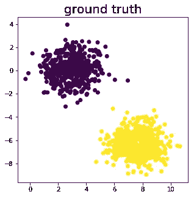
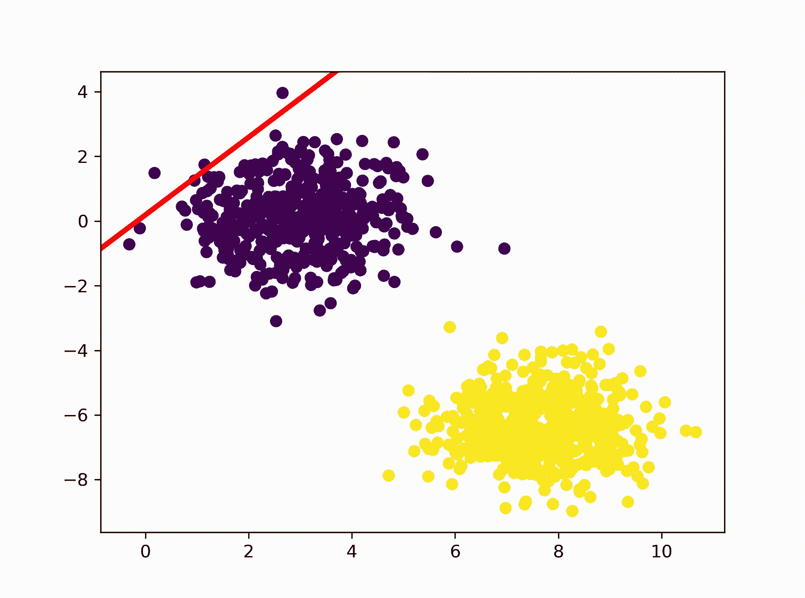

# 从生物学到人工智能:感知机

> 原文：<https://towardsdatascience.com/from-biology-to-ai-the-perceptron-81abfdc788bf?source=collection_archive---------20----------------------->

## Python 中受生物启发的线性分类器

创造能像人类一样行动和推理的机器是一项长期的任务。虽然近年来人工智能(AI)和机器学习取得了很多进展，但一些基础工作在 60 多年前就已经奠定了。这些早期概念的灵感来自于生物神经网络(如人脑)的工作原理。1943 年，麦卡洛克和皮茨发表了一篇论文，描述了基于“全有或全无”活动特征的(人工)神经元在网络中的关系。这种“全有或全无”的特征是指生物神经元要么对刺激做出反应，要么保持沉默，没有中间状态。对这种行为的直接观察可以在[人脑的微电极记录](/using-signal-processing-to-extract-neural-events-in-python-964437dc7c0)中看到。在这篇关于人工神经网络的初步论文之后，Frank Rosenblatt 于 1957 年发表了一篇题为“[感知机——一种感知和识别自动机](https://blogs.umass.edu/brain-wars/files/2016/03/rosenblatt-1957.pdf)”的论文。感知器是一种受监督的线性分类器，它使用可调权重将输入向量分配给一个类别。与 1943 年麦卡洛克和皮茨的论文类似，感知机背后的想法是模拟生物神经元的计算来创造一个可以学习的代理。下面我们将看看感知器背后的思想，以及如何用 Python 代码实现它。


Hardware implementation of the Perceptron ([Mark I](https://en.wikipedia.org/wiki/Perceptron))

## 这个想法

你的大脑包含数十亿个神经元，每个神经元都可以被视为一个处理单元，它整合输入并根据阈值标准创建二进制响应。在生物学术语中，输入是在神经元树突处的膜去极化，其向体细胞传播。如果去极化足够强，神经元将通过产生动作电位作出反应，动作电位将沿着轴突传播。在轴突末梢，神经递质将被释放到突触间隙中，这将使下游神经元的树突去极化。此过程的更详细描述可在[这里](/using-signal-processing-to-extract-neural-events-in-python-964437dc7c0)找到。现在真正的线索是生物神经元网络可以学习如何对其输入做出反应。这种特性的术语是**可塑性**，正是这种特性使得静态软件和能够适应其环境的智能代理有所不同。然而，1943 年[麦卡洛克和皮茨](http://www.cse.chalmers.se/~coquand/AUTOMATA/mcp.pdf)的论文并没有解决这个问题，而是关注神经元之间的关系。另一方面，感知器为可塑性问题提供了一个优雅的解决方案:**权重**。感知器的每个输入都乘以一个权重，然后将结果相加。因此，通过改变输入的权重，我们可以改变感知器的反应。下图给出了感知器如何工作的示意图。


Figure 1: Schematic outline of the Perceptron

在图 1 的左侧，输入表示为 x1、x2、x3…xn。每个输入乘以权重 w0，w1，w2，… wn。在这个乘法步骤之后，结果被累加并通过激活函数。在感知器的情况下，激活函数通过 [*亥维塞阶跃函数*](https://en.wikipedia.org/wiki/Heaviside_step_function) 类似于生物神经元的“全有或全无”特性。这意味着任何≤0 的值将被转换为 0，而任何值> 0 将变为 1。我们可以把上面的也写成:


其中 ***w*** 是权重向量， ***x*** 是输入向量， ***b*** 是偏差项。在图 1 中，我们已经将偏差作为 1(红色方块)包含在输入向量中，并作为 w0 包含在权重向量中。在这种情况下，我们只需要计算输入和权重向量的点积。但仍有一个问题:我们如何调整权重？毕竟这就是感知机的学习方式。思考这个问题的一种方式如下。我们的感知器应该根据输入做出二进制决定(0 或 1)。假设我们有两个数据点，一个属于类 1，另一个属于类 0，感知器必须学习每个数据点的类。下面的图 2 显示了该任务。


Figure 2: Geometrical interpretation

从图 2 中我们可以看到，这个问题可以被视为寻找一个决策边界，也称为*超平面*(红色虚线)*，*，它将两个组分开。红色虚线以上的一切都是 0 类，超平面以下的一切都是 1 类。超平面由垂直于它的权重向量 w’定义(红色实线向量)。因此，计算输入向量与权重向量的点积并将结果传递给激活函数将给出输入的分类。因此，如果我们看看数据点 1，我们也可以将其绘制为一个向量，并垂直于它绘制另一个超平面(黄色实线)。接下来，查看输入向量 2，我们可以再次绘制一个垂直于它的超平面(蓝色实线)。由于分隔两组的超平面需要垂直于我们正在寻找的权重向量，从图 2 中可以明显看出，w’必须位于黄色和蓝色超平面之间(标记为“用于 *x 的范围】*)。因此，按照上述内容，我们可以实现如下学习规则。

首先，我们将权重向量中的所有值设置为零，包括偏差项。在二维输入的情况下，如图 2 所示，这意味着: *w* = [0 0 0]。然后，我们将偏差 1 添加到第一个输入向量，得到 X(1) = [1，x1，x2]。现在我们计算 X1 和 *w* 的点积。这个计算的结果是 0。通过激活函数传递 0 会将 X1 分类为 0 类，这是正确的。因此不需要更新 *w* 。对 X(2)做同样的事情也会得到类 0，这是错误的，因此我们需要通过以下学习规则更新 *w* :


在这种情况下，这意味着从正确的类(1)中减去我们的结果(类 0)，将结果乘以当前输入向量，并将其添加到 *w* 。这将导致:*w*=【1 x1，x2】。如果有更多的数据点，我们将对每个输入向量继续这一过程，并且随着每次迭代，我们将更接近描述线性分离我们两组的超平面的权重向量。为了测试这一点，我们接下来将用 Python 代码实现感知器。

## 实施

为了开发我们的感知器算法，我们将使用通过 [scikit-learn](http://scikit-learn.org/stable/) 生成的玩具数据。我们将使用 [NumPy](http://www.numpy.org/) 实现所有其他功能。包含本文所有代码的完整 Jupyter 笔记本可以在这里找到。下面的代码将创建并可视化我们的玩具数据集。

```
# Import libraries 
from sklearn.datasets import make_blobs
import matplotlib.pyplot as plt
import numpy as np# Generate dataset
X, Y = make_blobs(n_features=2, centers=2, n_samples=1000, random_state=18)# Visualize dataset
fig, ax = plt.subplots(1, 1, figsize=(5, 5))
ax.scatter(X[:, 0], X[:, 1], c=Y)
ax.set_title('ground truth', fontsize=20)
plt.show()
```



Figure 3: Data for testing the Perceptron algorithm.

图 3 显示了我们刚刚创建的两个集群，正如我们可以看到的，它们可以被一个超平面线性分离，这是感知器工作的先决条件。接下来，我们需要将偏置项添加到输入向量中，并用零初始化权重向量。

```
# Add a bias to the X1 vector
X_bias = np.ones([X.shape[0], 3])
X_bias[:, 1:3] = X# Initialize weight vector with zeros
w = np.zeros([3, 1])
```

好了，现在我们都准备好编码感知器算法了。从下面的代码中我们可以看到，这是一个非常简单和优雅的算法。因为不能保证感知器一遍就收敛，所以我们会在不断应用学习规则的同时，将所有训练数据连续 10 次馈入感知器，只是为了确保这一点。

```
# Define the activation function
def activation(x):
    return 1 if x >= 1 else 0# Apply Perceptron learning rule
for _ in range(10):
    for i in range(X_bias.shape[0]):
        y = activation(w.transpose().dot(X_bias[i, :])) # Update weights
        w = w + ((Y[i] - y) * X_bias[i, :]).reshape(w.shape[0], 1)
```

让我们来看看结果。下面的动画形象地展示了感知器是如何搜索一个分离两个聚类的超平面的。正如我们所看到的，它最终提出了一个解决方案，其中一个 1 类数据点位于超平面上。这个解决方案实际上是正确的，因为我们在前面的激活函数中指定:`return 1 if x >= 1 else 0`如果您感兴趣，您可以使用下面的激活函数重新运行上面的代码，看看结果如何变化:`return 0 if x <= 0 else 1`



## 结论

最后，在我们结束对以上的一些思考之前。正如我们看到的，感知器算法是一种实现监督线性分类器的简单方法。然而，它也有缺点。例如，当组不是线性可分时，它不起作用。此外，它是一个在线算法，这意味着我们一次只能传递一个训练示例，如果我们有一个更大的数据集，训练过程会很慢。尽管有这些限制，感知器实际上是一个重要的概念，启动了第一次人工智能炒作。具有讽刺意味的是，几年后，当它无法实现关于它的重大承诺时，它也结束了它。

如果你想要这个项目的完整代码，你可以在这里找到它。当然，你也可以在 [**Twitter**](https://twitter.com/ak_carsten) 上关注我，或者通过 [**LinkedIn**](https://www.linkedin.com/in/carsten-klein/) 联系我。

[](https://github.com/akcarsten/Perceptron/blob/master/perceptron.ipynb) [## 阿克卡斯滕/感知器

### 在 GitHub 上创建一个帐户，为 akcarsten/Perceptron 的开发做出贡献。

github.com](https://github.com/akcarsten/Perceptron/blob/master/perceptron.ipynb)