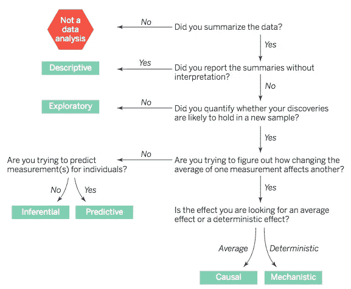

# 从业务问题到数据科学任务

> 原文：<https://towardsdatascience.com/from-business-question-to-data-science-task-55a49f471a0c?source=collection_archive---------15----------------------->

## 数据科学任务的六种类型

每一个分析的开始，都应该有一个问题。在商业世界中，这是一个典型的与商业运作、战略或产品相关的问题。作为一名数据科学家，我的工作是将问题转化为数据科学任务。听起来很简单，但确实至关重要，因为要解决的特定数据科学任务定义了可以从数据和分析中得出的结论。

[我在*数据分析&洞察*部门工作](https://www.linkedin.com/in/mjaeugster/)，在[我的 Meetup 简介](https://www.meetup.com/4laendereck-Data-Science-Meetup/members/209552468/)中，我说*“我试图将数据转化为洞察”*，在我的工作日，我经常大声说*“我们需要创造(可操作的)洞察，并以数据为导向”*——但这实际上意味着什么呢？这是我的[数据哲学系列](https://medium.com/@mjaeugster/data-philosophy-4522529ac213)的第一部分，我试图剖析并理解*“将数据转化为见解”*的实际含义。

# 数据科学任务的六种类型

Jeffery T. Leek 和 Roger D. Peng 在" [*中定义的问题是什么？*](https://www.d.umn.edu/~kgilbert/ened5560-1/The%20Research%20Question-2015-Leek-1314-5.pdf) “六种日益复杂的数据科学任务:

在这篇文章中，我省略了“机械的”数据科学任务，因为它在日常数据科学问题和任务中很少出现(至少在我的日常工作中我从未遇到过)。

## 描述性和探索性数据分析

What is the number of active users per month? Is there a seasonal trend in the number of active users?

第一个例题是描述性问题。目标是获得现有数据样本的[摘要。第二个示例问题是探索性问题，任务是总结，但也是探索潜在的相关性和趋势。通常，它的目标是处理数据，形成新的想法和假设，这些想法和假设可能会导致新的数据收集和实验。描述性和探索性任务中使用的方法范围从](https://en.wikipedia.org/wiki/Descriptive_statistics)[五数字汇总](https://en.wikipedia.org/wiki/Five-number_summary)到与[探索性数据分析](https://en.wikipedia.org/wiki/Exploratory_data_analysis)相关的更复杂的方法(由[约翰·图基](https://en.wikipedia.org/wiki/John_Tukey)大力推广)。对于示例描述性问题，我们将计算每月活跃用户的平均数量
(可能已经有了[置信区间](https://en.wikipedia.org/wiki/Confidence_interval))；对于示例探索性问题，我们将从[时间序列图](https://blog.socialcops.com/academy/resources/visualizing-time-series-data/)开始。

## 推理数据分析

Is the user activity really different between customers that bought the product in May vs. June?

在推理问题的情况下，任务是量化观察到的模式是否可能超出现有的数据样本。[统计推断](https://en.wikipedia.org/wiki/Statistical_inference)
包括，例如[统计假设检验](https://en.wikipedia.org/wiki/Statistical_hypothesis_testing)。对于上面的示例问题，我们可以使用[零假设](https://en.wikipedia.org/wiki/Null_hypothesis)进行统计测试，假设两个月之间的活动相同，使用[替代假设](https://en.wikipedia.org/wiki/Alternative_hypothesis)假设活动不同。假设零假设为真，测试计算结果的可能性。如果非常小(即 [p 值](https://en.wikipedia.org/wiki/P-value)小于
预定义的显著性水平)，我们拒绝零假设，并认为存在[显著差异](https://en.wikipedia.org/wiki/Statistical_significance)。

推断性数据分析是我们开始产生*可操作见解*的地方，因为我们确保结果在数据样本之外有效，并且结果不是偶然的。然而，重要的是要理解，显著的差异并不一定意味着与业务相关的差异。人们还应该调查影响的大小，看看这种差异是否真的对业务有明显的影响。这被称为[实用或
临床意义](https://en.wikipedia.org/wiki/Clinical_significance)并且很可能是未来博客文章的一部分。

## 预测数据分析

Which of our users are most likely to churn?

推理数据分析可在群体层面(例如，在您的所有客户中)产生可操作的见解。如果问题是为个人发现*可操作的见解*，那么任务就是预测性数据分析。在这样的任务中，给定一组其他特征(自变量)，我们预测个体的一个[特征](https://en.wikipedia.org/wiki/Feature_(machine_learning))(因变量)。要为示例预测性问题构建预测模型，我们需要一个数据样本，该数据样本具有描述客户是否流失(是/否)的目标特征“流失”,以及一组描述客户行为(产品活动、客户服务呼叫等)的描述性特征。).给定来自搅动用户和活跃用户的例子，我们可以[将](https://en.wikipedia.org/wiki/Predictive_modelling)任务建模为[二元分类问题](https://en.wikipedia.org/wiki/Binary_classification)。

一个成功的预测模型(通过定义的[绩效衡量指标](https://en.wikipedia.org/wiki/Sensitivity_and_specificity)来衡量)会为特定的个人产生*可操作的洞察力*。因此，如果模型表明某个特定客户可能会流失，我们应该定义一个行动来防止流失。不幸的是，这个模型并没有告诉我们应该采取什么行动——最佳行动是你需要在实验中找到的。在这种情况下，通常不容易正式评估业务影响，整体成功是我们构建预测模型的好坏与触发行动的好坏的结合。如果我们还想估计最优行动，那么这个任务就叫做[规定性分析](https://en.wikipedia.org/wiki/Prescriptive_analytics)，这也是未来博客文章的主题。

## 因果数据分析

Why are our users churning?

因果推理是关于“为什么”这个问题的 —理解描述我们业务或特定业务流程的特征之间的[因果关系](https://en.wikipedia.org/wiki/Causality)。在因果数据分析中，我们希望找出如果一个特征被改变，另一个特征会发生什么:平均起来，特征之间的关系的方向和大小是什么。在我们的示例问题中，我们可以(应该)问一个更详细的问题，例如，“*用户流失是因为我们展示了太多的广告吗？*”。为了回答这样一个问题，我们可以利用我们已有的观察数据的统计模型，或者进行特定的[随机实验](https://en.wikipedia.org/wiki/Randomized_experiment)并收集[实验数据](https://en.wikipedia.org/wiki/Experimental_data)来明确回答这个问题。第二个选项是当您执行 [A/B 测试](https://en.wikipedia.org/wiki/A/B_testing)时会发生什么。这也是我们可以做的来回答我们的示例问题:进行 A/B 测试，其中一组用户看到较少的广告，并监控两组用户之间的流失率。

随机数据分析是这篇博文中描述的五个数据分析中最困难的任务。然而，如果做得好，它会产生最清晰的可操作的洞察力，因为我们实际上了解我们特征之间的因果关系。显然，因果推理的背后有更多的东西，我计划在以后的博客中写更多。现在，永远不要忘记
"[cum hoc ergo proper hoc](https://en.wikipedia.org/wiki/Cum_hoc_ergo_propter_hoc)":相关性并不意味着因果关系！