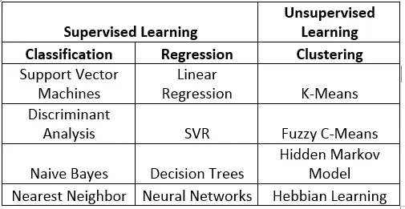

# 从经典的人工智能技术到深度强化学习

> 原文：<https://towardsdatascience.com/from-classic-ai-techniques-to-deep-learning-753d20cf8578?source=collection_archive---------3----------------------->

建造能够从例子、经验甚至从人类水平的另一台机器学习的机器是解决 AI 的主要目标。换句话说，这个目标就是创造一台通过图灵测试的机器:当一个人与它互动时，对于这个人来说，他不可能断定他是在与一个人互动还是与一台机器互动。

深度学习的基本算法是在 20 世纪中期开发的。自那以后，该领域作为随机运筹学和计算机科学的一个理论分支得到了发展，但没有任何突破性的应用。但是，在过去的 20 年里，大数据集、特别标记的数据和使用图形处理器单元的计算机能力的增强之间的协同作用，这些算法已经在更复杂的技术、技术和推理逻辑中得到发展，能够实现几个目标，如降低语音识别中的单词错误率；在一场图像识别比赛中降低错误率[Krizhevsky 等人 2012]并在围棋中击败一名人类冠军[Silver 等人 2016]。吴恩达将这一成功归因于深度神经网络正确学习复杂函数的能力，以及其与输入数据成比例增长的性能。

如今，每个人都可以使用机器学习来创建一些有趣的项目，例如，在石油和天然气行业:

 [## 石油和天然气工程项目中的数据科学。

### 探索性数据分析

towardsdatascience.com](/datascience-in-oil-and-gas-engineering-projects-daace6e6c7f) 

或者享受探索泰坦尼克号事故数据的乐趣:

 [## 泰坦尼克号数据集的特征工程和算法精度

### 机器学习最流行的数据集之一对应于泰坦尼克号事故

towardsdatascience.com](/feature-engineering-and-algorithm-accuracy-for-the-titanic-dataset-5891cfa5a4ac) 

*然而，深度学习是一种机器学习，它允许由多个处理层组成的计算模型学习具有多个抽象级别的数据表示。【le Cun et al 2015】*要理解这项技术，了解机器学习的主要技术很重要:

机器学习技术分为两种:[监督学习，](/supervised-learning-algorithms-explanaition-and-simple-code-4fbd1276f8aa)它训练一个模型，该模型以已知数据集(一个带标签的训练集)作为输入，并生成一个可以预测新数据未来输出的模型。无监督学习获取数据集(未标记)并在数据中寻找模式或内在结构，它通常作为聚类数据工作。一些最重要的机器学习技术在表 1 中进行了分类。

**Table 1\.** Some machine learning techniques

如果您想更详细地了解这些技术，请查看下一篇文章，在这篇文章中，我用图形和简单的代码解释了它们:

 [## 监督学习算法:解释和简单代码

### 监督学习算法采用一组已知的输入数据(学习集)和已知的数据响应(学习集)

towardsdatascience.com](/supervised-learning-algorithms-explanaition-and-simple-code-4fbd1276f8aa) 

此外，强化学习问题涉及学习从经验中最大化数字奖励信号，也就是说，如何将步骤映射到行动(或创建策略)以最大化奖励效用。这种类型的机器学习不从标记数据的训练集中学习，它从与其环境的交互中学习。它尝试几种途径以最大化长期积累的报酬，也叫效用。强化学习的特点是:学习系统的行动影响其后来的输入，它没有直接的指示，如采取什么行动，以及行动的后果，包括奖励信号，发挥了长时间[萨顿和巴尔托 1998]。

**利用高效算法进行无监督或有监督的知识发现** [**特征学习**](/feature-engineering-and-algorithm-accuracy-for-the-titanic-dataset-5891cfa5a4ac)

深度学习是一种基于 20 世纪中期开发的一些基本算法的机器学习。其中大多数用于神经网络，下一节我们将展示一些最重要的机器学习算法。

机器学习中最强大的技术之一是神经网络，因为它可以在不同类型的机器学习的补充中实现，如接下来的会议所示。受人类大脑的启发，神经生理学家沃伦麦卡洛克和逻辑学家沃尔特皮茨提出了一种神经网络，它由高度连接的功能网络组成，这些功能网络映射了从输入到所需输出的路径。这是第一种数学方法。通过迭代修改连接的权重来训练网络。[M .沃伦，W .皮尔茨 1943 年]

神经网络具有从复杂或不精确的数据中获取意义的非凡能力，可用于提取模式和检测太复杂而无法被人类或其他计算机技术注意到的趋势。一个经过训练的神经网络可以被认为是它所分析的信息类别中的“专家”。然后，可以使用该专家对感兴趣的新情况进行预测，并回答假设问题。”【梅林等人，2002 年】

同样受到神经科学的启发，Rosenblatt[Rosenblatt et al f . 1958]开发了感知器，这是一种用于学习二进制分类器的算法，它将每个神经元的输出映射为 0 或 1；它采用输入向量 **x，**权重向量 **w** 并评估标量积是否超过阈值 u，即如果 wx-u>0 则为 *f(x) = 1，否则为 0。在简单的层神经网络中，这种算法不是很有用，因为二进制分类是有限的。*

另一方面，强化学习算法是从动态规划原理发展而来的。动态规划是一组可以解决所有类型的马尔可夫决策过程的算法。[贝尔曼 1957 年动态规划] MDP 是在随机情况下建模决策的数学模型。它们通常用图来表示，其中节点是状态，线是从一个状态到另一个状态的动作，从每个状态开始，每个动作都有一定的概率独立于过去的状态或动作而发生。每个新状态给出一个奖励(正面或负面)。解决 MDP 问题意味着建立一个使所有奖励总和最大化的政策。如果处于某一状态的概率不是 100%，问题就变成了部分可观测 MDP (POMDP)

贝尔曼首先提出了一个可以解决这个问题的方程。[1957 Bellman]这个递归公式提供了遵循期望最高回报的特定政策的效用。解这个方程意味着找到最优策略，这个问题很难解决，因为这个方程涉及一个最大化函数，它是不可求导的。这个问题使得强化学习领域没有任何相关的进展，直到 1989 年 Watkins 提出了 Q 学习算法[Watkins，1989。它通过计算状态对行为的量来解决问题。(莎莎)

最后利用时间差分(TD)学习算法保证解的收敛性。它是由 R. S. Sutton 在 1988 年提出。[Sutton et al 1988]自从他第一次使用它以来，它已经成为解决强化学习问题的参考。它确保大多数国家的参与，有助于解决伴随勘探-开采困境而来的挑战。

**推理技术与深度学习的整合**

当神经网络发展到不止一层时，深度学习就开始了。在几层神经元中工作只是走向深度学习和数据挖掘的第一步。在这一部分，我们将揭示第一部分的技术是如何集成到多层神经网络中的，它们共同开发了深度学习的基础。

最初，感知器被认为是解决一层神经网络，它作为一个一维分类器。这种技术在例如语音或图像分类中不是很有用，因为该技术必须对输入的不相关变化不敏感，例如照片的方向、照明、缩放，但是它们应该对区分图像和另一个图像(例如狼和狗)的细节敏感。

当多层感知器(MLP)在 1986 年由 Rumelhart 用一种称为梯度下降反向传播技术开发出来时，感知器开始只在多层网络中有用。反向传播是算法的集合，旨在分配正确的权重，使神经网络在学习中具有较低的误差。反向传播中最重要的方法之一是随机梯度下降(SGD)，这是一种算法，旨在使用微积分概念作为偏导数的链规则来最小化错误率[Rumelhart 等人，1986]。在该技术中，目标相对于神经元的输入的导数可以通过相对于该神经元的输出(即下一个神经元的输入)反向计算来计算。该技术传播所有导数或梯度，从顶部输出开始，一直到底部，然后直接计算每个链接的相应权重。

自 MLP 和 SGD 以来，在解决神经网络方面没有太多的进展，直到 1997 年提出了另一种称为长短期记忆 LSTM 的反向传播方法[Hochreiter et al 1997]，它缩短了正常的梯度下降法，并引入了递归网络的概念来学习长范围的依赖性。它倾斜得更快，解决了以前从未解决过的复杂的人工长时间滞后的任务。

在深度学习论文中，LeCun 解释了其对深度学习形成的重要性:“*长期短期记忆(LSTM)网络使用特殊的隐藏单元，其自然行为是长时间记忆输入。一个称为存储单元的特殊单元的作用就像一个累加器或门控漏神经元:它在下一个时间步长与自己有一个权重为 1 的连接，因此它复制自己的实值状态并累积外部信号，但这种自我连接受到另一个单元的乘法门控，该单元学会决定何时清除存储器的内容*【LeCun 等，Nature 2015】，

LSTM 网络可以训练某种类型的网络，称为递归神经网络(RNN)，可以为涉及顺序输入的任务进行训练，如语音和语言[Graves et al 2013]。RNN 在明年非常有用，但它没有解决深度学习的问题。

科学家还开发了另一种更容易训练的网络，这意味着它需要更少的例子来获得神经元之间连接的正确权重，并且它还可以进行更好的分类。这种网络被称为卷积神经网络(CNN ),其特征在于相邻层之间具有完全连通性。它首先出现在[Lecun et al 1989]中，应用于手写邮政编码识别。作者解释了 CNN 中的卷积层和池层是如何直接受到视觉神经科学中细胞的经典概念的启发。CNN 是发展计算机视觉的第一步。

结合神经网络和强化学习的系统是深度强化学习(DRL)的基础。在这种情况下，处于状态的代理使用深度神经网络来学习策略；根据这个策略，代理在环境中采取行动，并从特定的状态中获得奖励。奖励供给神经网络，它产生一个更好的政策。这是在一篇著名的论文《用深度强化学习玩雅达利》(playing Atari with deep reinforcement learning)[Mnih，V. et al 2013]中开发和应用的，在这篇论文中，他们学习一台机器直接从像素开始玩雅达利游戏，经过训练，这台机器输出了优秀的结果。

后来，AlhpaGo 团队开发了一个深度强化学习系统，使用了本次会议中引用的所有技术(LSTM，美国有线电视新闻网，RNN)，创建了一个能够学习玩围棋的人工智能系统，被训练观察专家，被训练与自己对弈，并最终击败世界冠军 Lee Sedol。这是人工智能的一个突破，因为由于游戏的复杂性，科学家认为让一台机器赢得这场游戏需要更多年的时间。[西尔弗等人，2016 年]

# 感谢阅读！！！

> 如果你想继续阅读这样的故事，你可以在这里订阅！

我喜欢与[贝叶斯网络](/will-you-become-a-zombie-if-a-99-accuracy-test-result-positive-3da371f5134)一起工作:它们允许人类学习和机器学习协同工作，即贝叶斯网络可以从人类和人工智能的**组合中开发出来。除了跨越理论和数据之间的界限，查看下一个帖子来了解更多信息:**

 [## 贝叶斯思维导论:从贝叶斯定理到贝叶斯网络

### 假设世界上存在一种非常罕见的疾病。你患这种疾病的几率只有千分之一。你想要…

towardsdatascience.com](/will-you-become-a-zombie-if-a-99-accuracy-test-result-positive-3da371f5134) 

**参考书目**

> *1。贝尔曼河(1957 年)。一个马尔可夫决策过程(编号 P-1066)。兰德公司圣莫尼卡加州。*
> 
> *2。贝尔曼(1957 年)。动态编程。新泽西州普林斯顿:普林斯顿大学出版社。*
> 
> *3。Bottou，L. (2014 年)。从机器学习到机器推理。机器学习，94 (2)，133–149 页。*
> 
> *4。Ciresan 博士，Meier，u .，& Schmidhuber，J. (2012 年)。用于图像分类的多列深度神经网络。计算机视觉和模式识别(CVPR)(第 3642-3649 页)。*
> 
> *5。F. Vernadat，企业现代化技术:业务流程的应用，收款管理，经济学，1999 年*
> 
> *6。GONZALES N .:对“项目成熟度评估流程的实施:在汽车上的应用”的贡献，博士论文，2009 年 12 月 3 日*
> 
> *7。Graves，a .，Mohamed，A.-r .，& Hinton，G. (2013 年)。基于深度递归神经网络的语音识别。声学、语音和信号处理(icassp)，2013 年 ieee 国际会议。*
> 
> *8。赫布，国防部长(1949 年)。行为的组织。威利。*
> 
> *9。辛顿，G. E .，达扬，p .，弗雷，B. J .，&尼尔，R. M. (1995 年)。无监督神经网络的唤醒-睡眠算法。科学，268 (5214)，1158–61。*
> 
> 10。Juang，B. H .，& Rabiner，L. R. (1990 年)。语音识别的隐马尔可夫模型。技术计量，33 (3)，251–272。
> 
> *11。Krizhevsky，a .，Sutskever，I .，& Hinton，G. E. (2012 年)。基于深度卷积神经网络的图像网分类。神经信息处理系统进展 25(第 1097-1105 页)。*
> 
> *12。LeCun，y . beng io，& Hinton，G. (2015)。深度学习。自然，521，436–444。*
> 
> *13。LeCun，y .，Boser，b .，Denker，J. S .，Henderson，d .，Howard，R. E .，Hubbard，w .，& Jackel，L. D. (1989)。反向传播算法在手写邮政编码识别中的应用。神经计算，1，541–551。*
> 
> *14。勒昆，y .，博图，l .，本吉奥，y .，& H*
> 
> *国家能源研究所，P. (1998 年)。基于梯度的学习在文档识别中的应用。IEEE 会议录，86 (11)，2278–2323*
> 
> *15。利特曼博士(1994 年)。马尔可夫博弈作为多主体强化学习的框架。《第十一届机器学习国际会议论文集》(第 157 卷，第 157–163 页)。*
> 
> 16。麦卡洛克，沃伦；沃尔特·皮茨(1943)。“神经活动中固有的思想逻辑演算”。数学生物物理学通报。5 (4): 115–133.
> 
> 17。麦卡洛克，沃伦；沃尔特·皮茨(1943)。“神经活动中固有的思想逻辑演算”。数学生物物理学通报。5 (4): 115–133.
> 
> 18。非线性动力系统的建模、模拟和控制。泰勒和弗朗西斯，伦敦(2002 年)
> 
> 19。Mnih，v .，Kavukcuoglu，k .，Silver，d .，Graves，a .，Antonoglou，I .，Wierstra，d .，& Riedmiller，M. (2013 年)。用深度强化学习玩雅达利。arXiv 预印本 arXiv:1312.5602。
> 
> 20。罗森布拉特，F. (1958)。感知器:大脑中信息存储和组织的概率模型。心理评论，65，386–408 页。
> 
> *21。鲁梅尔哈特，丁顿，g .&。通过反向传播误差学习表征。自然，323 (9)，533{536。*
> 
> *22。S. Hochreiter 和 J. Schmidhuber。长短期记忆。神经计算，9(8):1735–1780，1997。*
> 
> *23。西尔弗，d .，黄，a，，C. J .，盖兹，a .，西弗尔，l .，德里斯切，G. V. D .。。哈萨比斯博士(2016)。用深度神经网络和树搜索掌握围棋。自然，529 (7585)，484–489。*
> 
> *24。萨顿，R. S. (1988)。学会用时差法预测。马赫。学习。, 39.*
> 
> *25。萨顿，R. S .，&巴尔托，A. G. (1998)。强化学习:导论(第 1 卷第 1 号)。剑桥:麻省理工学院出版社。*
> 
> 26。沃特金斯，c . j . c . h .(1989)，从延迟奖励中学习。博士论文，剑桥大学。