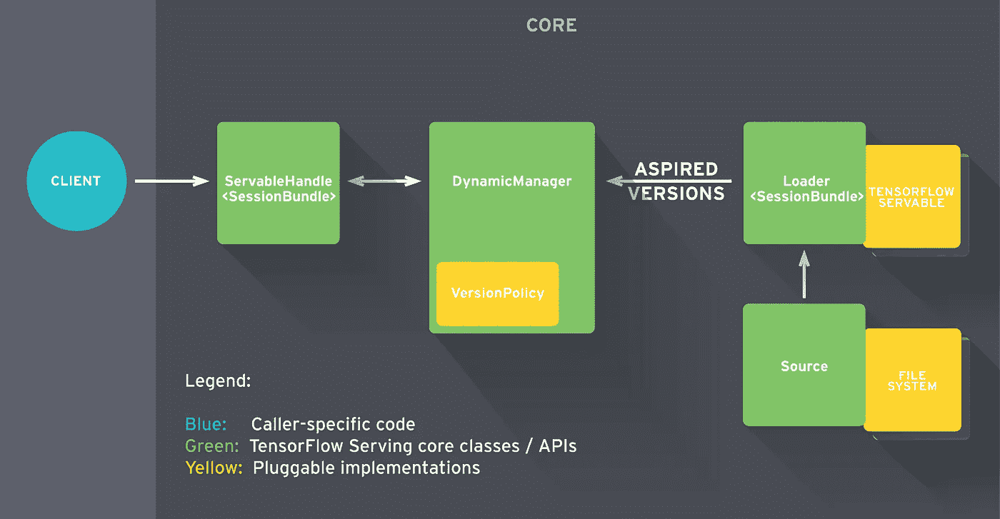
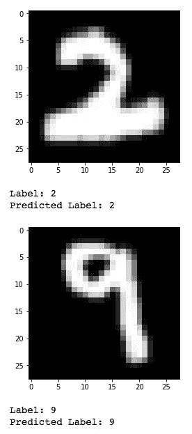
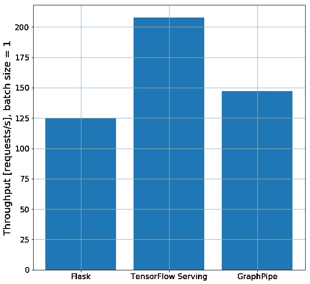
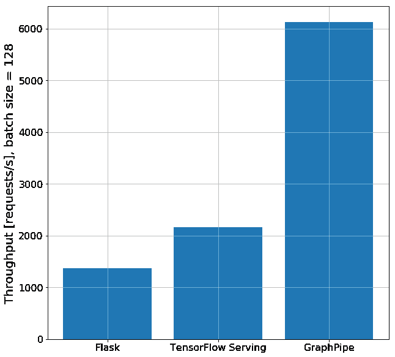

# 从探索到生产——弥合深度学习的部署差距(第二部分)

> 原文：<https://towardsdatascience.com/from-exploration-to-production-bridging-the-deployment-gap-for-deep-learning-part-2-9e33cc8dfe5e?source=collection_archive---------7----------------------->


这是关于深度学习模型探索、翻译和部署的两个博客系列的第二部分。两者都涉及到很多技术，比如 **PyTorch、TensorFlow、TensorFlow Serving、Docker、ONNX、NNEF、GraphPipe、Flask** 。我们将协调这些技术，使用更具挑战性但不太受欢迎的 **EMNIST 数据集**来解决图像分类的任务。在第一部分中，我们介绍了 EMNIST，使用 PyTorch 开发和训练模型，使用开放神经网络交换格式(ONNX)翻译它们，并通过 GraphPipe 服务它们。

本部分通过添加两种额外的模型部署方法来结束本系列。TensorFlow Serving 和 Docker 以及一种相当业余的方法，在这种方法中，我们构建了一个服务于我们模型的简单 web 应用程序。这两个部署都将提供 REST API 来调用预测。你会在 [GitHub](https://github.com/squall-1002/emnist_dl2prod) 上找到所有相关的源代码。如果您喜欢从头开始，请在这里找到关于数据科学的第**部分。**

我们将使用我们在第一部分中生成的来自 PyTorch 和 TensorFlow 的经过训练的模型文件。你可以在 GitHub 上的`models`文件夹中找到它们。


# 模型部署:TensorFlow 服务和 Docker

这确实是我们第二次在这个系列中使用 TensorFlow 服务。我们第一次使用它是作为 GraphPipe 的一部分，它提供了参考模型服务器和调整模型服务器配置。我们现在不使用元框架，而是直接转向 TensorFlow。参考[这个 JuPyter 笔记本](https://github.com/squall-1002/emnist_dl2prod/tree/master/notebooks/4_production_TFServing.ipynb)按照步骤去体验深度学习模型部署的另一种方式。

第一步，我们必须加载我们的 ONNX 模型，并使用 [ONNX TensorFlow 连接器](https://github.com/onnx/onnx-tensorflow)创建它的 TensorFlow 表示:

接下来，我们定义加载模型的路径，并创建一个`SavedModelBuilder`。这个实例是生成路径和创建模型的 protobuf 导出所必需的。在 TensorFlow 服务术语中，该特定保存路径也称为*源*。

为了给我们的模型构建一个合适的签名(某种类型的接口)，让我们回顾一下模型由什么组成:

```
External Input: ['flattened_rescaled_img_28x28']
External Output: ['softmax_probabilities']{'weight_1': <tf.Tensor 'Const:0' shape=(512, 784) dtype=float32>,
 'bias_1': <tf.Tensor 'Const_1:0' shape=(512,) dtype=float32>,
 'weight_2': <tf.Tensor 'Const_2:0' shape=(256, 512) dtype=float32>,
 'bias_2': <tf.Tensor 'Const_3:0' shape=(256,) dtype=float32>,
 'weight_3': <tf.Tensor 'Const_4:0' shape=(62, 256) dtype=float32>,
 'bias_3': <tf.Tensor 'Const_5:0' shape=(62,) dtype=float32>,
 'flattened_rescaled_img_28x28': <tf.Tensor 'flattened_rescaled_img_28x28:0' shape=(1, 784) dtype=float32>,
 '7': <tf.Tensor 'add:0' shape=(1, 512) dtype=float32>,
 '8': <tf.Tensor 'add_1:0' shape=(1, 512) dtype=float32>,
 '9': <tf.Tensor 'add_2:0' shape=(1, 256) dtype=float32>,
 '10': <tf.Tensor 'add_3:0' shape=(1, 256) dtype=float32>,
 '11': <tf.Tensor 'add_4:0' shape=(1, 62) dtype=float32>,
 'softmax_probabilities': <tf.Tensor 'Softmax:0' shape=(1, 62) dtype=float32>}
```

我们可以识别三个完全连接的层以及我们的输入和输出张量。后者是入口和出口，特别重要的是构建所谓的签名定义。这些签名定义了服务环境和我们的模型本身之间的接口。这是模型部署的第一步，接下来是在 Docker 中启动服务器并进行适当的部署测试。

## 签名定义构建

在本节中，我们将创建适当的签名(分类和预测)并将它们添加到模型图中。之后，我们使用我们的`SavedModelBuilder`实例进行实际的导出

为了创建合适的签名，我们必须从输入和输出张量中推断出`TensorInfo`对象。`TensorInfo`对象是类 JSON 对象，包含`Tensor`的*名称*、*数据类型*和*形状*。我们简单地获取输入和输出张量的引用，并使用`build_tensor_info`为它们创建`TensorInfo`对象:

应用于`output_tensor`，我们得到`output_tensor_info`并看到张量持有与我们的 62 个不同 EMNIST 标签相关的维度 1 x 62 的 softmax 激活:

```
name: "Softmax:0"
dtype: DT_FLOAT
tensor_shape {
  dim {
    size: 1
  }
  dim {
    size: 62
  }
}
```

现在，我们已经准备好构建分类和预测签名，如下所示。它们只是将`TensorInfo`对象与适当的名称和方法名的声明结合起来:

定义后的`prediction_signature`看起来像这样:

```
inputs {
  key: "images"
  value {
    name: "flattened_rescaled_img_28x28:0"
    dtype: DT_FLOAT
    tensor_shape {
      dim {
        size: 1
      }
      dim {
        size: 784
      }
    }
  }
}
outputs {
  key: "scores"
  value {
    name: "Softmax:0"
    dtype: DT_FLOAT
    tensor_shape {
      dim {
        size: 1
      }
      dim {
        size: 62
      }
    }
  }
}
method_name: "tensorflow/serving/predict"
```

最后，我们将两个签名添加到模型中，并执行导出:

我们现在可以找到类似于包括元数据(签名)的序列化模型图定义的`saved_model.pb`。此外，我们的构建器添加了包含序列化图形变量的文件夹`variables`。不幸的是，签名构建过程增加了额外的复杂性。说实话，我还没得到它的效用。毕竟，人们也可以使用张量名称本身，而不需要任何额外的包装。但是，如果您想尝试一下，可以在[相关 TensorFlow 文档](https://www.tensorflow.org/serving/signature_defs)中找到更多信息。

## 通过 Docker 容器中的 TensorFlow 服务模型

嘿，看起来我们刚刚创建了一个*可服务的*，它是 TensorFlow 为客户用来执行计算的对象提供语音服务。是时候真正为可服务对象服务了。但是，TensorFlow 中的服务一般是如何工作的？简而言之，TensorFlow Serving 由下图中描述的五个组件组成: **Servables** 、 **Loaders** 、 **Sources** 、 **Manager** 和 **Core** 。它们一起工作如下:我们运行一个模型服务器，告诉*管理器*它应该监听的*源*，以便它可以探索新的*服务对象*。在我们的例子中，我们使用一个文件系统。当我们将一个模型保存到那个文件系统时，*源*通知*管理器*关于一个新检测到的*可服务的*，这使得它成为*期望的版本*。源提供了一个*加载器*，它告诉*管理器*加载模型所需的资源。*管理器*同时处理请求，决定是否以及何时加载模型。根据*版本策略*，它可以卸载旧版本或保留旧版本。成功加载模型后，*管理器*可以开始服务*客户端*请求，将*句柄*返回到非常新的*可服务*或其他版本，如果*客户端*明确请求的话。客户端可以使用 [*gRPC*](https://grpc.io/) 或 *REST* 发送推理查询。



[https://www.tensorflow.org/serving/overview](https://www.tensorflow.org/serving/overview)

到目前为止，一切顺利——让我们再练习一次:安装 Docker 后，我们用`docker pull tensorflow/serving`提取 TF 服务容器映像，并简单地用下面的命令启动模型服务器:

```
docker run -p 8501:8501 --name emnist_model \
--mount type=bind,source=$(pwd)/../models/tf_emnist,target=/models/tf_emnist \
-e MODEL_NAME=tf_emnist -t tensorflow/serving &
```

这将启动 dockerized 模型服务器，并将其端口 8501 发布到我们主机上的同一个服务器。这个端口为我们的模型提供了一个 REST API。此外，我们将目录( *source* )挂载到容器( *target* )中，在那里我们喜欢保存我们的 servables。因此，每次我们导出较新的模型版本时，TF serving 都会在容器中识别它们并触发加载过程。我们现在可以直接看到服务进程以及由核心、管理器和加载器完成的任务。

```
2018-10-13 13:38:15.518130: I tensorflow_serving/model_servers/server.cc:82] Building single TensorFlow model file config:  model_name: tf_emnist model_base_path: /models/tf_emnist
2018-10-13 13:38:15.518416: I tensorflow_serving/model_servers/server_core.cc:462] Adding/updating models.
2018-10-13 13:38:15.518455: I tensorflow_serving/model_servers/server_core.cc:517]  (Re-)adding model: tf_emnist
2018-10-13 13:38:15.638251: I tensorflow_serving/core/basic_manager.cc:739] Successfully reserved resources to load servable {name: tf_emnist version: 1}
2018-10-13 13:38:15.638370: I tensorflow_serving/core/loader_harness.cc:66] Approving load for servable version {name: tf_emnist version: 1}
2018-10-13 13:38:15.638411: I tensorflow_serving/core/loader_harness.cc:74] Loading servable version {name: tf_emnist version: 1}
2018-10-13 13:38:15.639975: I external/org_tensorflow/tensorflow/contrib/session_bundle/bundle_shim.cc:360] Attempting to load native SavedModelBundle in bundle-shim from: /models/tf_emnist/1
2018-10-13 13:38:15.641451: I external/org_tensorflow/tensorflow/cc/saved_model/reader.cc:31] Reading SavedModel from: /models/tf_emnist/1
2018-10-13 13:38:15.659090: I external/org_tensorflow/tensorflow/cc/saved_model/reader.cc:54] Reading meta graph with tags { serve }
2018-10-13 13:38:15.660035: I external/org_tensorflow/tensorflow/core/platform/cpu_feature_guard.cc:141] Your CPU supports instructions that this TensorFlow binary was not compiled to use: AVX2 FMA
2018-10-13 13:38:15.672728: I external/org_tensorflow/tensorflow/cc/saved_model/loader.cc:162] Restoring SavedModel bundle.
2018-10-13 13:38:15.673671: I external/org_tensorflow/tensorflow/cc/saved_model/loader.cc:172] The specified SavedModel has no variables; no checkpoints were restored. File does not exist: /models/tf_emnist/1/variables/variables.index
2018-10-13 13:38:15.673710: I external/org_tensorflow/tensorflow/cc/saved_model/loader.cc:138] Running MainOp with key saved_model_main_op on SavedModel bundle.
2018-10-13 13:38:15.677101: I external/org_tensorflow/tensorflow/cc/saved_model/loader.cc:259] SavedModel load for tags { serve }; Status: success. Took 35653 microseconds.
2018-10-13 13:38:15.678135: I tensorflow_serving/servables/tensorflow/saved_model_warmup.cc:83] No warmup data file found at /models/tf_emnist/1/assets.extra/tf_serving_warmup_requests
2018-10-13 13:38:15.684767: I tensorflow_serving/core/loader_harness.cc:86] Successfully loaded servable version {name: tf_emnist version: 1}
2018-10-13 13:38:15.686409: I tensorflow_serving/model_servers/server.cc:285] Running gRPC ModelServer at 0.0.0.0:8500 ...
[warn] getaddrinfo: address family for nodename not supported
2018-10-13 13:38:15.686843: I tensorflow_serving/model_servers/server.cc:301] Exporting HTTP/REST API at:localhost:8501 ...
[evhttp_server.cc : 235] RAW: Entering the event loop ...
```

## 测试模型服务器

再次测试的时候到了！让我们对我们的模型服务器使用一些测试图像，并评估它们的分类准确性。此时，使用我们的预测签名中定义的输入和输出定义将是直观的。然而，这并不是那么简单，我们创建了一个用`instances`注释的数据有效负载作为我们的 POST 请求的输入，并接收一个响应对象，我们需要用`predictions`处理它的内容:

在我们的 1000 个测试例子中，我们最终得到的准确率为 **78.3%** ，这与我们的训练结果一致。最后让我们看看下面的一些例子。我们可以发现该模型很难区分大写的 **O** 和 **0** ，这一点都不容易。


# 模型部署:Flask Webservice

在本节中，我们将转向我们的最终部署方法。因此，我们在一个简单的 web 服务中嵌入了模型推理，并构建了一个允许用户上传图像进行分类的极简前端。为此，我们使用了 [Flask](http://flask.pocoo.org/) ，这是一个简洁的 Python web 开发框架，基于 Werkzeug 和 Jinja2。我们将在包本身中实现模块`emnist_dl2prod.emnist_webserver`，但是你可以参考[这个 JuPyter 笔记本](https://github.com/squall-1002/emnist_dl2prod/tree/master/notebooks/5_production_Webserver.ipynb)获得更多信息。

本节包括三个部分:

1.  构建模型包装类
2.  实现 web 服务和前端
3.  运行并测试我们自己的 EMNIST 网络服务器

## 1.构建模型包装类

我们从下面的模型包装类开始。为了创建一个新的实例，我们必须提供之前使用`SavedModelBuilder`保存的模型的路径。这里，我们使用`tf.saved_model`的加载器功能来加载和恢复我们的模型。我们还创建了一个会话，在这个会话中，我们恢复了构成我们的`SavedModel`的图形定义和变量。此外，模型类还实现了一个`run`方法，以便稍后轻松执行单个实例或批量推理。此方法只是对展平和规范化的图像数据(浮点值在 0 和 1 之间)运行会话，并返回所有 62 个类的 softmax 激活。

## 2.实现 web 服务和前端

接下来，我们转向 Flask 和一些 HTML，因为我们将简单的 REST webservice 与极简前端相结合，以上传图像并可视化分类结果。首先，我们创建两个 HTML 文件，`img_upload.html`和`result.html`。第一个页面实现了一个图像上传界面和一个按钮来提交图像数据，这在内部触发了预处理和分类过程。后一个文件类似于显示上传图像本身的模板，当然也显示分类结果。结果是检测到的(最有可能的)类以及我们的模型得出的 softmax 分数。让我们仔细看看这中间发生了什么。上传图片时，上传页面触发以下重定向:`url_for('process_img_upload')`。此重定向通过后请求提供了以下方法:

`emnist_result`是一个字典，我们用它来最终用适当的值呈现我们的结果页面。这也需要临时保存上传的图像并检查文件类型是否正确。在后一部分，我们使用`skimage`读取图像，直接产生一个 NumPy 数组——数据科学家的宠儿。然后，我们对图像数组进行预处理(归一化+展平)和分类，简单地调用我们的模型包装器实例的`run`作为`classify_img`的一部分。这将返回 softmax 激活值，并将最高激活的索引映射到适当的标签。最后，我们通过向字典添加 softmax 值和标签来完成我们的请求结果，并调用`show_emnist_result`来呈现结果页面。

除了我们的前端展示，我们还实现了一个方法，用一个适当的响应对象来回答 POST 请求，而不是呈现任何 HTML 模板:

## 3.测试和性能评估

又到了收获我们劳动果实的时候了。我们启动我们的网络服务器，让我们处理一些例子。您可以使用`python emnist_webserver.py`或使用随软件包安装的命令`emnist-webservice`来启动它。无论哪种方式，您都应该在终端中显示类似于以下内容的内容:

```
[2018-10-14 11:07:26] INFO:__main__:Set up temporary media folder for webserver: /Users/mkurovski/Python/emnist_dl2prod/src/emnist_dl2prod/tmp_flask_media
 * Serving Flask app "emnist_webserver" (lazy loading)
 * Environment: production
   WARNING: Do not use the development server in a production environment.
   Use a production WSGI server instead.
 * Debug mode: off
[2018-10-14 11:07:26] INFO:werkzeug: * Running on [http://0.0.0.0:5000/](http://0.0.0.0:5000/) (Press CTRL+C to quit)
```

太好了！让我们去参观一下:


为了方便测试，您可以在[库](https://github.com/squall-1002/emnist_dl2prod/tree/master/test_images/)中找到包含 10 个字符的文件夹`test_images`。试几个吧！我们选择一个图像并点击`Get Result`,然后“瞧”,我们在 softmax 激活中看到 **e** 和 **99.74%** 的概率。在后端，我们收到了进一步的确认，表明一切都按预期进行:

```
[14/Oct/2018 11:11:26] "POST /emnist/result HTTP/1.1" 200 -
[14/Oct/2018 11:11:26] "GET /emnist/img_upload/img_upload_1539508286216.png HTTP/1.1" 200 -
```


在相关的 JuPyter 笔记本中，您将看到我们后面的实现的一些示例，我们也想在这里尝试一下。出于评估和测试的目的，您可以将`eval_serving_performance`作为`emnist_dl2prod.utils`的一部分。该方法从测试或训练数据中创建一定量的请求，将它们发送到指定的端点，并评估响应的准确性及其时间。我们将在下一部分更详细地讨论它。这里，让我们在刚刚创建的终端上尝试一下:

这将一些结果可视化，并告诉我们请求的平均准确性:



```
Accuracy on 1000 test images: 77.60%
```

77.6% —耶！这看起来与我们的训练经验非常一致。
太好了！我们实现了自己的 web 服务，成功地证实了我们在生产中的培训结果。到了决赛的时候了——所有这些方法在定性和定量意义上如何相互比较？

# 结论:比较不同部署的吞吐量和预测准确性

这是我关于深度学习模型探索、翻译和制作的综合博客系列的最后一部分。借助 Docker、TensorFlow、GraphPipe、PyTorch、ONNX 和 Flask 等众多技术，我们构建了从勘探到生产的桥梁。所有的方法都是从 PyTorch 探索和 ONNX 翻译开始的。它们的不同之处在于我们部署每个解决方案的方式。我们从 GraphPipe 和 Docker 开始提供一个处理 REST 调用的简短包装器。我们继续使用 TensorFlow 在 Docker 容器中提供服务。这有点冗长和复杂。最后，我们使用 Flask 构建了自己的 web 服务器，并嵌入了模型推理调用。我们还将最后一种方法与极简前端相结合。这是最冗长的，但也是最容易理解的部署方式。然而，我不建议将它用于大规模生产系统，它有助于捕捉模型推理、客户端-服务器通信和前端如何相互连接。现在，让我们看看这些方法在定性和定量方面是如何相互比较的。

首先，让我们从**易用性**和**实现努力**的角度来看一下定性。在我看来，Flask 是最简单的方法 GraphPipe 紧随其后。服务 ONNX 模型的 GraphPipe 中的一些意外故障导致了问题。然而，转移到 TensorFlow 很容易地解决了我们当时的问题。使用 TensorFlow 服务，事情会变得有点复杂，因此它在这方面占据第三位。就我们的实现程度而言，GraphPipe 是明显的赢家，只需要很少的代码来部署我们的模型。TensorFlow 服务需要多一点，但仍然做得很好。签名的定义在这里增加了一些冗长。Flask 紧随其后，因为它比 GraphPipe 花费更多的精力，这对于构建自己的解决方案来说似乎是不言而喻的。

但是，作为数据科学家和工程师，我们更感兴趣的是仅仅作为直觉的数字。因此，我还对这些部署在给定请求吞吐量的情况下如何进行比较以及它们是否返回一致的结果感兴趣。参见[这款 JuPyter 笔记本](https://github.com/squall-1002/emnist_dl2prod/tree/master/notebooks/6_conclusion_Serving_Performance_Comparison)进行对比。我在一个只有一个 CPU 的谷歌云计算实例上测试了所有解决方案。然而，为了避免糟糕的网络连接导致的测量偏差，我在这里展示了本地托管每个服务的结果。我们涵盖了各种场景:发送单个实例请求和批处理请求，每个都有 128 个示例。对于这两个场景，我们使用单个客户端线程，没有异步请求，以保持与 Oracle 评估 GraphPipe 的方式一致。然后，我们计算在一致的持续时间内成功请求的数量，并获得每秒的*吞吐量*作为性能指标。参见`emnist_dl2prod.utils:eval_throughput`了解我们吞吐量测试的实施。需要注意的是，不同设置下的绝对数字可能会有所不同。然而，这不应该是我们关心的问题，因为我们更感兴趣的是**这些方法如何相互比较**而不是它们各自的绝对性能。因此，让我们来看看**单实例请求吞吐量。**我们清楚地看到 TensorFlow 的服务性能优于 GraphPipe 和 Flask，每秒处理超过 200 个单实例请求，其中 GraphPipe 和 Flask 分别超过大约 150 个和 125 个。



如果我们研究使用的**批处理推理案例，并且顺序已经改变，差异会变得更大。GraphPipe 显然脱颖而出，在相同时间内，它提供的图片数量大约是 TensorFlow 的三倍**。TensorFlow 服务在处理请求方面排名第二，比 Flask 服务高出约 70-80%。



这与[甲骨文的说法](https://oracle.github.io/graphpipe/#/guide/user-guide/performance)相当一致。然而，在我们的例子中，震级并没有变得那么极端。


[https://oracle.github.io/graphpipe/#/guide/user-guide/performance](https://oracle.github.io/graphpipe/#/guide/user-guide/performance)

总之，在批量推断方面，GraphPipe 比 Flask 和 TensorFlow 要快得多。然而，TensorFlow 服务明显优于单个实例推理，这一点值得注意。如果我们不批量处理传入的请求并为其提供 GraphPipe，我们最好继续使用 TensorFlow 服务。但是，如果我们的问题允许，或者如果我们可以批量处理传入的请求，我们最好使用 GraphPipe。

## 观点

哇，这是很多，我希望你仍然喜欢它。请你自己尝试一下，分享一下你的经验，让我们试着介意一下探索和制作之间的差距。有大量的技术支持我们，甚至更多的技术将会出现。特别是，我预计 ONNX 将成为深度学习框架不可或缺的一部分，GraphPipe 将超越其目前的地位。有了这些和其他的贡献，我们可以让事情变得更容易生产，让人工智能通过改变人们的生活来为人们服务。