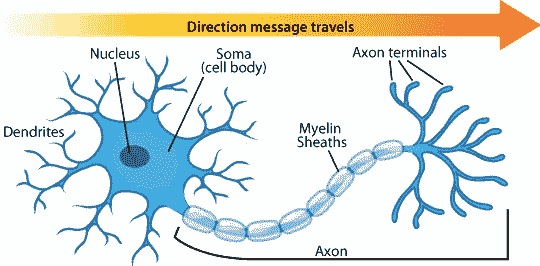

# 从虚构到现实:人工神经网络初学者指南

> 原文：<https://towardsdatascience.com/from-fiction-to-reality-a-beginners-guide-to-artificial-neural-networks-d0411777571b?source=collection_archive---------3----------------------->

(这篇文章和许多类似的文章来自我在 jasonroell.com 的个人博客。看看吧！)

对人工智能的兴趣正在达到新的高度。2016 年是人工智能初创公司和资金创下[纪录的一年，2017 年肯定会超过它，如果它还没有超过的话。根据 IDC 的数据，到 2020 年](https://www.cbinsights.com/blog/artificial-intelligence-startup-funding/)，认知系统和人工智能方面的支出将增长[超过 750%。从最小的初创公司到最大的公司，从智能手机应用程序到公共健康安全系统，对人工智能的兴趣和投资涵盖了商业和技术领域的所有领域。技术领域的大牌都在人工智能上投入巨资，同时将其融入商业模式，并越来越多地用于他们的产品中:虚拟助理(如 Siri)、计算机视觉、语音识别、语言翻译和许多其他应用。但是 AI 背后实际的 IT 是什么？简而言之:人工神经网络(ANN)。在这里，我们来看看它们是什么，它们是如何工作的，以及它们如何与激发它们的生物神经网络相关联。](https://www.axios.com/spending-on-ai-to-reach-46-billion-in-2020-2367282679.html)

# 定义人工神经网络

术语*人工神经网络*用于指代数学模型或模拟大脑神经网络中基本计算特征的实际程序。

# 神经元

来源:[http://www . robots . ox . AC . uk](http://www.robots.ox.ac.uk)

虽然生物神经元是极其复杂的细胞，但它们在输入和输出方面的基本计算性质相对简单。每个神经元有多个树突和一个轴突。神经元从其树突接收输入，并通过其轴突传递输出。输入和输出都采用电脉冲的形式。神经元将其输入相加，如果总电脉冲强度超过神经元的*触发阈值*，则神经元沿着其单个轴突触发新的脉冲。轴突进而沿着其分支突触分发信号，这些分支突触共同到达数千个相邻的神经元。

来源:[数据营](https://www.google.com/url?sa=i&rct=j&q=&esrc=s&source=images&cd=&cad=rja&uact=8&ved=0ahUKEwiyzvWI4LjUAhWb0YMKHXXbBlkQjB0IBg&url=https%3A%2F%2Fwww.datacamp.com%2Fcommunity%2Ftutorials%2Fdeep-learning-python&psig=AFQjCNGecj78y5vNjb9I8ViePXfYGULoNw&ust=1497372055586437)

神经元和晶体管之间有一些基本的相似之处。它们都是各自领域信息处理的基本单位；它们都有输入和输出；他们都和邻居有联系。然而，神经元和晶体管之间也有很大的不同。晶体管是简单的逻辑门，通常连接到不超过三个其他晶体管。相比之下，神经元是高度复杂的有机结构，与大约 10，000 个其他神经元相连。自然地，当涉及到执行需要数千个并行连接的认知壮举时，这种丰富的连接网络使神经元比晶体管具有巨大的优势。几十年来，工程师和开发人员一直在设想如何利用这一优势，让计算机和应用程序更像大脑一样运行。最后，他们的想法已经成为主流。虽然晶体管本身不会很快看起来像神经元，但它们运行的一些人工智能软件现在可以模仿基本的神经处理，而且只会越来越复杂。

# 神经元建模

*感知器*

来源:http://cs231n.github.io/neural-networks-1/

感知器，或*单层神经网络*，是最简单的神经计算模型，也是构建的理想起点。你可以把感知器想象成一个神经元。然而，感知器没有树突，而是简单地有输入: *x1，x2，x3，…，xN。*此外，感知器没有轴突，而是只有一个输出: *y = f(x)* 。

*重量*

感知器的每个输入(x1，x2，x3，…，xN)都有一个权重(w1，w2，w3，…，wN)。如果某个权重小于 1，就会削弱其输入。如果大于 1，就会放大。在稍微复杂一点但被广泛采用的感知器模型中，还有一个*输入 1* ，具有固定权重 *b* ，称为*偏差*，用作训练感知器的目标值。

*激活功能*

也被称为*传递函数，*激活函数决定了感知器输出的值。激活函数的最简单形式是某种类型的*阶跃函数*。它模仿生物神经元在达到其*触发阈值*时触发，如果总输入超过给定的阈值量，则输出 1，否则输出 0。然而，为了得到更真实的结果，需要使用一个非线性的激活函数。其中最常用的是 *sigmoid 函数:*

> **f(x)= 1 / (1+e^-x)**

这个基本公式有许多常用的变体。然而，所有的 sigmoid 函数在绘制时都会采用某种形式的 S 曲线。当输入为零时，输出也为零。然而，当输入值变为正值时，输出最初(大致)呈指数增长，但最终在水平渐近线表示的固定值处达到最大值。这个最大输出值反映了生物神经元可以产生的最大电脉冲强度。

# 添加隐藏层

在更复杂、更现实的神经模型中，至少有三层单元:输入层、输出层和一个或多个隐藏层。输入层从系统试图解释、理解、感知、学习、记忆、识别、翻译等的外部世界接收原始数据。相比之下，输出层传输网络最终处理后的响应。然而，位于输入和输出层之间的隐藏层是驱动最先进的人工神经网络的机器学习的关键。

大多数建模假设各层*完全连接*。在完全连接的神经网络中，一层中的所有单元都连接到其相邻层中的所有单元。

# 反向传播

你可以认为*反向传播*是神经网络中允许网络学习的过程。在反向传播过程中，网络处于不断训练、学习、调整和微调的过程中，直到它更接近预期的输出。反向传播通过使用*损失函数比较预期输出和实际输出进行优化。*结果是一个误差值，或成本，反向传播使用它来重新校准神经元之间的网络权重(以找到最相关的特征和输入，从而产生期望的输出)，通常是在众所周知的*梯度下降*优化算法的帮助下。如果存在隐藏层，那么该算法也重新校准所有隐藏连接的权重。每一轮重新校准后，系统再次运行。随着误差率变小，每一轮重新校准都变得更加精确。在反向传播网络的输出与预期输出紧密匹配之前，这个过程可能需要重复数千次。在这一点上，可以说网络是完全训练有素的。

# 考虑清楚

随着人工智能投资和开发达到新的高度，这对人工智能爱好者和有抱负的开发人员来说是一个激动人心的时刻。然而，重要的是首先要好好看看人工智能背后的 it:人工神经网络(ANN)。这些计算模型模拟了生物神经网络中的基本计算特征。神经元变成感知器或简单的*单元*；树突成为输入；轴突成为输出；电脉冲强度成为连接权重；神经元的触发强度函数成为单元的激活函数；一层层的神经元变成了一层层完全连接的单元。将所有这些放在一起，您可以按原样运行您完全训练好的前馈网络，或者您可以训练和优化您的反向传播网络以达到所需的值。很快，你就可以拥有你的第一个图像识别器，自然语言处理器，或者任何你想出来的新的人工智能应用程序。

感谢您的阅读，如果您喜欢这篇文章**，请分享这篇文章**，或者订阅我在 JasonRoell.com 的博客，或者在 LinkedIn 上关注我，我在那里发布了我认为普通程序员甚至技术爱好者都感兴趣的技术话题。

祝你有美好的一天，继续学习！