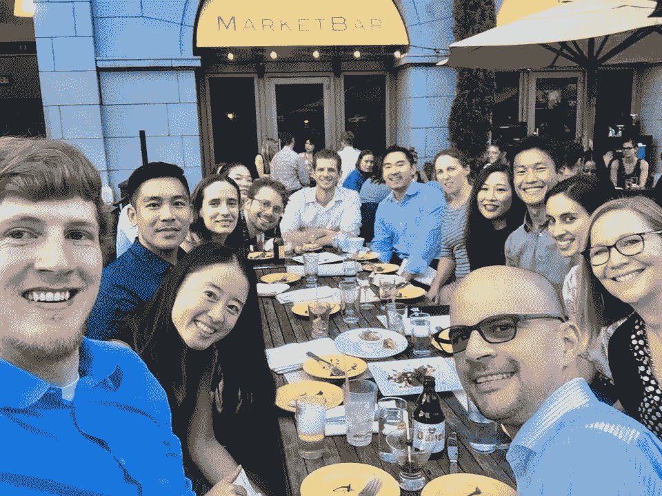

# 从病人到 Python:成为“数据科学家博士”的思考

> 原文：<https://towardsdatascience.com/from-patients-to-python-thoughts-on-becoming-a-dr-data-scientist-d01aa583b08a?source=collection_archive---------2----------------------->

“当我长大后，我想成为一名医生，因为我想让我的灵魂迷失在点击通知和写便条中。”

说没有孩子。

回到我的时代，我们住院医生用纸和笔写笔记。我们对图表的抱怨包括在特别长的 H+Ps 后严重的手抽筋，或者试图辨认难以辨认的鸡肉划痕。你可以想象当医院转向电子健康记录时我们的喜悦心情(EHR)。对我来说，在 AOL IM 和在线视频游戏中长大后，打字变得轻而易举，笔记也终于清晰可辨。

然后一些邪恶的想法开始给 EHR 增加“功能性”。

几年后，“功能性”导致了我们今天看到的 EHR 这个九头蛇怪物。你砍掉了一个脑袋，解决了一个订单输入故障，EHR 九头蛇又长出了三个脑袋，在它们的位置上弹出了通知窗口。

我正在为执业医师量身定做这个职位。如果那是你，那么我正在向唱诗班宣讲当前的医疗保健基础设施对我们的工作流程和患者护理的影响。然后，你会明白为什么我想在十年的医学训练后回到学校。如果我们要给系统带来改变，并说服我们的同事改变现状，那么我们最好知道我们到底在说什么。

**为什么是数据科学？**

也许是 2012 年《哈佛商业评论》[的标题](https://hbr.org/2012/10/data-scientist-the-sexiest-job-of-the-21st-century)，“数据科学家:21 世纪最性感的工作”唉，我后来才知道，不是所有的数据科学家都生来平等，也不是所有人都天生性感(尽管我们在努力)。数据科学不是固定的描述；这是一个连续体。它涵盖了从清理和组织数据、限制统计分析中的偏差等极其无趣的事情，到有效地向你的受众传达可操作的发现。熟悉从原始数据到有意义的结论的流程似乎比在游戏的后期追求一个直接的编程学位更有用。

选择加州大学伯克利分校的数据科学硕士( [MIDS](https://www.ischool.berkeley.edu/programs/mids) )项目并不难。虽然听起来不像他们会说话的头，但我真的，真的，真的很喜欢做 MIDS 的学生。它仍然是一个相对年轻的项目，课程不断发展，并且是在线的(除了沉浸周，在那里你可以与科技公司接触)，但它在一个国际知名的机构提供了坚实的课程和令人惊叹的师资，有大量的社交机会。不要告诉我不知道你的在线课程的同学——当你两年来每周都看到相同的人时，你会情不自禁地结交一些亲密的朋友(大声喊出 socal-4eva 和 da-mids slack channels！).

MIDS Immersion Week 2017, whereeveryone looks wierd in 3D

所以，对于所有执业医师来说，你应该如何对待这个进入科技世界的信念飞跃呢？

**现实一点。**

首先，你需要评估你的技能、金钱和时间。举个例子，我有一个博士后研究员基金，这个基金比我作为全职临床医生的正常收入低 30%。另一方面，我一个月有 3 周的研究时间。你可以尽情嫉妒，但请记住，当你开着玛莎拉蒂的时候，我还在吃拉面和鸡蛋(或者至少在为一辆玛莎拉蒂付款)。但我从未上过编码或计算机科学(CS)课程，我认为时间应该是最重要的。你的资助也是一个考虑因素，因为研究生课程并不便宜。当然，Coursera、Udacity 和 Khan Academy 的在线课程非常优秀，许多数据科学家都通过他们的教学促进了自己的职业发展。交几千拿个证好还是交几万拿个毕业证好？作为一名医疗科技行业的新人，我迫切需要在简历上获得街头信誉，所以我选择了后者。

**要谦虚。**

你不再是精英了。一点也不接近。当然，你挺过了医学院、住院医师和董事会，但是假设你真的没有任何计算机科学背景，当你还在疯狂地谷歌"[如何做矩阵乘法](https://en.wikipedia.org/wiki/Matrix_multiplication)"时，你知道比你小 15 岁的孩子将会讨论 LSTM 矩阵的维数我花了几个星期才明白，你可以通过点击 tab 键来自动完成命令行。老实说，我只是觉得我的教授打字非常非常快。不要让我开始参加 [Kaggle](https://www.kaggle.com/competitions) / [kegel](https://en.wikipedia.org/wiki/Kegel_exercise) 竞赛。最后，准备好 1:3 的家庭作业时间比例——你的同学花在家庭作业上的每一个小时，你都要花三倍的时间。虽然我不想说太多，但现在重温这一点还为时过早。

**坚持不懈。**

在我的第一个 Python 入门课程中，我认真考虑过放弃，如果我不是更讨厌放弃的话，我会放弃的。有时候，特别是当我住院和随叫随到的时候，抽出时间去上课或参与集体项目是如此的令人生畏，以至于我想蜷缩成一团哭出来。相反，我给自己倒了一杯威士忌，然后开始喝。这很像医学院，在那里学习不是短跑；这是一场马拉松。

**不要脸。**

对于医生来说，我们的招聘信息相当简单。事实证明，对于未来如何使用自己的数据科学技能，需要进行大量的自我反省。当我面对我在这个项目上投入的金钱和时间，却发现没有适合我描述的人的工作时，我没有预料到那段深深的、黑暗的绝望时期。我不符合数据科学家的特征，精通 SQL，对机器学习(ML)技术了如指掌。我也不是医学信息学家，他们对 EHR、SNOMED 和其他领域的所有东西都有深刻的理解。因此，在毕业前一年，我开始随机联系医疗技术行业的人或数据科学家。如果我在 techcrunch 上读到一篇关于他们的文章，或者看到一个转发的帖子引发了我的兴趣，我会联系他们。在我的巅峰时期，我每周发出 5-10 条信息，大约有 5%的回复，这导致了 30 分钟的电话聊天或谷歌聊天。在这样做了整整一年后，一些随机的信息让我收到了一些采访请求，其中包括一个关于我未来的家 Curai 的请求，我非常兴奋和感激几个月后就可以开始工作了。

**冒名顶替。**

进入硅谷是令人生畏的。在 SV 有很多聪明的人，他们似乎都互相认识并且穿着 [Allbirds](https://www.allbirds.com/) 。此外，每三个人中就有一个以几百万美元的价格卖掉了一家初创公司。当你遇到有工程学或计算机科学背景的了不起的医生时，我会想，“谁他妈的需要我？”我那了不起的丈夫改变了我的想法，他向我介绍了“骗子综合症”的概念，在这种情况下，我们不合理地低估了自己的表现和才能。查一下吧，它发生在我们最好的人身上。

**要骄傲。**

这是我从这次经历中得到的最重要的教训——有很多才华横溢的软件工程师和统计学家可以让我的基本逻辑回归和张量流图相形见绌。但当面对这样的疑问时，我想起了当初为什么要投身数据科学。我可以带来一些纯数据科学家做不到的东西。医疗保健系统需要像你和我这样的人，他们从临床战壕中幸存下来并理解 NLP 和 ML 概念，因为我们可以帮助将我们在医院或患者护理中看到的问题转化为工程师、统计学家、首席执行官、风投、UI 开发人员和其他重要决策者可以理解的术语。有了这些超能力，我们可以开始改变医疗保健系统，这是我们医生知道我们需要的。

祝你好运，希望胜率永远对你有利。