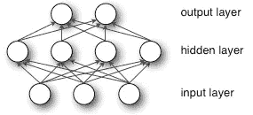
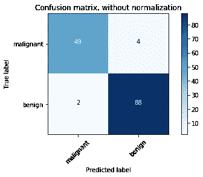
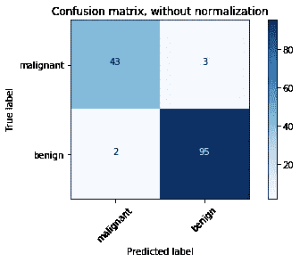

# 从 Scikit-学习到 TensorFlow:第 2 部分

> 原文：<https://towardsdatascience.com/from-scikit-learn-to-tensorflow-part-2-66c56985d6c7?source=collection_archive---------1----------------------->

从我们离开的地方继续，我们从 scikit-learn 开发人员的角度更深入地研究如何使用 TensorFlow 开发机器学习(ML)算法。如果您想知道迁移到 TensorFlow 的原因、动机，请阅读我之前的帖子，了解迁移到 TensorFlow 的[原因](https://medium.com/towards-data-science/from-scikit-learn-to-tensorflow-part-1-9ee0b96d4c85)和一个简单的分类程序，该程序强调了 scikit-learn 和 TensorFlow 开发的相似性。

在之前的文章中，我们比较了 scikit-learn 和 TensorFlow 中 fit 和 predict 范式的相似性。在这篇文章中，我想展示我们可以用 Scikit-learn 的数据处理和报告工具开发一个 TensorFlow 分类框架。这将提供一个很好的方法来交织这两个框架，从而得到一个简洁明了的框架。

# 利用机器学习

机器学习(ML)问题无处不在。然而，这里的问题是，一旦你开始用 ML 解决问题，每一个新问题看起来都像是 ML 问题，就像那句老话所说的:

> 如果你只有一把锤子，所有的东西看起来都像钉子

一个*理解* ML 的人和一个*使用* ML 的人有一个重要的区别，那就是，当**不是**使用 ML 来解决问题的时候。如果您可以通过简单的规则轻松地找到解决方案，那么您可能不需要使用 ML。例如，你不需要一个 ML 算法来预测所有的*自行车和汽车*是*交通方式*或者用正确的拼写替换常见的拼写错误的单词。

如果规则变得难以处理，并且如果有太多的参数来确定这样的规则，我们**将**需要 ML。例如，我们将要求 ML 预测明天的天气，因为它取决于许多因素，如季节、地点、其他因素，如[厄尔尼诺](https://www.livescience.com/3650-el-nino.html)，这使得编写规则很困难，而且往往不准确。我们可能需要 ML 的另一个例子是当数据变得人类不可能仔细阅读并找到模式时，这是 ML 似乎做得很好的一个领域。以电子邮件*垃圾邮件*或*火腿*为例，我们根据电子邮件中的文本(正文+主题)将电子邮件分类为垃圾邮件。如果垃圾邮件的模式是有限的，这个任务就很容易。然而，发送此类电子邮件的“王子”往往会找到新的方法让我们都变得“富有”，这使得我们有必要开发 ML 框架来帮助我们对抗垃圾邮件。

说了这么多，让我们来看看一个本来就很难发现规则的问题，以及一个获得高精度和召回率的棘手问题。

# 问题是

我们将使用[威斯康星州乳腺癌诊断数据](https://archive.ics.uci.edu/ml/datasets/Breast+Cancer+Wisconsin+(Diagnostic))检测癌症的存在。这个数据集是一个二元分类问题(恶性或良性)，有 569 个实例(数据点)，允许我们执行分类任务。

这篇文章中描述的所有代码都可以在我的 GitHub repo [这里](http://bit.ly/sklearn_tf_expts)获得。

# 数据处理-sci kit-learn

我们利用 Scikit-learn 的高效数据加载工具来获取我们的数据。乳腺癌数据集可在[这里](http://scikit-learn.org/stable/modules/generated/sklearn.datasets.load_breast_cancer.html)获得。Scikit-learn 允许我们加载的其他数据集的列表可以在[这里](http://scikit-learn.org/stable/datasets/index.html)找到。让我们加载数据集并查看数据的一些属性。

```
from sklearn.datasets import load_breast_cancer
cancer_data = load_breast_cancer()print("Number of instances in the dataset: %d" % len(cancer_data.target))>> Number of instances in the dataset: 569 
```

让我们讨论一下在训练数据之前，按原样使用数据与扩展功能的影响。缩放数据可以使特征标准化。这意味着数据以零为中心，并调整到标准偏差为 1。换句话说，我们将数据限制在[0，1]之间，而不改变数据的原始分布。这确保了分类器不会在大维度空间中搜索最优权重，而是将搜索空间限制在[0，1]之间。这种缩放对分类器的性能有很大的影响，这可以在下面的实验部分看到。我们尝试了两个实验，一个有特征缩放，另一个没有特征缩放。

# 实验一:按原样使用数据[D1]

我们按原样使用来自 SKLearn 的数据，使用内置的训练、测试分离器简单地加载变量

```
from sklearn.model_selection import train_test_split
in_train, in_test, out_train, out_test = train_test_split(cancer_data[‘data’], 
 cancer_data[‘target’])
```

# 实验二:缩放数据[D2]

对于第二个实验，我们使用 SKLearn 中可用的预处理功能来缩放数据。

```
from sklearn.preprocessing import StandardScaler
data_scaler = StandardScaler()# Fit train data 
data_scaler.fit(in_train)in_train = data_scaler.transform(in_train)
in_test = data_scaler.transform(in_test)
```

# 网络-张量流

我们设计了一个类似于我的[早期文章](https://medium.com/towards-data-science/from-scikit-learn-to-tensorflow-part-1-9ee0b96d4c85)的神经网络，以保持网络的简单方法，而不是理解数据预处理和过度拟合的影响。我们使用 TensorFlow 的 [DNNClassifier](https://www.tensorflow.org/api_docs/python/tf/contrib/learn/DNNClassifier) ，它在 TensorFlow 的 *contrib* 模块中可用。我们定义一个有三层的网络，每层有 *<个单元>* 个隐藏单元。在我们的实验中，我们首先通过改变输入的预处理方式来评估以下网络的性能，其中*单位=50* 。然后选择性能最佳的输入进行进一步实验，以了解过拟合，其中我们保持数据不变(在 D1 和 D2 中最好)并改变*单位*。网络结构描述如下:

```
feature_columns = tf.contrib.learn.infer_real_valued_columns_from_input(in_train)
classifier_tf = tf.contrib.learn.DNNClassifier(feature_columns=feature_columns, 
 hidden_units=[units, units, units], 
 n_classes=2)
classifier_tf.fit(in_train, out_train, steps=1000)
```

上面的网络所做的是定义一个全连接网络，也称为[多层感知器](http://deeplearning.net/tutorial/mlp.html)，其输入来自我们刚刚加载的数据。多层感知器可以描述如下:



Multi-layer Perceptron [source: deeplearning.net]

在我们的例子中，输入是从癌症数据集加载的数据，而输出是一个二进制值，表示输入是恶性的还是良性的。

# 实验三:隐藏单元的数量[H1]

这两个实验的目的是了解隐藏单元的数量对每层的影响，这也将提供对[过度拟合](http://machinelearningmastery.com/overfitting-and-underfitting-with-machine-learning-algorithms/)的洞察。

在这个实验中，我们首先选择 D1 或 D2(如上所述),然后改变网络每层的隐藏单元数量。这个实验的隐藏单元的数量保持在 H1=10。

# 实验四:隐藏单元的数量[H2]

我们用比 H1 更多的隐藏单元进行了第四次实验。这将能够适应数据中的更多变化，但是可能最终会记住数据，因此无法在测试数据上很好地执行。我们运行类似于上面 H1 的实验，然后运行 H2=50 的网络。

# 报告-sci kit-学习

我们使用 Scikit-learn 的报告功能来了解我们的分类器是如何执行的。我们使用分类报告和混淆矩阵来理解我们的分类器的表现。

[分类报告](http://scikit-learn.org/stable/modules/generated/sklearn.metrics.classification_report.html)生成一个矩阵，其中包含使用预测输出和实际输出值计算的关键指标。报告的指标是每个类别的精确度、召回率和 f1 分数，以及所有类别的平均值。

```
report = metrics.classification_report(out_test, predictions, 
 target_names=cancer_data.target_names)
print(report)
```

虽然分类报告提供了关键指标，但是[混淆矩阵](http://scikit-learn.org/stable/modules/generated/sklearn.metrics.confusion_matrix.html)提供了每个测试数据点所属的类别。混淆矩阵显示了分类器在对一个类别进行预测时有多强，同时显示了分类器在对其他类别下的数据进行分类时的弱点。

```
# Plotting the confusion matrix using matplotlib
%matplotlib inline
confusion = metrics.confusion_matrix(out_test, predictions)# Plot non-normalized confusion matrix
plt.figure()
plot_confusion_matrix(confusion, classes=cancer_data.target_names,
 title=’Confusion matrix, without normalization’)
```

分类报告描述了整体性能，而混淆矩阵提供了分类到每个类别下的数据点的准确数量。

# 结果

我们首先进行实验，以了解数据标准化是否有助于更好的分类。因此，我们选择 H1，在 D1 和 D2 进行实验。结果如下:

**与 H1+D1 的表演**

```
 precision    recall  f1-score   support

  malignant       0.94      0.88      0.91        51
     benign       0.94      0.97      0.95        92

avg / total       0.94      0.94      0.94       143Prediction Accuracy: 0.937063
```

**H1+D2 的表现**

```
 precision    recall  f1-score   support

  malignant       0.96      0.93      0.95        46
     benign       0.97      0.98      0.97        97

avg / total       0.96      0.97      0.96       143Prediction Accuracy: 0.965035
```

从我们的实验中可以明显看出，数据缩放在分类准确性方面提供了 **~3%** 的改进。这让我们选择 D2(数据与缩放)为我们的实验与 H2。

**H2+D2 的表现**

```
 precision    recall  f1-score   support

  malignant       0.96      0.92      0.94        53
     benign       0.96      0.98      0.97        90

avg / total       0.96      0.96      0.96       143Prediction Accuracy: 0.958042
```

# 技术性能分析

H1+D2 和 H2+D2 的性能指标没有提供多少关于分类器在数据点数量方面在其他类别中表现如何的洞察力。这就是混淆矩阵为进一步分析提供更好的图像的地方。



Confusion matrix for H2 + D2



Confusion matrix for H1 + D2

上述矩阵更清楚地显示了 H1 和 H2 分类器的性能差异。尽管 H2 的隐藏单元数量是 H1 的五倍，但它在测试数据上的表现却不如 H1。混淆矩阵提供了每个类别下被错误分类的点数的准确分布。

# 结论

在这篇文章中，我们看到了如何使用 Scikit-learn 和 TensorFlow 来执行不同的分类实验，并查看每个分类器的性能。我们还对数据预处理和网络参数进行了简单的实验，以理解不同的概念。

这篇文章中描述的所有代码都可以在我的 GitHub repo [这里](http://bit.ly/sklearn_tf_expts)找到。

让我知道你希望我在下一篇文章中讨论什么话题，请在下面评论。我在推特上，如果你想在那里和我联系的话！