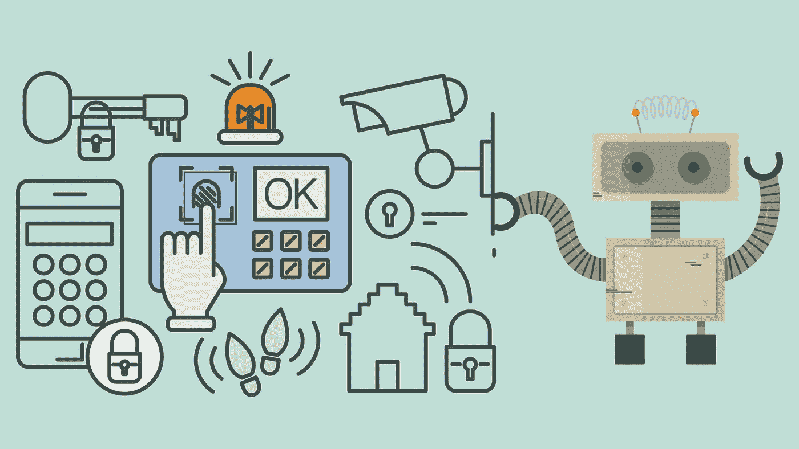
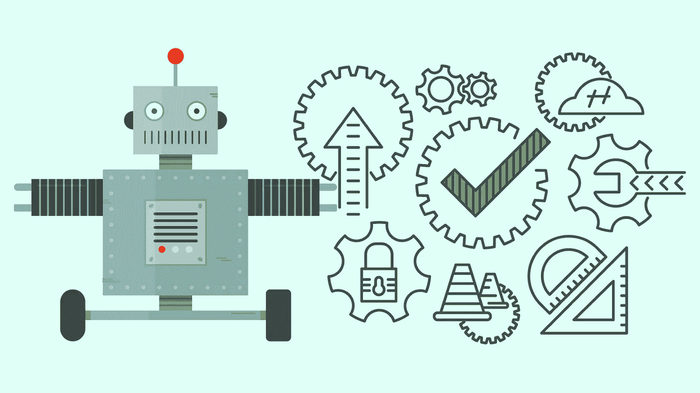
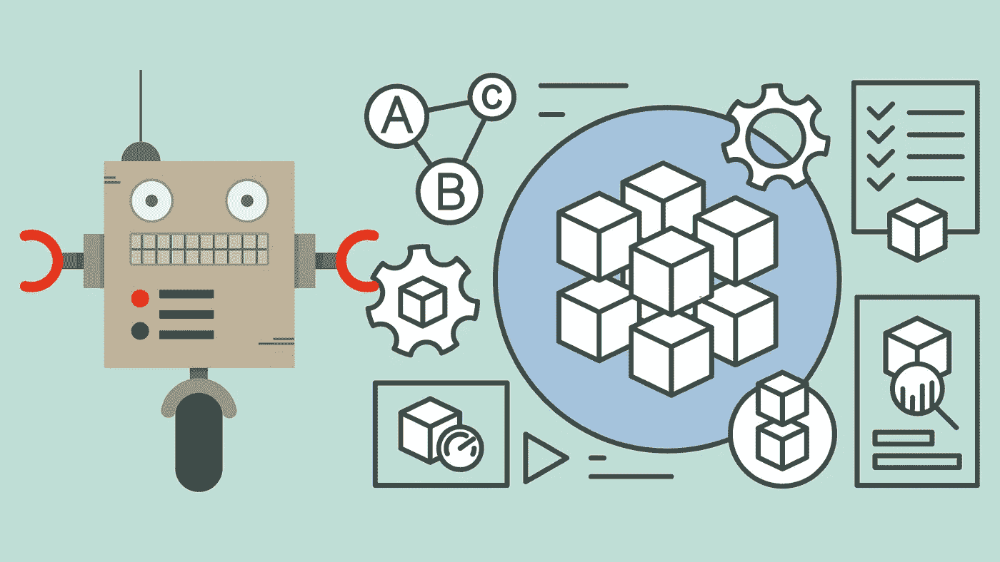
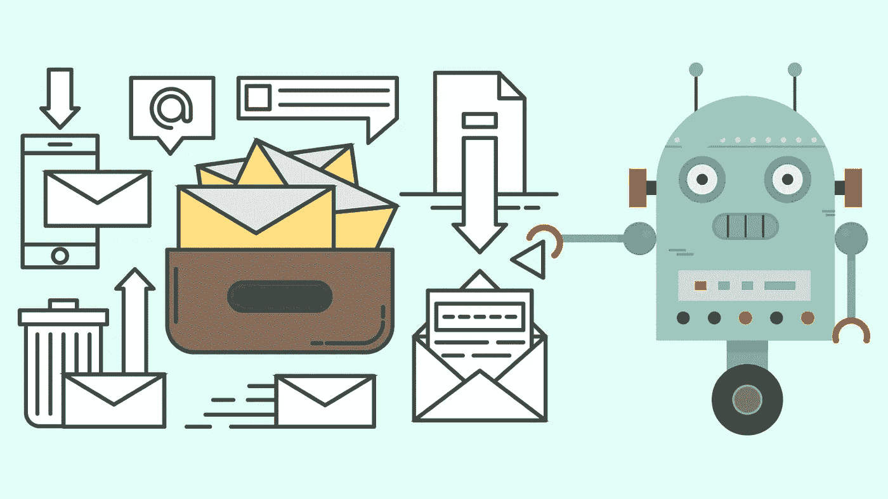

# 前沿人工智能技术正以前所未有的方式影响着金融科技的业务运营！

> 原文：<https://towardsdatascience.com/frontier-ai-technologies-that-are-impacting-fintech-business-operations-like-never-before-99737daf197f?source=collection_archive---------8----------------------->

金融公司在采用新技术和创新方面总是领先于其他公司！难怪这些了解未来的公司体验到了最好的人工智能——从欺诈检测到风险管理，甚至预测不良贷款。

这一部分的挑战也是独特的，变化正以极快的速度到来。他们面临着数据量、信息量、复杂性和碎片化的问题。即便如此，机器学习、自然语言处理、大数据和分析、数据挖掘、自动化和物联网(IoT)等人工智能技术正在取得重大成果。

以下是人工智能技术为金融科技创造前所未有的商业运营改进的主要领域。关注领先的新兴公司以及这些推动他们走向积极业务成果的强大技术是值得的。

# 1.欺诈检测:

欺诈检测可能是人工智能领域最大的一块。这也是最重要的，预计到 2020 年将成为 3B 的一个美元市场。

为了理解金融科技领域欺诈的含义，让我们考虑一个常见的例子。随着越来越多的人在日常交易中使用网上银行，他们将会创造成千上万的印象和数据点。通过几个设备和接触点，这些服务将被不断地访问。银行必须建立非凡的灵活性，及时快速地识别和定位可疑行为。

欺诈检测解决方案依靠大规模数据挖掘和数据分析技术来得出答案。该系统基于强大的神经网络算法，能够系统地处理相当大的数据集，同时识别和标记不一致。它们非常敏感，因此即使是微小的不一致和违规也能被准确地发现。

每笔交易都要扫描数千个数据点，模糊查找被用来“发现”相关的模式、异常和巧合；无论是对用户，还是对特定交易，甚至是对一段时间内发生的类似交易。与过去更加手动和耗时的方法相比，使用人工智能进行几微秒的欺诈检测是一个飞跃！

# 2.生物认证和令牌化:

认证和授权是我们这个高度数字化、基于知识的世界的重要方面。在这里，访问是由可验证的凭证定义的入口。

身份验证和授权之所以重要，是因为一旦提供了访问权限，就很大程度上无法收回。或者，一旦未经授权的访问被允许，就会产生灾难性的后果。

生物认证和令牌化使用人工智能技术来创建更强的系统。例如，利用语音识别和自然语言处理的设备通过其声纹来识别和授权人员。使用物联网并将使用心电图与智能系统集成的设备，其中两个系统相互通信并传递信息，唯一目的是识别某人。此外，与眼白中的静脉图案匹配的设备，或用于完美识别的“眼纹”。

令牌化也有几个用例，其中令牌被用作一种方便交易的手段。卡的详细信息、姓名和账号等敏感个人信息被分离出来，单独存储在另一个位置。在欺诈者破解这个令牌的情况下，他/她将无法使用它或识别信息所属的人。

# 3.自动化:

自动化在整个金融科技行业得到了广泛应用。当然，有几个明显的优势。但是，让组织能够应对不断增长的数据量的冲击是一个主要问题。

此外，还通过优化、改进客户服务等方式大幅降低了成本、减少了冗余、降低了风险、提高了预测能力、敏捷性和响应能力。

当自动化与机器学习和深度学习在预测分析和报告、营销和活动管理、语音识别和响应、数据输入、客户关系管理(CRM)以及机器人流程自动化(RPA)等功能中相结合时，优势会进一步扩大。

一家名为“WorkFusion”的公司正在彻底改变这一领域。与金融公司合作，提供人工智能支持的优势和双赢。例如，[本案例研究描述了 WorkFusion SPA 如何通过 RPA、AI 和人员的独特组合，帮助 Six Financial 应对其不断增长的数据处理挑战](http://info.workfusion.com/customer-automation-case-study-six-financial?utm_source=blog&utm_medium=other&utm_name=lakshmi-kanchi&utm_term=frontier-ai-technologies-that-are-impacting-fintech-business-operations-like-never-before!)。

# 4.区块链:

这项创新的新技术有潜力改变商业运作的方式。产生共享信任并确保数据完整性。从零售银行到保险和财富管理，甚至投资银行，各种规模和类型的金融服务机构都将从中受益。

关键在于这项技术是如何工作的——它从分布式基础设施开始，在这个基础设施中，关于交易的信息被安全地共享。然后，一个用户网络支持和验证每一个独特的交易，确认其准确性。在最后阶段，记录被透明地添加到每个人都可以访问的区块链中。

区块链不是天生的 AI 技术。但人工智能可以赋予它更多的力量。例如，在能源密集型的开采过程中，人工智能算法可以通过优化和平衡来降低消耗。联邦学习系统和数据分片技术可以提高效率，增强快速增长的区块链的可扩展性。区块链可以抵御黑客攻击，但是底层和应用程序更容易受到攻击。这可以通过机器学习来改变，人工智能算法可以帮助安全的应用程序部署。

这项技术用途广泛。它用于资产创建(例如，在加密货币的生成中)、资产转移(例如，在艺术品交易商和画廊多次买卖艺术品时保留记录)和数据核对(例如，钻石行业用于标记“血钻”或假货)。)

# 5.实时警报和通知:

随着规范分析的出现，分析系统可以规定未来的路径，世界不再停滞不前。我们在快速前进。

客户期望通过任何设备和渠道获得准确的实时警报和通知，这是目前行业的基准。很难想象今天的一笔交易会在月底才生成一份对账单。标准变化很快。

大数据挖掘、物联网、机器学习和更多这样的人工智能技术正在为更快、更敏捷的系统创造可能性。不断发展的组织正在利用这些优势！