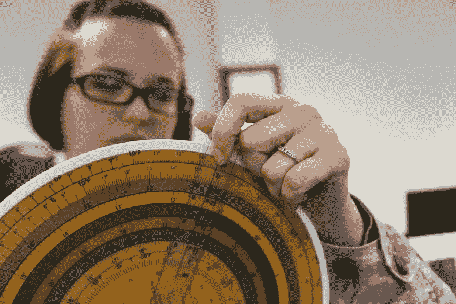

# 对 DataViz 工具的不满

> 原文：<https://towardsdatascience.com/frustrations-with-dataviz-tools-de27cbcd2ff1?source=collection_archive---------8----------------------->

Slide rule (U.S. Air Force photo by Airman 1st Class Keenan Berry)

我对目前可用于数据可视化工作的工具范围感到沮丧。它们正在迅速扩散，但经常试图解决完全相同的问题，并从相似的角度解决它们。一些用例确实被很好地覆盖了，但是很多没有——除非我错了；如果是这样，请告诉我我遗漏了什么产品！

# 几个被很好覆盖的案例:

**使用 R / Python 进行科学分析/发布**

统计分析和数据争论是核心。图表可以一个接一个地制作，非常简单，通常看起来并不美观。(你可以把它们发表在科学杂志或你的数据博客上，但不能发表在其他地方。)

*我大概有 25%的时间在这里工作，直到……*

**信息海报设计:R/其他+插画**

如果你想要复杂的布局，你需要布局软件，通常是 Illustrator。多个图可以很容易地排列在一起，具有不同的层次和共性。视觉吸引力和可视性很高，完全集成了排版、插图和其他页面设计元素。

我经常从事这方面的工作，工具也很不错。我只是和 Illustrator 有时在本质上更技术性。

**简单的交互式图表/仪表盘:大量在线产品**

使用 Tableau 或 Plotly 或任何其他数量的服务，您可以制作简单、清晰的图表。它们可以被组合到仪表板中，并且至少是最低限度的交互(悬停状态，打开/关闭变量，也许是一些切片)。

**通过 D3 高度定制的互动 Vizzes**

从头开始建造你想要的任何东西。非常适合在线。学习曲线高。

*这条路我还没走过。Javascript 对我来说是一种非常没有吸引力的语言。交互性也不是那么重要。*

# 少了什么

**用于基本打印就绪图形的高度可定制工具**

“可定制”和“基本”似乎是对立的，但它们不应该是对立的。我愿意做(大量)前期工作来定义一种风格，然后输入数据，以非常快地获得该风格的结果。这是因为我经常需要为打印文档制作一些基本的图表——我也不是指 Word 文档，而是真实的、设计好的跨页。所以我需要严格遵守预先定义的布局、排版规则等的图表。

尽管有上百万种工具可以制作简单的图表，但没有一种工具可以充分定制。交互式 viz 工具并不适合静态显示，R 中的主要库也不能被正确控制。这很糟糕，但我看到的最好的工具是 Illustrator 的内置图表，可以最小化定制(这些可以追溯到十多年前！).

*理想的解决方案:Adobe 为图表制作了一个创意套件应用程序。*

**一个 DataViz 迷你语言**

我不想从线条构建图表(太详细了！)但我也不想要一个试图自动为我制作饼状图的系统(太抽象了！).这种语言的目的应该是通过利用算法思维来促进创新设计；所以需要一些技能和劳动力，但你也不一定要成为 web 开发人员。

我认为我们需要一种真正专注于数据的语法，即去掉所有与网络相关的东西；这是高级的，是为数据迭代而设计的(尽管我通常很喜欢函数式语言)。

现有的解决方案都是推某种解决方案和思考。也许这只是我的背景，但这些通常似乎不太正确。例如，在 R 的 ggplot 中有“图形的语法”，或“格子”显示，这吸引了统计学家们；或者 D3 和它的各种库，这对于专注于 responsive/DOM/等等的 javascript 人来说是有意义的。我认为图形更像一个设计师，也许是一个老式的计算机爱好者。

换句话说，为什么我们要从数据中的属性(比如范围/域)或者从盒子中构建东西？这在技术上是有道理的。但是它对人类探索数据可视化的可能性有意义吗？我想多想想:

*   **等级和布局**，以及一些标准化的选择
*   **以及计算机将如何*得出*值；**也就是说，数据是如何通过计算机将采取的过程映射到像素/矢量上的

我认为海龟图形可以成为一个灵感:因为一只海龟画一条线或点很像人类的手，以特定和明显的顺序。对数据进行循环可以直观地构建出在绘制时以特定方式变化的模式。

简而言之，我们有很好的工具给那些完全不想成为技术人员的人，以及那些想最大限度地成为技术人员的人。我们有很好的互动和在线展示工具。但是据我所知，我们没有好的工具，将算法思维和设计焦点融合在一起；这既适用于印刷，也适用于网络。

如果有的话我会买的！