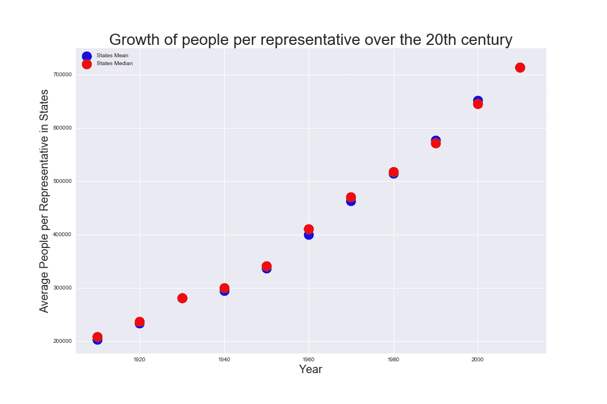
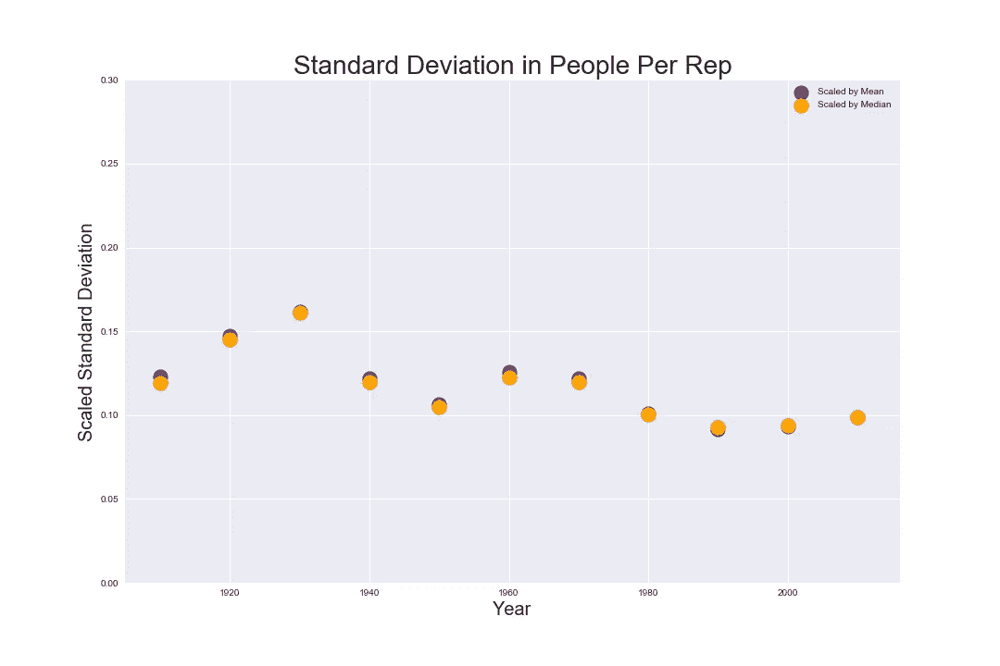
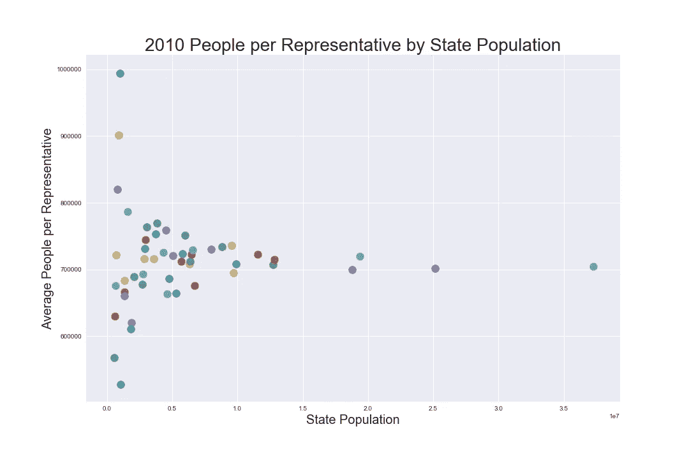

# 从普查数据中观察到的情况

> 原文：<https://towardsdatascience.com/fun-with-census-data-2643ecd266c4?source=collection_archive---------5----------------------->

有一段时间，我想尝试用 Python 做一些基本的数据分析和可视化。所以，我从 2010 年美国人口普查中得到了一些文件。我处理的数据中有一些关于每个州的有趣事实，从 1910 年开始每十年一次(甚至是那些还没有加入联邦的州！).所以我提出了一些问题，然后开始工作。

注意:我在一个 Jupyter 笔记本上为此工作，你可以在这里查看。

# 群体大小

**问题 1** :是什么让一个州的人口在十年间不断增长？([1]).

一个州今年的规模会影响下一年的增长吗？这次我可以选择任何一种方式。这种积极的关系需要“社会证明”——也许人们想搬到像纽约和加利福尼亚这样的大州，那里有很多令人兴奋的事情发生。另一方面，也许人们想搬到更小的州，那里生活更安静，土地更便宜。

我没想到的是，几乎没有任何关系。对于数据集中的每一年，我计算了一年中各州的人口规模(该州的总人口数)与其未来十年人口增长百分比之间的相关性。

两者之间的相关性有时为正，有时为负，相关系数([2])的绝对值从未超过 0.25。很明显，没有任何关系。

即使是 1980 年，也显示了所有测量年份中最强的相关性，其相关性的 p 值为 p≈0.054，足以拒绝在 0.05 的显著性水平上存在相关性的假设。

# 人口密度

问题 1(修改后):也许我们需要提出一个更严格的问题。如果我们测量人口密度(即每平方英里的人口数量)而不是人口增长率(T10 ),我为正反两种情况提出的因素可能更有意义。如果你住在中央谷，像加利福尼亚这样的大州并不令人兴奋——你需要住在大城市之一，那里有大量的人住得很近。即使你住在一个小州，你也需要更少的邻居来确保更便宜的土地和更安静的生活。

那么人口密度呢？一个州每平方英里的人口数量影响其人口增长吗？嗯，有时候。如果我们像以前一样做同样的事情——计算一年内一个州的人口密度与其未来十年人口增长之间的相关性，这就是我们得到的结果。

我们可能会变得更暖和一点。自 1960 年以来，一直存在微弱的负相关性，这意味着致密态比稀疏态增长得更慢。然而有趣的是，相关性最大的十年显示出相反的情况。1930-1940 年的人口增长是怎么回事，这期间的相关性是 r≈0.436，p 值是 p≈0.001？简而言之，沙尘暴。这绝对是一次大规模的州际人口迁移，是美国历史上最重大的事件之一。在沙尘暴期间，超过 350 万人从平原州移民到西部。事实上，捕虾最快的前五个州都来自大平原(达科他州、内布拉斯加州、堪萨斯州和俄克拉荷马州)。([3]).

但这是另一篇文章的内容。

# 众议院分配

每次人口普查都决定了每个州在美国众议院的席位。这是通过一个叫做*分配*的过程，实质上是给每个州一个免费的席位，然后使用一个法律规定的公式来分配第 51 个席位，然后是第 52 个，以此类推，直到第 435 个。([4]).

自 1930 年以来，美国人口增加了一倍多，而众议院拥有 435 个席位，因此每 10 年每名代表的人数都在增加。

很明显，随着时间的推移，个人的投票权被稀释了。此外，众所周知[议院的代表性不平等](https://www.brookings.edu/blog/fixgov/2017/02/22/misrepresentation-in-the-house/)，部分原因是不公正的选区划分。这让我不禁要问，众议院中的不平等代表性是否也达到了历史最高水平。

**问题 2:现在州与州之间的众议院代表差距有多大？与前十年相比如何？**

为了衡量这一点，我用每个代表人数的标准差来衡量每十年的“分布”。一个完全公平的年份的标准差应该是 0。

事实证明，用这种标准衡量，近代历史上的情况比过去好得多。这并不奇怪，因为不公正的选区划分已经存在了几个世纪。但是我不会因此得出任何结论，因为这并不严格，最好是逐区检查差异，而不是以州为单位。

**问题 3:就每个代表的人数而言，哪个州最好，哪个州最差？这个问题的答案可能有点令人惊讶。作为一名加利福尼亚人，我的第一个猜测是像加利福尼亚和纽约这样的大州是最差的代表。但事实证明完全不是这样。人口众多的州正好位于中间。每个代表的最高和最低值的州都相对较小。**

# 结论

这比我想象的要困难得多，但也很有趣。在以后的文章中，我想在更细粒度的层次上研究数据。例如，挖掘国会选区的数据会很有趣，而且可能会得出与我在这里发现的不同的分摊结论。

感谢阅读。请提出任何建议、批评或想法！

# 脚注

1.  在这里，各州的人口增长是以过去十年的百分比来衡量的。因此，如果德克萨斯州在 1930 年有 1000 名居民，在 1940 年有 1500 名居民，那么其 1940 年的人口变化将是 0.5。
2.  我用的是[皮尔森的 r](https://en.wikipedia.org/wiki/Pearson_correlation_coefficient) 。
3.  来源:https://en.wikipedia.org/wiki/Dust_Bowl[。](https://en.wikipedia.org/wiki/Dust_Bowl)
4.  这些被称为[优先级值](https://www.census.gov/prod/cen2010/briefs/c2010br-08.pdf)，它们本身就有一个有趣的故事