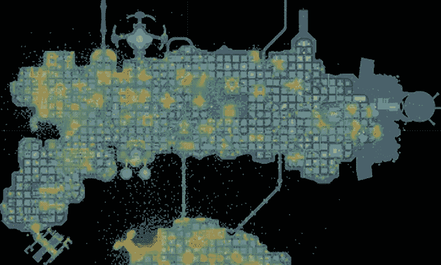

# 数据科学的功能

> 原文：<https://towardsdatascience.com/functions-of-data-science-4afd5341a659?source=collection_archive---------10----------------------->

Data Visualization, a key skill of the For Product function

数据科学是一个宽泛的术语，包括组织内许多不同职能的工作角色。这篇文章介绍了一种在数据科学领域对不同工作职能进行分类的方法，并确定了这些专业的有用技能。

以下是我在职业生涯中体验到的数据科学的四大关键职能，这些职能通常与职位联系在一起:

*   对于产品(推理科学家)
*   作为产品(应用科学家)
*   运营部(系统科学家)
*   As 操作(ML 工程师)

我用两个维度来划分工作职能:

*   **"For" vs "As":** 数据科学家是支持正在构建某种东西(For)的团队，还是支持他们自己构建某种东西(As)？
*   **产品与运营:**数据科学家构建的是面向客户的东西(产品)还是对业务运营至关重要的后端系统(运营)？

第一个维度的关键区别在于数据科学团队是否在构建数据产品。如果一个数据科学团队拥有系统的一部分，那么这个团队就负责实现发现。如果团队与另一个执行调查结果实施的团队合作，那么数据科学就是一个支持角色。第二个维度区分数据科学团队的成果是否对客户直接可见。例如，网飞推荐系统是面向客户的，因为它影响向用户显示的标题和[作品](https://medium.com/netflix-techblog/artwork-personalization-c589f074ad76)，而欺诈检测系统可能对运行在线游戏至关重要，但对用户不可见。

我自己曾在许多不同的职能部门工作过:在 Twitch，我被安插在移动产品团队，负责产品分析(针对产品)，在 Twitch，我负责应用科学，专注于构建面向客户的数据产品(作为产品)，在 Twitch，我监督一名科学家，专注于预测平台的运营指标，如页面加载时间(针对运营)。我还没有在 As 运营部门工作过，但我所知道的最常见的例子是 Quantcast 和 Pinterest 等公司使用的广告竞价系统。

**产品的数据科学** 这是我在游戏行业经历过的最常见的数据科学角色类别。在 Daybreak Games、EA 和 Twitch，许多数据科学家的角色侧重于分析，为产品经理或游戏制作人提供支持。许多数据科学团队渴望构建数据产品，但是没有工具和基础设施来拥有自己的数据产品。我也见过这种角色被称为推理数据科学家或决策科学家。

该角色的主要职责之一是为团队提供见解，然后用于改进产品和公司路线图。这可以包括围绕战略的高层次分析，或者关于特定产品性能的更多战术分析。出色地履行这一职责通常需要以下技能:

*   **探索性分析:**这涉及到使用脚本和 SQL 来探索和总结数据集，并回答以下问题:我们能否确定哪些行为对于监控产品健康状况很重要？我们能否确定哪些因素与此行为相关？
*   **实验:**如果产品团队做出改变，你如何评估影响？这可能包括 A/B 测试和[分阶段推出](https://blog.twitch.tv/a-b-testing-using-googles-staged-rollouts-ea860727f8b2)。
*   **影响:**如果数据科学团队不断地处理关于数据的特别问题，而不是拥有一些自主性来寻找有用的见解，那么这个角色就更像是一个商业智能功能。担任这一角色的成功数据科学家能够获得团队的认可，将他们的发现应用到产品中。

拥有强大的书面和口头交流能力对于所有这些数据科学功能也很重要。这对产品支持功能特别有用，可以影响其他团队。

**数据科学作为产品** 这是另一个专注于改进产品的数据科学角色，但与之前职能的区别在于，其中一个关键产出是支持面向客户产品的数据产品。在 Twitch，应用科学团队符合这一功能，并使用机器学习来构建产品，如用于军团联盟的[冠军探测器](https://www.pcgamer.com/twitch-now-lets-you-sort-league-of-legends-streamers-by-rank-and-champion/)。

该职能的职位可能包括应用科学家或机器学习工程师。这也是一个经常向工程经理而不是分析或科学经理汇报的角色。以下是一些对这类角色有用的技能:

*   **机器学习:**虽然预测建模是所有数据科学功能的先决条件，但这一角色需要更多处理不同类型数据源(包括文本、图像和视频)的实践经验。还需要了解如何扩展这些预测模型。
*   **原型制作:**在分配大部分资源来构建系统之前，能够构建数据产品的 MVP 是很有用的。
*   **软件工程:**构建这种规模的数据产品需要能够部署在分布式环境中的系统编程语言的知识。数据产品的代码需要健壮且可维护。

数据产品通常是实时系统，该职能部门的数据科学家需要能够扩展预测模型的知识。

**运营数据科学** 我在 Twitch 的时候，这个功能还处于起步阶段。该职位的主要职责是了解不同的因素如何影响我们产品的运营指标，如页面加载时间。我们将这个角色称为系统科学家，因为它需要对我们的基础设施和可能影响各种系统度量的各种因素建立深刻的理解。

这一特殊角色的重点是系统性能下降的根本原因分析，但该职能更广泛的重点是建立模型，以更好地了解各种内部和外部因素如何影响系统。它需要以下技能:

*   **系统基础设施:**理解不同的因素如何影响运营指标需要对用于构建产品的系统和基础设施有深入的了解。例如，跟踪页面负载需要了解 cdn、缓存和 API 调用依赖关系。
*   **预测:**为了检测指标中的异常，有必要建立基线和预期行为。预测可以用来模拟影响系统行为的因素。
*   **警报:**这个角色可能还负责确定何时向其他团队发出异常系统行为的警报。重要的是能够设置何时提醒团队的阈值，而不会有太多的误报。

系统科学是一个较新的工作职能，比其他数据科学角色需要更多的基础设施知识。

**数据科学作为运营** 这是一个数据科学角色，通常是工程团队的一部分，目标是构建运营业务所需的数据产品，而不是面向客户的产品。构建自动广告竞价系统是这种角色的一个例子，构建欺诈检测系统是另一个例子。与数据科学产品组的主要区别在于，这些系统往往更加自动化。例如，由于数据的规模和实时要求，广告竞价系统可以使用相同的系统进行培训和生产，而面向客户的数据产品通常可以在较小的规模上进行原型化和迭代。

以下是一些对此功能有用的技巧:

*   **分布式系统:**该功能需要构建分布式系统的知识，这可能包括 Spark 或其他用于扩展流程的云技术。在意外收获，我们使用云[数据流](/productizing-ml-models-with-dataflow-99a224ce9f19)。
*   **在线学习:**这些系统的实时要求通常意味着批量学习过程是不合适的，相反，需要利用在线方法来更新模型。
*   **DevOps:** 构建运行业务功能的数据产品意味着维护这些系统，而这是 DevOps 责任最大的数据科学角色。

这是一个我没有经验的功能，但我认为它是数据科学中最有价值的角色之一。

**结论** 数据科学术语可能执行各种不同的功能。为团队制定一个清晰的章程是很重要的，这样你就能够恰当地雇佣员工并支持组织的需求。这些职能需要不同的技能组合，数据科学家的首选职能可能会在职业生涯中发生变化。

[本·韦伯](https://www.linkedin.com/in/ben-weber-3b87482/)是[意外收获数据](https://angel.co/windfall-data)的首席数据科学家，我们的任务是确定世界上每个家庭的净资产。我们目前正在[招聘](https://angel.co/windfall-data/jobs/335043-data-scientist)产品数据科学和产品数据科学职能部门的角色。