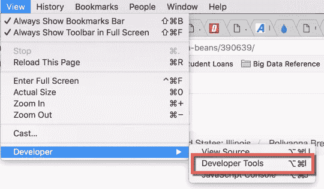
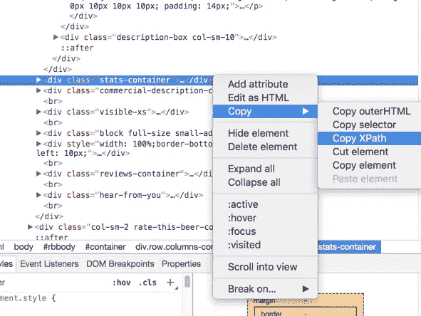
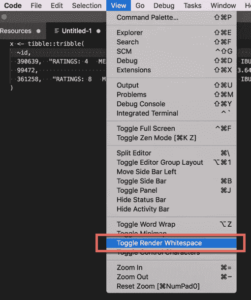
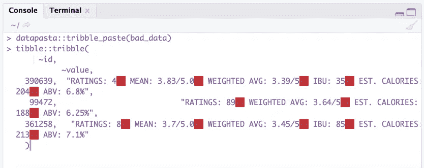

# R 和 rvest 函数:外行指南

> 原文：<https://towardsdatascience.com/functions-with-r-and-rvest-a-laymens-guide-acda42325a77?source=collection_archive---------2----------------------->


如果有一个主题在使用 R 后很难理解，那就是函数。从编写函数到学习如何调试函数，一切都没有明确的指导。此外，已经出现了一些旨在帮助完成这项任务的工具，但是在解决您的问题时，似乎很难理解如何利用这些工具。这篇博客旨在让您了解 R 中有哪些函数，如何在任务中使用它们，并在 RStudio 中轻松调试它们，以诊断到底发生了什么。

最近，我有机会去苹果酒节，学习和尝试新的苹果酒。我不是苹果酒的最大粉丝，所以很自然地，我选择尝试几乎所有可用的啤酒，并想比较我品尝的味道。如果有人问我的味蕾，我会说我喜欢尚迪和小麦啤酒。我尝过的啤酒都不太合我的口味，但不知何故，味道比我预期的要好。如果能有一种方法来比较这两种啤酒，那肯定会很有帮助。我一直想知道为什么我喜欢美国淡啤酒，甚至是一桶啤酒。使用 rvest，我们可以很容易地从 [RateBeer](https://www.ratebeer.com/) 中获取每种啤酒的必要数据，以帮助相互比较，确定它们可能有哪些相似之处。

# **但是首先…一些我们需要处理的事情**

在我们开始之前，需要建立一些基本规则，这样你就可以让自己走上正确的轨道，完成手头的任务。一开始，通过编程与网络互动很容易让人觉得是未知的领域，就像喝第一杯啤酒一样:我在哪里，我怎么会在这里？但是，不要害怕，因为这个博客将为你提供资源，使你不会迷失在这个深渊中。

# **工具时间:**

为了从这篇博客中获得最大的价值，你需要以下工具:

*   RStudio
*   Visual Studio 代码
*   基特克拉肯

你可能会问，我们为什么需要这些？用正确的工具武装自己有时是成功的一半:如果你没有解决问题的必要工具，很难弄清楚如何理解手头的问题。除了这些工具，我还强烈建议你考虑使用沙盒环境，使用 Docker 或 RStudio Cloud，因为 R 在不同操作系统上的编码存在一些问题。如果您想了解更多关于如何为 R 创建自己的自定义沙盒环境的信息，您可以查看这个博客了解更多信息，或者查看 RStudio Cloud。

[https://medium . com/@ peterjgensler/creating-sandbox-environments-for-r-with-docker-def 54e 3491 a 3](https://medium.com/@peterjgensler/creating-sandbox-environments-for-r-with-docker-def54e3491a3)

https://rstudio.cloud/

概括地说，有两种获取 web 数据的通用方法:

*   API 的——API 被称为应用编程接口
*   网络抓取——更像是一种暴力的方法

好吧，那么 API 到底是什么呢？我应该用它吗？

> API 是一个信使，它接收请求，然后向您返回响应

API 已经设置好了，因此您可以轻松地与服务进行交互。假设我想要获取明尼阿波利斯的火灾数据。

[](https://data.world/minneapolismn/8baeeaebfd9d489d9ee6c9ae0fed3988-0) [## 明尼阿波利斯确认 2013 年火灾-数据集

### 有关此数据的问题，请联系

数据世界](https://data.world/minneapolismn/8baeeaebfd9d489d9ee6c9ae0fed3988-0) 

如果我愿意，我可以通过 data.world 的 API 轻松获取这些数据:

 [## API 文档

### 为所有 OAS (Swagger)和 RAML 规范托管 API 文档。由 Stoplight.io 提供动力。文档、模拟、测试…

apidocs.data.world](https://apidocs.data.world/v0/data-world-for-developers) 

另一方面，网络抓取是一种更加暴力的获取网络数据的方式。并不是所有的网站都有 API 可以使用，这意味着可能需要搜索才能找到。我们如何检查我们是否能抓取一个网页？简单，检查 robots.txt 文件。有关 robots.txt 文件用途的更多信息，请观看此视频:

对于我们的例子，我们使用的是网站 RateBeer，所以让我们看看他们的文件，看看是否有限制:

【https://www.ratebeer.com/robots.txt 

```
User-agent: Mediapartners-Google
Disallow:

User-agent: *
Allow: /
```

查看 RateBeer 的 robots.txt 文件，我们可以看到它们允许抓取，因为它们不允许任何东西，所以我们可以继续。

吃个三明治，喝杯咖啡，然后去看下面列出的 RStudio 的网络研讨会。RStudio 有两个很棒的网络研讨会，分别涉及 API 和深度网络搜集，我们希望第 2 部分:

[](https://www.rstudio.com/resources/webinars/extracting-data-from-the-web-part-2/) [## 从 web 部件 2 中提取数据

### 从 web 中提取数据第 2 部分下载资料描述互联网是一个数据宝库，如果你…

www.rstudio.com](https://www.rstudio.com/resources/webinars/extracting-data-from-the-web-part-2/) 

网上研讨会的幻灯片可在此处找到:

[https://github . com/r studio/webinars/blob/master/32-Web-Scraping/02-Web-Scraping . pdf](https://github.com/rstudio/webinars/blob/master/32-Web-Scraping/02-Web-Scraping.pdf)

在我看了上面列出的网上研讨会后，我对所有这些话题都很迷茫，这是理所当然的。学习用于设计网站的网络技术不是一件容易的事情，在刚开始的时候会非常困难。如果您想了解更多资源，我强烈建议您观看《用户 2016》中的这些非常相似的幻灯片，并做好准备:

[https://github . com/ropensci/user 2016-tutorial/blob/master/03-scraping-data-without-an-API . pdf](https://github.com/ropensci/user2016-tutorial/blob/master/03-scraping-data-without-an-api.pdf)

大多数用 R 开发的 web 抓取包都是为了抓取网页的 HTML 或 CSS 部分，而不是呈现在浏览器中的 Javascript 内容。Javascript 编写起来要复杂得多，可以用 RSelenium 完成，但不适合胆小的人:

[](https://github.com/ropensci/RSelenium) [## 鲁本斯西/硒元素

### RSelenium——Selenium 远程 WebDriver 的 R 客户端

github.com](https://github.com/ropensci/RSelenium) 

## 理解和奠定基础

为了得到我们的数据，我们首先需要设置一些函数来获取每种啤酒的变量。现在，为了简单起见，我只挑选了三瓶啤酒，但是我希望这个例子能够说明一个函数在投入使用时是多么强大。让我们来看看:

为了比较每种啤酒，我们首先需要找到一种方法来获得每种啤酒的属性。Ratebeer 为我们提供了每种啤酒的基本统计数据:


Pollyanna Eleanor Beer Descriptive statistics

正如您在上面看到的，我们对每种啤酒的描述性统计很感兴趣，但是我们如何找到与该元素的确切联系呢？由于这些网页上没有关于每种啤酒的 JavaScript，我们可以简单地利用工具找到我们感兴趣的元素的 CSS 或 Xpath。最简单的方法是

现在，为了从网站中提取数据，我们首先需要下载网页，然后尝试通过 CSS 标签或 xpath 选择我们感兴趣的元素。毫无疑问，这可能是一个痛苦的过程，原因有二:

*   CSS 标签应该(但没有)与 rvest 一起工作，因为 selectr 有一些问题(这促使找到 CSS 标签):[https://github . com/sjp/selectr/issues/7 # issue comment-344230855](https://github.com/sjp/selectr/issues/7#issuecomment-344230855)
*   或者，您不知道所选择的路径是否是您想要的元素的正确路径，这种情况比我愿意承认的更常见

现在，起初，这似乎是一个几乎不可能的任务，但不用担心。我们仍然可以使用 xpath 来选择我们感兴趣的内容，以便进一步使用。

有两个工具非常有助于为您希望提取的元素找到正确的 XPath:Selectorgadget 和 chrome developer tools。

## 选择器小工具

Selectorgadget 是一个点击式 CSS 选择器，专门用于 Chrome。只需安装 chrome 扩展，然后点击你感兴趣的元素就可以了。这将选择与该对象相关的所有元素。接下来，选择你不想要的黄色*的东西。这就对了。*


Using SelectorGadget

有关 SelectorGadget 的更多信息，请访问:

 [## SelectorGadget:指向并单击 CSS 选择器

### SelectorGadget 是一个开源工具，使复杂网站上 CSS 选择器的生成和发现变得轻而易举…

selectorgadget.com](http://selectorgadget.com/) 

如果您需要额外的示例，也可以在这里找到详细的演练:

 [## 选择 orgadget

### Selectorgadget 是一个 javascript bookmarklet，它允许你交互式地计算出你需要什么样的 css 选择器…

cran.r-project.org](https://cran.r-project.org/web/packages/rvest/vignettes/selectorgadget.html) 

## Chrome 开发者工具

如果从 SelectorGadget 获取正确的 xpath 有问题，也可以尝试使用 Chrome 开发者工具，它们对用户非常友好。

只需点击视图-开发者工具，这将加载开发者工具。



接下来，点击鼠标小按钮与网页互动。这将使您的光标能够显示是什么代码在驱动页面上的每个元素。


在下面的截图中，我们可以看到我们用鼠标选择的内容，以及驱动该特定元素的相应代码。


Chrome Developer Tools selecting element on page

点击上面的蓝色区域，如上所示。在本例中，我们对 stats 容器感兴趣，因为它包含了我们想要比较的指标。这将把你锁定在那个元素上，这样你的光标就不会试图为其他元素选择 HTML 或 CSS。现在右键单击 html 代码中突出显示的区域(红框)，然后选择 copy->Copy XPath。这将允许您找到特定元素在页面上的最具体路径。



完美！现在我们有了元素的 xpath，我们可以开始编写从 xpath 中提取数据的函数了。

## **设置功能**

让我们总结一下到目前为止我们所取得的成就。至此，我们首先确定了我们到底想要完成什么:收集每种啤酒的基本统计数据。然后我们找到了必要的 xpath，它标识了网页上我们感兴趣的元素。使用 rvest，我们可以编写一个脚本，允许我们

在 RStudio 的幻灯片(演讲开始时的链接)中概述了，在我们的功能中，对于给定的网页，我们需要完成三个“核心活动”。仔细想想，它们是有道理的:

*   拉下网页
*   确定我们想要的元素
*   提取并拉出元素
*   整理元素使其可用

rvest 包中有三个函数允许我们轻松地执行这些步骤。然而，由于我们想要在多个 URL 上执行这些步骤，我们可以像这样设置我们的函数:

```
library(magrittr) #for pipes
library(dplyr) #for pull function
library(rvest) #get html nodes
library(xml2) #pull html data
library(selectr) #for xpath element
library(tibble)
library(purrr) #for map functions
library(datapasta) #for recreating tibble's with ease#Sample Data
sample_data <- tibble::tibble(
  name = c("pollyanna-eleanor-with-vanilla-beans","brickstone-apa","penrose-taproom-ipa","revolution-rev-pils"),
  link = c("[https://www.ratebeer.com/beer/pollyanna-eleanor-with-vanilla-beans/390639/](https://www.ratebeer.com/beer/pollyanna-eleanor-with-vanilla-beans/390639/)",
           "[https://www.ratebeer.com/beer/brickstone-apa/99472/](https://www.ratebeer.com/beer/brickstone-apa/99472/)",
           "[https://www.ratebeer.com/beer/penrose-taproom-ipa/361258/](https://www.ratebeer.com/beer/penrose-taproom-ipa/361258/)",
           "[https://www.ratebeer.com/beer/revolution-rev-pils/360716/](https://www.ratebeer.com/beer/revolution-rev-pils/360716/)"
  )
)#the function:get_beer_stats1 <- function(x){
    read_html(x) %>%
    html_nodes(xpath = '//*[[@id](http://twitter.com/id)="container"]/div[2]/div[2]/div[2]') %>%
    html_text()
}
```

我们还可以编写函数，使其在值发生变化时更加明确，从而更容易在 RStudio 中单步调试:

```
get_beer_stats2 <- function(x){
  url <- read_html(x)
  html_doc <- html_nodes(url, xpath = '//*[[@id](http://twitter.com/id)="container"]/div[2]/div[2]/div[2]')
  stats <- html_text(html_doc)
  return(stats)
}
```

**等等**，我想我们应该确保每一个动作都被精确地记录下来，这样他们的电脑就能理解了？难道我们不需要某种 for 循环，在每个 URL 之后作为一个计数器来增加吗？为什么我们不使用 dplyr::pull 命令将向量从数据帧中直接取出来进行迭代呢？

使用 purrr 的一个问题是理解如何以正确的心态思考你所面临的问题。思考这个问题，我们可以从以下几个角度着手:

*   我有一个 URL 的数据框架，我想迭代每一行(或 URL)，并为每个 URL 执行一组给定的操作
*   我有一个包含一列 URL 的数据框架，对于每个 URL，我想对每个 URL 进行操作
*   将数据帧中的 URL 列视为一个向量，我希望对向量中的每个元素进行操作

你看，purr 的主要工作函数 map，被设计成迭代包含一堆元素的对象，然后允许你作为用户专注于写一个做一些动作的函数。在 R 中，大多数时候这些对象要么是列表、列表列，要么只是一个向量。这样，它允许您拥有这样的工作流:

*   确定您想对给定的元素做什么
*   把“收据”变成一个函数
*   在对象上应用带有 purr 的配方(如有必要，创建一个新列来存储结果)

好了，现在让我们将刚刚创建的函数应用于我们的数据，看看它是否有效:

```
sample_data_rev <- sample_data %>%
  mutate(., beer_stats = map_chr(.x = link, .f = get_beer_stats1))
```

在我们继续之前，让我们分析一下到底发生了什么。首先，我们用管道连接 dataframe，并说我们想用 mutate 添加一个新列。接下来，我们使用 map_chr(或 vector)创建一个定义为字符列的新列，然后应用我们的自定义函数。

## 在 RStudio 中获取数据和调试

既然我们的核心函数已经定义好了，如果我们想看看值是如何变化的，我们可以使用 RStudio 遍历我们的函数。只需转到以下位置即可启用调试模式:

调试->出错->错误检查器

接下来，简单地用 debug 包装您的函数，如下所示:

```
debug(
get_beer_stats1 <- function(x){
    read_html(x) %>%
    html_nodes(xpath = '//*[[@id](http://twitter.com/id)="container"]/div[2]/div[2]/div[2]') %>%
    html_text()
}
)
```

当运行调用函数的代码时，将进入调试模式，以便查看代码中的值是如何变化的:

```
sample_data_rev <- sample_data %>%
  mutate(., beer_stats = map_chr(.x = link, .f = get_beer_stats1))
```

扩展我们的例子，让我们说，我们有可能导致一些打嗝的网址。我们如何创建一个函数来轻松处理这些错误呢？

purr 为我们提供了错误处理函数，来包装我们的函数，以优雅地处理错误。我们可以使用 possibly 函数添加错误处理:

```
sample_data_rev <- sample_data %>%
  mutate(., beer_stats = map_chr(.x = link,    possibly(get_beer_stats1, otherwise= "NULL")))
```

可能非常类似于 try-catch，它允许我们用不同的错误处理函数来包装我们创建的函数。乍一看，这可能有点令人困惑，但是一旦您正确地设置了它，这是有意义的。

## 编码和 R:进入深渊

在我们继续前进之前，值得注意的是，下面是我称之为“深渊”的地方，或者叫魔多。注意，这不适合胆小的人，所以如果你觉得你已经准备好了，那就继续吧。否则，去做个三明治，小睡一会儿。


Mordor, aka how Encoding feels in R

对我来说，用 R 编码让我想起了《指环王》中的魔多。这就像一些永无止境的坑，几乎濒临死亡。不过不用担心，你会得到很好的照顾。我们走吧。

我们有了数据，应该都准备好清理了，对吧？没有。为什么会这样呢？前面我们提到我们的工作流程由以下步骤组成:

*   拉下网页
*   确定我们想要的元素
*   提取并拉出元素
*   整理元素使其可用

这种工作流程的部分问题是，它假设一旦我们从网页中取出数据，它就应该“准备好，马上下船”，不幸的是，来自 web 的数据并非如此。你看，来自网络的数据必须被编码，发现甚至检测编码问题可能是一个真正的麻烦，因为你可能不会发现，直到你的分析过程的更下游，像我一样。

在我们进入下一步之前，我鼓励你先阅读下面的文章。这将有助于为理解我们的文本数据到底出了什么问题以及帮助检测问题根源的策略打下基础:

 [## 面向初学者的字符编码

### 什么是字符编码，我为什么要关心？

www.w3.org](https://www.w3.org/International/questions/qa-what-is-encoding) [](http://r4ds.had.co.nz/data-import.html#readr-strings) [## r 代表数据科学

### 这本书将教你如何用 R 做数据科学:你将学习如何把你的数据放入 R，把它放入最…

r4ds.had.co.nz](http://r4ds.had.co.nz/data-import.html#readr-strings) 

重复一下，我们的计算机(或机器，真的)以字节为单位存储数据。然后，这些字节被编码成不同的语言环境，如 UTF-8 或 ANSI。根据您如何设置您的平台(或机器)的本机编码，R 可能会给您带来很多麻烦。根据经验，无论您的平台的原生编码是什么，只要有可能，尝试与 UTF-8 接口总是最好的，因为它导致的困难最少。找出编码问题的根源可能是一项挑战，因此以下工具将有所帮助:

*   textclean 包—用于检测编码文本的问题
*   rvest —如果不确定，适合尝试猜测编码
*   data pasta——有利于轻松地重新创建 tibble
*   stringi- brute force 查看 unicode 是否与我们正在查看的内容匹配，并清除它
*   base::charToRaw —查看字符串的原始字节
*   工具::showNonASCII 和 iconv 显示非 ASCII 字符
*   Unicode 检查员-[https://apps.timwhitlock.info/unicode/inspect](https://apps.timwhitlock.info/unicode/inspect)
*   Unicode 表-【http://www.utf8-chartable.de/ 

我们的一般工作流程如下:

*   检测或识别文本中的问题
*   尝试修复编码

在我们继续之前，我强烈建议您确保可以通过 Tools-Global Options-Code 查看 RStudio 中的空白，并显示空白字符。


Configuring whitespace characters in RStudio

此外，进入 Visual Studio 代码，并通过查看-切换渲染空白进行同样的操作。



Toggle Render Whitespace in Visual Studio Code

让我们举一小段代码作为例子。假设你得到这个数据:

```
bad_data <- tibble::tribble(
 ~id, ~value,
 390639, “RATINGS: 4 MEAN: 3.83/5.0 WEIGHTED AVG: 3.39/5 IBU: 35 EST. CALORIES: 204 ABV: 6.8%”,
 99472, “RATINGS: 89 WEIGHTED AVG: 3.64/5 EST. CALORIES: 188 ABV: 6.25%”,
 361258, “RATINGS: 8 MEAN: 3.7/5.0 WEIGHTED AVG: 3.45/5 IBU: 85 EST. CALORIES: 213 ABV: 7.1%”
)> Encoding(bad_data$value)
[1] "UTF-8" "UTF-8" "UTF-8"
```

我们如何检测它是否有问题？从上面我们可以看到，数据编码为 UTF-8，所以我们应该没问题……对吗？这不就是网页告诉我们的编码吗？是的，但是深入研究数据，似乎有一些字符没有被正确转换。那么，我们究竟如何“纠正”一个坏的 UTF-8 文件呢？

## **第一圈火:发现问题**

首先，我们可以尝试使用 datapasta 重新创建数据帧，如下所示，希望我们能看到一些东西

```
datapasta::tribble_paste(bad_data)
```

幸运的是，当我们这样做时，我们可以看到一些有趣的事情:



Odd red spaces in our data?

好的，所以在我们的数据中有一些奇怪的红色空格…那到底意味着什么呢？如果我们将输出粘贴到 Visual Studio 代码中，我们可以看到一些特殊的东西:


看了上面的截图，好像有点不对劲。为什么蓝色箭头的地方没有空格？似乎有点奇怪。假设我们想看的不仅仅是 3 瓶啤酒，而是几百瓶，也许几千瓶啤酒，这可行吗？当然，但是一定有更好的方法，而且有:

```
#Truncated Output
textclean::check_text(bad_data$value)

=========
NON ASCII
=========

The following observations were non ascii:

1, 2, 3

The following text is non ascii:

1: RATINGS: 4   MEAN: 3.83/5.0   WEIGHTED AVG: 3.39/5   IBU: 35   EST. CALORIES: 204   ABV: 6.8%
2: RATINGS: 89   WEIGHTED AVG: 3.64/5   EST. CALORIES: 188   ABV: 6.25%
3: RATINGS: 8   MEAN: 3.7/5.0   WEIGHTED AVG: 3.45/5   IBU: 85   EST. CALORIES: 213   ABV: 7.1%

*Suggestion: Consider running `replace_non_ascii`
```

textclean 包是 [qdap 包](http://trinker.github.io/qdap/vignettes/qdap_vignette.html)的衍生包，设计用于处理文本数据，但需要 rJava 才能正常工作。textclean 是来自 qdap 生态系统的一个端口，并且更轻便，因此允许我们使用它来检测我们文本的问题。正如我们在上面看到的，有很多错误，但这允许我们验证非 ascii 字符存在于我们的文本中，因此如果我们现在不处理它们，会引起我们的头痛。

现在，如果你和我一样，试图掌握字符串中到底发生了什么可能是一个挑战:我们如何知道这些问题发生在字符串中的哪个位置？幸运的是，base-r 提供了一些优秀的工具来帮助检测这一点:

```
> iconv(bad_data$value[[2]], to = "ASCII", sub = "byte")
[1] "RATINGS: 89<c2><a0><c2><a0> WEIGHTED AVG: 3.64/5<c2><a0><c2><a0> EST. CALORIES: 188<c2><a0><c2><a0> ABV: 6.25%"
> tools::showNonASCII(x$value[[2]])
1: RATINGS: 89<c2><a0><c2><a0> WEIGHTED AVG: 3.64/5<c2><a0><c2><a0> EST. CALORIES: 188<c2><a0><c2><a0> ABV: 6.25%
```

工具包和 R 中的 iconv 都让我们看到，果然，这里出现了一些由<>指示的奇怪字符。

如果您想更好地了解这些字符到底是什么，我们可以将 datapasta 的 tribble_paste 的原始输出插入到 Tim Whitlock 的 Unicode Inspector 中，我们可以看到，毫无疑问，我们有一个名为“No Break Space”的字符


No Break Space

和各自的 UTF-16 代码。为了验证，我们可以插入带有前缀\u 的代码，以及上面的代码，果然:

```
str_detect(bad_data$value[[2]], “\u00A0”)
```

## 第二个火环:修复 UTF-8

有用！现在我们需要想办法修复绳子。要修复字符串，我们可以通过 rvest、textclean 或 stringi:

```
bad_data <- tibble::tribble(
 ~id, ~value,
 390639, “RATINGS: 4 MEAN: 3.83/5.0 WEIGHTED AVG: 3.39/5 IBU: 35 EST. CALORIES: 204 ABV: 6.8%”,
 99472, “RATINGS: 89 WEIGHTED AVG: 3.64/5 EST. CALORIES: 188 ABV: 6.25%”,
 361258, “RATINGS: 8 MEAN: 3.7/5.0 WEIGHTED AVG: 3.45/5 IBU: 85 EST. CALORIES: 213 ABV: 7.1%”
)
#' for reference
#' [https://stackoverflow.com/questions/29265172/print-unicode-character-string-in-r](https://stackoverflow.com/questions/29265172/print-unicode-character-string-in-r)
#' stringi also uses mostly UTF-8, which is very comforting to know
#'[https://jangorecki.gitlab.io/data.table/library/stringi/html/stringi-encoding.html](https://jangorecki.gitlab.io/data.table/library/stringi/html/stringi-encoding.html)
str_detect(x$value, "\u00A0")
ex1 <- textclean::replace_non_ascii(bad_data$value)
ex2 <- rvest::repair_encoding(bad_data$value)
```

textclean 将消除它检测到的值，而 rvest 将尝试保留该值。虽然 rvest 可以(而且确实提供了这种能力)，但它并没有很好地可靠地清理文本数据。相反，stringi 为我们提供了函数 str_trans_general，它允许我们保持每个字符之间的三个空格不变。这将允许我们稍后使用这些空格作为分隔符来进一步清理数据。

```
bad_data$value <- stringi::stri_trans_general(bad_data$value, “latin-ascii”)
```

## 放大:用更大的数据量进行编码

现在，这听起来很棒，但也许你和我一样，发现大量啤酒数据(比如 2GB)，并发现可能有一些编码问题…..我们可以尝试在导入后运行一个函数来清理数据，但这可能需要相当多的时间。有没有更好的方法来处理这个烂摊子？是的，有。输入 iconv:

 [## ICONV

### iconv 程序将文本从一种编码转换为另一种编码。更准确地说，它从编码转换…

www.gnu.org](https://www.gnu.org/savannah-checkouts/gnu/libiconv/documentation/libiconv-1.15/iconv.1.html) 

iconv 是一个 GNU 命令行实用程序，它帮助强制将数据转换成正确的形式，同时还试图保留尽可能多的数据。

让我们以这里的数据为例:

[](https://data.world/petergensler/ratebeer-reviews) [## RateBeer 评论 petergensler 数据集

### 来自 https://snap.stanford.edu/data/web-RateBeer.html 的数据

数据世界](https://data.world/petergensler/ratebeer-reviews) 

现在，乍一看，数据似乎有点乱，但让我们集中精力尝试将数据转换成 UTF-8。首先，让我们使用 r 中的 gunzip 将文件解压缩到一个目录中。

```
#Gunzip Ratebeer 
gunzip(filename = “~/petergensler/Desktop/Ratebeer.txt.gz”,
 destname = “~/petergensler/Desktop/Ratebeer.txt”, remove= FALSE)
```

这个命令中的~仅仅意味着相对于您机器上的主目录。只需在终端中键入 cd，您就会被带到您的主目录。

接下来，我们可以使用 bash 通过 wc -l 确定这个文件中有多少行，我们还可以看到 bash 认为 file -I 的编码是什么:

```
wc -l Ratebeer.txt22212596 Ratebeer.txtfile -I Ratebeer.txtRatebeer.txt: text/plain; charset=utf-8
```

好的，这看起来没问题，但是有 2200 万行，修复起来会很麻烦。iconv 使这一过程变得轻而易举:

```
Approach 1:
iconv −f iso−8859−1 −t UTF−8 Ratebeer.txt > RateBeer-iconv.txtApproach 2:
iconv -c -t UTF-8 Ratebeer.txt > Ratebeer-iconv.txt
```

对于方法一，我们尝试获取我们认为应该是什么样的文件，并指定我们希望它是 UTF-8，并尝试覆盖它。方法二是一种更加暴力的方法，因为我们简单地告诉 iconv 我们想要转换到 UTF-8，并创建一个新文件。沃伊拉！如果需要的话，我们现在可以以原始行的形式读取文件，没有任何问题，这都要感谢 iconv。

需要注意的一点是，虽然 R 确实有一个 iconv 函数，但我发现命令行实用程序更适合我的需要，您可以简单地在 RMarkdown notebook 中放一个 bash 块。使用命令行。

## 第 5 部分:清理数据

现在我们已经获得了数据，并清理了编码，让我们看看是否可以尝试将基本统计数据放入它们各自的列中。乍一看，这似乎很简单，因为我们只需要在一个分隔符上拆分统计数据列，这应该很好。但是当然，我的一种啤酒没有另一种那么多的元素，因此乍看之下造成了很大的破坏(好像编码已经够有挑战性了)。

简单回顾一下，我们的数据如下:

```
bad_data <- tibble::tribble(
                                    ~name,                                                                         ~link,                                                                                      ~beer_stats,
   "pollyanna-eleanor-with-vanilla-beans",  "[https://www.ratebeer.com/beer/pollyanna-eleanor-with-vanilla-beans/390639/](https://www.ratebeer.com/beer/pollyanna-eleanor-with-vanilla-beans/390639/)",  "RATINGS: 4   MEAN: 3.83/5.0   WEIGHTED AVG: 3.39/5   IBU: 35   EST. CALORIES: 204   ABV: 6.8%",
                         "brickstone-apa",                         "[https://www.ratebeer.com/beer/brickstone-apa/99472/](https://www.ratebeer.com/beer/brickstone-apa/99472/)",                           "RATINGS: 89   WEIGHTED AVG: 3.64/5   EST. CALORIES: 188   ABV: 6.25%",
                    "penrose-taproom-ipa",                   "[https://www.ratebeer.com/beer/penrose-taproom-ipa/361258/](https://www.ratebeer.com/beer/penrose-taproom-ipa/361258/)",   "RATINGS: 8   MEAN: 3.7/5.0   WEIGHTED AVG: 3.45/5   IBU: 85   EST. CALORIES: 213   ABV: 7.1%",
                    "revolution-rev-pils",                   "[https://www.ratebeer.com/beer/revolution-rev-pils/360716/](https://www.ratebeer.com/beer/revolution-rev-pils/360716/)",   "RATINGS: 34   MEAN: 3.47/5.0   WEIGHTED AVG: 3.42/5   IBU: 50   EST. CALORIES: 150
```

理解手头任务的部分关键是双重的——我们希望将数据拆分到每个列中，但是使用:来保持键-值对关系。

```
final_output <- bad_data %>%
  # create a new list column, str_split returns a list
  mutate(split = str_split(string, "  ")) %>%
  # then unnest the column before further data prep
  unnest() %>%
  # you can now separate in a fixed 2 length vector 
  separate(split, c("type", "valeur"), ": ") %>%
  # then get the result in column with NA in cells where you did not    have value in string
  spread(type, valeur) %>%
  rename_all(str_trim) %>%
  select(-string, -link)
#> # A tibble: 3 x 6
#>     ABV `EST. CALORIES`   IBU     MEAN `WEIGHTED AVG` RATINGS
#> * <chr>           <chr> <chr>    <chr>          <chr>   <chr>
#> 1  6.8%             204    35 3.83/5.0         3.39/5       4
#> 2  7.1%             213    85  3.7/5.0         3.45/5       8
#> 3 6.25%             188  <NA>     <NA>         3.64/5      89
```

请理解，当我第一次运行这个脚本时，第一行代码一开始就失败了--这是由于编码问题，但是直到实际尝试使用 spread 函数时，我才收到错误消息。

起初，这看起来有点复杂，尤其是如果您不熟悉 list-column 的话。当我第一次看这段代码时，str_split 似乎有一个非常奇怪的行为，几乎是代码的一个不必要的负担。取消 list-column 嵌套几乎创建了一个类似笛卡尔的连接，它接受每条记录，然后使每一行都有每一个值的每一种可能的组合，从而使传播和动态传播成为可能。

现在我们的表看起来像这样:

```
> head(final_output)
# A tibble: 4 x 7
                                  name   ABV `EST. CALORIES`   IBU     MEAN RATINGS `WEIGHTED AVG`
                                 <chr> <chr>           <chr> <chr>    <chr>   <chr>          <chr>
1                       brickstone-apa 6.25%             188  <NA>     <NA>      89         3.64/5
2                  penrose-taproom-ipa  7.1%             213    85  3.7/5.0       8         3.45/5
3 pollyanna-eleanor-with-vanilla-beans  6.8%             204    35 3.83/5.0       4         3.39/5
4                  revolution-rev-pils    5%             150    50 3.47/5.0      34         3.42/5
```

由此，有趣的是，收视率最高的啤酒没有平均评论，但波利安娜似乎得分最高。

## 结束语

当你读完这篇文章时，我会鼓励你尝试喝点啤酒(或你选择的饮料)，并尝试收集相关数据。你注意到了什么？ABV(饮料能有多烈)和啤酒的平均点评分数有关联吗？我希望这篇教程能够帮助你深入了解*如何*在尝试解决问题时利用 R，并且你已经了解了更多关于 R 编码的知识，以及在面临这些挑战时有所帮助的工具。我在下面概述了我的一些想法，因为我一直在思考这些数据是如何在这么多方面挑战我的，不仅仅是在 R 方面，而是在我的个人工作流程中。

**编码**

在过去的几天里，我一直在和 R 一起工作，我一直注意到的一件事是，当 R 失败时，很难明确地告诉*它何时失败以及失败的原因。作为一个 R 的新手，我认为这使得诊断什么工具可能会失败变得非常困难，因为 R 不会很快失败，也不会很难失败。我们字符串的编码:*

*   读取 html 失败了吗？
*   仅仅是 tidyr 与 UTF-8 有问题，还是这是一个更深层次的问题？
*   如果 base r 有如此多的编码问题，这是任何项目的“坚实基础”吗，无论是否与工作相关？

经历了大量的编码问题后，很明显，如果你使用的是 Windows，编码对 R 来说可能是一场灾难。对我个人来说，我实际上看了 TIBCO 发布的另一个版本的 R，名为 TERR:

[](https://docs.tibco.com/products/tibco-enterprise-runtime-for-r) [## TIBCO 企业版 R 运行时

### 在 TIBCO Enterprise Runtime for R 文档中，您可以找到关于创建和分发…

docs.tibco.com](https://docs.tibco.com/products/tibco-enterprise-runtime-for-r) 

因为太多 base-r 的编码问题太麻烦了。这些问题虽然很小，但我认为几乎传达了一个关于 R 核心的信息:它根本不是一个稳定的基础。从开发的角度来看，使用函数而不信任输出是非常不利的。tidyverse 无疑为新来者提供了许多正在开发的新包，但我认为这提出了一个好问题:您应该在生产管道中使用 R 吗，或者甚至是为了分析的目的？当你没有碰到这些问题的时候，一切看起来都很顺利，但是一旦你碰到了，调试起来真的很痛苦，尤其是对于一个语言新手来说。

**咕噜图 vs dplyr:骑行线**

乍一看，purrr 似乎是一个理想的包，但是如果没有正确的用例，就很难使用它。在我们的例子中，我们有 URL，我们想应用一个函数。

然而，虽然 purrr 被设计为*将*函数应用于对象，但大多数时候我们只是对应用函数感兴趣，比如通过谓词函数将 POSIX 转换为 datetime:

```
library(lubridate)
library(dplyr)
x <- data.frame(date=as.POSIXct("2010-12-07 08:00:00", "2010-12-08 08:00:00"),
                orderid =c(1,2))
str(x)
x <- mutate_if(x, is.POSIXt, as.Date)
str(x)
```

当您需要使用自定义函数迭代元素时，Purrr 确实很出色，但是如果您所做的只是在工作流中使用 mutate_if，就很难掌握了。相反，如果您从未见过 dplyr 中的这些新功能，也很难理解它们能为您做些什么。

作为一种函数式编程语言，r 有很多优点:它允许您轻松地操作数据，并且有大量的函数可供您使用。如果有什么不同的话，我写这篇文章时面临的最大挑战之一就是在寻找解决方案时到底从哪里开始:R Manual、堆栈溢出、特定的包，甚至是 [RStudio 社区](https://community.rstudio.com/)。在正确的人手中，使用正确的技能，R 可以成为一个强大的工具，但不适合胆小的人。你怎么想呢?你认为 R 对于你的日常任务来说足够强大吗，或者你认为 base-r 有时感觉不稳定吗？