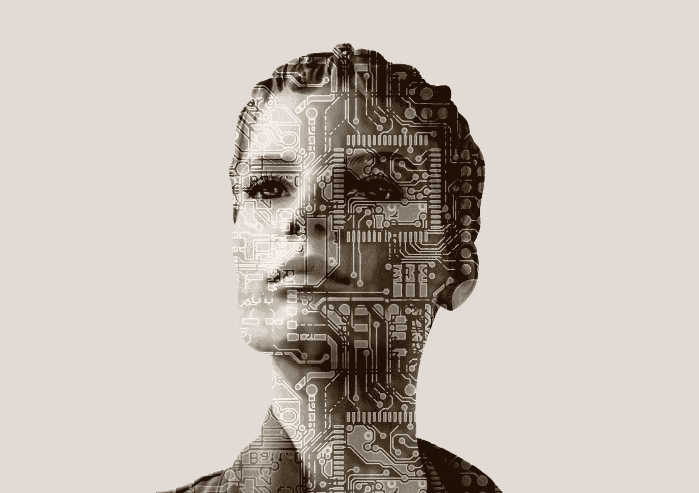
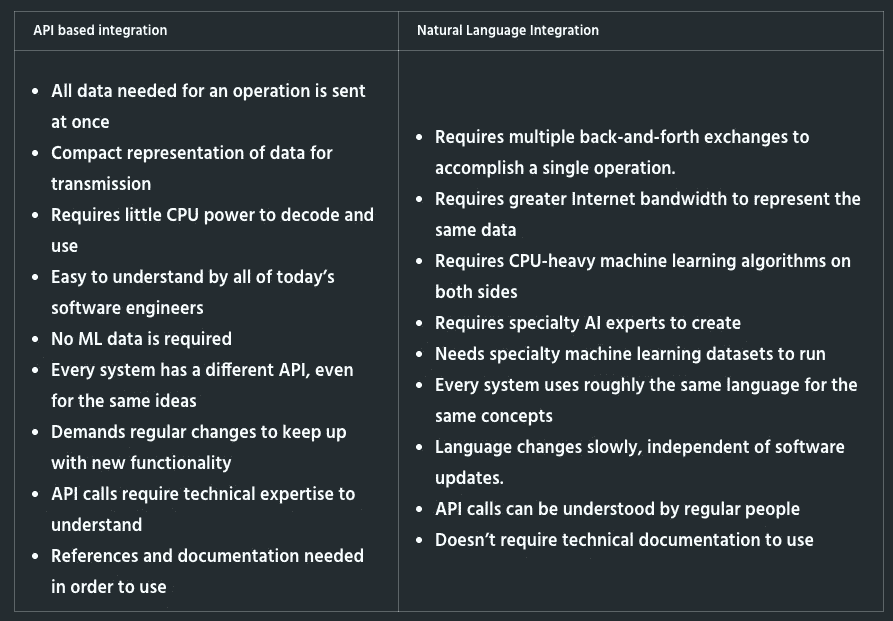

# 聊天机器人的未来——机器人与机器人交谈

> 原文：<https://towardsdatascience.com/future-of-chatbots-bots-talking-to-bots-388112a204f5?source=collection_archive---------13----------------------->

The future of integration with conversation

我最近在考虑一个项目。我们正在开发一个应用程序，其中一部分涉及到在餐馆预订。大多数餐馆没有自动预订系统——你可以插入的支持许多餐馆的 API 很少。

支持每一家餐馆的唯一可靠的方法是给这些餐馆打电话，用传统的好方法预订——和一个人交谈。然而，为了省钱，我们正在探索让机器人打电话的想法，而不是使用现代语音技术。理论上，这是非常可能的，尽管需要收集大量的数据来完成。

巧合的是，我也是 Vesta.ai 的技术顾问，这是一家为餐馆开发聊天机器人技术的公司。他们的目标是制造一个可以代替服务员的聊天机器人。你可以进来，坐下来，开始和一个小的智能扬声器说话来点菜。然而，该公司计划将这项技术扩展到通过电话接听电话。

于是很自然的想到这两个项目，我开始怀疑。如果这两种技术都成为主流，会发生什么？我们会让机器人和机器人说话吗？几乎不可否认的答案是——是的。但问题是，这将是一个边缘案例，一个我们将看到社会从人类供电系统向人工智能供电系统过渡的退化技术的幽默例子。或者，对话最终会成为集成两个软件的工程选择吗？

在考虑答案时，我要求你比较和对比集成系统的两种方式:

鉴于所有这些，相信自然语言集成可能会成为真正的工程选择似乎有些疯狂。但是我要提请注意这样一个事实，即假设的自然语言集成的许多负面影响随着长期趋势而减轻:

*   CPU 能力和网络容量继续呈指数增长，降低了额外 CPU 和网络成本的重要性
*   通用 NLP 工具每天都在改进，减少了对专业知识和定制数据集的需求
*   人工智能专业知识正变得越来越广泛，这得益于它在科技行业的时尚地位
*   无论如何，公司越来越多地为人类创建对话界面，使机器对机器集成的重用变得容易

从长期趋势来看，有利因素同样越来越诱人:

*   随着变化速度的加快，维护基于 API 的集成变得越来越昂贵，这要求我们不断更新代码以跟上变化
*   随着越来越多的人进入技术行业，允许半技术或非技术人员理解系统的设计变得更有价值
*   有越来越多的系统需要集成，每个集成都需要单独创建和维护，即使它们的行为非常相似

所有这些趋势的结合似乎意味着，随着时间的推移，相对于传统的集成，两个系统之间的自然语言集成将变得越来越有价值。

一开始，它会从小处着手。它将从日益流行的为人类设计的机器人中衍生出来。一些有进取心的程序员会创建自然语言集成，只是为了证明这是可以做到的。一些机器人对机器人的对话可能是由于交易双方自动化程度的提高而偶然产生的。

然后，当项目进展缓慢，工程师面临交付压力时，自然语言集成可能被认为是临时的黑客修复或一次性计划，出于对其便利性的好奇，但从未打算成为永久的。但是，当这些集成投入使用，天不会塌下来，这种疯狂的思考 API 的方式将越来越成为一种可接受的工程选择，尽管被归入某些边缘情况。

不过我预测，随着人工智能行业继续向前发展，我们试图自动化越来越多的流程和工作，我们将需要以指数增长的速度在不同的组织之间创建集成。这些集成将需要以越来越复杂的方式进行交互，这需要代表人类进行越来越多的监督。有了它，自然语言集成将从一个深奥的概念，一个黑客玩具，变成一种占主导地位的主流技术。

在不同的集成之间分担工作的好处太大了，不容忽视。因此，不是人类越来越适应技术世界，而是技术世界将越来越像我们。即使在最深的层次，我们的机器也可能开始用人类的语言相互交流。机器人会和机器人说话。

*仅供参考:本帖原载于*[*www . electric brain . io*](https://www.electricbrain.io/blog/bots-talking-to-bots)*。*