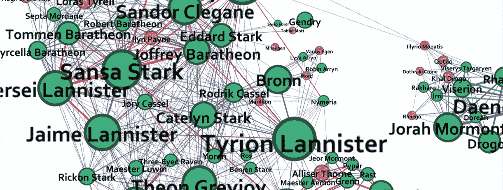

# 《权力的游戏》第 7.5 季第 1 集

> 原文：<https://towardsdatascience.com/game-of-thrones-season-7-5-episode-1-27bdc906e6df?source=collection_archive---------10----------------------->

## 绘制大图

在第一集里，我们将使用动画展示整个网络在七季中的“拓扑结构”,来鸟瞰不断发展的角色共现网络。这些图表也将向我们展示随着故事的展开，人物的位置在网络中是如何变化的。

Character Co-appearance Network

## 阅读网络

在深入研究之前，先了解一下图表的内容，以帮助理解它们。

**节点。**节点代表单个人物，七季共有 557 个。为了给每个角色的重要性一个感觉，出现在更多场景中的角色的节点更大，主要角色(147 个常规和重复出现的角色)的节点为绿色。次要角色的节点是粉红色的，当然也很小。

角色在第一次出现在场景中时进入网络，在被杀或以其他方式死亡时退出(100 个主要角色的命运)。次要人物如果连续五集没有出现，以后也不会再出现，也会退出。那些后来重新出现的仍然存在，缺失的连接向图的中心漂移，直到它们重新出现并重新连接。

**棱角分明。边缘连接在特定场景中共同出现的角色。在 557 个字符中，有 3849 条边(~ 7/字符)。当角色第一次一起出现在场景中时，边缘被添加。主要角色之间的边被认为是永久的——一旦两个主要角色同时出现，除非其中一个或两个被杀死或死亡，否则会有一条边将他们连接起来。如果角色没有连续五集同时出现，或者一集或两集退出网络，则涉及次要角色的边缘被移除。这种差异反映了主要角色之间的联系可能会持续下去，尽管他们最近没有共同出现——例如，史塔克或兰尼斯特家族成员之间的联系，尽管他们走的是分开的(和断开的)道路。**

边缘也标志着关系的性质。较厚的边表示更频繁的共同出现，因此关系“更强”。领带的基调反映在它们的颜色上，较红(较蓝)的边缘表示在武装场景中更频繁(不太频繁)的共同出现，因此更具战斗性(亲切)的关系。略带紫色的边缘混合了友好和敌对的共同出现，因此可能反映了一起对抗敌人的朋友，或者后来成为敌人的朋友(或者反之亦然)。

**布局。**使用“力导向”算法生成图形，在该算法中，未连接的节点被推开，而连接的节点被拉在一起。这赋予了字符在图形中的位置以意义。图中同处一地的角色在场景中更频繁地一起出现。并且，当一组字符倾向于彼此频繁地共同出现时，这些字符将聚集在一起。与倾向于不一起出现的字符一起出现的字符占据这些字符之间的位置，这些字符本身位于图形的不同区域。

现在你知道了“阅读”图表所需的一切，并赋予图表中角色的位置和运动以意义。多看几次图表动画，看看你是否能跟踪图表中展开的故事线，并理解演变中的网络。

## 图表特征和趋势

在未来的剧集中，我们会对该图的几个特征感兴趣。我将在这里介绍其中的几个，这样我们可以在以后的章节中更深入(更精确)地挖掘它们(以及其他的)。

**小集团。**一个值得注意的特点是，该网络在该系列的大部分时间里都以“派系”结构为特征，在这种结构中，相对不同的角色群围绕支撑他们的主要角色展开故事线——正如边缘颜色所显示的那样，一些角色比其他角色更加暴力。

这些“集团”和他们的中心人物，在下一张图中更容易看到，其中经常一起出现的人物群被涂上相似的颜色。因为他们的成员主要是彼此共同出现，所以这些集团(及其成员)在网络中彼此相对孤立——以丹妮莉丝·坦格利安为中心的集团是最孤立的。

Character Co-appearance Network with Clusters Colored

该图的拓扑结构在第七季发生了转变，因为该图汇聚成一个由所有主要角色组成的单一集团。这一转变反映了在面对日益增长的白人沃克威胁时，先前分离的故事线和他们的中心人物合并成一个单一的联盟。

**小天地。第二个是，在第七季融合之前，几个主要角色，而不是属于一个小团体，跨在他们之间，将他们的故事线连接起来，并将他们的主要角色连接成一个单一的网络图。例如，提利昂·兰尼斯特在网络中跨越多个派系，席恩·葛雷乔伊也是如此。另一些人，比如琼恩·雪诺，既以小集团为中心，又在他们之间牵线搭桥。**

这种拓扑结构——由少量桥连接起来的密集互连的集团——是标志性的“小世界”网络，在社会(以及生物和技术)系统中无处不在。因此，有趣的是，这种拓扑结构也出现在这些虚构的土地上，不管有没有该系列创作者/作者的意图。

在小世界网络中，尽管大多数节点主要连接到集团内相对少量的其他节点，但是它们之间的路径很短，因为少量节点“桥接”该集团。小世界网络结构表现出重要的特征，包括信息在网络中快速传播只需几步，以及对节点丢失的鲁棒性，其中大多数对路径的长度或网络的集团性几乎没有影响。

当艾德·史塔克(奈德·史塔克)失去理智，以及他的妻子和儿子凯特琳和罗柏在“红色婚礼”中死去时，这种坚强都显而易见。从动画中可以明显看出，图形的拓扑结构几乎没有因为它们的退出而改变。因为与他们一起出现的角色也倾向于彼此一起出现(他们的边缘颜色相对统一——灰色、紫色；凯特琳和罗柏，绿色)，它们的边是“冗余的”，网络拓扑对它们的消亡是鲁棒的。

相比之下，像提利昂·兰尼斯特这样的“桥接”角色的边并不是多余的，它们的丢失会极大地改变拓扑结构。

*(* ***)没有提利昂的世界*** *。为了说明这一点，我贴了一张图，图中提利昂受到了“乔治-贝利-这是一种美妙的生活”的待遇。除去他的节点和所有的边，图的中心大部分是空的，派系几乎没有联系(但对席恩·葛雷乔伊来说，尤其是在红色婚礼之后)，并且在第七季汇合之前一直如此……这很大程度上取决于提利昂的联系，在他缺席的情况下不太可能。可以在这里* *查看* [*。)*](https://youtu.be/x46EBu_xG6M)

**短暂的联系。**突出这些网络特征的另一种方式是，如果主要人物*和次要人物*没有在连续五集内共同出现，或者其中一个或两个人物退出，则通过丢弃所有边缘，在故事的更窄时间窗口内绘制共同出现网络。

5-episode edge windows.

因为这个图表是基于最近的共同出现(活跃的联系)绘制的，所以派系之间的联系更为稀疏，正如那些从一个派系跳到另一个派系的桥牌人物一样，他们通过网络与人物建立联系。例如，观察提利昂·兰尼斯特在网络中的移动。结果是他在早期图表中的中心位置，这些图表假设这些联系是持久的而不是短暂的。

## 接下来:第二集——这是一个冰与火的小世界

在下一集(下面的链接)，我将更详细地研究全球网络结构特征的“统计力学”,量化其各种特征——密度、聚类、路径长度和小世界性——并可能开始挖掘一些主要人物的网络位置和联系。

## 同时…

**新来 GoT 第 7.5 季？在这里查看预告片******，以及剧集:****

**第 1 集— [描绘大局](https://medium.com/@joel.a.c.baum/game-of-thrones-season-7-5-episode-1-27bdc906e6df)**

**第 2 集— [冰与火的小世界](https://medium.com/@joel.a.c.baum/game-of-thrones-season-7-5-episode-2-dd518f6b03c)**

**第 3 集— [人物网络地位和优势](https://medium.com/@joel.a.c.baum/game-of-thrones-season-7-5-episode-3-fcf1f35af7c0)**

**第四集— [谁会熬过第八季？杀死](https://medium.com/@joel.a.c.baum/game-of-thrones-season-7-5-episode-4-abb12ee1e43d)的网络位置**

****对“应要求”这一集有什么想法？留下评论，我会看看我能做些什么…****