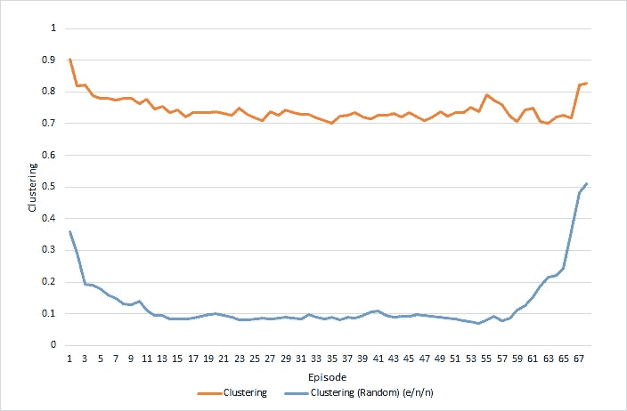
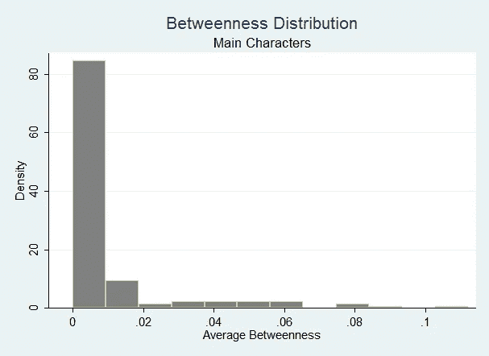
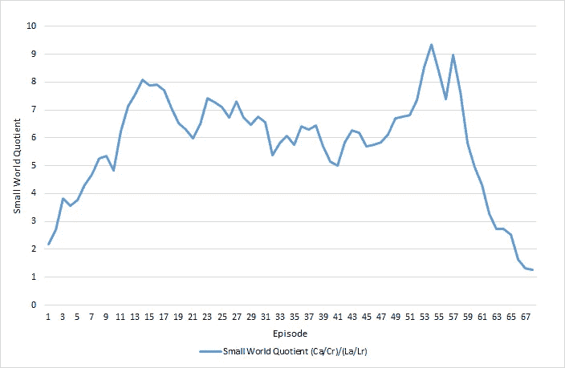

# 《权力的游戏》第 7.5 季第 2 集

> 原文：<https://towardsdatascience.com/game-of-thrones-season-7-5-episode-2-dd518f6b03c?source=collection_archive---------12----------------------->

## 这是一个冰与火的小世界

在[第一集](https://medium.com/@joel.a.c.baum/game-of-thrones-season-7-5-episode-1-27bdc906e6df)中，我们使用图表来展示冰与火之地七季中网络的拓扑结构，鸟瞰了不断发展的角色共现网络。我们看到的是一个不均匀的，移动的，模块化的结构。许多角色聚集成密集的小集团，主要是彼此共同出现，由一些共同出现的角色连接，这些角色通过相对较短的路径连接那些不经常共同出现的角色。所有这些特征都是“小世界”网络的特征。

很容易看出这种社会结构是如何普遍出现的。人们倾向于形成“社区”,其中每个人都认识其他人，每个社区的成员倾向于与其他社区的人有一些关系，而一些人——例如政治和社区领导人——与许多社区的人有联系。

在第 2 集，我们将更详细地研究这种拓扑结构，并量化它的一些关键特征——**密度**、**聚集**、**桥接**和**路径长度**——以得出关于共现网络的更坚定的结论，并准备挖掘网络位置和单个角色的优势。

## 背景

> 小世界效应首先出现在斯坦利·米尔格拉姆(1967)的经典研究中，他描述了一个实验，在这个实验中，信件在熟人之间传递，他从中得出结论，许多对看似遥远的人被非常短的熟人链连接起来。在他的研究中，这个链条的典型长度大约是 6，这个数字已经成为民间传说，并在约翰·格尔(1990)的戏剧《六度分离》中被载入史册。尽管米尔格拉姆的研究中存在偏见——例如，路径较长的字母更容易丢失或遗忘——但他的结果通常被视为支持假设的证据，即人口中的大多数人可以通过熟人的短连接路径连接起来，即使是在包含社会结构(如孤立社区或地理和文化障碍)的大型人口中。米尔格拉姆将这种现象称为“小世界效应”。最近， [Watts 和 Strogatz (1998)](https://www.nature.com/articles/30918) 将这种描述正式化，将小世界定义为展示短路径和社会结构组合的网络，后者的特征在于高度的网络聚集。这两个条件现在被作为小世界的标准定义，揭示了网络拓扑对于理解小世界的本质和运作的重要性。([改编自鲍姆等人，2004 年](https://www.researchgate.net/publication/279698106_The_small_world_of_Canadian_capital_markets_Statistical_mechanics_of_investment_bank_syndicate_networks_1952-1989))。

## 密度

人物之间的联系有多密集(或者反过来说，稀疏)？我们可以通过考虑组成网络的节点(字符)和边(共现)的相对数量来回答这个问题。这些按情节显示在图 1 中。

Figure 1\. Character Co-appearance Network — Nodes & Edges

在第一季和第二季中，角色的数量增长很快，然后随着角色引入的放缓和死亡人数的增加，增长速度会变慢。在第六季达到 126 个角色的高峰后，随着故事情节的趋同，角色的数量急剧下降，留下了一些角色，另一些角色死去。在第七季结束时，剩下的角色比第一季第一集中出现的要少。(也许并不令人惊讶——在第一集介绍的 44 个角色中，只有 13 个出现在第七季的大结局中！)

共同出现的数量遵循相同的一般模式，保持每个角色的平均边缘数量相对恒定在 8-9 之间，尽管在第一季和第七季中更大，在 13-16 之间。

Figure 2\. Character Co-appearance Network — Density

总的来说，边与节点的比率表明连接相对稀疏，或低密度网络。也就是说，实现了相对小部分的可能边(即，如果所有节点都具有与所有其他节点的边)。例如，考虑第 35 集，其中 110 个角色的共同出现创建了 1092 条边。虽然这看起来是一个很大的数字，但它仅代表 11，990 个可能边的 9%的密度(即 110*109)。图 2 显示了网络密度在第 2-6 季中介于 8-10%之间，而在第 1 季早期则下降了 30%以上。密度在第七季中跃升，在最后两集达到近 50%。这一跳跃与我们在《T2》第一集中观察到的转变相吻合，当之前独立的故事线合并，中心人物在面对日益增长的白人沃克威胁时结成联盟时，图表崩溃成一个单一的集团。

## 使聚集

尽管总体稀疏，但共现网络的图形仍然揭示了一种不均匀的结构，具有稀疏链接的密集聚集区域。但是，共现网络的聚集程度——以及连接的不均匀程度——如何呢？

为了回答这个问题，我们可以计算网络的**聚类系数**，它测量“封闭三元组”(所有边都被画出的三角形)与“开放三元组”(缺少一条边的三角形)的比率。如果所有的三联体都是“开”的，系数为 0，如果所有的三联体都是“闭”的，系数为 1。当我们在网络图中看到聚类时，我们可以期望找到许多三角形。在共现网络中高比例的“封闭”三元组意味着字符倾向于彼此共现。

Figure 3\. Character Co-appearance Network — Clustering

图 3 显示了每集的聚类系数以及“随机网络”的聚类系数，该“随机网络”具有与每集中实际网络相同的边数和节点数。随机网络的聚类系数往往很小，这为评估实际网络中的聚类提供了一个基准( [Watts & Strogatz，1998](https://www.nature.com/articles/30918) )。

共现网络的聚类系数在 0.7-0.8 之间，但在第一季开始和第七季结束时略高(当时网络密度也更高)。这意味着网络中 70-80%的“三胞胎”是“封闭的”。随机网络的聚类系数低得多，在 0.08-0.09 之间，除了在第一季开始和第七季结束时。因此，对于实际的同现网络，聚类系数要大 8-10 倍。

## 桥接

既然我们已经量化了集群网络区域，那么让我们来看看贯穿和链接它们的连接。在[第一集](https://medium.com/@joel.a.c.baum/game-of-thrones-season-7-5-episode-1-27bdc906e6df)的图表中，这些“桥梁”似乎是由几个字符与那些往往不会相互出现的字符共同出现造成的——它们形成了“开放”的三元组，通过一条短路径将原本不相连的字符连接起来。

我们可以通过考虑同现网络中的**介数**和**度**中心性的分布来量化这些桥的性质。在下面给出的这些分布的图表中，只包括主要的字符(规则的和重复出现的)；次要角色在这两个指标上都得分较低，增加了许多接近零的观察值。

Figure 4\. Character Co-appearance Network — Betweenness

**中间性**衡量一个字符位于其他字符之间最短路径上的程度，分数越高表示最短路径越多。如图 4 所示，分布是高度倾斜的。大多数主要人物没有最短路径，少数人有几条最短路径，极少数人有多条最短路径。这种偏斜使得少数字符具有个体意义，它们的高度中间性赋予了它们控制信息流和资源的潜力。

Figure 5\. Character Co-appearance Network — Degree

**度**是一个给定的字符与其他字符一起出现的次数。如图 5 所示，学位分布也是倾斜的，尽管不太严重。大多数主角每集和 10 个或更少的其他角色一起出现，少数有 10-20 个，极少数超过 20 个。

这些分布的偏斜度的差异反映了一些高度特征位于几条最短路径上。这些字符占据了图形中密集聚集的区域；丹妮莉丝·坦格利安就是一个例子。除了龙之母，低度节点往往属于密集集群，这些集群通过高度(和高介数)节点相互连接。

这种偏斜对网络中节点之间的路径长度有影响。当偏斜度很高时，网络的“直径”——节点之间的最大距离——很大程度上不受网络规模增加的影响( [Cohen & Havelin，2003](https://doi.org/10.1103%2FPhysRevLett.90.058701) )。因此，这些分布的偏斜度意味着在共现网络中字符之间的步数相对较少。

## 路径长度

路径长度是最后的小世界拼图。我们可以通过将字符之间的所有最短路径相加并除以路径总数来计算字符之间的路径长度。下面的图表显示了每集的结果。并且，再次作为基准，对于具有相同数量的节点和边的随机网络。正如我们所见，虽然随机图往往具有较小的聚类系数，但它们也往往具有相对较小的平均路径长度( [Watts & Strogatz，1998](https://www.nature.com/articles/30918) )。

Figure 6\. Character Co-appearance Network — Path Length

如图 6 所示，角色之间的平均路径是 2-3 步，除了在第一季和第七季，它低于 2 步。虽然比表征随机网络的短路径稍长，但是桥确实导致了预期的短距离偏斜。沿着这些短路径，只需几步，信息就能迅速到达网络的其他遥远区域。

## 世界真小

在数量上，我们发现同现网络的特征是高度模块化的，与具有相同数量的节点和边的随机网络相比，具有更高的聚类和几乎一样短的平均路径长度。我们可以使用这些见解来计算**小世界商** (Q)以量化共现网络拓扑的“小世界性”。

q 比较实际(a)网络与节点和边数相同的随机(r)网络的聚类系数(CC)和平均路径长度(PL)。具体来说，Q = [CC(a)/CC(r)]/[PL(a)/PL(r)]。一个网络的 CC(a) >> CC(r)和 PL(a) ~ PL(r)越多，它就越“小世界”，Q 就越大，如果 Q > 1，就说这个图是一个小世界。

Figure 7\. Character Co-appearance Network — Small World Quotient

从我们早期对聚类和路径长度的研究中，我们知道 CC(a)比 CC(r)大 8-10 倍，并且 PL(a) ~ PL(r)，所以我们预计 Q > 1。

图 7 证实了这一点。在第一季和第二季中，q 从 2 上升到 8，然后在 5-8 之间波动，直到第六季的 9 左右达到峰值，然后迅速下降。到第七季结束时，Q 值已经下降到接近 1，这个小世界崩溃了，因为核心人物在面对白衣行者威胁时形成的联盟将网络折叠成了一个小团体。

好吧。那就证实了。这的确是一个冰与火的小世界……嗯，对于*七季中的大部分*来说。

## 接下来:第 3 集—网络地位和优势

在下一集(下面的链接)，我们将把注意力转向网络中的角色。谁在网络中处于有利位置？谁失去或浪费了一个网络优势？谁有权力控制信息和资源的流动？谁能赢得信任和忠诚？他们是如何拥有(或失去)这些网络优势的？

## 同时…

**新来 GoT 第 7.5 季？在这里查看预告片******，以及剧集:****

**第 1 集— [描绘大局](https://medium.com/@joel.a.c.baum/game-of-thrones-season-7-5-episode-1-27bdc906e6df)**

**第 2 集— [冰与火的小世界](https://medium.com/@joel.a.c.baum/game-of-thrones-season-7-5-episode-2-dd518f6b03c)**

**第 3 集— [人物网络地位和优势](https://medium.com/@joel.a.c.baum/game-of-thrones-season-7-5-episode-3-fcf1f35af7c0)**

**第四集— [谁会熬过第八季？杀死](https://medium.com/@joel.a.c.baum/game-of-thrones-season-7-5-episode-4-abb12ee1e43d)的网络位置**

****对“应要求”这一集有什么想法？留下评论，我会看看我能做些什么…****