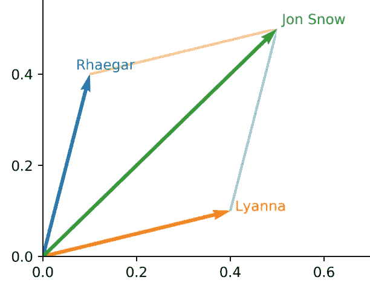
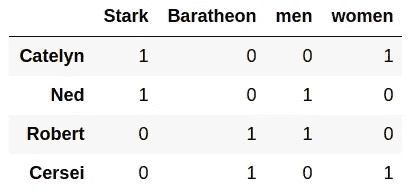
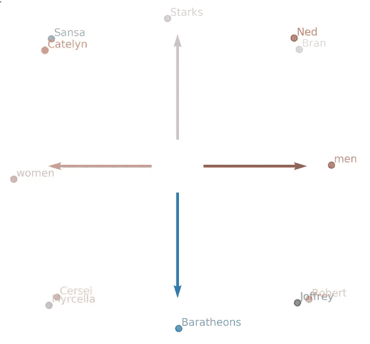

# 《权力的游戏》单词嵌入，R+L = J 吗？—第一部分

> 原文：<https://towardsdatascience.com/game-of-thrones-word-embeddings-does-r-l-j-part-1-8ca70a8f1fad?source=collection_archive---------6----------------------->

> 我们能从 5 本《权力的游戏》书中的单词向量表示中学到什么吗？

I know this is stupid, please read on :)

剧透警告:这个故事包含了《权力的游戏》第七季的剧透

在我的第一篇关于[文本生成](https://medium.com/@jctestud/yet-another-text-generation-project-5cfb59b26255)的报道之后，我决定学习并撰写关于单词嵌入的文章。单词嵌入是 2013 年(现在是史前时代)的热门新事物[。现在，让我们将这一数据科学突破应用于一些愚蠢的事情！](https://arxiv.org/pdf/1301.3781.pdf)

> 这是一个分为两部分的故事:
> -第一部分:单词嵌入？什么？怎么做，为什么？
> -第二部分:[《权力的游戏》嵌入的乐趣](https://medium.com/@jctestud/game-of-thrones-word-embeddings-does-r-l-j-part-2-30290b1c0b4b)
> (代码在此处)
> 
> 在这第一部分中，我们将从快速复习机器学习的字符和单词编码开始…如果你熟悉 NLP，你可以直接进入[第 2 部分](https://medium.com/@jctestud/game-of-thrones-word-embeddings-does-r-l-j-part-2-30290b1c0b4b)。

# 字符编码

机器学习算法(以及一般的数学)处理数字。
在自然语言处理(NLP)中，我们必须用数字，更精确地说是向量(空间中的特定坐标)来表示字符和单词。

当在字符级工作时(比方说在小写字母上)，我们必须编码 26 个字符。在这个场景中，“词汇表”是 26 个不同“标记”(“a”到“z”)的列表。因为 26 很小而且容易管理，一个简单的方法是给每个字符在空间中自己的维度。一个字符成为一个向量，在相应的字符坐标中为 1，在其他位置为零:

lowercase alphabet one-hot encoding

从几何学的角度来看，在这个空间中，所有的角色彼此距离相等。我们让我们的算法知道一个“a”与一个“b”无关，更一般地说，所有的字符都是相同的。这种表示词汇表(以及一般的分类变量)的方式通常被称为**“一个热点编码”**(空间中只有一个坐标是“热点”)。

我们也可以用一维编码，例如用 **a** = (1)， **b** = (2)，一直到 **z** = (26)。但是在这个空间中,“z”将离“a”非常远，并且“z”是“a”的 26 倍，算法可能认为“z”只是类固醇上的“a ”,这是不正确的。它可以工作，但它不是一个非常明智的表示。

# 单词编码

回到我们的主要任务，在我们的例子中，我们想要对单词进行编码。《权力的游戏》包含了 12 000 个单词。这些单词中的每一个都必须给定一个空间矢量表示。如果我们“一次性编码”这个词汇，我们将得到 12 000 维空间中的向量。你可以看到它很快失去控制。因此，单词通常被编码在固定的低维子空间中。

另外，这一次，我们的令牌(单词)并不是 100%独立的，有些单词在语义上非常相似。例如，“愚蠢”和“哑巴”的意思差不多。通过一次性编码，我们会丢失这些信息。由于英语中的许多单词都有相似的语义，一种有趣的表示词汇的方法是为相似的单词创建相似的向量。

当单词在一个密集的向量空间中以一个任务表示时(比如保持语义相近的单词彼此靠近)，这个过程(和产生的向量)通常被称为**“单词嵌入”**。

# 如何构建单词嵌入

有两种众所周知的算法来构建“通用”(多用途)嵌入，谷歌的 [word2vec](https://arxiv.org/abs/1301.3781) (2013)和斯坦福的 [GloVe](https://nlp.stanford.edu/pubs/glove.pdf) (2014)。

两种方法都通过两个词共现的程度来量化它们之间的相似性(学术术语是[分布假设](https://en.wikipedia.org/wiki/Distributional_semantics#Distributional_hypothesis))。即使创建嵌入向量空间的过程不同，它们也产生相似的向量。以下是每个算法的简化步骤:

*   **word2vec** (skip-gram 模式)采用浅层前馈神经网络(1 个隐层)。对于输入的给定单词，网络被训练来预测词汇表中的每个单词与我们输入的单词一起出现的概率。为了更好地完成这项任务，网络只需要调整一个权重矩阵，这个矩阵来自一个密集的中间隐藏层。一旦经过训练，这个隐藏层就是我们单词的矢量表示。
*   **GloVe** 比较传统(不涉及神经网络)，使用矩阵分解。它首先浏览文本，并计算单词对彼此靠近的次数(在给定的窗口中，比如 10 个单词)。这些信息存储在一个叫做“共现矩阵”的结构中。迭代地构建和调整单词向量，以最小化具有高共现概率的单词之间的(余弦)距离。

# 单词嵌入属性

2013 年，单词嵌入的一个特别之处让每个人都大吃一惊，那就是由此产生的向量空间有很多意想不到的性质。它不小心编码了几个高级语义概念。比如“他”和“她”这样的代词，它们之间的距离非常近(正如所料)，但同时，从“他”到“她”(另一个向量)的路径具有惊人的性质。

通过将同样的“他到她”的转换应用到其他事物上，我们实际上是在交换性别。“男人”变成了“女人”，“演员”变成了“女演员”。为了说明这一点，这里是第二部分的一瞥。下面是从《权力的游戏》书籍中构建的单词向量的可视化(仅限):

Illustration of the “gender-swap” relationship (PCA projection of selected Game of Thrones word vectors)

在完全无监督的方式下，一个算法已经编码了“性别”的概念(没有命名)，这怎么可能？

你可以把它想象成一个空间，在这里，文字因为不同的原因而相互吸引。让我们以这篇短文为例:

> “奈德、凯特琳、布兰和珊莎来自史塔克家族。
> 劳勃、瑟曦、乔佛里和弥赛菈都来自拜拉席恩家族。凯特琳、珊莎、瑟曦和弥赛菈都是女人。
> 奈德、布兰、劳勃和乔佛里都是男人。”

通过这篇文章，我们希望来自同一个家庭的人能够相互吸引，同性之间也是如此。

truncated word co-occurrence matrix

左边是一个截断的共现矩阵，只有一些特定的目标词(行)和上下文词(列)。

2-D representation of our words

利用共现矩阵的直接 2-D 近似(PCA 因子分解),我们得到以下单词表示(这种操作显然不同，并且在 GloVe 中更复杂)。在这个二维空间中，有四种“力”在起作用。男人把其他男人拉向他们，与此同时，女人、史塔克和巴拉瑟翁也在这么做。

它达到了一种平衡，巴拉瑟翁在底层，史塔克在顶层，女人在左边，男人在右边，所有这些都没有任何指导。

嵌入捕捉了很多这样的语义关系(或者像一些人所说的“语言规则”)。它们可用于解决单词类比任务，例如:

> “a”和“b”相似，就像“c”和“d”相似一样

缺少四个术语之一的示例:

> “他”之于“她”，正如“男人”之于>

这被称为“**类比推理**”，这项任务是由 word2vec 的作者托马斯·米科洛夫等人引入的，他们建立了一个包含大量这些问题的完整的[数据集](http://download.tensorflow.org/data/questions-words.txt)。

> 在向量算术中，类比“A 之于 B 如同 C 之于 D”翻译过来就是:
> **B**-**A**~**D**-**C
> B**-**A**+**C**~**D** 她———“他”+“男人”~女人

我们的四句话单词空间已经可以解决一些问题，比如:

> “劳勃”之于“巴拉瑟斯”就像“奈德”之于>
> 相当于……
> “巴拉瑟斯”减去“劳勃”加上“奈德”是多少？

在我们的空间里，它给了我们一个或多或少“斯塔克斯”(tada！).

你可以看到，在我们的短文本例子中已经发生了很多事情，想象一下现在在 5 本书中，或者在维基百科中，也有更多的维度(数百个)，让算法有一些空间来表达自己。

理想情况下，要“学习”英语，你必须使用大量的语料库。斯坦福的小组(以及谷歌)提供预训练的单词嵌入，其中语料库包含超过 100 亿个单词(通常来自维基百科)。在我们的例子中，我们只有 1000 万个单词，它们来自一本中世纪的奇幻书(所以请宽容)。

你现在已经准备好[第二部分](https://medium.com/@jctestud/game-of-thrones-word-embeddings-does-r-l-j-part-2-30290b1c0b4b)！

# 奖金:这是无监督学习吗？

Word2vec 通常被认为是一种非常成功的“无监督学习”算法。人们可以理直气壮地说，因为神经网络是用输入/输出对来训练的，以使损失函数最小化，所以训练它们在某种程度上总是一项受监督的任务。

然而，在**“手动标记的”**和**“自动标记的”**数据集之间肯定有区别。网络获得其预期输出(也称为标签/目标)的方式完全不同:

*   *“手动标记”*示例:网络被训练为将输入图像分类为包含“狗”或“猫”。为了训练这样的分类器，人们必须手动注释猫和狗的图像来建立数据集。
*   *“自动标注”*示例:在 word2vec 中，有一种巧妙的自主方式来为任何文本生成标签。因此，您可以使用任何想要的数据集，并且不需要人工干预(有些人称之为“自我监督”)。对于时间序列预测或自动编码器来说，情况相对类似。

第一部分到此结束。如果你喜欢，可以关注我的 [*中*](https://medium.com/@jctestud) *或* [*推特*](https://twitter.com/jctestud) *获取最新消息。此外，如果你发现有什么问题或者有任何疑问，请在评论区提问。*