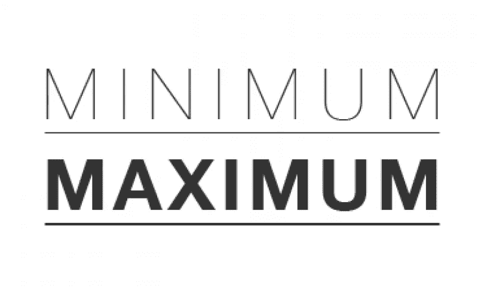
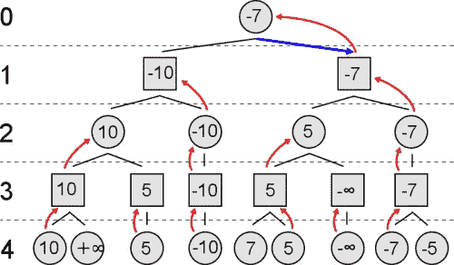

# 博弈论——极大极小

> 原文：<https://towardsdatascience.com/game-theory-minimax-f84ee6e4ae6e?source=collection_archive---------2----------------------->



这篇文章与之前的文章有些不同，之前的文章是基于一些在你的项目中使用的新技术。

有意思？我将从博弈论的角度来描述极大极小算法。只是让你知道你会期待什么:

1.那么什么是极大极小算法呢？
2。计划和代码
3。算法描述
4。优化
4.1。深度优化
4.2。阿尔法-贝塔优化
5。建议
6。结论

对于编码，我们将使用 Objective-C 语言。不过不要担心，会有比代码更多的理论。

方向定了，走吧。

那么什么是极大极小算法呢？minimax——是决策理论、博弈论、统计学和哲学中使用的决策规则，用于最小化最坏情况下(最大损失)的可能损失。最初是为两人零和博弈理论而制定的，涵盖了两人交替行动和同时行动的情况，它也被扩展到更复杂的游戏和存在不确定性时的一般决策。

咕咕咕！
现在我们有了定义，里面嵌入了什么逻辑？让我们假设你正在和你的朋友玩一个游戏。然后你走的每一步，你想最大化你的胜利，你的朋友也想最小化他的损失。最终，对你们两个来说都是一样的定义。你的下一个决定应该是最大化你当前的盈利位置，知道你的朋友在下一步将最小化他的亏损位置，并且知道下一步你也将最大化你的盈利位置…

闻到这种递归的味道了吗？所以这个算法的主要思想是在知道你的对手也会这么做的情况下做出最好的决定。

**计划和代码**

我们将使用树表示来构建这个算法。每一代新的孩子都有可能成为另一个玩家的下一步。例如，第一代是你的可能步骤，每一步都会导致对手的可能步骤的一些列表。在这种情况下，您的步骤是“父顶点”，而您的对手可能的下一步是它的“子顶点”。
这里是经过所有优化的最终算法代码。

```
#pragma mark - Public- (NSUInteger)startAlgorithmWithAITurn:(BOOL)aiTurn; { return [self alphabetaAlgorithm:_searchingDeapth    alpha:NSIntegerMin beta:NSIntegerMax maximizing:aiTurn];}#pragma mark - Private- (NSInteger)alphabetaAlgorithm:(NSInteger)depth alpha:(NSInteger)alpha beta:(NSInteger)beta maximizing:(BOOL)maximizing { self.currentCheckingDepth = _searchingDeapth - depth; if (self.datasource == nil || self.delegate == nil) { return 0; } if (depth == 0 || [self.datasource checkStopConditionForAlgorithm:self onAITurn:maximizing]) { return [self.datasource evaluateForAlgorithm:self  onAITurn:maximizing]; } NSArray *nextStates = [self.datasource  possibleNextStatesForAlgorithm:self onAITurn:maximizing]; for (id state in nextStates) { [self.delegate performActionForAlgorithm:self andState:state onAITurn:maximizing]; if (maximizing) { alpha = MAX(alpha, [self alphabetaAlgorithm:depth - 1 alpha:alpha beta:beta maximizing:NO]); } else { beta = MIN(beta, [self alphabetaAlgorithm:depth - 1  alpha:alpha beta:beta maximizing:YES]); } [self.delegate undoActionForAlgorithm:self andState:state onAITurn:maximizing]; if (beta <= alpha) { break; } } return (maximizing ? alpha : beta);}
```

**算法描述**



Example

让我们对优化视而不见，从我们需要的初始东西开始。首先，我们需要一个算法，它将基于一个已完成的步骤返回可能的后续步骤列表。我们用它来产生其他的子顶点，如前所述。

其次，我们需要一个算法，将在游戏结束时计算游戏结果的评估。使用该算法，每个顶点(生成的步骤)都将具有赋值的结果。如何分配将在后面描述。

那么这是如何使用树和这些算法的呢？逻辑上算法分为两部分:
1。轮到我们了
2。对手转身

在作为下一个顶点的“轮到我们”上，我们选择一个具有最佳评估值的孩子。然后，由于下一个选择的步骤产生可能的对手步骤及其评估，他将选择最差的评估值(对我们最差意味着对他最好)。

这仅仅意味着我们将从可能的对手步骤中采取最大的评估步骤，而对手将从我们可能的下一步中采取最小的评估步骤。

下一个问题是——我们什么时候评估 step？当它被创造出来的时候，首先想到的是什么。但是等一下，如果它依赖于下一代，或者换句话说依赖于另一个玩家的脚步，我们怎么能马上计算出来呢？意味着我们的步长值将从下一代步长值开始最大化，这是一个对手步长。从另一个角度来看，对手的步长值将是下一代步长值的最小值，这是我的。遵循这个规则，我们可以说评估将在游戏结束时进行，因为它是最终生成的步骤。之后，它将向后展开，用前面描述的计算值标记所有顶点，直到它到达根。

递归生成结束，如果:
我们得到一个赢家
不可能有下一步棋，我们得到一个平局

游戏状态的评估可以用下一种方式计算:
如果我们赢了，那么评估值应该大于某个正值
如果我们输了，那么它应该小于某个负值
如果我们打平了，那么它应该在这个值之间
这意味着我们的位置越好，它的值应该越大。

这个评价可能取决于不同的东西。举个例子，为了评估，我们给它一个我们是赢家的情境。
然后它可以根据下一个值进行评估:
1。我走了多少步才获得胜利
2。你的对手离胜利有多近
等等…

这个函数是算法中最重要的部分之一。组织得越好，你得到的结果就越好。仅依赖于一个特征的函数不会像依赖于十个特征的函数那样精确。此外，您选择用于评估的特征应该具有逻辑意义。如果你认为评估值更大是因为玩家是女性而不是男性，这对性别歧视者有一定意义，但对算法没有意义。结果，你会收到错误的结果。一切都是因为你是个性别歧视者。

太好了！，现在我们大体上理解了算法和它下面的思想。这听起来很酷，但在执行时间方面却没有那么好。为什么？

**优化**

例如，对于用法，让我们选择“四连胜”游戏。如果你不知道它是什么，这里有一个简短的描述:


“游戏的目标是将你的四个代币连成一条线。所有方向(垂直、水平、对角线)都是允许的。玩家轮流将他们的一个代币放入七个槽中的一个。令牌在槽内尽可能远地下落。拿红色代币的玩家开始。当第一个玩家连上四颗石头时，游戏立即结束。”

让我们想想在这种情况下我们的算法将如何工作。该字段有 7*6=42 个步骤。开始时，每个用户可以做 7 个不同的步骤。这个数据给了我们什么？这些价值观是有史以来最糟糕的。为了让他们更真实，让我们说，例如，游戏将在 30 步结束，平均用户将有可能选择 5 行。使用我们的算法，我们将得到下一个近似数据。第一个用户可以产生 5 个步骤；每个步骤将产生 5 个自己的步骤。现在我们有 5 + 25。这 25 步，每一步可以产生 5 个新的步骤，等于 125 步。这意味着在计算的第三步，我们将有大约 155 步。每下一步都会产生越来越多的可能步骤。您可以使用下一个函数来计算它们:
5 + 5 + 5 + … + 5 ⁰.这个值是巨大的，计算机计算这么多步要花很多时间。

值得庆幸的是，有现成的优化极大极小算法，这将降低这个值。我们很快就会谈到他们两个。

**深度优化**

很久很久以前，一个非常聪明的人说“为什么我们要一直数到最后？我们能不能在中间的某个地方做个决定？”。是的，我们可以。当然最后精度会比中间某处好很多，但是有了好的算法进行评估，就可以把这个问题降下来。那么接下来我们该怎么办，只不过是多加一条“算法停止”的规则。这个规则是，如果当前步长深度达到临界值，则停止。这个值你可以在测试后自己选择。我想通过一系列的测试，你会发现那些符合你特殊情况的测试。当我们根据这条规则开始评估时，我们把它当作平局。

这条规则并不困难，而且可以真正优化我们的算法。然而，它仍然降低了我们的精度，为了使它工作，我们不能使用超低深度，否则它会给我们错误的，不准确的值。接下来我会告诉你，我们选择了深度 8。尽管花了很长时间才得到最终结果。下一步优化对精度没有影响，并减少算法时间真的很好。它的名字叫阿尔法贝塔，它让我神魂颠倒。

**阿尔法-贝塔优化**


Example

它的意思很简单。接下来的想法是——如果我们知道已经建立的分支会有更好的结果，就不需要计算下一个分支。这只是浪费资源。想法很简单，实现呢？

为了计数，我们需要将另外两个变量传递给递归算法。
1。α—表示最大化零件
2 的评估值。β——表示最小化部分的评估值

从前面的部分中，我们了解到我们必须走到树的末端，只有这样我们才能评估我们的结果。所以如果我们总是选择左顶点，那么第一次求值将在最后一个顶点上进行。在此之后，评估过程将从它的直接顶点开始，并且将对所有左边的顶点继续，直到一个可能的顶点结束，等等。

我为什么要告诉你这些？这都是因为理解如何评估顶点是至关重要的优化。

为了让我们更容易想象，让我们假设我们正处于最大化的转折点。对我们来说，这意味着我们在计算阿尔法值。该值被计为其后代的所有评估值的最大值。在我们计算阿尔法值的同时(我们在最大化过程中)，我们有一个贝塔值。在这里，它表示其父代的当前 Beta 值。太好了！，现在我们知道了α和β在特定时间的含义。为避免误解，α是我们当前的评估值，β是当前的进一步评估值。

最后是优化检查。如果β低于或等于α，我们将停止对所有下一个子代的评估。

最后是优化检查。如果β低于或等于α，我们将停止对所有后代的评估。

为什么有效？因为β已经小于α——它的后代的值，同时α被计为可能的后代值的最大值。这意味着现在我们步骤的评估值不能低于当前值。从另一个角度来看，我们现在拥有的 Beta 是我们父代的当前评估值。从目前我们正在最大化的观点来看，我们可以理解我们的父代正在最小化，这意味着它将选择其当前值和其子代计算值的最小值。

将所有这些放在一起——因为我们知道我们的计算值高于父值，所以我们做出决定，它不会选择我们作为它的下一个可能步骤(它有更好的后代，如果选择它们，它的值会更低)。从这个角度来看，做下一个计算是荒谬的，因为它们不会改变最终结果。所以我们，作为父-子，我们停止所有的计算并返回当前值。利用这一点，我们的父母将比较我们和当前的最佳选择。通过前面描述的逻辑，它将选择其当前值。

使用这种优化，我们可以削减巨大的分支，并节省大量的工作，不会对最终结果产生任何影响。

**建议**

太好了！，现在我们知道了两种优化方法，可以让我们的算法运行得更快，我想给你一个建议。通常，当机器做出选择时，真正的用户需要一些时间来决定下一步做什么。我们可以利用这段时间为下一步的决定做准备。

因此，当我们做出选择时，让我们继续为所有可能的用户选择而努力。这给了我们什么？
1。它们中的许多已经从以前的用户迭代中计算出来了。
2。当用户选择他的选择时，我们将继续我们的计算。这将增加我们的树的深度，换句话说，准确性。

最后，当用户做出选择时，我们可以简单地切断所有其他未被选择的分支，只继续选择一个分支。
这很好，但接下来让我们对我的假设做出一个总体结论——不要每次轮到你的时候都开始你的算法。让它在游戏中运行一次，当用户选择某个步骤时，获取它的计算数据，并继续我们的计算，直到结束。

有人会说，它有严重的记忆问题。是的，但这只是一个建议，你可以结合两种解决方案，找到最适合你的时间，内存和你的具体情况的准确性。

此外，我建议在一个新线程中对每个可能的步骤进行计算，但这是一个完全不同的故事。

**结论**

您应该在哪里使用这些信息？在任何地方，你都必须根据用户的行为做出决定。最常见的可能是游戏，但是然后，你可以用你的幻想把它整合到一个地方，在那里你必须反思任何执行的动作。你唯一需要理解的是两个互相“博弈”的部分的算法。

结束了！


[https://nerdzlab.com](https://nerdzlab.com)