# GANGogh:用 GANs 创造艺术

> 原文：<https://towardsdatascience.com/gangogh-creating-art-with-gans-8d087d8f74a1?source=collection_archive---------1----------------------->

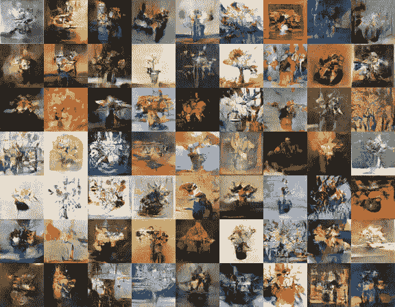

Novel Generation of Flower Paintings

**简介:**

这里介绍的工作是肯尼·琼斯和德里克·博纳菲利娅(均为威廉姆斯学院 2017 级)在教授[安德里亚·丹尼卢克](https://communications.williams.edu/experts/andrea-danyluk/)的指导下进行的长达一个学期的独立研究的结果。与这个项目相关的代码可以在 https://github.com/rkjones4/GANGogh[找到。Kenny 和 Derrick 明年都将作为软件工程师前往脸书，并希望继续研究 GANs。](https://github.com/rkjones4/GANGogh)

**背景:**

生成敌对网络(GANS)是由伊恩·古德菲勒等人提出的。艾尔。在 2014 年的一篇论文中。gan 解决了深度生成模型与深度判别模型相比缺乏相对成功的问题。作者引用最大似然估计的难以处理的本质作为这种差异的原因，最大似然估计是大多数生成模型所必需的。因此，gan 被设置为利用深度判别模型的强度来绕过最大似然估计的必要性，从而避免传统生成模型的主要缺陷。这是通过使用相互竞争的生成模型和判别模型来训练生成器来实现的。本质上，“生成模型可以被认为类似于一队伪造者，试图生产假币并在不被发现的情况下使用，而辨别模型类似于警察，试图检测假币。这场游戏中的竞争促使两个团队改进他们的方法，直到无法区分假冒品和真品。”更具体地说:

为了了解发生器在数据 x 上的分布 Pg，我们定义了输入噪声变量 Pz(z)的先验，然后将到数据空间的映射表示为 G(z；θg)，其中 G 是由具有参数θg 的多层感知器表示的可微分函数。我们还定义了第二个多层感知器 D(x；θd ),它输出单个标量。D(x)代表 x 来自数据而不是 Pg 的概率。我们训练 D 以最大化为训练样本和来自 G 的样本分配正确标签的概率，同时训练 G 以最小化 log(1D(G(z))。换句话说，D 和 G 用价值函数 V (G，D)玩以下两人极小极大博弈:min G max D V (D，G)= Ex∾Pdata(x)[log D(x)]+Ez∾Pz(z)[log(1d(G(z))]。(1)"

该游戏通过交替训练 G 和 D 来进行，直到达到纳什均衡，并且 G 产生的样本与数据集中的样本无法区分。该公式立即受到怀疑，因为该论文的作者解释说，这种方法会导致饱和梯度，因此他们在实际训练时使用了不同的公式。然而，在发表时，这一公式产生了一些已经发布的任何模型中最有前途的生成样本，并且它的一般结构允许其他人调整设计来创建问题的更细微的实例(good fellow et al .艾尔。2014).

辅助量词 GAN(AC-GAN)是 Augustus Odena 等人引入的。艾尔。2016 年。AC-GAN 为鉴别器增加了一个分类器层，为发生器增加了一个条件向量。然后，训练鉴别器，除了传统的真与假的 GAN 目标之外，还最小化分类误差。这种方法允许利用标签，并向 GAN 提供附加信息。此外，它还允许对发生器进行调节，以产生特定类别的样本。目前，这可能是最有效的条件 GAN，并且往往比使用未标记数据的 GAN 做得更好。这个模型利用了迁移学习和多任务学习(Odena et .艾尔。2016).

StackGAN 是由张等人介绍的。艾尔。2016 年。StackGAN 使用从递归神经网络检索的特征信息和两阶段图像生成过程——第一阶段从噪声向量创建低分辨率图像，第二阶段使用第一图像的编码来创建高分辨率图像。特征信息用于调节鉴别器和发生器。这种模型创造了高分辨率样品的艺术状态。

Wasserstein GAN(WGAN)是由 Martin Arjovsky 等人提出的。艾尔。并引入了一个基于理论和经验发现的新理论框架。通过这个新的框架，他们创建了 WGAN，该 WGAN 最小化了 wasserstein 距离的近似值，他们发现该距离对于生成性建模问题具有有用的理论属性，因为它在鉴别器中创建了更好的梯度，生成器可以更容易地从中学习(Arjovsky 等人。艾尔。2017).他们实施某些约束的方式被证明是不一致的，Ishaan Gulrajani 使用基于梯度的惩罚来约束鉴别器的斜率，从而对其进行了改进。该模型被发现在训练从通常模型到以前无法训练的模型的各种 gan 时非常健壮和有效(Gulrajani 2017)。

Wavenet 和 Conditional PixelCNN 是 2016 年谷歌出来的两个生成模型。GANs 也不是，但两者都利用了一个有趣的概念，叫做全球调节。全局调节的关键是使用调节向量，而不是在开始时一次性添加到噪声向量，而是作为神经网络中每个激活函数的调节向量。这允许比传统方法更强和更复杂的调节。他们还都使用门控乘法激活函数，这似乎与这种全局条件作用很好地啮合(van den Oord 2016 范登奥尔德 2016)。

**目标:**

我们本学期学习 GAN 的主要动机是试图将 GAN 衍生的模型应用于小说艺术的生成。深度学习中与艺术生成相关的许多工作都专注于风格，特别是特定艺术作品的风格。在诸如*艺术风格的神经算法*等论文中，深度学习网络学习 1)将一件艺术品的风格与其内容区分开来，2)将该风格应用于其他内容表示。通过建立 GAN 模型，我们希望建立一个深度网络，不仅能够学习许多不同艺术作品的风格和内容组件的分布，而且能够以新颖的方式组合这些组件来创建新的艺术作品。新颖内容生成的任务比将一个特定艺术作品的风格应用到另一个艺术作品的内容要困难得多。

**数据集和集合:**

由于 GAN 的生成组件只能学习表示呈现给鉴别器的真实分布，因此选择合适的绘画数据集对我们来说是一个至关重要的决定。我们首先尝试使用仅来自一位艺术家的绘画数据集:莫奈。经过几次初始测试后，我们发现我们在这个数据集上的模型收敛很差，因为只有 1200 幅画的数据集太小了。我们需要找到一种方法来增加我们的数据集的大小，所以我们求助于 wikiart 数据库，这是一个超过 100，000 幅绘画的集合，所有这些绘画都标有风格，流派，艺术家，绘画制作年份等(wikiart)。从这个数据集，我们知道我们将 1)有足够的数据使我们的模型可能收敛，2)我们将能够使用标记信息来提高我们的网络的学习能力:在 GAN 场景中，当训练时使用额外的条件信息通常是有帮助的，特别是当学习具有清晰子分布的分布时(即，风景与肖像)。在我们模型的最终版本中，我们通过创建 python 脚本来构建数据集，直接从 wikiart 网站上抓取超过 80，000 张单独的图像，同时保留每张图像的风格和流派标签。

**型号:**

在设计我们的模型时，我们希望在典型 AC-GAN 框架的扩展中利用改进的 wasserstein 度量的能力。在一个高层次上，这意味着我们最初在改进的 wasserstein 模型下设置我们的鉴别器和生成器，但是除此之外，我们还向我们的鉴别器添加了一个分类组件，它还将尝试预测给定绘画的流派。然后，我们的生成器被扩充以接收标签数据的一个热点向量，其目的是影响所生产的绘画的流派。我们可以通过向我们的鉴别器的成本函数添加一个惩罚项来加强这种度量，该惩罚项试图最小化它对给定绘画的真实流派的流派预测的交叉熵，并向我们的生成器添加一个惩罚项，试图最小化鉴别器的预测与它根据条件向量被指示做出的流派的交叉熵。

我们对标准 GAN 模型进行的另外两项修改是包括了预训练和全局调节。这两个添加都是在我们观察到我们的模型在第一次迭代中非常注重产生“真实”与“虚假”图像的趋势后做出的，只是后来才学会在调节流派时提供不同类型的表示。我们假设其中一个原因是，当开始训练时，我们的鉴别器根本没有学会流派之间的区别，结果是生成器不能像我们希望的那样早地开始区分。我们提出的解决方案是在任何生成器训练之前对我们的鉴别器进行预训练，通过这种方式让我们的鉴别器对不同流派之间的差异有一个初步的了解。在普通 GAN 公式中，这将导致有问题的行为和较低的收敛机会，但当我们使用 wasserstein 度量时，它限制了鉴频器的功率，并始终为发生器提供平滑的梯度，我们实际上在此框架下达到了更优化的状态:在 GAN 设置的“优化”公式中，我们将在每个发生器训练步骤之前训练鉴频器收敛。

我们包含的全局条件再次允许我们的生成器更好地区分其产生的内容，作为其条件向量的结果。全局调节背后的思想是，每当我们在网络中的层之间执行激活功能时，我们可以使用调节向量来影响该激活如何发生，并且可以在逐层的基础上不同地使用该调节向量。我们选择使用来自 Conditional PixelCNN 和 Wavenet 的条件门控乘法激活函数。据我们所知，这是首次将全局调节应用于 GAN 框架。

**详细架构:**

发电机:

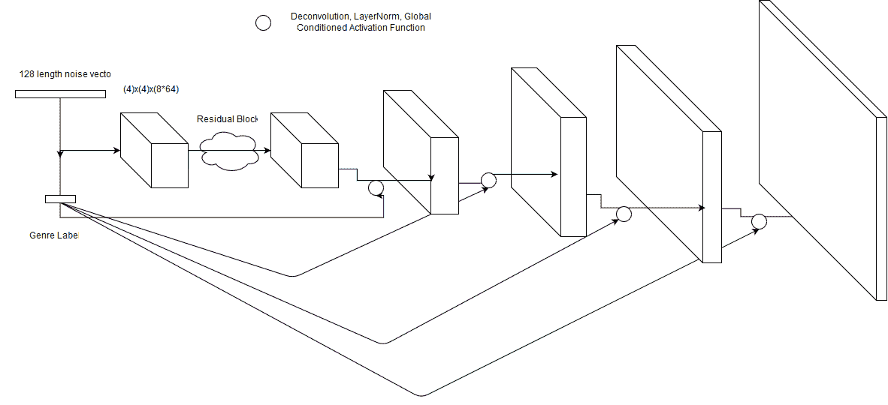

鉴别器:

**结果:**

在这里，我们展示了一系列从我们的三个流派中挑选出来的照片。

鲜花:

风景:

肖像:

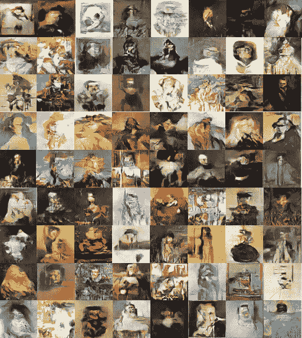

由于我们的鉴别器的性质，我们能够使用它来选择我们的生成器产生的“好”图像。具体来说，由于我们的鉴别器能够对图像的真实性进行分类和判断，我们可以为特定的流派产生一组生成器图像，并从这些图像中要求鉴别器选择它 1)以高置信度分类为该流派并且 2)还判断具有高真实性值的图像。这就是产生上述图像的方法。

我们也可以在一个静态噪声向量下，通过改变给定的条件信息，来观察发生器是如何区分流派的。所有流派的这些图片都可以在附录中看到。这里要注意的是，虽然生成器已经明确地学会了产生不同种类的流派，但是它们并没有像我们所希望的那样被区分开来。此外，所产生的艺术作品的质量也有很大的差异，其中一些所产生的图像比其他图像好得多，即使对于给定的噪声矢量，在特定的流派中也能更真实地表现出来。我们认为这种现象的原因再次是，我们的模型学习“真实”与“虚假”艺术的表现比在给定的“流派”中创作艺术要容易得多。通过增加预训练和全局调节，我们在一定程度上缓解了这个问题，但显然没有完全解决它。我们面临的另一个挑战是，一些艺术流派比其他流派复杂得多，或者差异更大。特别是，这导致我们的生成器在生成某些类型(如神话画和动物画)时性能不佳，尽管我们假设给定更大的数据集，我们的模型也应该能够生成这些类型的真实示例。

虽然我们在这个项目中的主要动机是生成图像，但我们也能够通过将它作为分类器来评估我们的鉴别器的有效性。我们在训练集和大小为训练集 1/20 的测试集上测量了我们的分类能力，并在我们的测试集中获得了 90%以上的分类准确率。我们注意到，虽然我们的分类精度并不严格，但它优于在相同数据集上执行的其他分类指标，Wai Ren Tan 在 2016 年在大约相同的数据集上获得了 74.14%的分类精度(我们的数据集只是略有不同，因为我们在不同的时间点抓取了 wikiart 网站)(Tan 2016)。

**未来工作:**

我们项目中的一个实质性限制因素是我们对计算资源的访问。使用只有 2GB 内存的 GPU，我们被迫坚持生成 64x64 像素的图像，因为任何更高的分辨率都迫使我们的批量大小和模型的维数显著减少。当将我们的 64x64 模型生成的图像与我们最初的 32x32 模型进行比较时，我们注意到我们的模型有了显著的改进，因此我们假设，通过增加计算资源，允许缩放到 128x128 图像，在我们当前的架构下，图像的质量也会显著提高。在考虑将艺术生成的问题扩展到更大的图像尺寸(如 256x256)时，我们认为受 StackGAN 影响的架构使用我们提出的两个 GAN 模型可能会非常有效。我们认为这种架构可以提供的一个实质性好处是，我们的阶段 I GAN 可以作为一种强制区分不同类型的方式，因此阶段 II GAN 在阶段 I 图像上进行调节时，将更适合于克服我们在模型中看到的困难，其中具有不同调节信息的噪声向量映射到相似的图像。我们还注意到，这种两层 GAN 模型可以通过额外的调节信息来改进，具体来说，我们建议，除了我们的模型中描述的流派调节设置之外，可以在第二阶段鉴别器和第二阶段发生器的输入中使用另一个具有风格信息的热矢量，然后可以进一步划分所生成的艺术组合，例如文艺复兴肖像与抽象肖像。

**结论:**

虽然我们不认为我们的模型“解决”了艺术生成的问题，但我们希望能够对使用 GANs 生成新艺术的方式提供见解。具体来说，我们已经表明，在正确的条件度量下，wasserstein 风格的 GANs 能够以一种有用的方式考虑条件信息，用于“硬”图像分布。此外，我们已经证明了全局调节是对 GAN 框架的有效补充。我们还指出了我们为特定流派选择的鉴别图像，以验证这一研究路线，因为很明显，我们的生成器在为特定流派制作小说艺术方面做得非常出色。

**作品引用:**

Arjovsky、Martin、Soumith Chintala 和 Léon Bottou。"瓦瑟斯坦·甘" *arXiv 预印本 arXiv:1701.07875* (2017)。

伊恩·古德菲勒等着《生成性对抗性网络》*神经信息处理系统的进展*。2014.

改善瓦瑟斯坦甘斯的训练。 *arXiv 预印本 arXiv:1704.00028* (2017)。

奥登纳，奥古斯塔斯，克里斯多佛·奥拉和黄邦贤·史伦斯。"使用辅助分类器的条件图像合成." *arXiv 预印本 arXiv:1610.09585* (2016)。

谭，，等。《不是一根管子:一个用于美术绘画分类的深度卷积网络》*图像处理(ICIP)，2016 年 IEEE 国际会议上*。IEEE，2016。

《Wavenet:原始音频的生成模型》 *CoRR abs/1609.03499* (2016)。

用像素 cnn 解码器生成有条件的图像。*神经信息处理系统的进展*。2016.

维基亚特。[https://www.wikiart.org/](https://www.wikiart.org/)

张，韩，等。〈堆叠式甘:利用堆叠式生成对抗网络进行文字到照片的真实感图像合成〉。 *arXiv 预印本 arXiv:1612.03242* (2016)。

**附录:**

用相同的噪声矢量但不同的调节矢量产生的图像。

摘要:

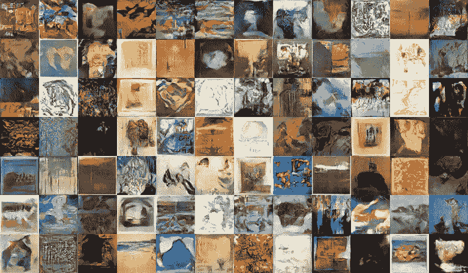

动物绘画:

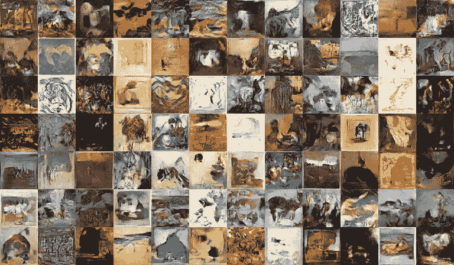

城市景观:

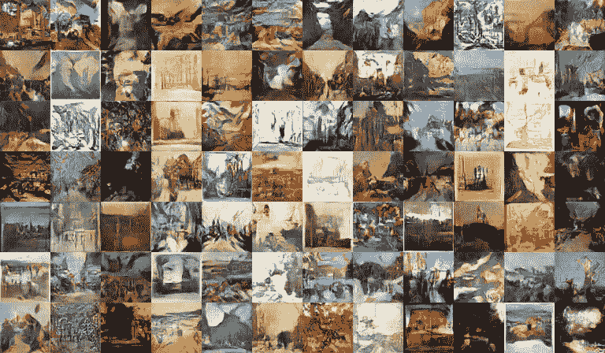

比喻:

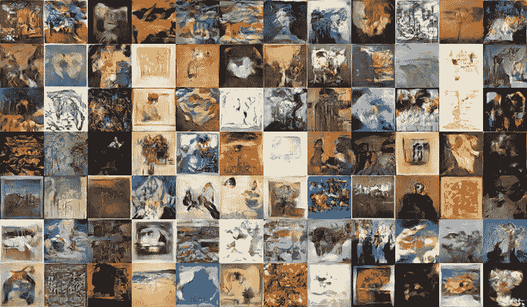

花卉画:

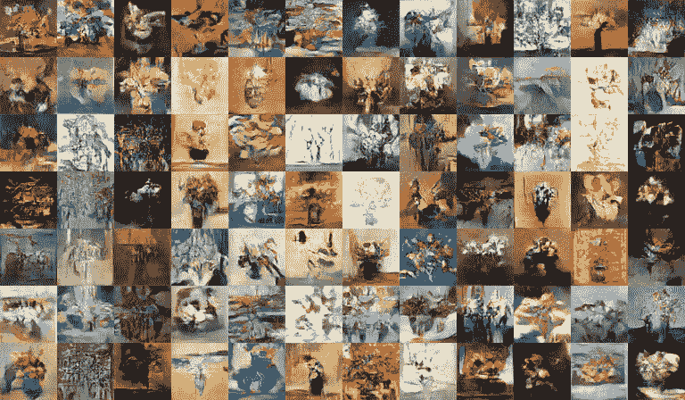

风俗画:

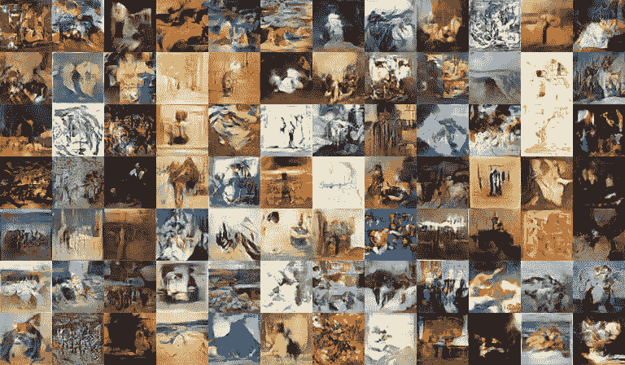

风景:

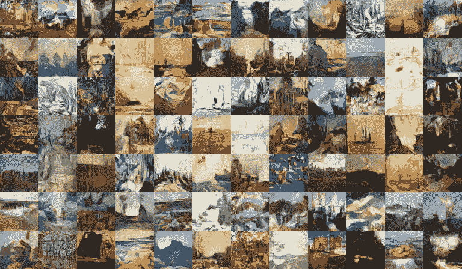

玛丽娜:

神话绘画:

裸体画:

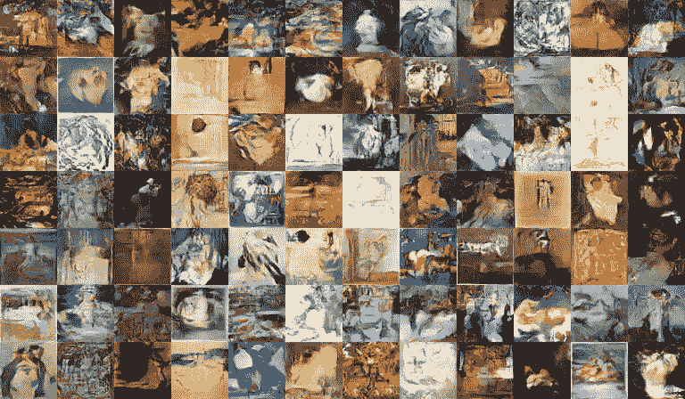

肖像:

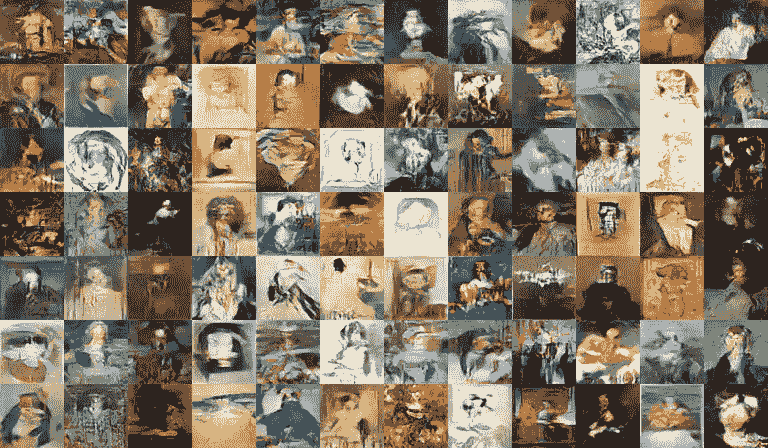

宗教绘画:

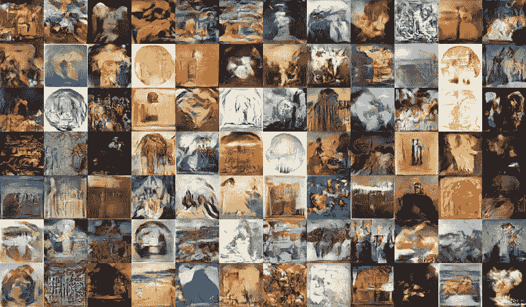

静物:

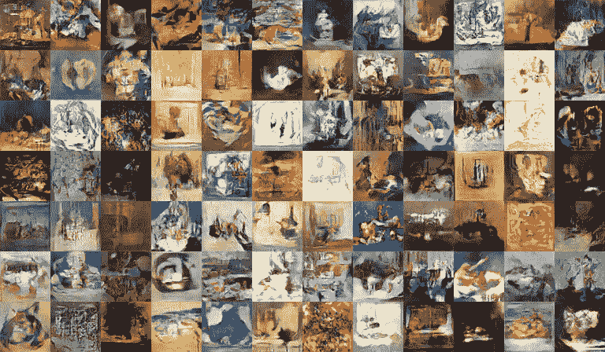

象征性绘画:

