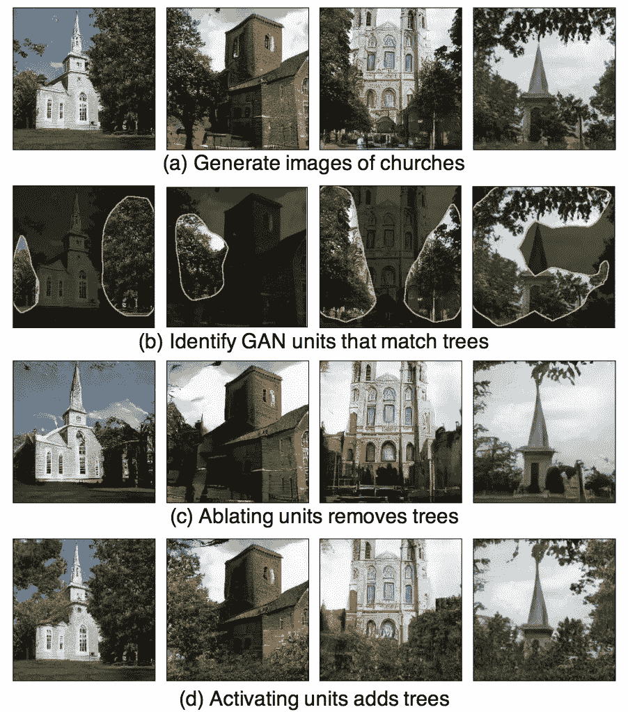
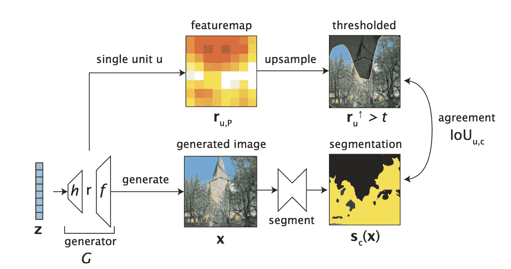
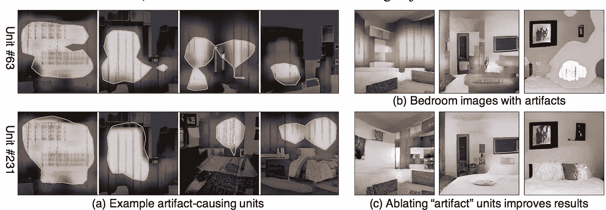

# 去神秘化的甘——他们到底学到了什么？

> 原文：<https://towardsdatascience.com/gans-demystified-what-the-hell-do-they-learn-142575c878db?source=collection_archive---------7----------------------->

## 可视化生成性对抗网络

本文是研究论文“ [*甘剖析:可视化和理解生成性对抗网络*](https://arxiv.org/abs/1811.10597) ”的总结。本文对 GANs 的内部表示提供了极好的见解，并对以下问题给出了严密的回答。

甘一家到底在学什么？我特别指的是发电机。我们都见过 GANs 产生的惊人结果，在某些情况下几乎与人类的工作无法区分。但是它们是如何表示学到的知识的仍然是一个谜。他们只是简单地学习像素模式并合成他们所看到的吗？还是他们真的从训练数据中捕捉到了复杂的关系？

本文试图解释 gan 的表示，并举例说明可视化和调试它们的技术。它使用两个阶段来实现。

Overview of the work. Watch the [demo video here](https://www.youtube.com/embed/yVCgUYe4JTM?rel=0&autoplay=1)

## 解剖

剖析的目的是识别生成器中层的输出所代表的对象类。G 中的一个特殊单位代表树吗？

一些术语:

**单元:**发电机的各通道特性图 G
r:一层发电机的输出

基于 Bau 等人(2017)，过滤器的特征图给出了对象类分割的良好近似。对于我们感兴趣的每个对象类，我们首先计算生成的图像中该类的分割掩码。我们使用下面的公式对单元 u 的特征图进行上采样和阈值处理。然后，我们取这个阈值化的、上采样的特征图和该类的分段掩码之间的 IOU。

**∧** 表示交集， **∨** 表示并集。 **s_c(x)** 表示图像 x **中特定类别 c 的分割掩模。**上面也提到了计算特定单元和类的阈值的公式。简而言之，上面的公式给出了一个度量**一个单位 u 多少代表 c 类**。你可以在论文中读到更多关于阈值公式背后的直觉。

1

因此，通过对每个类 c 获得的值的这些分数进行排序，对单元所代表的概念(对象类)进行排序

**TLDR；**解剖允许你发现与一个对象类最匹配的单元。但这并不一定意味着他们要对产生它们负责。

## 干涉；干预

干预旨在发现一组单元是否导致对象类别 c。这是通过打开和关闭单元并观察对生成的图像 g 的影响来完成的。

**r:** 张量输出(激活图)来自生成图像 G 中某一特定层的 **G
U:** 单位集 **P:** 像素

**消融**是指通过将 U 中的单元设置为 0 来关闭它们。另一方面，**插入**强制 U 中的单位等于 **k** ，每类常数 a。通过取引起 c 的单元的特征图的平均值来计算 c 类的 k。

上面的公式给出了多少单位 U 负责生成 c 类的度量。该度量被命名为平均因果效应 **(ACE)** 。这里， **s_c(x)** 表示像素 p 处的图像 x 中的 c 类分割图。因此，基本上，插入和切除对 G 中 c 类分割图的因果影响之间的差异。

但是我们怎么知道如何选择最优的单位 U 呢？很难进行彻底的搜索来选择最佳组合。这是通过使用一个巧妙的目标函数，并将这项工作外包给梯度下降来完成的。

我们将 **U** 设为整个单元集，但是用参数向量α对它们进行加权。**随机梯度下降**然后被用于最大化目标函数(ACE)和最小化最优集合中的单元数量(通过使用阿尔法的 L2 正则化项)。

L2 regularisation term is added to minimize number of units in the optimal set

下图显示了消融导致树木的单元如何成功地从生成的图像中移除树木。

Ablating units to remove trees

## 简单地说，结果

**层间差异:**根据结果，第一层与井对象类别不匹配。这具有直观的意义，因为早期的图层通常表示原始特征。中间层有许多匹配语义对象和对象部分的单元。结束层匹配局部像素模式，如材料、边缘和颜色。

**GAN 架构之间的差异:**本文还通过检查单元讨论了不同架构在内部表示方面的比较。

**经由插入的上下文关系:**该论文还描述了通过强制单元将特征插入到生成的图像的特定位置。一个有趣的观察是，像门这样的物体只能被插入到视觉上有意义的特定位置(如窗户附近的建筑、砖块)。这表明 GANS 实际上捕捉了物体之间的关系，而不仅仅是像素模式。

上图说明了对象类的生成是如何高度依赖于本地上下文的。插入的实际效果因发生的地点而异。

## 诊断 GANs

通过使用干预技术，我们可以研究生成的图像中错误/不期望的部分和伪影的原因。通过手动注释和去除引起的单元，GAN 的结果可以得到相当大的改善。下图说明了消融伪影产生单元如何产生可见结果。

使用这个框架，您可以手工定制和影响 GAN 的结果。增强或减少某些对象类的存在(在一定程度上)是相对简单的。

## 最后的想法

这篇论文很好地试图揭开 GANs 的神秘面纱，这是一个迄今为止相对未被探索的话题。他们的框架使研究人员和实践者能够更好地调试、改进和理解他们的模型。

所讨论的调试方法大多基于人工监督。然而，我相信本文中介绍的推理和技术可以潜在地用于开发更自动化的技术来改进 GANs(本文讨论了一种自动识别工件单元的技术)。

**演职员表:**取自论文的想法、公式和图像。

# 参考

【甘剖析:可视化与理解生成性对抗网络

[项目官网](https://gandissect.csail.mit.edu/)(附 Github 代码、演示视频、幻灯片等)

[交互式甘绘制工具](http://gandissect.res.ibm.com/ganpaint.html)