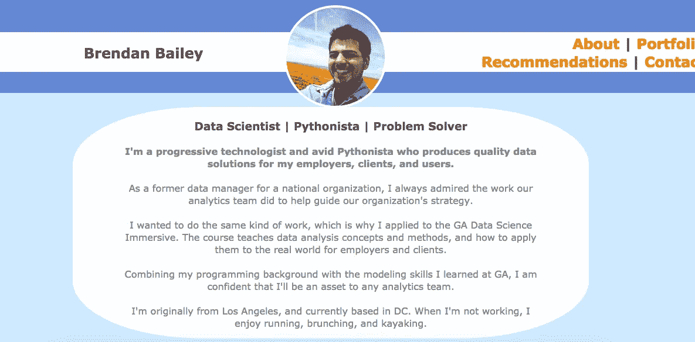

# 大会毕业生招聘

> 原文：<https://towardsdatascience.com/general-assembly-graduate-for-hire-509210e5267b?source=collection_archive---------6----------------------->

我最近从大会的数据科学项目毕业，并为我的下一次冒险感到兴奋！我在劳联-产联有五年管理、管理和可视化数据的经验。我正在寻找一个可以继续使用这些技能的地方，同时也磨练我新获得的机器学习技能。我主要在 DC 和洛杉矶地区找工作，但也愿意去旧金山、圣地亚哥和拉斯维加斯(这些都是我住过的城市)。

**巨大的成果**

我很高兴我不是一个人在找工作，而是有大会的结果的帮助。Outcomes 是大会的职业准备部门，我希望其他教育机构能够复制他们的模式。

对于结果支持，你需要写 10 篇博文(这是我开这个博客的原因)，创建一个[在线文件夹](https://brendanbailey.github.io/)，以及其他一些要求。这是为了让学生习惯于获得曝光和网络。该计划本身是一个支持小组，有几项责任措施:每周申请 10 份工作，每月参加 2 次社交活动，以及其他目标。

My Portfolio brendanbailey.github.io

除了支持小组，Outcomes 还将您与雇主联系起来。昨天我们在学生聚光灯下展示了我们的作品集。我与优步、蓝色实验室和摩根富兰克林咨询公司进行了几次有意义的交谈。

最后，我对大会成果小组提供的支持感到非常兴奋。

**建设性的批评:简历**

我对大会的职业准备计划的一点建设性的批评是关于要求学生在简历中两次列出 GA，一次在经验下，一次在教育下。

对于没有技术背景的学生来说，这完全有意义。如果你想在科技行业找份工作，那么你应该尽一切努力突出你的科技技能，这些技能主要来自你在 GA 的经历。

然而，对于有技术背景的学生来说，学习一门课程来补充他们的经验或转换行业，那么这是重复的。例如，我用 Python、SQL、AWS 和大会上涉及的其他工具为美国劳工联合会-产业工会联合会管理了五年的政治和会员数据。我来 GA 的原因是通过获得机器学习技能来补充这一经验，以及探索政治以外的行业。这一组中还有其他具有 SQL 和商业智能经验的学生，他们可能也属于这一类别。

在这些学生的简历中两次列出大会是一个问题，因为它可能会挤占其他相关的有偿经验。根据以前的经验对学生进行细分，可以帮助大会更好地解决他们的相对需求。