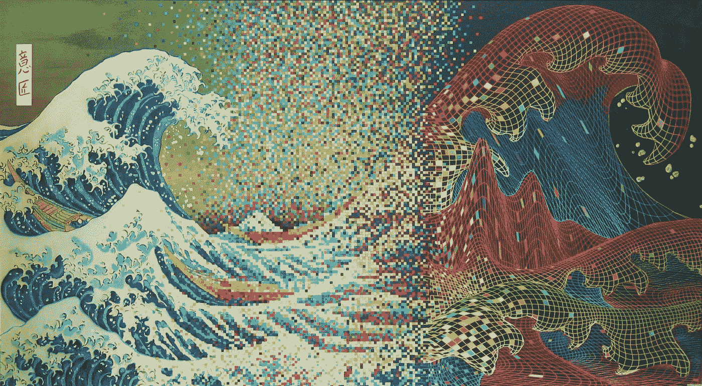
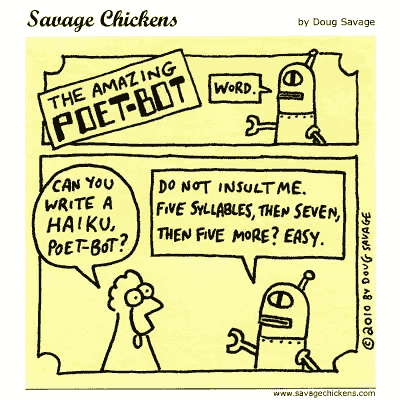
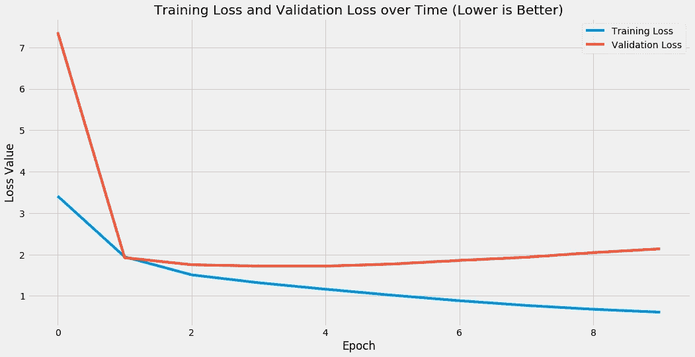

# 用深度学习生成俳句(第一部分)

> 原文：<https://towardsdatascience.com/generating-haiku-with-deep-learning-dbf5d18b4246?source=collection_archive---------5----------------------->

## 使用神经网络生成 5–7–5 音节结构的俳句。

[https://imgur.com/r/all/4aYN3](https://imgur.com/r/all/4aYN3) (Original source unknown)

有很多关于使用深度学习生成文本的工作——计算机生成模仿人类书写文本的新文本。甚至简单的模型也能产生令人信服的文本，正如安德烈·卡帕西因[而出名。但是他们努力的一个地方是当文本必须满足严格的结构约束时。**我们如何改进当前的文本生成模型，使其更好地完成这项任务？**](http://karpathy.github.io/2015/05/21/rnn-effectiveness/)

俳句生成是严格约束任务的一个例子。它们是由三行诗组成的非常短的诗。传统上第一行是 5 个音节，第二行是 7 个音节，第三行是 5 个音节。例如，由[布莱恩·德尔·韦基奥](http://wiki.c2.com/?HaiKu):

> 俳句的发明者
> 的中指一定有七根手指

现代俳句保留了一首简短的三行诗的精髓，但并不严格遵循 5-7-5 音节的结构。因此，大多数用于获取训练数据的在线俳句都不具备这种结构，而且许多先前关于生成俳句的研究也没有强制音节数。

这让我想到了我的问题:**我们能创作出既有意义又结构正确的俳句吗？**

[https://www.savagechickens.com/2010/02/easy-haiku.html](https://www.savagechickens.com/2010/02/easy-haiku.html)

# 先前的工作

我以前做过俳句生成方面的工作。[这个生成器](http://jeremyneiman.com/haiku/)使用在非俳句诗歌语料库上训练的马尔可夫链，一次生成一个词，当所有可能的下一个词都违反 5–7–5 结构时，通过退格确保 5-7-5 结构。这和我写俳句时做的没什么不同。我尝试一些东西，数出音节，发现它们不起作用，然后返回。但这并不令人满意。这感觉更像是蛮力，而不是真正理解写俳句意味着什么的东西。我还使用了同样的方法，使用了一个非诗歌训练语料库。

我不是唯一一个尝试过的人。萨姆·巴拉斯和 T2【塔内尔·基尔斯&马库斯·康塞普都使用了标准的字符级递归神经网络(RNN)来生成俳句。他们产生的输出看起来像俳句，但不是很有凝聚力，当然也不符合我们所寻找的结构。部分问题是，正如我上面所说的，大多数现代俳句不遵循这种结构，这意味着训练语料库不会反映它。另一个问题是，字符与音节的相关性很差，因此，即使有一个好的语料库，只给字符的模型也不太可能选择 5–7–5 形式。

[杰克·霍普金斯和多维基拉](https://research.fb.com/publications/automatically-generating-rhythmic-verse-with-neural-networks/)提出了几种生成诗歌的模式。他们把重点放在十四行诗上，十四行诗不仅对每行的音节数有限制，而且必须遵循特定的押韵方案。一个模型是音素级别的，这允许他们在训练时限制结构。另一个是字符级模型，可以产生更连贯的文本，但对形式没有任何限制。他们在采样时通过使用鉴别器来限制文本，该鉴别器将拒绝不符合期望度量的文本，类似于我的马尔可夫模型技术。

# 数据

我使用了四个来源来构建我的训练语料库:

*   [http://www.tempslibres.org/tl/en/dbhk00.html](http://www.tempslibres.org/tl/en/dbhk00.html)
*   来自《[叙事描述之外的三行诗:多元对抗训练下的意象生成诗](https://github.com/bei21/img2poem/blob/master/data/unim_poem.json)》语料库。
*   山姆·巴拉斯的诗集。
*   赫瓦尔·弗莱雷的[海枯藻](https://github.com/herval/creative_machines/blob/master/haikuzao/src/main/resources/haiku.txt)文集。

[这个 Jupyter 笔记本](https://github.com/docmarionum1/haikurnn/blob/master/notebooks/data/Preprocess%20Haikus.ipynb)有我的资料准备流程。它清理数据并使用[CMU 发音词典](http://www.speech.cs.cmu.edu/cgi-bin/cmudict) (CMUdict)计算每行的音节数。CMUdict 将单词映射到它们的音素，这又可以用于计算每个单词的音节数。如果一个单词有多个有效发音，则保留每个发音。

最终的语料库包含了 25886 首诗，其中只有 725 首(3%！)匹配 5–7–5 结构，这远远不足以训练模型。

# 问题是

这让我们陷入了困境。我们的目标是生成符合传统的 5–7–5 结构的俳句，但我们在这方面的训练数据很少。我们有什么选择？

1.获取更多数据。如果有人自愿为我写几千首俳句，我很乐意接受这个提议。

2.使用类似于霍普金斯和基拉所做的方法，我们在整个语料库上不受限制地训练一个字符级网络来“学习英语”——学习如何构成单词、句子结构等。，然后在采样时使用一个可以将诗歌分类为俳句或不分类的鉴别器来约束形式。这种方法的一个问题是，它可能很难产生有凝聚力的、完整的俳句。从本质上讲，生成器是贪婪的，它将一直生成文本，直到鉴别器告诉它停止，此时不确定生成器是否完成了“完整的思想”。给定任何严格约束的格式，在采样时实施格式的同时，很难保持内容的内聚性。为了证明我所说的不完整的想法是什么意思，这里有一个例子，是我以前的作品使用类似的样本时间限制生成的一首诗:

> 哦，福楼沙，看看
> 它来得多快，滋养着
> 食物，直到最后死亡

击杀*什么*？

3.在整个语料库上训练，但是在训练时告诉网络*和在采样时告诉网络*该行有多少音节。即使我们在一条有 3 或 10 个音节的线上训练，我的*希望*是当我们在采样时间要求 5 或 7 个音节时，模型可以概括。这是我采用的技术。

# 模型

High level diagram of the model. Three dense layers are used to embed the number of syllables for each line into the LSTM’s state. Then text is fed through the LSTM one character at a time and a dense network

该模型本质上是一个扭曲的字符到字符的文本生成网络。每行的音节数被提供给网络，通过一个密集层，然后添加到 LSTM 的内部状态。这意味着通过改变提供的三个数字，我们可以改变网络的行为。我的希望是，这仍然允许网络从整个语料库中学习“英语”,即使大多数样本不是 5-7-5 句俳句，同时仍然允许我们以后生成那个长度的俳句。[这个 python 文件](https://github.com/docmarionum1/haikurnn/blob/master/notebooks/models/v1/models.py)实现了模型和生成器。

[这个 Jupyter 笔记本](https://github.com/docmarionum1/haikurnn/blob/master/notebooks/models/v1/Training.ipynb)展示了训练过程。简而言之，我在角色层面对数据进行一次热编码，将数据分成训练集和验证集，然后使用[教师强制](https://machinelearningmastery.com/teacher-forcing-for-recurrent-neural-networks/)进行训练。我在 Paperspace P6000 虚拟机器上对该模型进行了大约 2 个小时的训练，尽管在 4 个周期之后，它很快就停止了改进。这是一张培训和验证损失随时间变化的图表:

The training loss (blue line) and validation loss (red line) after each epoch of training. After two epochs the validation loss is almost as good as it will get, and it gets worse after epoch 4\. Meanwhile the training loss keeps improving, meaning the model is over-fitting the training data.

# 结果

最后，我们到了有趣的部分——看看这会产生什么样的废话。

为了生成每首俳句，我首先为三行中的每一行指定我想要的音节数(即 5，7，5)。然后，我为第一个单词随机选择一个字符，并将其输入模型，该模型输出每个字符成为下一个字符的概率。我从这些字符中选择一个，与它们的概率成比例，并根据“温度”进行缩放，温度影响我们选择低概率字符的可能性。温度越高，随机性越大。一旦我选择了下一个字符，我就将它反馈到模型中，并重复直到行尾。在行间，我输入下一行的音节数来更新 LSTM 的状态。[该函数](https://github.com/docmarionum1/haikurnn/blob/master/notebooks/models/v1/models.py#L104)包含生成代码。

*当验证损失停止下降时，我在训练时期 4 后使用检查点生成了以下所有内容。*

以下是一些采样温度为 0.1(不太随机)时产生的 5–7–5 个俳句:

> 就在我走在沙滩上的时候
> 太阳像一顶皇冠
> 春天来了
> 
> 正当我越来越深的时候，我想看看春风的底部
> 
> 清晨的太阳
> 从被搬运的花园命运
> 日落时的星星

虽然音节数并不完美，但很酷的是我们可以看到我们提供的音节数影响了生成的文本。例如，输入 3–5–3 会产生:

> 春天的阳光
> 来自星星的水的味道
> 
> 深冬
> 来自星星的乌鸦
> 的气味
> 
> 海滩上学
> 水的味道
> 天空中

而 10–10–10 会产生更长的线:

> 上帝一定偷听到了春天的友好气息随着我的每一次心跳，我将爱你
> 
> 你能看见太阳的离去吗？我想看看太阳在春天的消逝，在落日的余晖中
> 
> 就像街灯说的那样，阳光灿烂，灵魂和春天在吹拂，我将爱你，伴随着我每一次心跳

如你所见，它可能相当重复和公式化。我们可以调高采样温度，让模型更有“创造性”取样温度

5–7–5 首俳句，温度 0.3:

> 春天晚上的早餐
> 我和一只蝴蝶看见了
> 她面朝大海
> 
> 一月的黎明
> 老路树上蛾子清扫的声音
> 
> 月亮上滑稽的下午
> 和春风的轨迹

到了 0.5 岁，它开始在拼写上有问题:

> 远离公路
> 千里之外的村庄
> 夏想的大海
> 
> 每一个睡觉的妻子都从他的手里掉下来
> 和同一个枕头
> 
> 棉下
> 的个人时间
> 在电脑灯下

到了 1.0 版本，这几乎是无稽之谈:

> 佐德过去最后一个巴斯特？我从未向往过冬天的山

这个 Jupyter 笔记本有更多生成的俳句。

# 未来的工作

这是一个好的开始。对于当前的所有缺点，我们证明了**通过将音节的数量作为模型的输入，我们可以影响生成的行的长度**。

要改善这一点，还有很多工作要做。我想谈几个问题:

*   更加一致地坚持 5-7-5 音节形式，而不仅仅是在正确的邻近地区。
*   创作更连贯、更有意义的俳句

从哪里开始的一些想法:

*   更多更好的数据。我想得到更多的 5-7-5 个俳句的例子，或者一种在任何文本上训练然后从中产生俳句的方法。
*   尝试其他神经网络架构，比如一个更简单的模型，我预先输入音节数，然后生成整个俳句，而不是一次一行。
*   尝试一个音素级别的模型，类似于霍普金斯和基拉在他们的工作中使用的模型。这将使学习音节变得更容易，因为只有特定的音素才有音节的重量。但是它引入了将音素映射回单词的复杂性。
*   使用生成性对抗网络(GAN ),在该网络中，鉴别者可以评估俳句的内容和/或形式。

感谢 Abigail Pope-Brooks 的编辑和反馈。

*所有用到的代码和数据都可以在* [*github*](https://github.com/docmarionum1/haikurnn) *上获得。杰里米·内曼在他的网站上做着同样毫无意义的事情:*[*http://jeremyneiman.com/*](http://jeremyneiman.com/)