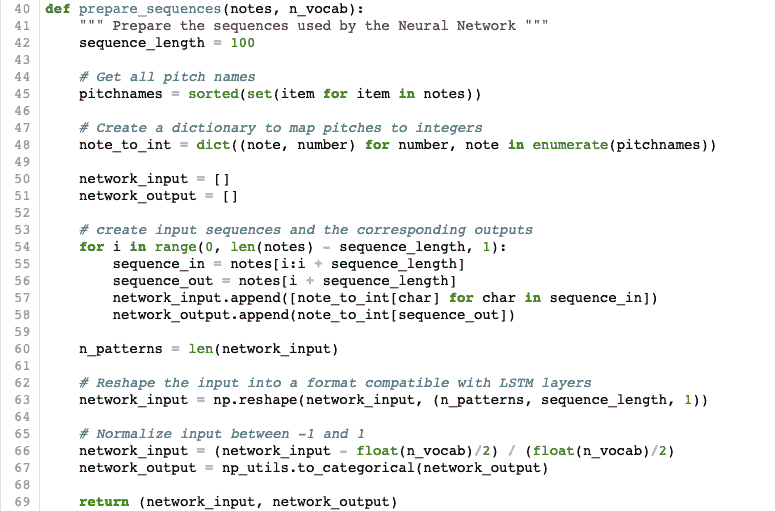
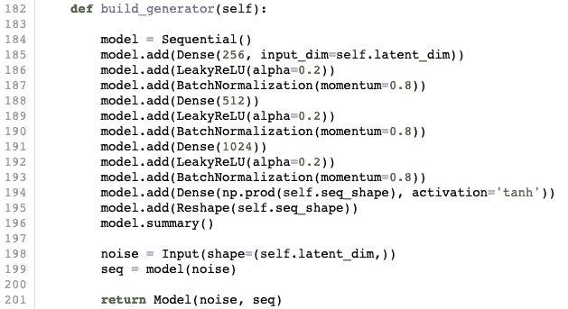
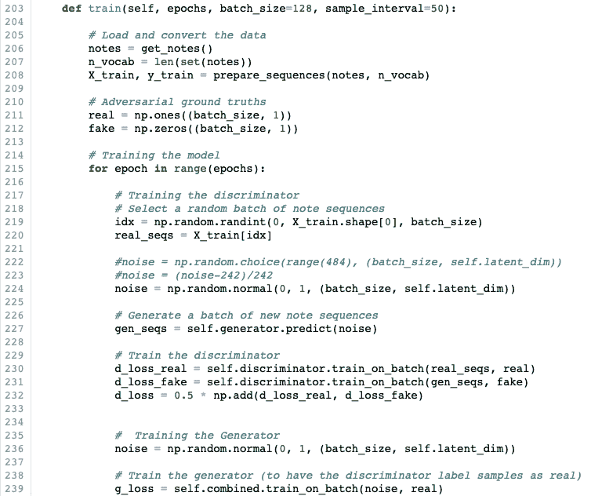
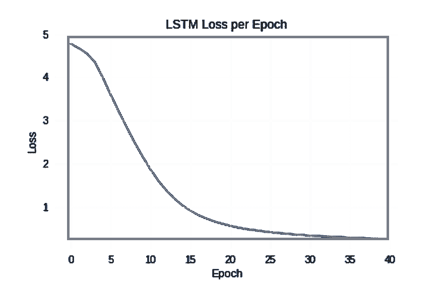
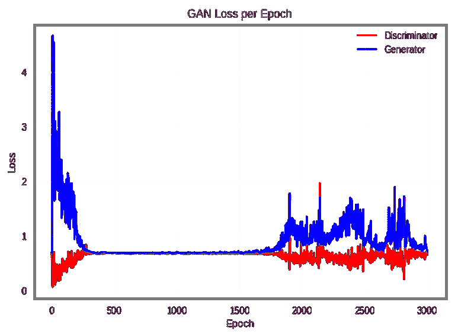
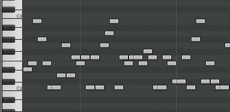

# 从神经网络生成受口袋妖怪启发的音乐

> 原文：<https://towardsdatascience.com/generating-pokemon-inspired-music-from-neural-networks-bc240014132?source=collection_archive---------2----------------------->

*Cory Nguyen、Ryan Hoff、Sam Malcolm、Won Lee、Abraham Khan 的项目*

> 机器学习技术能创造出好到足以愚弄人类的音乐吗？

# 一.摘要

最近，生成神经网络已经登上了艺术追求的舞台，如图像生成和照片修饰。这些深度学习网络开始留下印记的另一个领域是音乐生成。在这个项目中，我们的目标是探索使用 LSTM 和甘神经网络来生成音乐，就好像它是人为的。

通过将 MIDI 文件中的音符和和弦视为离散的顺序数据，我们能够训练这两个模型，并使用它们来生成全新的 MIDI 文件。我们成功地创造了真正的音乐吗？请继续收听我们的结果！

# 二。项目大纲

这个项目很大程度上是由两个独立的媒体职位启发和通知的。sigur ur skúLi 关于[使用 LSTM](/how-to-generate-music-using-a-lstm-neural-network-in-keras-68786834d4c5) 生成音乐的帖子帮助我们清楚地理解了使用音乐作为数据的机制和需要注意的问题。例如，单个乐器轨道是一个很好的起点，因为它们远没有那么复杂。钢琴音乐被特别提到，因为它有清晰、明确的音符，可以来自很宽的音域。此外，Alexander Osipenko 关于使用 GAN 生成音乐的帖子展示了一种替代方法，并向我们介绍了由于输入数据的顺序性而使用 RNN-GAN 的策略。

借鉴这两者，我们选择创建两个独立的神经网络架构:长短期记忆(LSTM)和递归生成对抗网络(RNN-甘)，我们在大约五个小时的 MIDI 文件形式的口袋妖怪视频游戏背景音乐上对其进行了训练。音符被转换成一个数字标度，并被标准化以输入到神经网络中。

经过多次实验，我们能够创作出与实际的口袋妖怪音乐相混淆的短歌曲。下面将更详细地讨论模型和参数，以及在时间和输出方面的性能比较。

# 三。数据收集和处理

如上所述，我们想要一个相对简单的钢琴音乐语料库来训练和学习。使这个项目在我们的时间框架内更加可行的其他标准包括寻找在类型和模式上同质的曲目，以及避免停顿的曲目。这仅仅是因为我们不知道模型在学习模式时如何处理无笔记空间。一组 307 首口袋妖怪歌曲(仅钢琴版)选自这个 MIDI 文件的[在线收藏。该语料库仅包含几代口袋妖怪游戏的背景音乐(意味着没有停顿)，每首曲目长度约为一分钟。这里可以看到一个音轨示例:](https://www.reddit.com/r/WeAreTheMusicMakers/comments/3ajwe4/the_largest_midi_collection_on_the_internet/)

我们使用 Music21 从 MIDI 文件中提取相关信息，该软件也在 Skúli 的文章中介绍过。Music21 允许我们将每个音轨的音符和和弦(音符组)读入 Python，同时保持它们的顺序。每个音符都表示为其特定的音符类型或相应的数字。然后，这些音符被转换为 0:1 比例(对于 LSTM 输入)或-1:1 比例(对于 GAN 输入)。

Function to prepare sequences for GAN input

来自每个音轨的信息被合并成一个列表，然后被分成 100 个音符的片段。当然，音乐比音符本身更复杂。我们原本打算使用 MIDO 包提取其他数据特征，如时间和后效。然而，这增加了复杂性，使得训练模型明显需要更多的资源，因此在我们的时间框架内是不可行的。

# 四。学问

T 我们在 Music21 包的输出中认识到的第一个特征是，它可以被视为文本数据，每个音符被解释为一个“单词”基于我们对自然语言处理的先验知识，我们认为 LSTM 网络可以有效地对笔记随时间变化的模式进行建模。这种直觉得到了 Skúli 帖子的肯定。此外，他的帖子向我们介绍了 Keras，这是一个深度学习库，可以使用 CPU 或 GPU 通过 Tensorflow 后端运行。由于其计算速度和相对易用性，Keras 库最终成为我们两个音乐生成模型的主干。

## **长短期记忆**

LSTMs 有几个关键特性，使它们非常适合处理本项目中使用的歌曲。LSTM 是一种递归神经网络，它按时间顺序而不是按空间顺序处理信息。这个模型架构随着时间的推移共享特征权重，这允许它输出某种程度上一致的模式。此外，在这种情况下，长时间记忆和重复使用输入的能力，复制一种长期记忆，是非常有用的。因此，LSTM 让我们在一首歌曲中保持相对的一致性，并牢记一个“主题”。

LSTM “pipeline”

*来源:*[*【http://colah.github.io/posts/2015-08-Understanding-LSTMs/】*](http://colah.github.io/posts/2015-08-Understanding-LSTMs/)

与其他缺乏长期记忆的 rnn 不同，LSTM 就像一条管道，可以在很长的时间间隔内传输信息。它通过一个平行于网络的“管道”从过去收集信息，并使用门控机制来选择进出每一步的信息。这种机制源自乘以网络元素的 sigmoid 变换，执行三项任务来控制信息流:输入、遗忘和输出。它决定了新状态的哪些方面与新的输入相关，以前状态的哪些方面需要被忘记，以及状态的哪个部分被继续。这些机制允许 LSTM 使用复杂但自适应的参数来开发音符序列，模拟人们可能从歌曲中听到的模式。

下面是我们自己的模型中各层的分解及其目的。

第一层 CuDNNLSTM 是一个 LSTM 层，它使用 NVIDIA 的 Cuda 工具包来单独运行 GPU，使其在许多情况下比常规 LSTM 更快。这一层是我们的模型学习如何预测特定序列中的音符的关键。

丢弃层是一种正则化技术，它通过在每次迭代中随机删除一部分神经元来防止过拟合。这迫使模型通过在剩余的神经元之间分割所学的概念来概括它们。这对于音乐生成至关重要，因为过拟合将导致输出听起来与一首或多首原始歌曲几乎相同。

双向 LSTM 层通过使用过去和未来的信息将当前的音符联系起来。该层并行训练两个 LSTMs，其中一个以相反的顺序读取输入。为了真正理解为什么特定的和弦在特定的地点和时间被使用，我们需要通过回顾特定和弦之前和之后的内容来了解它。双向层模仿这种方法，从排序中学习并拼凑所需的音符。

密集层在神经网络中很常见。它们包含一层神经元，所有节点都从输入连接到输出。每个神经元计算其输入的加权和，并添加一个偏置向量。然而，根据激活功能，它可能被激活，也可能不被激活。该函数定义给定输入的节点的输出，并将结果映射到 0 和 1 之间的值。我们选择使用 Softmax 激活函数来完成这一任务，并将每个输出除以一个因子，使其总和为 1。然后，该模型可以生成一个概率分布，允许在其输出中包含多个类别。根据这些概率，我们可以在生成步骤中进行预测，这将在后面的**“音乐生成”中详细介绍**

## **生成对抗网络**

除了 LSTM 模型之外，我们还想构建一个 GAN，它能够完成同样的任务，即从经过音乐转换的输入中生成音乐。通过使用相同的输入，我们可以比较和对比输出的 MIDI 文件，找出一个模型优于另一个模型的地方。

在 GAN 网络中，鉴别器模型和生成器模型被同时训练和测试。鉴别器收到的是真实数据——在我们的例子中，是真实的歌曲——以及随机噪音产生的虚假数据。对于每个样本，鉴别器的任务是正确地将数据分类为真或假。另一方面，生成器的任务是从随机噪声中生成假数据，这些假数据能够欺骗鉴别器犯更多的分类错误(即，将真正的歌曲称为“假的”，反之亦然)。通过堆叠这两个模型，鉴别器模型和生成器模型开始相互竞争，在我们的例子中，期望的最终结果是生成器可以轻松地欺骗鉴别器(希望是人)。

Artistic representation of a GAN model

> 蒙特利尔大学的 Ian Goodfellow 是关于 GAN 的[原始论文](https://arxiv.org/pdf/1406.2661.pdf)的作者，他将 GAN 比作一群试图欺骗侦探(代表鉴别器模型)的绘画伪造者(代表发电机模型)。

已经有一些利用 GAN 制作音乐的作品，如 [MuseGAN](https://salu133445.github.io/musegan/) 和 [C-RNN-GAN](https://arxiv.org/pdf/1611.09904.pdf) 。对于我们的项目，我们决定将我们的 GAN 基于 C-RNN-GAN，但使用 Keras 实现它，以进一步开发我们新获得的库经验。

我们的输入数据几乎与用于训练 LSTM 网络的数据相同。然而，我们决定将输入规范化在-1 和 1 之间，而不是从 0 到 1。这是为了让我们的发电机网络变得更容易，该网络被馈送来自标准正态分布的随机噪声，期望它将产生范围在-1 和 1 之间的输出。

现在，为了实际构建 GAN，我们从鉴频器网络开始:

在这个模型中，前两层是 LSTM 层。这允许鉴别器在训练期间从我们的音乐输入中学习序列数据。如果没有这些层，我们发现只要生成器能够计算出输入数据的离散域，鉴别器就无法区分真实音乐和虚假音乐。有了 LSTM，生成器现在要做的不仅仅是简单地计算真实数据的范围；它还需要明白音乐遵循一定的模式。最后，我们选择了 sigmoid 激活函数，因为我们希望输出为单个 0 或 1，分别代表伪数据或真实数据。

接下来，发电机网络:

为此，我们可以看到生成器网络只是一个多层感知器，它接收等于潜在维度大小的随机输入(我们使用 1000，因为与 100 相比，它可以以最小的速度更好地学习)。有了这两个网络，我们就可以开始训练了:

为了训练这个堆叠模型，我们首先给生成器一批来自标准正态分布的随机噪声，并让它处理这些噪声，以生成一批编码为数字的 100 个音符的序列。然后将这些数据作为一组假数据传递给鉴别器，鉴别器将经历一次训练迭代。然后，生成器生成另一组假数据，并将其作为假数据传递给堆叠模型，以训练鉴别器和生成器。

## **音乐生成**

训练完这两个模型后，我们想生成新的 MIDI 文件。对于这两个模型，我们希望使用该模型根据输入进行预测，并创建对应于音符和和弦序列的编码输出。对于 LSTM 网络，我们从语料库中随机抽取 100 个音符序列，并将其输入到网络中，让它做出预测，这就是我们的编码输出。对于 GAN 网络，我们向生成器提供一个从标准正态分布中采样的随机数字序列，并让它进行预测。有了这些预测，我们可以使用 Music21 将我们预测的序列变成全新的 MIDI 文件。

# 动词 （verb 的缩写）结果和见解

我们所创造的样本包括在下面。首先，从 LSTM 模式来看:

接下来，从 GAN 模型来看:

## 损失与培训

我们使用交叉熵损失函数，因为它们适用于我们的两个模型:LSTM 使用分类交叉熵来选择接下来出现概率最高的音符，而 GAN 使用二项式交叉熵来选择将序列分类为真实或虚假的较高概率。

从这些损失图中值得注意的是，模型能够在运行时间(在 Google Colab 的 GPU 运行时间上不到 12 小时)和纪元方面相对快速地进行训练。我们可以将此归因于我们数据的小尺寸和我们对多个 LSTM 层的使用。就表现而言，LSTM 的表现符合预期，损失逐渐减少，直到收敛到渐近线。为了避免过度拟合，我们在训练模型时小心翼翼，不要超过它开始收敛的地方。

对于 GAN，初始损耗与预期一致:发生器损耗高，鉴频器损耗低。我们预计这些值会在某个点上收敛——发生器下降到起点以下，而鉴频器上升到起点以上。有趣的是，在大约 2000 个时期之后，发生器和鉴别器开始朝着它们的初始起点分叉，这表明它们可以被训练更长时间(尽管对于 5000、10000 和 100000 个时期来说情况并非如此)。这种不一致的一个可能的解释可能是由于数据的小规模或由于同时训练两个模型。

我们试图颠覆这种快速收敛的方法之一是使用随机离散噪声预先训练鉴别器。通过 10000 个历元的预训练，我们发现生成器需要超过 50000 个历元才能开始与鉴别器竞争:

(in thousands of Epochs)

当比较两种模型的输出时，我们发现 GAN 在输出 MIDIs 的真实性和训练时间方面更胜一筹。LSTM 模型倾向于在开始每首歌曲时，在调整之前重复几秒钟同一个音符。我们推断网络还没有被训练到足以有效地学习音乐中的所有模式，即使模型的损失开始渐近。然而与此同时，虽然我们可以减少缺失层并允许过度拟合，但我们希望避免创建一个模型，该模型可以有效地从我们用于预测的 100 个音符中填充预先存在的歌曲的剩余部分。使用 GAN 模型时，我们不必担心过度拟合，也不再有“卡住”音符。

**LSTM** is able to find a long pattern and repeat it. **GAN** only plays notes from high-to-low and back.

LSTM 胜过 GAN 的地方在于对某些模式的执着。我们发现 LSTM 能够更好地专注于特定的模式，并在一首歌的整个过程中重复利用它们。该模型还能够跳出某些音符循环，并过渡到另一组音符循环。就甘而言，它只能掌握基本概念，如以由低到高的方式提升音符，而不会陷入更微妙的模式。

# 不及物动词结论

## 未来的工作

我们当前的音乐生成过程可以通过使用编码器-解码器框架来改进。这使我们能够将其他乐器演奏的音乐转换成模型的标准输入。也可以通过允许输入包含 MIDI 文件中包含的其他信息来改进输入，如力度、偏移和暂停。

处理停顿的一个初步方法是用超出人类正常听觉范围的音符替换停顿。这就为 Music21 的翻译提供了一个不可忽略的音符。就我们的模特而言，我们希望扩大我们用于训练的音乐的语料库，以便模特将接触到更多种类的音乐。我们想看看这些歌曲是否有什么总体模式，以及我们的网络是否能捕捉到它们。在对 GAN 的具体改进方面，我们希望对生成器模型实施 RNN 架构，因为我们相信这将有助于网络更好地组织音乐模式。然后，它也可以使用以前的输出作为附加输入。

## 应用程序

考虑到可以在过程中实现一定程度的复杂性和控制，使用深度学习网络来生成音乐的用例是无限的。例如，我们的模型可以提供一种方式来创建独特的、免版税的股票音乐，这种音乐来源于他们所接受的任何音乐。

除了我们的方法，机器可以被训练来检测尚未自动化的音乐的潜在模式。一旦这些模式可以被检测到，机器学习就可以用来在声波水平上编译和分析音乐。这可以与类似于热门歌曲科学的技术结合使用，使用定量和定性摘要来预测音乐，而不必听单个曲目。最后，虽然使用机器创造艺术可能会导致“错误”，但这些不准确性可能会意外地导致未被发现的音乐模式，这些模式可能会形成下一个流行的声音。

## 外卖食品

总的来说，我们觉得我们在音乐生成方面的实验是成功的。通过这个过程，我们能够获得关于深度学习的 Keras 库的实践经验，事实证明它像宣传的那样对用户友好。就模型架构而言，我们能够了解并实现双向层，并看到它对于从序列数据中学习的价值。

> **剧透警告**:在样本内预测精度和输出一致性方面，双向 LSTM 的表现比 LSTM 好得多

我们还对多层感知器的能力感到惊讶，因为我们基于 MLP 的使用连续输入的生成器网络能够在短时间内与我们基于 RNN 的基于离散数据训练的鉴别器网络竞争。这继续证明了 MLPs 非凡的多功能性。

最后，这个项目给了我们尝试强化学习的机会。对我们来说，这种方法代表了监督学习和非监督学习之间的一个很好的中间地带。与以前不同的是，我们现在可以获得生成器 AI 的帮助，在不需要目标变量的情况下将模型引向“正确的结果”。我们很高兴看到这种类型的机器学习将带来的新进展。

## 我们这个项目的代码可以在 [Github](https://github.com/corynguyen19/midi-lstm-gan) 上找到！

# 参考

sigur ur skúLi 的博文—[https://towards data science . com/how-to-generate-music-using-a-lstm-neural-network-in-keras-68786834 d4c 5](/how-to-generate-music-using-a-lstm-neural-network-in-keras-68786834d4c5)

布莱恩·麦克马洪的人工智能点唱机—[https://medium . com/@ cipher 813/AI-Jukebox-creating-music-with-neural-networks-1d 9585 C4 d 649](https://medium.com/@cipher813/ai-jukebox-creating-music-with-neural-networks-1d9585c4d649)

丹尼尔·约翰逊用 RNNs 作曲的页面—[http://www . hexad RIA . com/2015/08/03/composing-Music-with-recurrent-neural-networks/](http://www.hexahedria.com/2015/08/03/composing-music-with-recurrent-neural-networks/)

斯坦福大学关于深度学习网络音乐生成的论文—[https://web.stanford.edu/class/cs224n/reports/2762076.pdf](https://web.stanford.edu/class/cs224n/reports/2762076.pdf)

中-甘纸业—[https://arxiv.org/pdf/1611.09904.pdf](https://arxiv.org/pdf/1611.09904.pdf)

## 更多关于 GANs 的阅读，请点击以下链接:

甘斯简介—[https://skymind.ai/wiki/generative-adversarial-network-gan](https://skymind.ai/wiki/generative-adversarial-network-gan)

关于 GANs 的 PyTorch 简短教程—[https://medium . com/@ devnag/generative-adversarial-networks-GANs-in-50-lines-of-code-py torch-e81b 79659 e3f](https://medium.com/@devnag/generative-adversarial-networks-gans-in-50-lines-of-code-pytorch-e81b79659e3f)

喀拉斯甘图书馆—[https://github.com/eriklindernoren/Keras-GAN](https://github.com/eriklindernoren/Keras-GAN)

甘动物园—【https://deephunt.in/the-gan-zoo-79597dc8c347】

训练 gan 的有用提示—[https://medium . com/@ utk . is . here/keep-calm-and-train-a-gan-train-trains-and-tips-on-Training-generative-adversarial-networks-edd 529764 aa 9](https://medium.com/@utk.is.here/keep-calm-and-train-a-gan-pitfalls-and-tips-on-training-generative-adversarial-networks-edd529764aa9)