# 生成 Twitter 自我网络&发现社区

> 原文：<https://towardsdatascience.com/generating-twitter-ego-networks-detecting-ego-communities-93897883d255?source=collection_archive---------2----------------------->

## 一种基于图的 Twitter 网络社区发现方法

> 我们的心甚至还没有参与——就此而言，我们的耳朵也没有！我们更像是一个神不守舍、全神贯注的人，他的耳朵里刚刚响起了正午 12 点的钟声(一个 twitter 通知把你叫醒了)，他突然醒来，问自己“那个钟到底敲了多少下？” ***(他/她刚才到底转发了什么，是在说我想的那个吗..？)* ***(这真的是刚刚发生的吗？)*** 还有更多:“我们到底是谁？” ***(我为什么要跟着他/她？)*** 然后，正如我已经提到的，我们数一数——事后——我们经历的时钟的所有十二次颤抖的敲击 ***(我们浏览他们所有的推文)*** 、我们的生活 ***(我们的推文)*** 、我们的存在 ***(我们的追随者)***——唉！在这个过程中，我们不断失去计数。因此，我们对自己仍然是陌生人，我们不了解自己，我们必须让自己困惑 ***(我们察觉到它们)*** 。对我们来说，这条定律永远适用:“每个人都离自己最远。就我们自己而言，我们不是“有知识的人”。”—弗里德里希·尼采**

我很确定尼采预言了推特。以这样的方式开始我的数据科学相关帖子(引用这样的话)可能看起来很奇怪，但这确实是我们任务背后的动机——试图成为*‘有知识的人’，*通过理解我们身边的人(虚拟地)来拉近我们自己。

推特是..至少可以说很奇怪。我跟踪的很多人都不止一次抱怨过 Twitter 的无用和对它的沉迷..在推特上。我不知道当一个平台被用来抱怨自己时，它会说些什么，但我知道的是，它会把你拉回来。Twitter 就像柏拉图的洞穴，在那里我们看到影子在跳舞，除非我们有意识地面对它，并且技术上可以“自由”转身离开，但通常不会。这并不那么可怕和令人沮丧，我们必须承认，Twitter 允许我们拥有一个微型互联网，在我们作为进出连接的枢纽时，可以自由定义自己的定制规则。随着这个中心的成长——随着我们被越来越多的用户关注和追随——它塑造和修补成一些个人的东西，包含了解释我们的兴趣甚至我们个性的某些部分的潜在属性的组合。作为一个中枢，我们娱乐并被我们随着时间的推移创造的网络所娱乐:一个以我们为焦点的**自我网络**(一个来自社会学的术语)，延伸我们的虚拟肢体去触摸和感受其他自我和他们自己的自我网络的元素。

不管你对 Twitter 的看法如何，它可以是一个丰富的数据集，这个项目旨在使用这些数据来建模和分析一个 **Twitter 自我网络。**为了能够进行更深入的分析，我们必须完成一些预备步骤。因此，在这篇文章中，我将只讨论**这种分析的第一阶段:通过社区检测技术**对网络建模并执行一些高级软分析。

未来阶段将尝试使用自然语言处理技术进行更深入的研究和语言元素分析。

## 概述

> 1.数据挖掘
> 
> 2.网络建模
> 
> 3.社区检测
> 
> 4.观察和分析

> 这篇文章是为普通读者写的，旨在展示一些工作是如何完成的，我将避免过于技术性的谈话——希望让它成为每个人相关和有趣的经历。然而，我将为有一些基本编码经验的读者提供足够的技术参考，以便他们能够了解可以使用什么工具来执行任何类似的分析。(我也可以根据要求展示代码)

**技术说明**

所有编程，数据挖掘，算法应用等。是在 Jupyter 笔记本(Python)中从一个基本的 **Docker** 模板中完成的。

```
#Libraries Used:
tweepy
i-graph
networkx
tqdm
pandas
numpy
matplotlib
seaborn
pickle
json
```

> **Gephi** 用于输出两者的网络可视化。巴新和。svg 格式。 **i-graph** 和 **networkx** 库都可以输出**中的图形。来自 Python 对象的 gml** 格式，可以使用 **Gephi** 读取并组织、着色、分区等等。

## 数据挖掘— **让我们获取数据**

这个项目的数据是使用 Twitter 的 API 从 Twitter 中提取的。不幸的是，鉴于 Twitter 的费率限制，在给定的时间窗口内只允许一定数量的呼叫，挖掘起来并不迅速。为了建立我们的网络，我们需要:

*   ***账号/验证 _ 凭证*** *—* 获取 root 用户的【又名我的】信息
*   ***好友/列表*** —返回每个用户的信息 root 用户是“关注者”，我们称他们为“好友”[~ 300/15 分钟]
*   ***friends/ids —*** 返回 root 用户的朋友的 id 为“following”，如 get“朋友的朋友”)[~75，000ids/15min 或 15users/15min]
*   ***状态/user_timeline —*** 获取任何给定用户的多达 3，200 条最新推文[~36，000 条推文/15 分钟]

> 使用一个名为 **Tweepy** 的 python 库，它自动等待考虑速率限制，我们可以获得 Twitter 的 API 响应并将它们存储到 JSON 文件中。然后，可以读取这些文件，并将其放入数据结构(字典或 Pandas DataFrame)中，供我们的其余流程使用。

## 网络建模——我们如何量化我们所看到的？

任何数据科学分析最重要的步骤之一是花时间思考如何量化问题。通常，当我们用来量化现实的基础数据和手段薄弱时，我们往往会转向模型和算法。

我们将建立一个社会学中所谓的**一步邻居**——在某种意义上，我们将只深入到两层朋友，但条件是我们将删除不是根用户朋友的朋友的朋友。所以，我们会查看 look 用户(我的)的朋友以及他们之间的任何联系。(用户的*‘朋友’*是 twitter 的官方术语，用来描述用户*‘关注’的人)。由于要建立我们的网络，我们更感兴趣的是根用户“看到”了什么，而不是他们如何被“看到”，我们将关注他们的朋友，而不是他们的追随者。该网络将是一个基于**有向图的网络** *(图 1)* ，意味着我们主要处理**节点**和**有向边**。基本设置:*

*   节点将被定义为用户。
*   边基于某种关系将两个用户(节点)连接在一起。从这个意义上说，如果用户 A 跟随用户 B，一条边将从节点 A 出去，进入节点 B。


**Figure 1:** Basic Directed Graph

虽然这是网络的基础，但我们可以直观地看到，每个“我在关注你”的关系不可能有相同的**“权重”**——你的叔叔住在几英里外，4 年前跟踪你，作为一种“时髦”的手段，他在你的网络中的角色与你的共同分享者非常不同，他们总是转发你所做的一切。因此，我们通过建模**权重**(针对边和节点)在我们的网络中引入一些复杂性。本项目中的假设是权重由*【活动】*量化(这也将在我们稍后选择的社区检测类型中发挥作用)。

*   边缘权重将是任何给定用户之间的各种连接的函数，即你最近历史中的转发、回复和引用状态的数量。我们还将量化“我追随你”的联系，假设 **A)** 如果用户的追随者与追随者比率较低，那么他们追随某人会变得更加“重要”，而 **B)** 拥有更多追随者的用户追随拥有较少追随者的用户会变得更加“重要”。这就引出了一个等式:

```
EdgeWeight between a & b
     = (w1 * RT_ab) + (w2 * Qtd_ab) + (w3 * Rep_ab)
       + ( w4 * (Rff_a * (FC_a - FC_b) / (FC_a + FC_b) )Rt_ab = # of A Retweets B
Qtd_ab = # of A Quoted B
Rep_ab = # of A Replies to B
Rff_a = Follower to Following Ration of a
FC_a = Follower Count of a
FC_b = Follower Count of bw1,w2,w3,w4 = (manually assigned) weights of each connection
w4 > w3 > w2 > w1
```

w1、w2、w3、w4 这些术语是根据直觉选择的，以便对每个术语的意义进行排序(根据我与 Twitter 的互动方式)——关注比回复更有价值，引用比转发更有价值…

*   我们还可以根据用户活动为节点本身分配权重。可以理解的是，不管有什么联系，如果我(和我的朋友)更频繁地见到一个用户，他通常是我的网络中更强大的一部分。

```
NodeWeight of a = ~ Avg # of tweets day based on recent historyTweets include RTs, Quoted Statuses, & Replies.
```

> 可以使用 python 库 **i-graph** 或 **networkx** 对图形进行建模。 **Networkx** 很好，因为它允许从 **Pandas Dataframe** 直接导入，但是在 **i-graph** 上有更多的社区检测算法选项。就我个人而言，我在两个 i-graph 中对他们建模，以获得社区分配，然后使用 **networkx** 进行一些初步可视化(因为它与 **matplotlib** 一起工作，不像 **i-graph**

**网络统计:节点和边属性的分布**

在解释下面的图表时，请注意大多数轴都是对数 10 标度的，以便更清楚地看到数值的分布(例如，x 轴上的 2 表示 100 单位，3 = 1000 单位，4 = 1000 单位，等等)。).另请注意，节点统计的 y 轴值是密度而不是计数(例如曲线下的面积等于 1)。不管怎样，我们对查看一般分布感兴趣——哪个值出现得最多或最少。

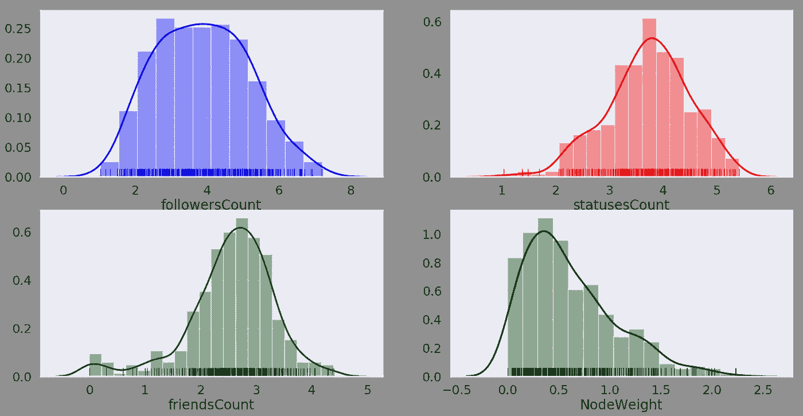

Node Stats (all x-axis are log-scaled)

> 在我们的网络中，似乎大多数用户有 1000-10，000 条推文和 100-1000 个好友(如下)。followersCount 分布似乎没有达到峰值，所以分布更加均匀。最后，我们的大多数节点都有很小的**权重**，有些用户比这个网络中的普通用户活跃近 10 倍。


Edge Stats

> 就优势而言，正如预期的那样，大多数用户并不经常联系，而那些联系上的用户之间最近的活动水平(5-100 次转发和回复)差异很大。

**最终网络:汇集一切**

现在，我们的网络由大约 400 个加权节点和大约 10，000 条边组成(很小，但关系复杂)。下面是过滤掉一些孤立节点后的样子:(注意，节点的大小描述了节点权重)

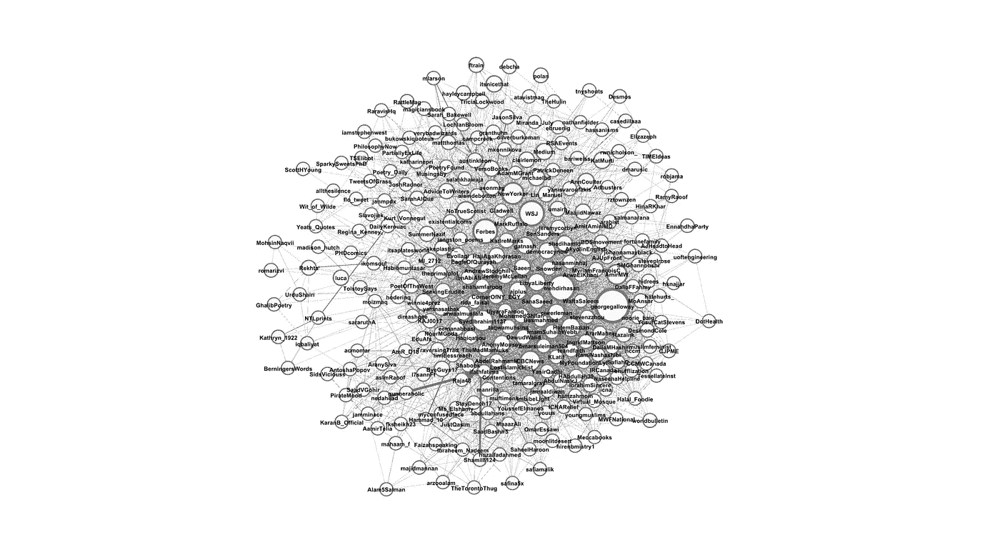

Figure 2: Social Network — Directed Graph with Weighted Nodes and Edges

嗯……酷？(有可能)。但实际上，我们很快就会意识到我们无法从中获得一大堆信息。目前，这是非常平淡无奇的(从字面上看，这只是黑与白)，这实际上是我们在处理复杂网络时面临的挑战之一——你不能只是从它们那里“观察”见解。这就是为什么在我们作为人类分析师真正进行任何有意义的分析之前，我们需要看到“聚集”的信息。从算法上来说，对数据进行聚类也将有助于我们今后的语言分析，并且也经常用于减少计算时间。有助于应对这一挑战的技术是**社区检测—** 一个强大的过程*(图 3)* ，其中我们将一个复杂的网络分割成**个社区**，这些社区在结构上对图进行分类，并描述一些隐藏在你在*图 2* 中看到的网状混乱中的高阶属性。

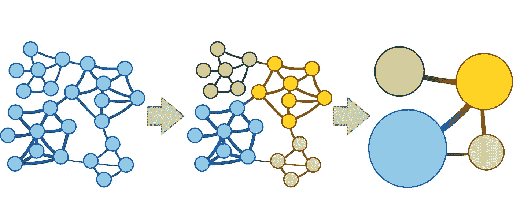

Figure 3: Example of Community Detection

# 社区检测

现在是有趣的部分(再次，字面上)，我们如何在我们的网络中找到隐藏的**社区**？我只有大约 400 个朋友，所以如果有人建议花一天时间浏览他们，他们并没有“错误”…然而，如果我们想摆脱人类的“偏见”,更“科学地”找到社区呢？如果我们开始手动地将用户分类到社区中，我们会确切地知道该做什么，但是在更真实的意义上，我们不知道该做什么。像'*这样的难题，首先有多少个社区？“社区分配的标准是什么？”*上来。因此，虽然可以理解，如果我们使用计算机进行这种分类过程，我们可能会失去一些细微差别，但与直觉相反，我们实际上可能会获得一些我们的偏见所不允许的细微差别。

有了数据科学，我们不需要总是处理数据，因为“人类不可能做到，这需要太长时间”。有时，数据科学是一门由可计算的有氧运动组成的艺术，它帮助我们以一种前所未有的方式查看数据。(尽管通常情况下，数据科学是在做一个人真的不应该用 Excel 做的事情。虽然他们尝试…他们总是尝试…人类。)本着这种精神，我们期待一种有趣的算法来发现基于“信息流”的社区——**信息地图**。

首先，什么是社区？没有具体定义的原因是因为“社区”的部分定义将来自社区检测算法。一般来说，信息分类在任何哲学或科学研究中都扮演着重要的角色，而**社区就是这样:组织知识的节点分类。**

我们本质上试图从社区中获取的是基于**同质化现象将相似的用户分组在一起。**

> “相互联系的群体中的个体往往具有相似的特征。这种现象被称为同质性，并被定义为“一个基本的组织原则”，即“相似的人之间的接触比不同的人之间的接触发生率更高”( [McPherson，Smith-Lovin，& Cook，2001](https://journals.sagepub.com/doi/full/10.1177/2056305117691545#) ，第 416 页)。“物以类聚，人以群分”的说法广为人知，它抓住了自然发生的社会网络的一个关键特征，并描绘了一种机制，通过这种机制，“社会特征方面的距离转化为网络距离”( [McPherson 等人，2001](https://journals.sagepub.com/doi/full/10.1177/2056305117691545#) ，第 416 页)。简单地说，同性恋表明个人更有可能与经常与他们非常相似的其他人形成新的社会网络联系。”
> 
> — [*使用社交网络分析对 Twitter 话题网络进行分类*](https://journals.sagepub.com/doi/full/10.1177/2056305117691545)

更具体地说，twitter 自我网络包含自然发生的基于流的社区——自然发生是因为“信息流”不是预先确定的，而是随着网络拓扑结构的变化而改变。节点(用户)通过边缘(转发、回复等)将自己确立为节点之间的信息载体。).在这个意义上，当我们寻找社区时，我们正在寻找基于流的社区检测方法，以便“社区由节点组成，其中,[信息]流一旦进入就会持续很长时间”([地图方程框架教程](http://www.mapequation.org/assets/publications/mapequationtutorial.pdf))。这不同于基于我们的网络模型的结构组成将一个图切割成斑点。我们将在后面看到基于流的社区检测算法如何不总是在结构上分离网络。

**Infomap** 是基于优化‘地图方程’的基于流量的社区搜索算法。我不想在这里变得过于技术化，所以如果感兴趣的话，我会让读者自己去探索，特别是因为作者已经[制作了一些描述 map](http://www.mapequation.org/apps/MapDemo.html) 方程机制的惊人演示，并且有一个[编写的教程来指导你。](http://www.mapequation.org/assets/publications/mapequationtutorial.pdf)

在使用 **Infomap** 进行了一些尝试后，我发现尽管它很好地对许多社区进行了分类，但通常有一大块节点被归类为一个社区，感觉像是“剩余”节点——用户很可能属于多个社区，并为更复杂的信息流做出贡献。为了进一步分割这个大的剩余社区， **Walktrap** ，另一个社区检测算法，但它更多地基于节点相似性和网络结构——如果从 A 和 B 分别到达所有其他节点的概率相似，则节点 A 和 B 被分类在同一个社区中。从一个节点到另一个节点的概率是用“随机漫步”来计算的，这背后也有一个简洁的直觉。

基本上，在应用这些算法之后，我们的社区检测采用以下组织原则:**如果推文和关注(信息和印象)似乎持续存在于用户中，则用户被分组在一起——使得他们彼此之间的活跃度很高。至于更大的剩余用户群(他们彼此之间有规律的活动，并且信息流不会在任何特定的更小的用户群中持续)，根据他们在该更大的群中的行为的相似程度，他们被进一步划分为小社区。** *图 4* 显示了我们网络中社区规模的直方图。

> 这两个社区定义不同的一个直观原因是，我们可以让我和我的朋友 Qasim 不转发对方的观点(因为这意味着承认失败)，而是不断转发第三方政治分析师的观点。一个**基于相似性的检测**会把我和我的朋友归入同一个社区(即我们有相似的行为)，一个**基于流的检测**不会(即信息不流经我们的连接)。

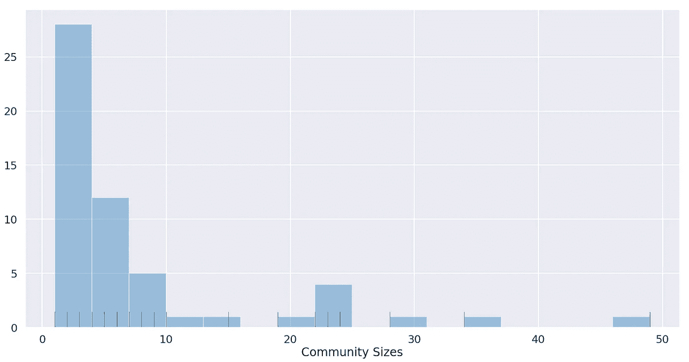

Figure 4: Histogram of Community Sizes (y-axis is # of communities)

这种分布突出了看似直观的东西(至少在我使用 Twitter 的方式上):我们有许多小社区——通常围绕特定的品味/事件/兴趣/主题构建——然后是一些主要的大玩家，在这种情况下包含 10 到 50 个用户。

> 注意:当然，一些用户在任何给定的社交网络中的多个(概念上的)社区中具有“成员资格”,但是对于这个项目，我们将不处理重叠和多个成员资格。部分原因是，我希望看到一个用户被分配到其所属的所有社区中最主要的社区，部分原因是，这会使计算变得不必要的复杂，并且我找不到足够方便的库来进行所述计算。

# 观察和分析

最后，我们得到了一个奇妙的自我网络，看起来像一个热闹的三星级酒店(如果你得到了这个参考，也请立即在 Twitter 上与我联系)。同样，节点大小描述了节点权重(用户有多“活跃”),而边厚度描述了边权重(两个用户基于他们彼此的活跃程度而有多强的连接)。

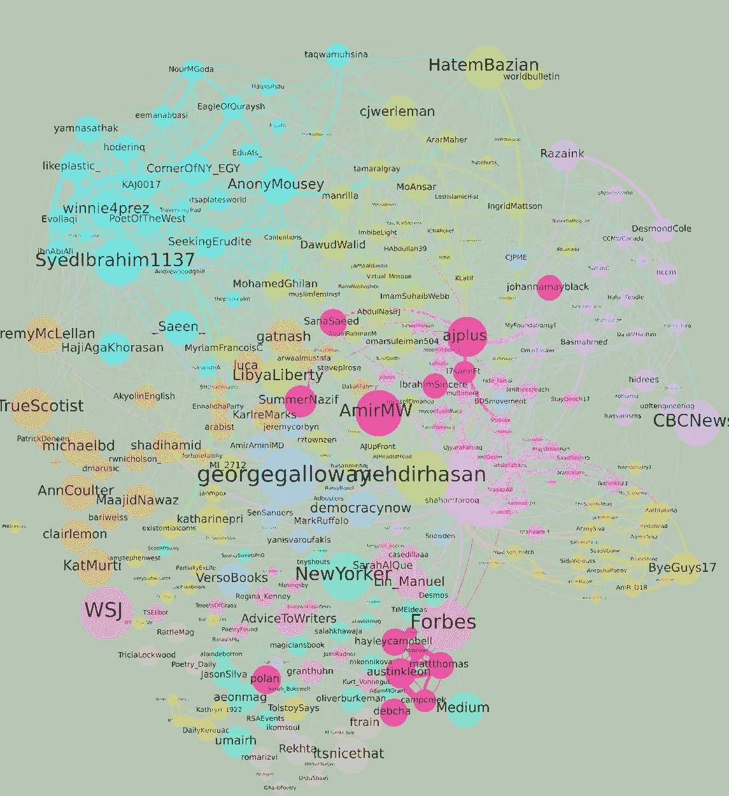

**Figure 5: Communities in a Twitter Ego-Network**

仅供参考，中间右边的白点是我(正如尼采预言的，我对自己一无所知…我甚至不是我自己社区的中心…)。说到自我，我认为我们的一部分总是希望被分析，而这种关注并不总是容易获得的——所以这就像是获得关注的 DIY 版本。在我的个人网络上做了这种分析后，我可以将算法输出与我自己的人类直觉进行比较，并且——以我早期的一些项目为例——这正是我想要做的。这篇文章的其余部分将强调一些从我们的网络图中提取洞察力的方法。

> 提醒一下，这是对“自我网络”的社区分析，因此，不是对 Twitter 上任何给定用户的客观分类，而是从我的角度对他们在我的网络中所扮演的角色的分类。

**可视化的分析原理**

**相互关联的位置—** 当我们分析社区时，重要的是要记住节点的确切位置(南、北、东、西)并不重要，但它与其他节点的相对位置不是偶然的。尽管可视化中包含一些随机性，但它实际上是通过吸引力、排斥力和重力的混合来建模的。所以强连通的节点会互相吸引，非连通的节点会互相排斥。

**内部相关位置** —区域内节点的位置也很重要。远离中心位置和深入社区的节点反映了更多的小生境行为和信息流属性。

**密度—** 更密集的节点集合意味着更强的互连性。稀疏意味着更弱的互联性。

**模块性—** 衡量集群质量的指标，即社区之间的断开程度。“高度模块化网络的特征是一些高度内部连接的集群，它们松散地相互连接。因此，用户高度互联而不考虑集群关系的网络模块化程度较低。”

**桥接节点—** 在社区边界上发现的节点有时可以充当链接，松散地互连两个社区。

**离群点—** 远离其所分配社区的结构领域的节点。有时这些是错误分类，有时远离**桥节点。**

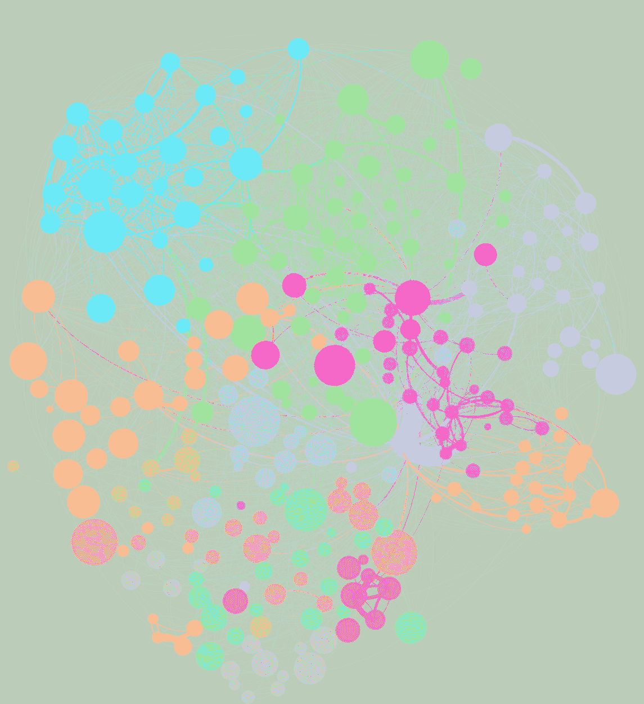

Ego-Network Fingerprint

## 社区#1-2:现实生活中的人和他们现实生活中的朋友

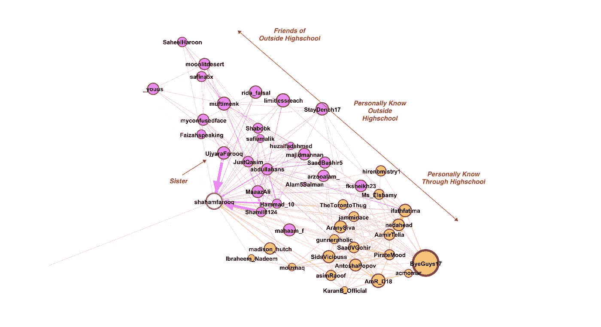

这两个社区通常包含我所关注的我的个人关系或朋友(以下简称“追随者”)，分别位于我主要的高中关系和高中以外的关系之间。因此，可以理解它们是密集的(即强内连接)。我看到了一个有趣的空间表现，我的高中联系远离了中心，从而远离了我的普通网络的其余部分(即，在 twitter 的世界里，我们已经分开了，可以理解的是，他们中的一些人甚至不活跃)。在这个社区中，我经常与之互动的人离我的节点更近。此外，与社区中的其他人相比，更强的朋友(或者至少是我所知道的那些)看起来彼此更亲近。总的来说，这些都是强大的、定义良好的社区，并且与真实系统相一致——网络的这一部分具有很强的模块化。

## 社区#3:多伦多人寿保险公司(最右边是 CBCNews)

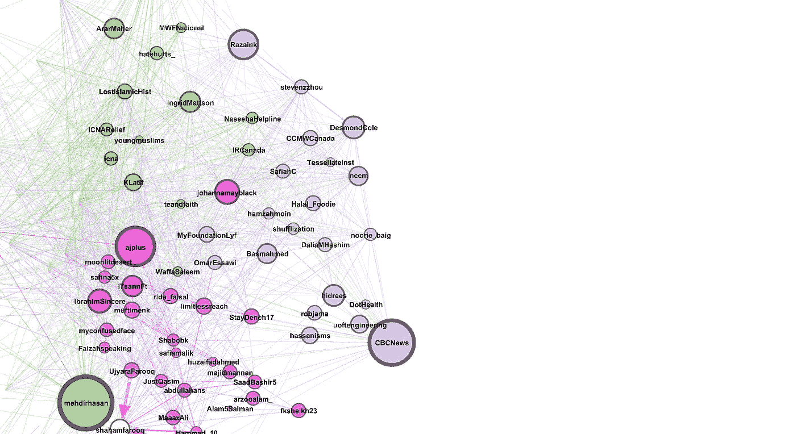

另一个强大的社区，在战略上离我的个人关系稍微远一点。这个社区主要包含不同主题的多伦多/加拿大用户。有趣的是， **'@hidrees '，' @DotHealth '，' @robjama '，**和 **'@uoftengineering'** 在一起，但与其他人相距较远——这是一个多伦多-加拿大商业技术迷你小组。当我们向北走时，我们会遇到更多的活动家/记者/政治评论家，比如**、**和**、【stevenzhou】。**像 **'@IRCanada '，' @ NaseehaHelpline '，**和 **'@IngridMattson'** 这样的节点是结构上更接近这个社区(和加拿大人)的用户的很好的例子，但是就流量而言，更涉及另一个社区。总的来说，除了一些微型组之外，集群通过松散的内部连接松散地连接到网络的其余部分。这意味着这个社区并不是太封闭，它包含了与我的更中心的网络的各种连接。

## 社区# 4–5:主角(绿色)和不适合的人(粉色)

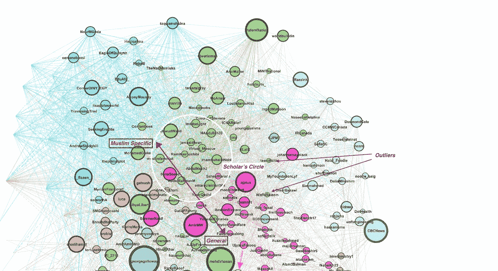

这是最大的跨社区(就区域而言),原因显而易见——我们有许多用户涌入其他社区的领地。我把这个社区称为“主要行为”——我觉得每个 twitter 用户都有一个在某些方面与此类似的社区——因为我的许多其他社区“观看”这个社区，有点像一出戏。

*   我们看到的主要是大客户，受欢迎的人物，他们在别人看着他们的时候相互交流。就我而言，我们看到对世界事务发表评论的伊斯兰学者聚集在中心，与来自其他社区的多个用户相连。
*   我们还可以看到一种趋势，即随着我们向西北方向发展，新闻和内容越来越普遍，越来越针对穆斯林。随着我们越走越远，用户越来越少关注我的网络中的其他中心话题。
*   这些在社区边缘的用户就像是连接更多小众社区和大众的桥梁。
*   我已经强调了一些离群值，他们最近的活动将他们分配到这个社区，但我发现如果有一个更结构化的分配会更好。

粉红色的社区——格格不入者，我没有任何贬损的意思——是一个弱势群体。这些用户在信息流中不够深入，而社区在结构上与他们很接近，因此似乎被随意地归类在一起。这也可以在空间上注意到，因为社区是分散和稀疏的，具有松散的内部连接和更强的相互连接。

**社区#6:臭名昭著的穆斯林推特[MT](蓝色)**

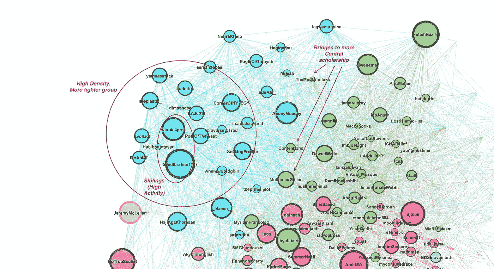

这是臭名昭著的穆斯林 Twitter 社区，除了我的个人社区之外，唯一一个在结构上和信息流上都被分割的社区。就个人而言，这是最有趣的利基社区之一，就其动态和信息流结构而言，值得对其进行整体分析。

*   兄弟姐妹/亲密朋友的趋势在这里再次显现，兄弟姐妹被放在一起。
*   在我的网络中，MT 的领域是相当模块化的——它们与我的网络的其余部分松散地互连，但具有很强的内部连接。这是显而易见的，因为我们看到在西北部有一个更紧密的迷你群围绕着两个高度活跃的兄弟姐妹，而 MT 的其余部分很稀疏。*(同样，这并不意味着他们客观上是机器翻译的中心，只是在我的自我网络中)。*
*   我还强调了我所关注的 MT 和我所关注的学者圈子之间的桥梁节点，这是我之前在绿色社区中讨论过的。
*   桥接节点当然可以走任何一条路，一些节点如 **'@_Saeen_'** 更属于下面的网络，而 **'@JeremyMcLellan'** 可能属于 MT。这是铁证 **'@JeremyMcLellan'** 是#creepingsharia 的支持者——MT 的人会理解这个笑话:d

**社区# 7–9:大思想政治评论(橙色)、社会主义者(灰色)和哲学(暗黄色)**

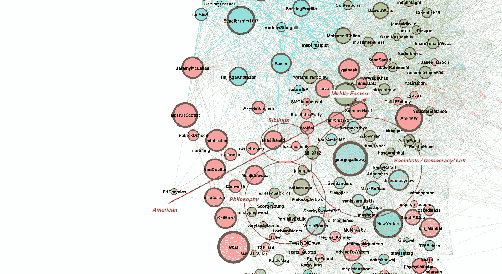

一群非常有趣的社区——现在我们深入到政治和哲学中。

*   与其他部分相比，该图的这一部分具有较低但合理的模块性，社区靠得很近，但它们也密集地聚集在一起，暗示着强大的内部联系。
*   橙色社区是强有力的政治评论员——我说的是你的大政治理念，从伊斯兰主义(支持和反对)到天主教国家，到“黑暗网络”的成员。我们还可以看到美国在外围的讨论和中东向中心的讨论，中间是 **'@shaadihamid'** (他应该是一个强调中东伊斯兰政治的美国人)。
*   我们还有社会党人、民主党人和左派(灰色)，他们或多或少地团结在一起。有趣的是，与一般的大思想政治评论不同，这些评论并不像美国社会主义者和欧洲左翼分子(桑德斯、科尔宾和瓦鲁法基斯)那样按地区分开。
*   哲学圈，虽然主要是教育账户，但由于 MT(蓝色社区#6)和大思想政治社区的多重联系，被拉离了更南方的团体。

## 社区# 10–14:互联互通的南方


网络的南部区域是最不模块化的。虽然存在一些密集的微型社区，但总体而言，我们在社区之间有大量的结构差异和相互联系——反映了这些类型的社区相互融合和互动的趋势。

*   这个区域的节点主要是关于艺术，阅读，写作和一些商业。出版物、杂志和期刊的大型节点分散在该地区。
*   “分享者”——因为他们分享许多与该地区主题相关的有趣内容——是一个以**' @ austinkelon '**为中心的紧密聚集的社区。我们也有一个与众不同的小众乌尔都语诗歌社区。
*   我发现 **'@Versobooks'** 是连接哲学、左翼和作家/读者群体的一个很好的桥梁节点。

# 额外:网络时间表

## 自我(网络)是如何形成的

我们再加一个维度:时间。类似于我们已经讨论过的**桥节点**作为不同社区之间的链接，有一些节点作为**暴露节点**将我们暴露给一个新的社区。如果我们看到网络随着时间的推移而增长，我们可以注意到这些特定的节点。我们也可以了解这种特定自我网络如何发展的一些模式。

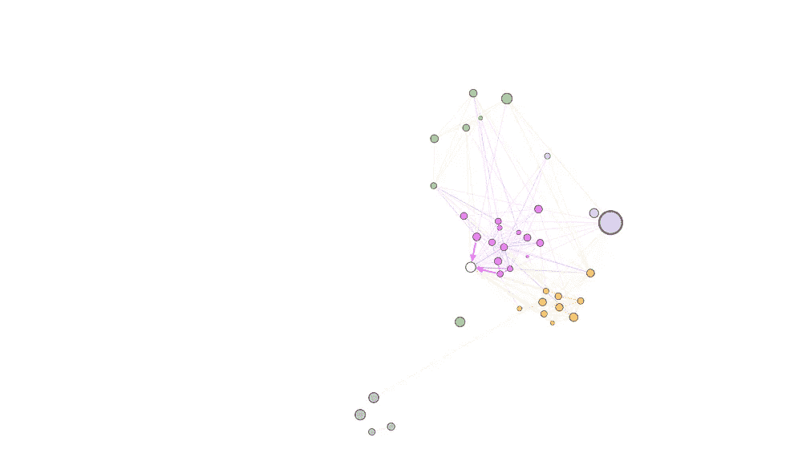

Epoch 1

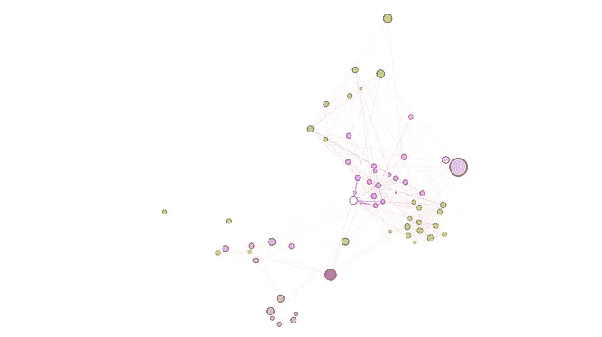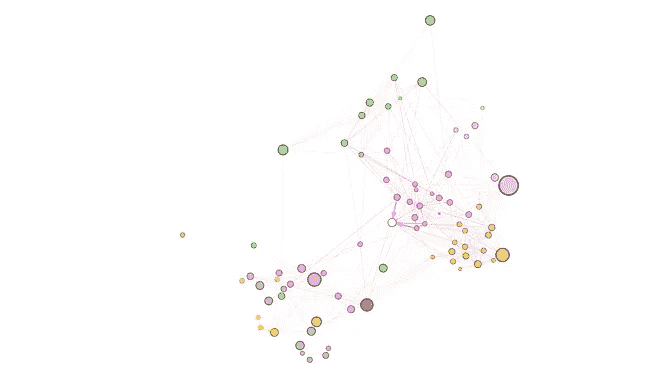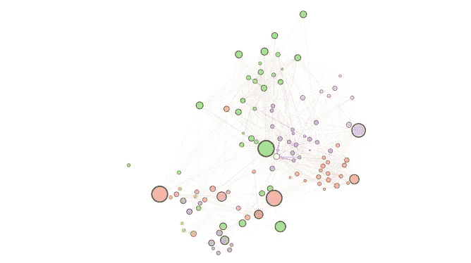

Epoch 2

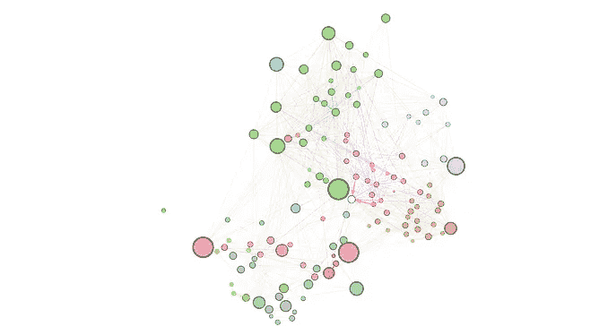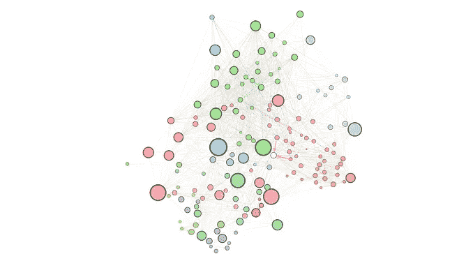

Epoch 3

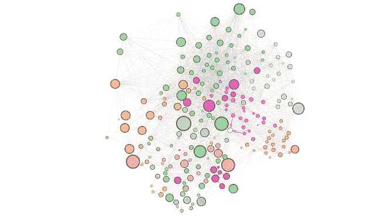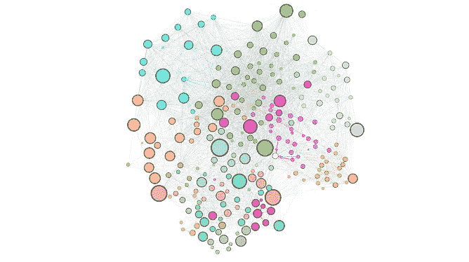

Epoch 4

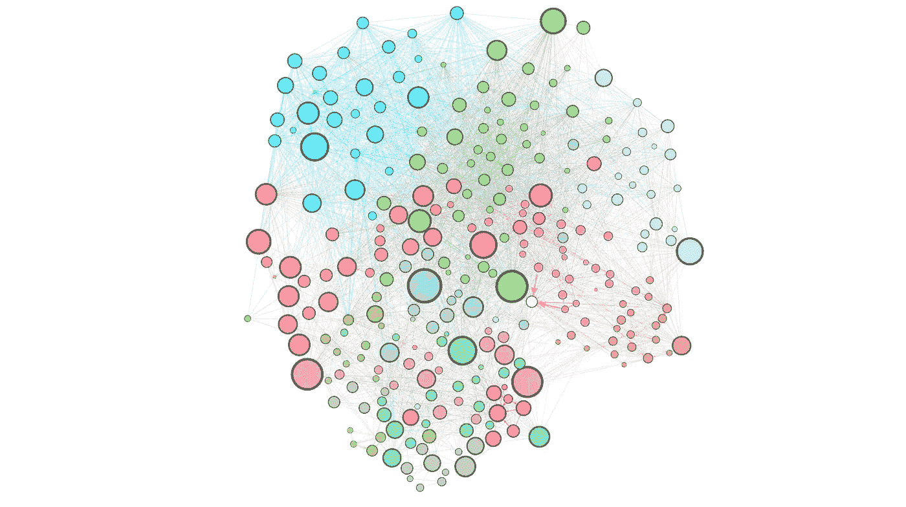

Epoch 5 — Current Network

在这种增长方式中可以观察到一个很好的模式:我们看到网络的模块化区域(高度互联)在给定的时间段内具有高增长率，然后降低到低增长率，而非模块化区域一旦开始就稳步积累。我们还看到，“曝光节点”(那些将我们引入社区的节点)不一定是该社区的“中心”节点，而是桥梁节点。这种节点的好例子是时段 2 的第一幅图像中的红色节点和时段 3 的第一幅图像中的蓝色节点。

# 结束语

*   这是我的个人网络，所以我可以从这个分析中提取的大量理解已经是“已知的”。但是想象一下，对任何一个我们从未接触过的用户进行这种分析，以及我们对他们的品味、群体、兴趣和成长的高层次了解…
*   大多数数据分析(尤其是基于网络的)试图获得客观的真相，并理解大的名人趋势。虽然这有它的目的，但出于某种原因，我没有看到很多试图提取主观行为和更小规模的深入见解的分析…我觉得这是一个差距，如果得到解决，可能会产生一些有趣的见解。
*   有定量的方法来计算模块性、内部连接性、互连性等。我在这里没有探讨读者可以研究的问题(我只是喜欢对这样的帖子进行定性分析，这是一个更有趣的项目)。
*   总之，我从这个项目的第一阶段得到的要点是**我们的网络模型中的相对关系模拟了真实系统中的相对关系！**这提供了一些可信度，以探索对这种网络模型和社区分割进行更深入的分析。