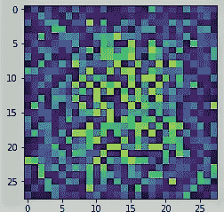
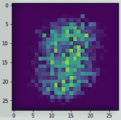

# 使用张量流的生成对抗网络

> 原文：<https://towardsdatascience.com/generative-adversarial-networks-using-tensorflow-c8f4518406df?source=collection_archive---------5----------------------->

## 这篇文章是关于生成对抗网络或简称 GANs 的初级读本。

生成对抗网络(GANs)是深度神经网络架构，由一组两个相互竞争的网络组成，因此得名“对抗”。2014 年，伊恩·古德菲勒和蒙特利尔大学的其他研究人员，包括约舒阿·本吉奥在一篇论文中介绍了 gan。

甘旨在模拟任何数据分布。也就是说，甘人可以被训练创造出与我们的世界在任何领域都极其相似的世界:图像、音乐、演讲、散文。为了更好地理解我的意思，让我们看一个例子

The Mona Lisa Analogy

让我们考虑这样一个场景，一个伪造者试图伪造达芬奇的著名肖像画，一个侦探试图抓住伪造者的画。现在，侦探可以接触到真正的肖像，因此可以比较伪造者的画作，找出哪怕是最细微的差异。所以，在机器学习的术语中，伪造者被称为**“生成器”**并生成假数据，侦探被称为**“鉴别器”**，负责将生成器的输出分类为假或真。

从某种意义上来说，gan 的计算成本很高，它们需要高性能的 GPU 来产生良好的结果。下面是 GANs 在 8 个特斯拉 V 100 的 GPU 上训练了 4 天的几个纪元后制作的一些假名人脸！！

我们将使用一个硬件不太密集的例子。在这篇文章中，我们将使用 **MNIST** 数据集来玩一个简单的 GAN，它将使用 **Tensorflow 的层 API** 来制作。在研究代码之前，我将讨论 GANs 通常会出现的两个问题:

1.  **鉴别器过功率发生器:**有时鉴别器会因为最细微的差别而开始将所有生成的例子归类为假的。因此，为了纠正这一点，我们将使鉴频器的输出不缩放，而不是 sigmoid(它只产生 0 或 1)。
2.  **模式崩溃:**生成器发现鉴别器中的一些潜在弱点，并利用该弱点连续产生类似的例子，而不管输入的变化。

所以，最后，让我们来看看代码！！

首先，我们导入必要的库并从`tensorflow.examples.tutorials.mnist`读入 MNIST 数据集。

接下来，我们将创建代表两个网络的两个函数。注意第二个参数“重用”，稍后我会解释它的效用。

两个网络都有两个隐藏层和一个输出层，它们是密集或完全连接的层。

现在，我们为输入创建占位符。`real_images`是来自 MNIST 的实际图像，`z`是来自实际图像的 100 个随机像素。为了让鉴别器进行分类，它首先必须知道真实图像的样子，因此我们对鉴别器函数进行了两次调用，前两次调用学习真实图像，后两次调用识别假图像。`reuse`设置为 true 是因为当两个函数调用中使用相同的变量时，张量流计算图会得到一个不明确的信号，并倾向于抛出值错误。因此，我们将重用参数设置为`True`以避免这样的错误。

接下来，我们为我们的网络定义损失函数。`labels_in`参数给出了损失函数的目标标签，基于该标签进行计算。`D_real_loss`的第二个参数是`tf.ones_like`,因为我们的目标是为所有真实图像生成真实标签，但是我们添加了一点噪声，以解决功率过大的问题。

当我们有两个独立的网络相互作用时，我们必须考虑每个网络范围内的变量。因此，在定义功能时，设置了`**tf.variable_scope**` 。在这个例子中，我们将使用 Adam 优化器。我们设置 batch_size 和 epochs 的数量。增加历元会带来更好的结果，所以可以尝试一下(如果你有 GPU 的话更好)。

最后，我们启动会话，并使用 tensorflow 助手函数中的`next_batch()`方法来训练网络。我们从生成器生成的样本中随机抽取一个样本，并将其添加到样本列表中。

绘制来自`samples`的第一个值显示了第一个时期后的发电机性能。将其与来自`samples`的最后一个值进行比较，显示发电机的运行情况。

输出如下所示:

Sample after 0th epoch

Sample after 99th epoch

这些是非常差的结果，但是因为我们仅仅在 CPU 上训练我们的模型，所以学习是相当弱的。但是我们可以看到，模型开始以更简洁的方式生成像素，我们可以看出这个数字是“3”。

GANs 应该在 GPU 上接受训练，所以尝试使用 GPU 或者简单地使用 google colab 来获得更好的结果。

好的，这是一个在 Tensorflow 上从零开始建立的生成性对抗网络模型。点击下面的横幅获得完整的代码。

下次见！！

