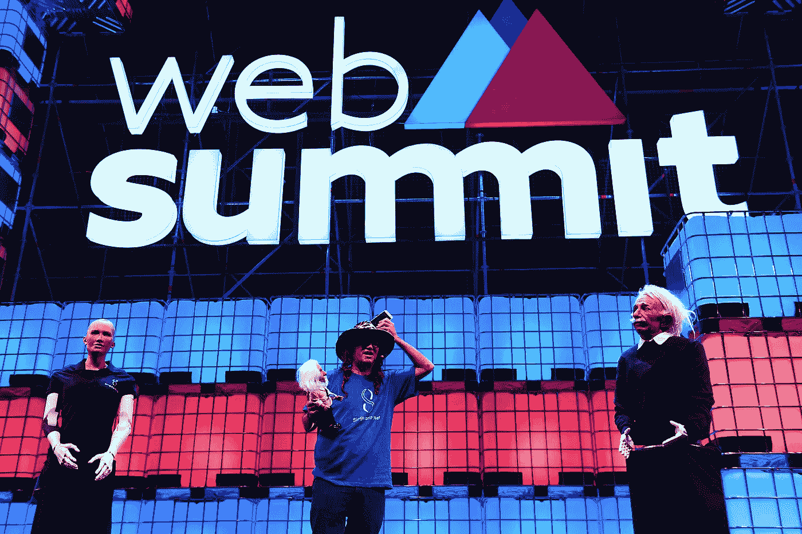

# 生成性深度学习:让我们探索人工智能如何延伸，而不是取代创造过程

> 原文：<https://towardsdatascience.com/generative-deep-learning-lets-seek-how-ai-extending-not-replacing-creative-process-fded15b0561b?source=collection_archive---------7----------------------->

> "技术不应该旨在取代人类，而是增强人类的能力."
> 
> -道格·恩格尔巴特，电脑鼠标的发明者

在葡萄牙里斯本举行的全球最大的科技大会 Web Summit 2017 上。由人工智能(AI)驱动的人形机器人索菲亚(Sophia)说**“我们会抢走你的工作”**6 万名世界科技领袖的观众只是紧张地笑了笑。

Web Summit 2017

到目前为止，你们都一定听说过人工智能的进步是如何破坏工业并对全球数百万工人的工作安全构成威胁的。办公室文员、接待员、客户服务代表、分析师、营销人员、医生和律师的工作可能在未来十年被人工智能取代。正如谷歌首席执行官[桑德尔·皮帅](https://medium.com/u/d329f4843d82?source=post_page-----fded15b0561b--------------------------------)所说，“未来 10 年，我们将转向人工智能优先的世界。”

但是取代人类总是跑题了:人工智能不是用其他东西取代我们自己的智能，而是给我们的生活和工作带来更多的智能——不同种类的智能。在许多领域，尤其是在创造性领域，人工智能将被人类用作增强自身能力的工具:因此它更像是增强的智能，而不是人工智能。

在这篇文章中，我将提供一个高层次的概述，说明人工智能目前是如何通过生成性深度学习来扩展而不是取代创造性过程的。

在这篇文章中，我将讨论什么是生成性深度学习，什么是 D **辨别**模型，以及它与 G **生成**模型有何不同。我甚至会提供一些应用生成性深度学习的具体例子，这将进一步帮助任何人和每个人增加他们对这些生成模型为我们所有人提供的奇妙可能性的理解。

所以，把你的手机调到静音模式，关掉你的电视，让我们开始吧。

在我的工程设计期间，我的老师每次都会说要更加关注基础知识，因为它们会让你在你阅读的任何学科中打下坚实的基础，所以在这里我也会首先给你关于监督学习和非监督学习的基本信息，然后我会为你们所有人打开生成模型的知识之门，让你们一头扎进去。

**监督学习**是目前为止最主要的深度学习形式，具有广泛的行业应用。在监督学习中，您有一个输入变量(x)和一个输出变量(Y ),并使用一种算法来学习从输入到输出的映射函数。

目标是很好地逼近映射函数，以便当您有新的输入数据(x)时，可以预测该数据的输出变量(Y)。

一般来说，目前备受关注的几乎所有深度学习应用都属于这一类别，如光学字符识别、语音识别、图像分类和语言翻译。

*信息部分*:如果你想了解如何使用 tensorflow 我做了一个食物分类器，只需点击这个[链接](/north-indian-food-or-south-indian-food-deep-learning-knows-it-all-part-1-13e1d20c359c)，无论如何，看一下视频更清晰。

[Indian food classifier](https://youtu.be/DwQ7wCzbDzY)

虽然监督学习主要由分类和回归组成，但也有更多引人注目的变体，包括以下内容:

*   图像分割—给定一张图片，在特定对象上绘制像素级蒙版。
*   对象检测——给定一张图片，围绕图片中的某些对象绘制一个边界框，如果你想了解更多关于对象检测的信息，请阅读这篇[文章](/real-time-object-detection-with-tensorflow-detection-model-e7fd20421d5d)(当然这也是我写的:)，但不要忘记查看下面的视频。

[Object detection](https://youtu.be/Ic2zxAzioNQ)

**无监督学习**是深度学习的另一个分支，它包括在没有任何目标的帮助下寻找输入数据的有趣转换，目的是数据可视化、数据压缩或数据去噪，或者更好地理解手头数据中存在的相关性。许多机器学习专家都说，无监督学习是数据分析的面包和黄油，在试图解决监督学习问题之前，这通常是更好地理解数据集的必要步骤。

Image Courtesy : [Unsupervised learning](https://www.quora.com/What-is-the-difference-between-supervised-and-unsupervised-learning-algorithms)

[降维](https://www.analyticsvidhya.com/blog/2015/07/dimension-reduction-methods/)和[聚类](https://www.analyticsvidhya.com/blog/2016/11/an-introduction-to-clustering-and-different-methods-of-clustering/)是非常著名的无监督学习类别，请通过点击链接来阅读它们，以进一步加强您对机器学习这一领域的理解。

现在，该谈谈本文的主人公了，即“生成模型”。生成模型是一类用于无监督学习的模型，其中给定训练数据，我们的目标是尝试从相同的分布中生成新的样本。

image courtesy: cs231n 2017 lecture notes

为了训练生成模型，我们首先收集某个领域的大量数据(例如，想象数百万的图像、句子或声音等。)然后训练一个模型生成类似的数据。

诀窍在于，我们用作生成模型的神经网络的许多参数远小于我们训练它们的数据量，因此模型被迫发现并有效地内在化数据的本质，以便生成数据。

生成模型有许多短期应用。但从长远来看，它们有可能自动学习数据集的自然特征，无论是类别、维度还是其他完全不同的东西。

好了，有很多文献，现在让我们来谈一点形式主义。

D **区别型**和 G **生成型**的根本区别在于:

**判别模型**学习类之间的**(硬或软)边界**

**生成模型**对各个类的**分布**进行建模

生成模型是能够生成数据的**。它对特征和类(即完整的数据)进行建模。**

如果我们对`P(x,y)`建模:我可以使用这个概率分布来生成数据点——因此所有对`P(x,y)`建模的算法都是可生成的。

如生成模型

*   朴素贝叶斯模型`P(c)`和`P(d|c)`——其中`c`是类，`d`是特征向量。
*   还有，`P(c,d) = P(c) * P(d|c)`
*   因此，朴素贝叶斯在某些形式模型中，`P(c,d)`
*   贝叶斯网

判别模型是只能用于**判别/分类数据点**的模型。在这种情况下，你只需要建模`P(y|x)`(即给定特征向量的分类概率)。

判别模型的示例:

*   逻辑回归
*   神经网络

简单来说:一个 G **生成模型**是一个可观察对象 *X* 的条件概率模型，象征性地给定一个目标 Y，P(X|Y=y)，而一个 D **判别模型**是一个目标 *Y* 的条件概率模型，象征性地给定一个观察对象 X，P(Y|X=x)。

因此，涵盖了所有的基础知识，解释了所有的技术术语，现在是时候将你的眼球转向生成模型的应用，并思考人工智能将如何帮助我们“人类”更具创造力。

我知道你一定会猜测，现在像其他人一样，这位作者也将解释隐性模型，如[**(**【甘斯】****](https://en.wikipedia.org/wiki/Generative_adversarial_network)**)和显性深度自回归模型，如[【pixel CNN】](https://papers.nips.cc/paper/6527-conditional-image-generation-with-pixelcnn-decoders.pdf)或者甚至他也可能解释深层潜在变量模型，如[变分自动编码器](https://www.analyticsvidhya.com/blog/2018/06/unsupervised-deep-learning-computer-vision/)，但你们都错了，所以请放松，让大脑平静下来，享受你将要阅读的内容。**

**现在，在这篇文章的最后一部分，我将向大家介绍这个项目。 [**品红**](https://magenta.tensorflow.org/) 是一个探索机器学习在艺术和音乐创作过程中的作用的研究项目。**

****

**这主要涉及开发新的深度学习和强化学习算法，用于生成歌曲、图像、绘图和其他材料。但这也是在构建智能工具和界面方面的一次探索，允许艺术家和音乐家扩展(而不是取代！)他们使用这些模型的过程。Magenta 是由谷歌大脑团队的一些研究人员和工程师发起的，但许多其他人也为该项目做出了重大贡献。**

**所以，我个人最喜欢的第一个模型是 ***草图——RNN***，这是一个矢量绘图的生成模型，它是一个递归神经网络(RNN)，能够构建基于笔划的常见对象的绘图。该模型在代表许多不同类别的人类绘制图像的数据集上进行训练。作者概述了有条件和无条件草图生成框架，并描述了用于以矢量格式生成连贯草图的新的健壮训练方法。**

**在下面的演示中，看看通过在瑜伽图上训练的模型的已学表现(潜在空间)中移动而产生的瑜伽姿势。请注意，当它从站立姿势移动到在瑜伽垫上做的姿势大约 10 秒钟时，它是如何变得困惑的。**

**[Sketch-RNN](https://youtu.be/gjEFwFfUwic)**

**第二款是献给音乐爱好者的，它被命名为 **MusicVAE。**当一名画家创作一件艺术品时，她首先在艺术家的调色板上混合和探索颜色选项，然后再将它们应用到画布上。这个过程本身就是一种创造性的行为，对最终作品有着深远的影响。**

**音乐家和作曲家大多缺乏探索和混合音乐思想的类似设备，但现在 MusicVAE 是一种机器学习模型，允许他们创建混合和探索乐谱的调色板。演示就在下面。**

**[MusicVAE](https://youtu.be/G5JT16flZwM)**

**我只向你们展示了在项目 [Magenta](https://magenta.tensorflow.org/) 下建造的许多模型中的两个，到这个时候你们一定都已经体验到人工智能如何帮助我们扩展而不是取代我们的创造过程。为了了解有关这些创成式模型的更多信息，请浏览参考部分中的指针。**

**参考资料:**

1.  **[素描的神经表征](https://arxiv.org/pdf/1704.03477.pdf)《纸上素描——RNN》。**
2.  **学习音乐长期结构的层次潜向量模型。**
3.  **[用神经网络绘制在一起](https://magenta.tensorflow.org/sketch-rnn-demo) Google AI 博客。**
4.  **[MusicVAE:用机器学习创建乐谱调色板](https://magenta.tensorflow.org/music-vae)谷歌人工智能博客。**
5.  **要了解更多信息，请观看来自谷歌大脑团队首席研究科学家 Douglas Eck 的视频。http://g.co/magenta 上的引线。)**

****

****感谢您的关注****

**你利用你在 T21 的时间阅读我的作品对我来说意味着一切。我完全是这个意思。**

**如果你喜欢这个故事，疯狂鼓掌吧👏 **)** 按钮！这将有助于其他人找到我的工作。**

**此外，如果你愿意，可以在 Medium、LinkedIn 或 Twitter 上关注我！我很乐意。**

** [## 纳文·曼瓦尼培养基

### 阅读纳文·曼瓦尼在媒介上的作品。机器学习工程师，深度学习爱好者|](https://medium.com/@naveenmanwani)  [## Naveen Manwani -机器学习工程师- AIMonk Labs Private Ltd | LinkedIn

### 查看纳文·曼瓦尼在全球最大的职业社区 LinkedIn 上的个人资料。Naveen 有一份工作列在他们的…

www.linkedin.com](https://www.linkedin.com/in/naveen-manwani-65491678/)  [## 纳文·曼瓦尼(@纳文·曼瓦尼 17) |推特

### 纳文·曼瓦尼的最新推文(@纳文·曼瓦尼 17)。电子和通信工程师，深度学习&…

twitter.com](https://twitter.com/NaveenManwani17)**