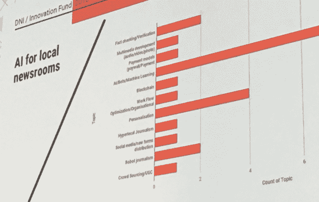

# #GENSummit 2018: AI 在出版领域的突破之年

> 原文：<https://towardsdatascience.com/gensummit-2018-ais-breakthrough-year-in-publishing-6fa5a78154be?source=collection_archive---------3----------------------->

[*这篇文章最初发表在在线新闻博客*](https://onlinejournalismblog.com/2018/06/04/gen-summit-ais-breakthrough-year-in-publishing/) 上。

本周的 **GEN 峰会**标志着人工智能(AI)在媒体行业的突破性时刻。这个话题主导了会议前两天的议程，从脸书的 **Antoine Bordes** [开幕主题演讲](https://www.youtube.com/watch?v=7XFIuo9Do5Q)到人工智能、机器人、货币化和验证——它也主导了我的时间表。

有时感觉像是在 20 世纪 80 年代的一次会议上，讨论如何在新闻编辑室使用“计算机”,或者听人们谈论手机在 21 世纪初用于新闻业——换句话说，感觉非常像早期。但仍然是重要的日子。

**Ludovic Blecher** 关于获得[Google Digital News Initiative](https://newsinitiative.withgoogle.com/dnifund/dni-projects/)资助的人工智能相关项目的幻灯片最好地说明了这个问题，这些提案被分为具体的“个性化”和模糊的“超本地”等类别。

Image [by Marc Springer](https://twitter.com/SpringerMa/status/1002222322718298112)

那么，深入挖掘一下，以下是我从里斯本学到的一些最具体的观点——以及记者和出版商可以从中得到的启示。

# “智能”和你可以教的机器人之间的区别

**本尼迪克特·埃文斯(Benedict Evans)**周四的主题演讲无疑是峰会上最清晰的演讲之一，他成功地从定位(“什么是机器学习”)到潜在应用，再到问题化。

这个演讲呼应了我最近参与的其他讨论，围绕着从谈论人工智能转向像**机器学习**这样的术语的必要性——能够识别模式，利用这些模式在干草堆中寻找针，自动化重复行为，预测可能性和可能性，等等。

在“人工智能”威胁机器人统治者和机器人新闻业的地方，机器学习更明显地涉及到教一个相对“愚蠢”(但相对而言也是聪明)的机器人如何做我们没有时间或一致性去做的部分工作的过程。

但强大的力量带来了巨大的责任——埃文斯对我们作为其中一部分创造的算法的准确性(特别是由输入形成的)和结果的潜在社会影响之间的责任进行了有益的区分。即使是精确的算法也会产生不良结果。

# 算法责任和通往可理解性的道路

Jonathan Albright 也提出了类似的观点，他[更广泛地](https://www.journalism.co.uk/news/why-algorithmic-accountability-reporting-needs-to-go-beyond-transparency/s2/a722634/)谈到了[的算法问责制](https://datasociety.net/output/algorithmic-accountability-a-primer/):当涉及到算法对公共和私人生活的影响时，记者的监督作用。

奥尔布赖特的[关于“危机演员”YouTube 视频](https://medium.com/@d1gi/untrue-tube-monetizing-misery-and-disinformation-388c4786cc3d)和[谷歌搜索建议](https://medium.com/@d1gi/notokgoogle-search-suggestions-2018-edition-ba09eaf49fc2)——以及 **ProPublica** 的[机器偏见系列](https://www.propublica.org/series/machine-bias)——作为该领域的介绍，非常值得探索。可能已经开始成为技术和政治节拍特征的东西显然最终将在每个领域发挥重要作用:从报道犯罪、住房到教育、T21、健康，甚至音乐、电影。

媒体公司是最早也是最常见的算法受害者之一，这很有帮助。我们敏锐地意识到，这些食谱中的一个小变化会如何影响我们的观众是否以及如何接受我们的新闻报道，[正如**艾米丽·贝尔**的谈话所示](https://www.youtube.com/watch?v=48otnt3bsGk)。

现在需要的不仅是对算法如何影响我们的社区的认识(以及对此进行报道的愿望)，还有对我们自己对算法的依赖的反思态度——以及对此透明的需要。

**Nick Diakapoulos** 的[工作为主题](http://www.nickdiakopoulos.com/projects/algorithmic-accountability-reporting/)奠定了一些重要的基础，包括算法透明度的[限制和潜在的披露机制](http://www.nickdiakopoulos.com/wp-content/uploads/2016/07/Algorithmic-Transparency-in-the-News-Media-Final.pdf)，而美联社的 **Stuart Myles** 已经就算法新闻谈到了同一主题，确定了算法透明度的四个级别。

# (一些)数据新闻的商品化——以及从自动化到增强的转变

Frames、Grafiti、RADAR 和 Le Parisien 的 LiveCity 项目显示了数据新闻已经从例外走向了商品化。

[Frames](https://frames.news/) 提供一项服务，为新闻机构提供现成的图表，嵌入到他们的文章中，并提供收入共享商业模式，图表也可以通过这种模式得到赞助(他们一直在与一家葡萄牙新闻机构合作，并且[声称包含图表可以带来更高的共享和再循环](https://twitter.com/knowforafact/status/1002169420427464706))。

与此同时，Grafiti 的目标是在建立一个图表作为数据的搜索引擎的同时，让图表的社交创作变得更加容易。RADAR 建立了英国最大的数据新闻团队之一，向当地出版商提供新闻专线式的副本；《巴黎人报》正在以个性化小工具的形式将城市数据整合到文章中。

换句话说，数据新闻开始规模化。对于数据记者来说，这意味着两件事:要么从低挂的果实转向更复杂或调查性的故事，要么进入数据新闻本身的规模(即编码)。

…或者，当然，两者兼而有之。

# 聊天机器人和叙事，机器人和新闻编辑室

与此同时，聊天机器人正朝着相反的方向发展——尽管许多新闻行业的聊天机器人到目前为止只不过是一个美化了的 RSS 警报，Quartz 的**约翰·基夫**和 BBC 的**保罗·萨金特**表明，我们越来越多地[看到编辑技巧](https://www.journalism.co.uk/news/from-social-media-to-in-story-experiences-chat-bots-help-the-bbc-do-things-at-scale-and-faster-/s2/a722596/)更复杂地应用于表单。

“一个好机器人的成功，”基夫解释道，“是真正的好人。”

换句话说，聊天机器人不仅代表了一个技术挑战，也代表了一个叙事挑战——萨金特在文章中谈到了 BBC 将聊天机器人作为讲故事设备的实验，比如[一篇关于*英国旁遮普人之间未言明的酒精问题*](http://www.bbc.co.uk/news/uk-43505784) 的文章，而基夫强调了“为机器人编写故事情节的非常有才华的人”以及广告商对这些技能的需求，这使得机器人团队分成了编辑和商业两部分。

> *“我们发现，我们的才能和我们与一些客户之间的故事有市场。”*

这种方法肯定是有效的:BBC 关于皇家婚礼的文章包含了内部聊天机器人[看到了](https://www.journalism.co.uk/news/from-social-media-to-in-story-experiences-chat-bots-help-the-bbc-do-things-at-scale-and-faster-/s2/a722596/) 20%的用户使用这些小工具，“通常会问多达五六个问题”。他说，聊天机器人可能不会增加覆盖范围，但会增加参与度。

在 Quartz Keefe，类似地[报告](https://twitter.com/catalinacma/status/1001825041909256193)说“90%的人一开始就坚持到底。

> 真正的价值不在于接触到更多的人，而在于加深与你接触到的人的关系

然而，叙事技巧的使用似乎在用户对交互性的期望和传播特定事实的新闻压力之间引入了一种张力。

在另一个单独的会议中 BBC 视觉新闻的 **Bella Hurrell** 会注意到他们的故事机器人的测试者错过了“直接写文本，问机器人他们自己的问题”的选项

也许人工智能在行业中的越来越多的使用将有助于部分解决这种紧张——事实上，萨金特[说](https://twitter.com/darrenwaters/status/1001825659549822977)他认为聊天机器人是“一种过渡形式”。我们知道我们要整合 AI，一起聊天。

> *“做这些(聊天机器人)你会学到很多关于如何语气，以及如何组织这些对话和讲故事[让你]在人工智能到来时处于有利位置”*

与此同时，越来越多的机器人正在开发供内部使用。

Quartz 的 quack bot(GitHub 上的[代码](https://github.com/Quartz/quackbot) ) [帮助记者缓存网页副本并建议数据来源](https://bots.qz.com/1455/announcing-quackbot-a-slack-bot-for-journalists-from-quartz-and-documentcloud/)，而 BBC 使用机器人[自动生成选举图片](http://bbcnewslabs.co.uk/2016/07/12/bots-in-newslabs/)并在 [@bbcelection](https://twitter.com/bbcelection) 账户上发布这些图片，Dagens Nyheter 的**Martin jnsson**已经[创建了一个“性别机器人”](https://sputniknews.com/viral/201804061063271431-sweden-gender-robot/)(“genus roboten”)来帮助记者了解他们的报道有多大代表性

**美联社**一直在[探索技术](http://www.tvnewscheck.com/article/113661/ai-promising-more-better-reporting-from-ap)在验证、转录、个性化和图像识别方面的潜力。他们的人工智能战略小组负责人丽莎·吉布斯 [建议](https://twitter.com/julieposetti/status/1002127726076194816)“我可以在人工智能(新闻工作的自动化部分)和我们的商业记者能够做的调查性新闻报道的增加之间画一条直接的线。”

如果有一个领域发生自动化与增强之战，一个将算法问责付诸实践并试验人工智能和口述可能性的地方，可能没有比机器人更好的地方了。