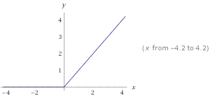
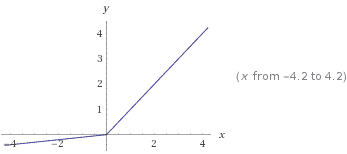

# 第一次介绍 SELUs 以及为什么你应该开始使用它们作为你的激活功能

> 原文：<https://towardsdatascience.com/gentle-introduction-to-selus-b19943068cd9?source=collection_archive---------1----------------------->

Photo by [Nick Fewings](https://unsplash.com/@jannerboy62?utm_source=medium&utm_medium=referral) on [Unsplash](https://unsplash.com?utm_source=medium&utm_medium=referral)

*标度指数线性单位*(或 SELUs)于 2017 年 9 月首次出现在[本文](https://arxiv.org/pdf/1706.02515.pdf)中。虽然 SELUs 很有前途，但并不像你想象的那么普遍。在这篇博文中，我通过将它们与激活函数的事实标准联系起来来介绍它们:*校正线性单位*(或 ReLUs)。我先从为什么 ReLUs 没有结束关于激活函数的讨论开始。然后，我转向 SELUs 的主要优势:内部规范化。读完这篇文章后，你会对 SELUs 有一个直观的理解，以及为什么你应该在你的神经网络中使用它们而不是 ReLUs。如果你需要复习激活功能，我推荐[这篇由](/activation-functions-neural-networks-1cbd9f8d91d6) [SAGAR SHARMA](https://medium.com/u/165370addbb5?source=post_page-----b19943068cd9--------------------------------) 撰写的优秀文章。

## 为什么 ReLUs 不够？

人工神经网络通过称为反向传播的基于梯度的过程进行学习。我强烈推荐[这个由 3Blue1Brown 制作的视频系列](https://www.youtube.com/playlist?list=PLZHQObOWTQDNU6R1_67000Dx_ZCJB-3pi)作为介绍。基本思想是网络在梯度指示的方向上更新其权重和偏差。

反向传播的一个潜在问题是梯度会变得太小。这个问题被命名为**消失渐变**。当你的网络遭遇渐变消失时，权重不会调整，学习也就停止了。在高级别上，深度网络在反向传播期间会倍增许多梯度。如果梯度接近零，整个产品下降。这反过来又推动其他梯度更接近零，以此类推。让我们来看看激活函数的事实标准 ReLUs 是如何防止这种情况的。

下面是一个 ReLU 如何将输入(在 *x* 轴上，在文献中命名为 *z* )映射到输出(在 *y* 轴上，命名为 *a* 用于激活):

ReLU 的规则很简单。如果 *z* 小于零， *a* 为零。如果 *z* 大于零，输出保持 *z* 。换句话说，ReLU 用零替换负值，而保持正值不变。这个激活函数的梯度非常简单。小于零的值为零，否则为一。这就是 ReLU 防止渐变消失的原因。没有接近零的梯度，这可能会减少其他梯度。信号要么继续流动(如果梯度为 1)，要么不流动(如果梯度为零)。

然而，ReLUs 有一个潜在的问题:它们可能陷入停滞状态。也就是说，权重的变化如此之大，并且在下一次迭代中得到的 *z* 如此之小，以至于激活函数停留在零的左侧。受影响的细胞不再对网络的学习有贡献，并且其梯度保持为零。如果这种情况发生在你的网络中的许多单元上，那么经过训练的网络的能力将低于其理论能力。你摆脱了消失渐变，但现在你必须处理**垂死的 ReLUs** 。

ReLU 在计算简单性方面非常出色，所以我们希望尽可能多地保留它，但同时也要处理神经元死亡的问题。形象地说，ReLUs 的墓地在 *y* 轴的左侧，这里 *z* 为负值。将墓地变成生命之地的一个突出方法是所谓的 *leaky ReLU。*看起来是这样的:

如你所见，现在左侧有一个斜坡。这个斜率通常很小(例如 0.01)，但它确实存在，所以总是有学习发生，细胞不会死亡。Leaky ReLUs 保持了计算的简单性，因为只有两个不同的和恒定的梯度是可能的(1 和 0.01)。左边的斜率定义了梯度消失的风险。

到目前为止，我们似乎必须在两种风险之间做出选择:死亡神经元(ReLU)或自我施加的消失梯度风险(leaky ReLU)。在这种权衡中，*比例指数线性单元* (SELU)处于什么位置？它看起来是这样的:

稍后我会展示实际的公式，但是乍一看，您可以看到两件事情。首先，右边(对于大于零的 z T21)类似于 ReLUs。然而，左侧(对于小于零的 *z* 来说)似乎接近零的梯度。那不是消失渐变的回归吗？那么，如果 SELU 重新引入了一个我们已经和 ReLUs 解决过的问题，为什么还要考虑使用它呢？答案是控制梯度只是一种方法。塞卢斯拿另一个:正常化。

## 正常化是怎么回事？

就神经网络而言，标准化可以在三个不同的地方发生。首先是**输入归一化**。一个例子是将灰度图像(0-255)的像素值缩放到 0 和 1 之间的值。这种类型的规范化是机器学习中的一般概念，并被广泛使用。输入规范化对一些算法至关重要，对另一些算法很有帮助。在神经网络的情况下，严格来说这不是必需的，但是很好的实践。

第二，这次与神经网络特别相关的是**批量标准化**。见[此处](https://medium.com/deeper-learning/glossary-of-deep-learning-batch-normalisation-8266dcd2fa82)由 [Jaron Collis](https://medium.com/u/f61c33f0b26a?source=post_page-----b19943068cd9--------------------------------) 提供的深入解释和编码示例。在网络的每一层之间，对值进行转换，使它们的平均值为零，标准差为一。这种方法有几个优点。关于激活函数的主要一点是，它限制了值，使极端值不太可能发生。

第三，还有**内部正常化，**这就是 SELU 的神奇之处。主要思想(详见[原文](https://arxiv.org/pdf/1706.02515.pdf))是每一层都保留了前一层的均值和方差。那么 SELU 是如何实现这种正常化的呢？更具体地说，它如何调整均值和方差？让我们再看一下图表:

激活功能需要正值和负值，以使 *y* 到**移动平均值**。这里给出了两种选择。这也是 ReLU 不是自归一化激活函数的候选函数的原因，因为它不能输出负值。

梯度可用于调整**方差**。激活函数需要一个梯度**大于 1 的区域来增加**它。现在是时候看看 SELU 背后的公式了:

虽然它看起来像是大于零的值的 ReLU，但是还涉及到一个额外的参数:λ。这个参数就是 SELU**S**(caled)的原因。大于 1 时，梯度也大于 1，激活函数可以增加方差。Tensorflow 和 PyTorch 中的实现使用原始论文中的值，大约为 1.0507。

非常接近零的梯度**可以用于**减小方差**。其他激活函数中梯度消失的原因是内部归一化的必要特征。**

**还有更多细节需要讨论(点击[这里](/selu-make-fnns-great-again-snn-8d61526802a9)查看 [Elior Cohen](https://medium.com/u/286fb8aea313?source=post_page-----b19943068cd9--------------------------------) 的精彩讨论)，但这里是直观的总结。由于激活函数以固定的方差集中值，消失梯度不再是一个问题。信号总是保持在实用范围内。**

## **为什么要用 SELUs 而不是 ReLUs？**

**总的来说，SELUs 拥有这种优秀的自我规范化的品质，我们不再需要害怕消失的渐变。从现在开始，您应该使用 SELUs 而不是 ReLUs，原因有三:**

1.  **与 ReLUs 类似，SELUs 启用**深度神经网络**，因为没有消失梯度的问题。**
2.  **与 ReLUs 相反，SELUs **不会死**。**
3.  **SELUs 自身**比其他激活函数**学习得更快更好，即使它们与批处理规范化相结合。**

**我的实验是初步的，因此不是这篇文章的一部分，支持这些结果。在某些情况下，ReLUs 和 SELUs 之间没有真正的区别。然而，如果有的话，SELUs 的表现远远超过 ReLUs。**

**实现 SELU 而不是 ReLU 很容易。在 *Tensorflow* 中，你要做的就是用`tensorflow.nn.selu`代替`tensorflow.nn.relu`。在 Pytorch 中，正确的类方法是`torch.nn.SELU`。如果你知道如何在你选择的框架内建立一个神经网络，把激活函数改成 SELU 没什么大不了的。**

**我仍然在尝试，所以如果你有一个正在进行的深度学习项目，我将非常感谢听到你的经验！**

****感谢阅读！如果你喜欢这篇文章，留下一些吧👏🏻并在 LinkedIn 或 Twitter 上分享。请在评论和** [**推特**](https://twitter.com/TimoBohm) **上告诉我你的想法。再次感谢，继续学习！****