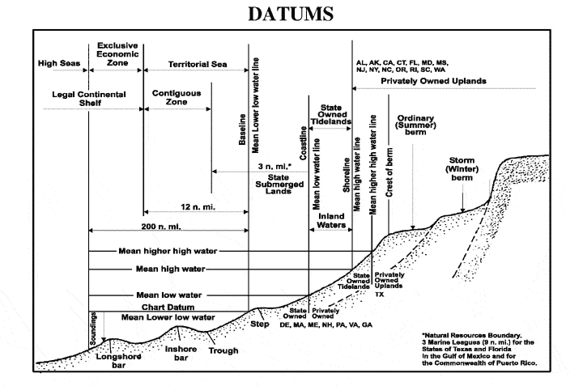
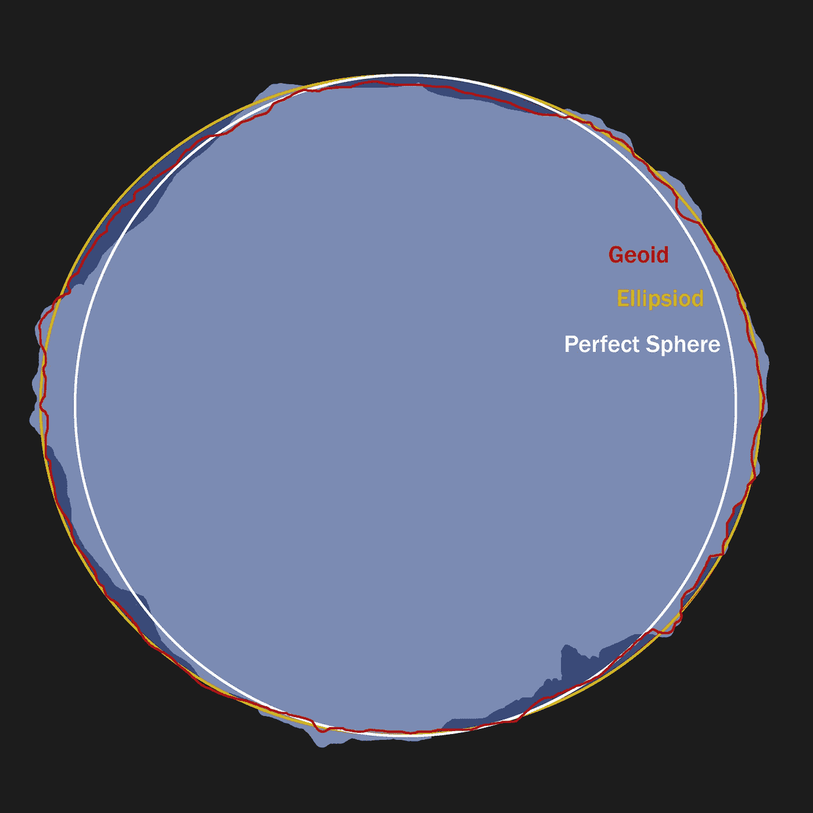

# 地理空间数据—基准入门

> 原文：<https://towardsdatascience.com/geospatial-data-a-datum-primer-479b7ca8635c?source=collection_archive---------6----------------------->

当我还是个孩子的时候，我和我爸爸一起看星球大战，他问我斗狗飞船是在上升还是下降。我的反应，“爸爸，那很傻，太空中没有上下之分！”

在太空中，当你在太空中“向上”或“向下”时，没有恒定的参考，并且在许多方面，当提供地面数据的参考时，存在相同的问题。这些年来，这个问题变得越来越复杂，但本质上还是一样的。

**地理信息系统** (GIS)的强大之处在于能够创建一个关系空间框架来设置信息层，从而获得洞察力。但是首先最基本的…

# 投影和纬度/经度

制图学是制作地图的研究和实践，在人类历史中有很深的渊源。公元前 3 世纪的厄拉多塞最早提出以**(北/南)和**(东/西)作为坐标系。测量分为度、分和秒，可以扩展为小数以提高精确度。如果秒被测量到六个小数位，它们将精确到 4 英尺，而如果只测量到一个小数位，它们将精确到 6.9 英里。****

********

****This is an example of a [Web Mercator](https://en.wikipedia.org/wiki/Web_Mercator) projection****

****纬度和经度描述了地球的三维结构，但将其转换到 2D 地图上需要使用 [**投影**](https://en.wikipedia.org/wiki/Map_projection) ，或者一系列将曲面上的点的位置转换到平面上的位置的变换。很容易就有一整篇文章讨论各种预测的利弊。****

****精度是对地图要素的观测或估计结果与其真实值或位置的接近程度的测量。现代制图中有两种类型的精度:****

*   ******相对精度:**相对精度是地图上给定点相对于同一地图内其他点的精确程度。制图通常使用一个已知的点，并根据这个局部参考进行测量。****
*   ******绝对精度**:绝对精度是指地图上的某个点与现实世界中某个固定坐标系的对应程度，即地图上某个点的经纬度与实际 GPS 坐标的对应相当准确。****

****现代应用，如自动驾驶汽车或飞机自动驾驶，需要比 50 年前更高的精确度。当前标准的发展反映了对提高精确度所面临的问题的解决方案。****

# ****位置的问题****

****在地球上放置一个参考点并不像最初看起来那样简单。首先，地球并不是一个完美的球体，而是由于重力而在中间凸起。它也是由移动的[构造板块](https://en.wikipedia.org/wiki/List_of_tectonic_plates)组成，当它们汇聚时也可能上升或下沉(在佛蒙特州，自 14000 年前冰川融化以来，地面仍在上升！).****

****最初的解决方案之一产生了自己的问题:**平均海平面(MSL)** 。这是通过长期测量海面高度并进行数学平均以消除波浪、潮汐以及风和海流短期变化的影响来确定的。****

****但是，它不会消除当地重力强度、水温和盐度的影响，因此 MSL 相对于大地基准面(不是基于实际海平面)的高度在世界各地会有所不同。通常一个国家会选择一个特定点的平均海平面作为所有制图的标准“海平面”。****

********

****[http://wiki.gis.com/wiki/index.php/Chart_datum](http://wiki.gis.com/wiki/index.php/Chart_datum)****

****当涉及到航海图时，水手必须能够知道在任何一点可能出现的最小水深。海图上的深度和潮汐是相对于[海图基准面](http://wiki.gis.com/wiki/index.php/Chart_datum)测量的，该基准面被定义为潮汐很少下降的水平面。这可能会造成船只搁浅或安全通过的差别。****

****回顾历史，海平面也没有在整个地质时期保持不变。当比较数据时，所有这些变量都会产生巨大的问题。****

# ****参考椭球、大地水准面和基准面****

****为了提供一组通用参考，使用了一个**基准**。通常，基准面定义了表面和表面相对于地球中心的位置。基准面有两种类型:水平或垂直。绘制北美海岸线的最初努力始于 1807 年杰斐逊总统和费迪南德·哈斯勒领导下的美国海岸测量局，但直到许多年后第一个标准化数据才在北美被广泛采用。****

********

****水平基准提供了一个固定点的参考和一个 [**参考椭球**](http://wiki.gis.com/wiki/index.php/Reference_ellipsoid) 模型，更好地代表了地球的非球面形状。1927 年的 [**北美基准**](https://www.ngs.noaa.gov/web/about_ngs/history/datums.gel.pdf) (NAD 27)使用了堪萨斯州米德牧场的一个固定点作为美国和克拉克椭球的邻接中心，因为它与美国非常吻合，并且误差最小。这是多年来的共同标准。它的替代品， [**北美基准 1983**](https://en.wikipedia.org/wiki/North_American_Datum#North_American_Datum_of_1983) (NAD 83)，取而代之的是使用地球的引力中心(也叫地心基准)作为椭球的固定参考。****

****垂直基准面用于根据平均海平面、潮汐数据或使用重力来表示假设海平面的大地水准面来描述某点的高程或正高。目前的 1988 年****【NAVD 88】北美垂直基准是一个大地水准面模型，它使用能够高精度测量重力的仪器来创建一个假设的形状，即在没有风和潮汐等其他影响的情况下，海洋表面仅受地球重力和自转的影响。地壳密度和山脉等特征会影响大地水准面的形状，它会偏离基于椭球的基准面，如 [WGS84](http://wiki.gis.com/wiki/index.php/WGS84) 、 [GRS80](http://wiki.gis.com/wiki/index.php/GRS80) 或 [NAD83](http://wiki.gis.com/wiki/index.php/NAD83) 。********

******在一个联系日益紧密的世界中，对通用视角的需求导致了以椭球体模型为起点的全球基准，如 WGS72、 [**大地测量系统参考 1980**](https://en.wikipedia.org/wiki/GRS_80) (GSR 80)，以及最终的 1984【WGS 84】世界大地测量系统 [**。**](https://confluence.qps.nl/pages/viewpage.action?pageId=29855173)******

****WGS84 是最常用的国际标准，是 1987 年 1 月以后全球定位系统(GPS)使用的参考坐标系。误差被认为小于地球中心质量的 2 厘米。****

# ****基准位移****

****每个数据集应该有哪些数据用于 [**元数据**](http://desktop.arcgis.com/en/arcmap/10.3/manage-data/metadata/what-is-metadata.htm)**阅读和理解它可以节省大量的时间和以后的痛苦。不能将两个具有不同基准面的数据集叠加在一起，因为它们不会对齐。相反，有一个将数据从一个数据转换到另一个数据的过程，称为数据转换；也叫坐标变换( [EPSG](http://www.epsg.org/) 、 [OGC](http://www.opengeospatial.org/) )或[地理变换](http://edndoc.esri.com/arcobjects/9.2/NET/d1b1de05-b15f-4787-829f-dd9b0d883c4c.htm) ( [ESRI](http://www.esri.com/) )。不同基准面之间的误差幅度可以小到几百英尺。******

******例如，自 1986 年建立原始大地测量基准以来，国家大地测量局已多次调整 NAD 83 基准，必须考虑这些细微差别。所有基准的完整列表太长，无法在此列出，但请看[该列表](http://www.colorado.edu/geography/gcraft/notes/datum/edlist.html)了解更多信息。******

******同样重要的是要理解，通常局部基准面的坐标系原点不在地球的中心，而是局部基准面的椭球体偏离了地球的中心。NAD 27 和 1950 年欧洲基准(ED 1950)是本地基准。NAD 27 的设计相当适合北美，而 ED 1950 则是为欧洲使用而设计的。因为局部基准面将其椭球体与地球表面的特定区域如此紧密地对齐，所以它不适合在设计区域之外使用。******

# ******基准的未来******

******技术及其应用方式的变化总是需要对基准进行更新，NAD 83 和 NAVD 88 将在 2022 年被更新的版本所取代。这将校正大陆漂移，并有助于提高精度，因为 NAD 83 的非地心距离约为 2.2 米(约 7.2 英尺)。精度方面的一些问题是使用被动大地测量标记确定的基准的产物，这些标记已经随着时间的推移而退化。******

******取而代之的新数据将主要依赖卫星的 GPS，随着时间的推移，GPS 将变得更容易、更精确。取代三个现有 NAD 83 参考框架的将是四个平板固定地球参考框架:******

*   ********2022 年北美地球参考框架(NATRF2022)********
*   ******2022 年太平洋陆地参考框架(PATRF2022)******
*   ******2022 年马里亚纳地球参考框架(MATRF2022)******
*   ******2022 年加勒比陆地参考框架(CATRF2022)******
*   ******2022 年北美-太平洋位势数据(NAPGD2022)******

****在 NAPGD2022 中，将有一个大地水准面的时间相关模型，在三个区域提供(第一个覆盖整个北美和中美、夏威夷、阿拉斯加、格陵兰和加勒比海，第二个覆盖美属萨摩亚，第三个覆盖关岛和马里亚纳群岛联邦)，将被称为大地水准面 22。****

****像所有科学领域一样，这是一个不断发展的过程，以适应当代人的需求。超级精确的地理空间数据所展现的潜力可能会改变生活，但像大多数事情一样，理解它的遗产也很重要。深入研究，看看元数据，看看你能找到什么！****