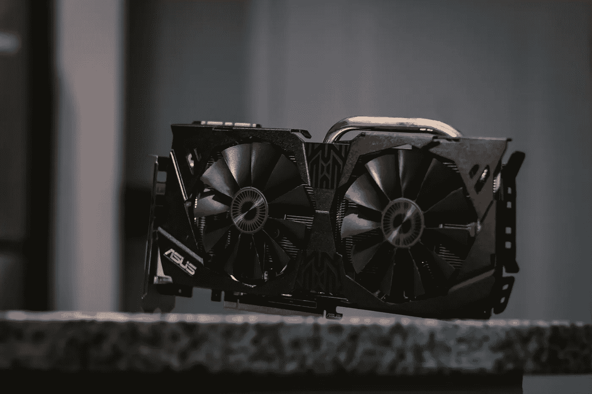
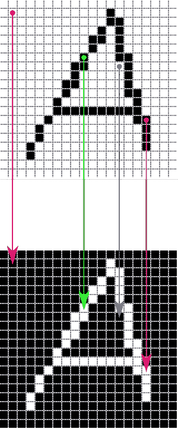
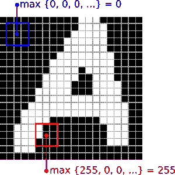
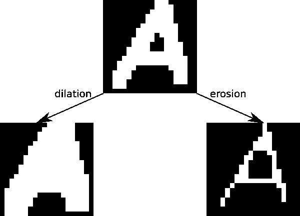
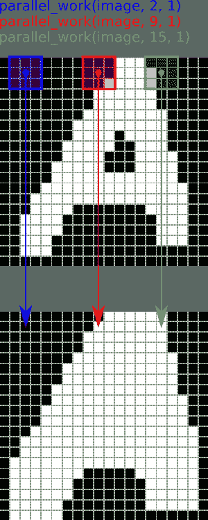
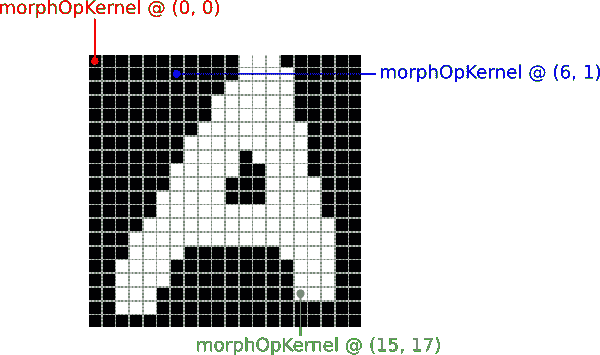

# 使用 OpenCL 的 GPU 图像处理

> 原文：<https://towardsdatascience.com/get-started-with-gpu-image-processing-15e34b787480?source=collection_archive---------2----------------------->

## **使用 Python 和 OpenCL 以不到 120 行代码实现两种图像处理方法**



Large speed-ups can be achieved by using GPUs instead of CPUs for certain tasks. (Image: Joseph Greve)

除了图形处理单元(GPU)的明显用例，即渲染 3D 对象，还可以使用 OpenCL 或 CUDA 等框架执行通用计算。一个著名的用例是比特币挖矿。我们将看看另一个有趣的用例:图像处理。在讨论了 GPU 编程的基础之后，我们使用 Python 和 OpenCL 在不到 120 行代码中实现了膨胀和腐蚀。

# 为什么图像处理非常适合 GPU？

## 第一个原因

许多图像处理操作在图像中逐个像素地迭代，使用当前像素值进行一些计算，最后将每个计算值写入输出图像。图 1 示出了作为例子的灰度值反转操作。我们单独反转每个像素的灰度值。对于每个像素，这显然可以同时(并行)完成，因为输出值不相互依赖。



Fig. 1: Inverting the color of an image. The output pixel at some location can be computed by only taking the input pixel at the same location into account. Some corresponding pixels are shown by colored lines.

## 第二个原因

在进行图像处理时，我们需要快速访问像素值。GPU 是为图形目的而设计的，其中之一是纹理，因此访问和操作像素的硬件得到了很好的优化。图 2 显示了 3D 程序中纹理通常的用途。


Fig. 2: Textures are often used to make models (in this case a sphere) make look more realistic.

# 膨胀和侵蚀

让我们简单看一下我们实现的图像处理方法。这两种运算都属于形态学运算的范畴。掩模(通常称为结构化元素)在输入图像中逐像素移动。对于每个位置，掩膜下的最大(用于膨胀)或最小(用于腐蚀)像素值被写入输出图像。图 3 示出了如何计算膨胀的图示。



Fig. 3: The 3×3 mask is shifted through the image. For dilation, the maximum pixel value under the mask is taken as the resulting value. Two locations of the mask are shown, one resulting in a black pixel (0), the other one resulting in a white pixel (255).

为了了解这两种操作，请看图 4。此外，图 5 示出了灰度值图像及其腐蚀版本。



Fig. 4: Top: input image. Bottom: output images for dilation and erosion.


Fig. 5: This example shows how to increase the pen width using multiple erosions.

# 利用 GPU 的并行性

正如你所看到的，当应用膨胀或腐蚀时，蒙版在图像中移动。在每个位置，应用相同的基本操作(通过掩模选择像素组，输出最大或最小像素值)。此外，输出像素不相互依赖。

这意味着将基本操作实现为输入图像上的一个函数，并为位置添加一个参数。然后，我们同时(并行)对所有可能的位置(x 在 0 和 width-1 之间，y 在 0 和 height-1 之间)调用该函数，以获得输出图像。

让我们先做一个伪代码实现:要么我们调用 synchronous_work(image)并遍历所有(x，y)位置，在每个迭代步骤应用相同的操作。或者我们调用 parallel_work(image，x，y ),并为所有位置并行调用其附加位置参数(例如，通过为每个实例启动一个线程)。图 6 示出了如何并行计算输出像素值。

同步实施:

```
**synchronous_work**(image):
   for all (x, y) locations in image:
      1\. select pixels from 3×3 neighborhood of (x, y)
      2\. take maximum (or minimum)
      3\. write this value to output image at (x, y)in main: run one instance of **synchronous_work**(image)
```

并行实现:

```
**parallel_work**(image, x, y):
   1\. select pixels from 3×3 neighborhood of (x, y)
   2\. take maximum (or minimum)
   3\. write this value to output image at (x, y)in main: run one instance of **parallel_work**(image, x, y) for each (x, y) location in the image at the same time
```



Fig. 6: Three mask locations are shown. The resulting pixel values do not depend on each other and can therefore be computed at the same time.

# OpenCL 实施

让我们移植我们的伪代码，使它运行在真正的 GPU 上:我们将使用开放计算语言(OpenCL)框架。图 7 说明了我们的实现所做的事情:我们首先将输入图像复制到 GPU，编译内核(GPU 程序)，对所有像素位置并行执行，最后从 GPU 复制回结果图像。

我们需要为主机和设备分别实现一个程序:

*   CPU(“主机”):一个 Python 程序，它设置 OpenCL，发布 CPU 和 GPU 之间的数据传输，负责文件处理等等
*   GPU(“设备”):一个 OpenCL 内核，它使用一种类似 C 的语言进行实际的图像处理


Fig. 7: A rough overview of what our OpenCL implementation does.

## 入门指南

*   OpenCL 已安装并运行
*   pyopencl 已安装并正常工作
*   从 [GitHub](https://github.com/githubharald/GPUImageProcessingArticle) 克隆存储库

## CPU 程序(主机)

CPU 或主机代码的大部分可以被视为样板代码。大多数时候，设置主要的 OpenCL 数据结构都是以同样的方式完成的。此外，准备输入和输出数据遵循一定的模式，同样适用于 GPU 程序编译，执行和数据传输。您应该能够使用提供的代码实现其他算法，如边缘检测或亮度调整，而无需接触 CPU 程序。让我们快速浏览一下主要步骤。括号中的数字与代码中的数字相对应，以便于导航。

(1)首先，必须完成 OpenCL 初始化:

*   选择平台:一个平台对应一个安装的驱动程序，例如 AMD
*   从所选平台选择 GPU 设备:您可能安装了多个 GPU。我们只取 GPU 列表中的第一个条目
*   创建一个 cl。上下文对象:该对象将运行 GPU 程序的所有相关信息(选定的设备、数据等)联系在一起
*   创建 cl 类型的命令队列对象。CommandQueue:这个对象是一个 FIFO 队列，它允许我们发出命令向/从 GPU 发送/接收数据，还允许我们在 GPU 上执行程序

(2)准备资料:

*   将图像从文件读入数字图像
*   分配与占位符大小相同的输出数字图像。我们稍后将使用来自 GPU 的结果来填充它
*   创建 cl 类型的缓冲区。保存 OpenCL 图像数据的图像

(3)准备 GPU 程序(图 8 示出了表示 GPU 程序的对象层次):

*   从文件中读取 GPU 程序的源代码并创建 cl。从中选择程序对象
*   用 cl 编译程序。Program.build 方法
*   创建 cl 类型的内核对象。代表我们的 GPU 程序的入口点的内核
*   设置内核函数的参数:这是我们的 CPU 程序中的数据和 GPU 程序中访问的数据之间的连接。我们传递输入和输出图像缓冲区以及一个整数，该整数表示我们是要应用膨胀(=0)还是腐蚀(=1)。我们使用 cl。方法，并指定内核参数的索引(例如，0 对应于我们的内核函数的参数列表中的第一个参数)和 CPU 数据


Fig. 8: OpenCL objects representing GPU program and its arguments.

(4)执行 GPU 程序并传输数据:

*   使用 cl.enqueue_copy 发出一个命令，将输入图像复制到输入缓冲区
*   执行 GPU 程序(内核):我们实现了像素级的形态学操作，因此我们将为每个(x，y)位置执行一个内核实例。这种数据和内核的结合称为工作项。我们需要处理整个图像的工作项的数量等于宽度*高度。我们将内核和图像大小传递给 cl.enqueue_nd_range_kernel 函数来执行工作项
*   当 GPU 程序完成其工作时，我们使用 cl.enqueue_copy 将数据从输出缓冲区复制回输出图像(并等待直到该操作完成，以将填充的输出图像返回到调用 Python 函数)

总结:我们设置 OpenCL，准备输入和输出图像缓冲区，将输入图像复制到 GPU，在每个图像位置并行应用 GPU 程序，最后将结果读回 CPU 程序。

## GPU 程序(设备上运行的内核)

OpenCL GPU 程序是用类似 c 的语言写的，入口点叫内核函数，我们这里是函数 morphOpKernel(…)。它的参数对应于我们在 CPU 程序中设置的参数。在内核中，有必要访问工作项 id。您要记住:工作项是代码(内核)和数据(在我们的例子中是图像位置)的组合。当在 CPU 程序中调用 cl.enqueue_nd_range_kernel 时，我们指定图像中的每个(x，y)位置需要一个工作项。我们通过使用函数 get_global_id 来访问工作项 id。因为我们有两个维度(因为图像有两个维度)，所以我们得到两个维度的 id。第一个 ID 对应于 x，第二个 ID 对应于 y。现在我们知道了像素位置，我们可以读取 3×3 邻域中的像素值，计算输出值，并最终将其写入输出图像中的相同位置。

(1)内核:

*   执行 GPU 程序时的入口点(也可能有内核调用的子函数)
*   我们将一个只读的输入图像和一个只写的输出图像传递给内核。此外，我们传递一个整数，它告诉我们是否必须应用膨胀(=0)或腐蚀(=1)

(2)全局 id 标识工作项，在我们的例子中对应于 x 和 y 坐标。

(3)结构化元素(掩模)由两个嵌套循环实现，这两个嵌套循环表示围绕中心像素的 3×3 正方形邻域。

(4a)使用 read_imagef 函数访问像素数据，该函数返回 4 个浮点数的向量。对于灰度值图像，我们只需要可以用 s0 索引的第一个分量。它是介于 0 和 1 之间的浮点值，表示像素的灰度值。我们将图像、像素位置和一个采样器传递给这个函数。采样器允许在像素之间进行插值，但在我们的例子中，采样器只不过是返回给定位置的像素值。

(4b)采样器由选项组合定义。在我们的例子中，我们希望采样器使用非标准化的坐标(从 0 到 width-1，而不是从 0 到 1)。此外，我们禁用像素之间的插值(因为我们不在像素位置之间采样)，并且我们还定义了当我们访问图像外部的位置时会发生什么。

(5)根据操作，我们寻找 3×3 邻域内的最大/最小像素值。

(6)将结果写入输出图像。同样，我们指定图像和位置。我们必须传递 4 个浮点数的向量，但是我们只需要填充第一个条目，因为我们的图像是灰度值的。

## 测试一下

执行 **python main.py** ，将这两个操作应用于图 9 所示的输入图像。执行后，目录中出现两个文件:dilate.png 和 erode.png，代表膨胀和腐蚀的结果。


Fig. 9: This image is used to test the implementation.

# 幕后发生了什么？

我们为每个像素创建一个工作项，如图 10 所示。GPU 为每个要并行处理的工作项启动某种硬件线程。当然，同时活动的线程数量受到硬件的限制。一个有趣的特性是，这些线程并不是完全独立的:有多组线程同步执行，对不同的数据实例应用相同的操作(SIMD)。因此，内核中的分支(if-else，switch-case，while，for)可能会降低执行速度:GPU 必须为所有在 lock-step 中执行的线程处理两个分支，即使只有一个线程发生分歧。



Fig. 10: Work-items are instances of the kernel created for all image-locations. Here, three work-items are shown.

GPU 上有不同类型的并行性(如使用向量类型、分区数据和并行应用操作到每个数据元素等)。我们只使用了其中一种类型，在像素级拆分数据，并单独计算每个像素位置的输出。

如果仔细观察 GPU 程序，您可能会注意到变量有不同的地址空间:输入和输出图像对所有工作项都是全局可见的，而在函数中用作暂存区的变量仅对工作项实例可见。这些地址空间对应于底层硬件。举个例子:图像由纹理单元及其采样器处理。这些单元也用于游戏和类似应用中的 3D 物体纹理。

# 进一步阅读

如果你想对 GPU 编程和 OpenCL 有更深入的了解，没有办法可以绕过阅读这方面的好书。有许多用例可以在 GPU 上高效地计算，而不仅仅是像图像处理和比特币挖掘这样的著名用例。

我推荐这本书[1]来帮助你开始使用 OpenCL。这本书从像 4D 矩阵向量乘法这样的简单程序开始，以像 FFT 或双调排序这样的复杂主题结束。

此外，这本书[2]也是一本很好的读物，但是它已经期望获得一些 OpenCL 的经验。

根据您的 GPU，您可能会找到有关其 OpenCL 实现的信息，以更好地了解 OpenCL 如何转换为硬件，例如，请参见 AMD 的[3]。

Khronos 提供了规范[4]和一个非常有用的 API 参考卡[5]。

[1] Scarpino — OpenCL 在行动
[2] Gaster 等人— OpenCL 的异构计算
[3] AMD 加速并行处理— OpenCL 编程指南
[4]Khronos—OpenCL 规范
[5] Khronos — OpenCL API 参考卡