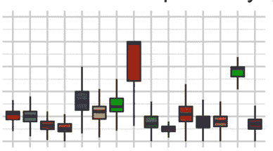
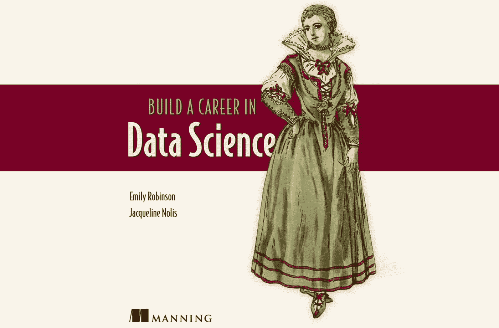

# 让数据科学发挥作用

> 原文：<https://towardsdatascience.com/getting-data-science-to-work-872d78865793?source=collection_archive---------4----------------------->

## 预测模型不仅仅是预测

在构建预测模型时，大多数初级(以及许多高级)数据科学家都陷入了一个思维陷阱，认为他们工作的成功恰恰取决于预测的准确性。这里有一个例子:一个数据科学家被拉进一个项目，“帮助预测哪些客户最有可能打开一封营销邮件。”他们花了数周时间想出如何做到这一点:线性回归还是随机森林？模型中应该包括哪些功能？我们应该在哪个时间段建立预测？模型是否应该包含正则化组件以避免过度拟合？数据科学家梳理谷歌学术，搜索交叉验证，并通过电子邮件向他们的同事征求建议。然后缩小到一个型号:这个型号有更好的 R，但是那个包括更少的功能。经过深思熟虑，做出了选择，数据科学家感到满意。

不幸的是，该模型从未投入使用，使得整个努力毫无价值。

这方面一个完美的案例研究是网飞奖:网飞向最能预测人们会喜欢哪部电影的团队支付了 100 万美元的奖金。不幸的是，[解决方案从未实施](https://www.techdirt.com/blog/innovation/articles/20120409/03412518422/why-netflix-never-implemented-algorithm-that-won-netflix-1-million-challenge.shtml)。事实证明，获奖的解决方案是如此复杂，以至于工程团队实现它所涉及的工作不值得获得准确性。获胜的解决方案实际上是 107 种不同的机器学习方法的[组合，因此试图让 107 种方法在生产中运行是没有意义的。](http://techblog.netflix.com/2012/04/netflix-recommendations-beyond-5-stars.html)

当建立一个预测模型时，你不能只选择最符合数据的模型，你需要设计一个人们想要实现的模型*。要做到这一点，模型需要得到组织中许多人的认可。它需要由负责监控和维护模型的工程团队签署。这通常意味着实现一个更简单的模型——你可以在几乎任何系统中编写逻辑回归代码，但让深度学习网络为存储在传统数据库中的数据可靠地运行可能是一项更艰巨的任务。这也意味着快速创建一个解决方案:如果你可以花三周时间使用逻辑回归得到一个“体面”的解决方案，那么为什么要花六个月时间寻找一个更好的呢？到那时，业务问题可能不再相关，或者哎呀，你的资金几个月前就用完了。*

*同样重要的是，你需要让商业利益相关者参与进来。这些人将会使用模型的结果(并可能为开发付费)。在我的位置上，这往往是营销主管，他们将使用工具来预测客户行为。对于其他人来说，可能是产品设计团队或物流部门。这些人需要相信模型会提供一个比根本没有更好的解决方案，这并不容易，因为模型需要维护。*

*那么，如何让商业利益相关者参与进来呢？通过清晰的叙述展示模型。通过 PowerPoint 或其他方式向他们展示你在模型中使用的数据以及你选择它的原因。你在建立模型时做了什么选择，这对结果有什么影响？该模型是否倾向于在预测方面做得很好，以及有多少潜在的收入收益。模型中的特征重要性是否告诉了你如何以不同的方式进行营销？*

**

*You’d be amazed at how much colorful shapes can help sell your data science solution*

*如果你能有效地让人们同意“是的，这是我们应该有的东西”，那么建立模型就变得容易多了。人们会很兴奋地看到模型的结果对业务有所帮助，并渴望让你从事其他项目。除非您有能力将您的模型呈现给将要使用它的人，否则您无法达到这种状态，这意味着您要花时间围绕工作创建演示文稿，而不是优先构建更好的模型。*

*通常很难知道何时停止——如果你总能让模型变得更好，为什么不去做呢？最好的方法是让外界的约束为你做决定。如果在整个模型开发过程中，您不断地准备好模型的演示，并在模型发生变化时更新它，那么就很容易不断地使模型变得更好，直到其他因素(如您的老板)要求模型就位。使用诸如 Rmarkdown (R)或 Jupyter Notebooks (Python)之类的工具最容易做到这一点，这些工具让您只需点击一个按钮就可以轻松导出结果。*

*因此，当你致力于为你的企业建立新的预测能力时，请记住，让其他人想要使用它们和创造它们一样困难。虽然很容易(也很有趣！)要深入数据科学，尝试构建*最佳*预测模型，不要忘记你在一个也需要参与的团队中工作。*

*如果你想要一大堆帮助你在数据科学领域发展职业生涯的方法，看看我和艾米丽·罗宾逊写的书: [*在数据科学领域建立职业生涯*](http://bestbook.cool) 。我们将带您了解成为数据科学家所需的技能，找到您的第一份工作，然后晋升到高级职位。*

**