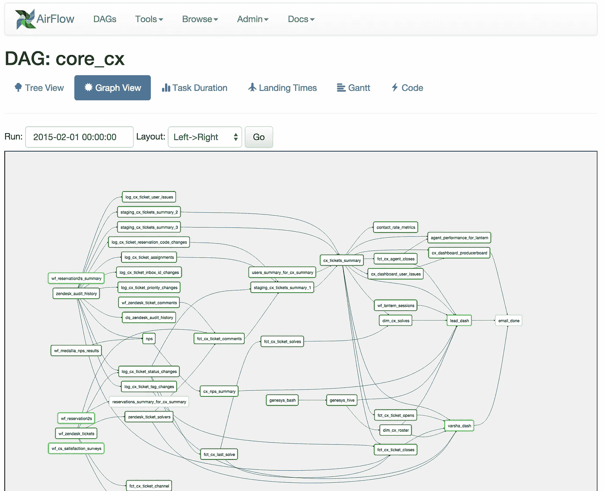
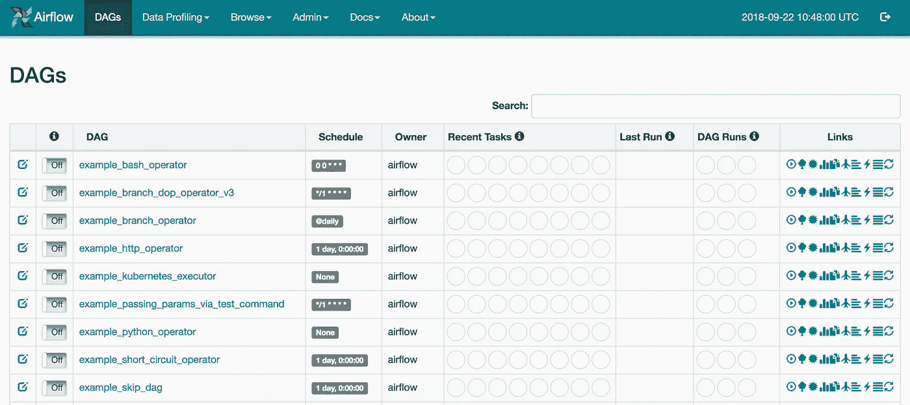
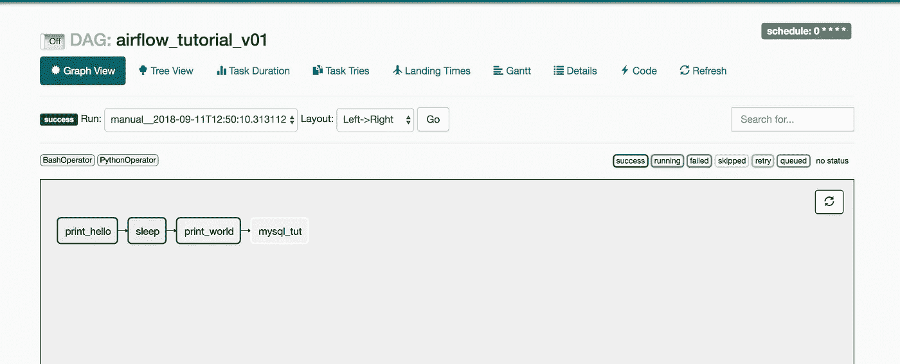
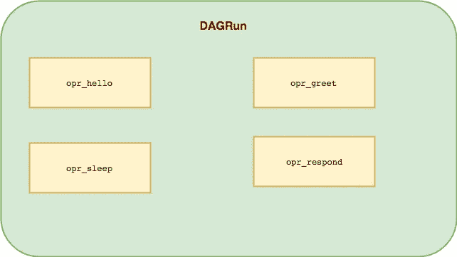
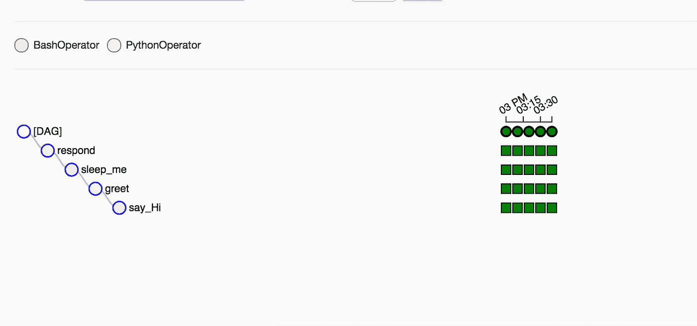
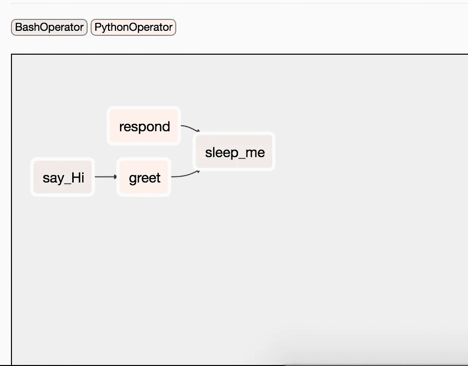

# Apache Airflow 入门

> 原文：<https://towardsdatascience.com/getting-started-with-apache-airflow-df1aa77d7b1b?source=collection_archive---------1----------------------->


Credit Airflow Official Site

在这篇文章中，我将讨论由 Airbnb 开发的工作流管理系统 Apache Airflow。

早些时候，我曾和[讨论过](https://medium.com/python-pandemonium/develop-your-first-etl-job-in-python-using-bonobo-eaea63cc2d3c)用 Bonobo 编写基本的 ETL 管道。Bonobo 在编写 ETL 管道方面很酷，但是这个世界并不全是编写 ETL 管道来实现自动化。还有一些其他的用例，在这些用例中，您必须按照一定的顺序执行任务一次或者定期执行。例如:

*   监控 Cron 作业
*   将数据从一个地方传输到另一个地方。
*   自动化您的开发运维。
*   定期从网站上获取数据，并为你令人敬畏的价格比较系统更新数据库。
*   基于推荐系统的数据处理。
*   机器学习管道。

可能性是无穷的。

在我们进一步在我们的系统中实现气流之前，让我们讨论一下什么是气流及其术语。

# 什么是气流？

从网站:

> Airflow 是一个以编程方式创作、调度和监控工作流的平台。
> 
> 使用 airflow 将工作流创作为任务的有向无环图(Dag)。airflow scheduler 在遵循指定依赖关系的同时，对一组工作线程执行您的任务。丰富的命令行实用程序使在 Dag 上执行复杂的手术变得轻而易举。丰富的用户界面使得可视化生产中运行的管道、监控进度以及在需要时解决问题变得容易。

基本上，它有助于自动化脚本来执行任务。Airflow 是基于 Python 的，但是你可以执行一个程序，而不管它是什么语言。例如，工作流程的第一阶段必须执行一个基于 C++的程序来执行图像分析，然后执行一个基于 Python 的程序来将信息传输到 S3。可能性是无穷的。

# Dag 是什么？

*来自维基百科*

> 在数学和计算机科学中，有向无环图(DAG /ˈdæɡ/(关于这个声音听))是没有有向圈的有限有向图。也就是说，它由有限数量的顶点和边组成，每条边从一个顶点指向另一个顶点，因此没有办法从任何顶点 v 开始，并沿着一致指向的边序列，最终再次循环回到 v。等价地，DAG 是具有拓扑排序的有向图，即顶点序列，使得每条边在序列中从前面指向后面。

让我试着用简单的话来解释:你只能是你父亲的儿子，而不是相反。好吧，这是蹩脚或怪异的，但找不到更好的例子来解释一个*定向周期*。



Airflow DAG(Credit: Apache Airflow)

在 Airflow 中，所有工作流都是 Dag。Dag 由*操作符组成。*操作员定义需要执行的单个任务。有不同类型的操作器可用(如 Airflow 网站上给出的):

*   `BashOperator` -执行一个 bash 命令
*   `PythonOperator` -调用任意的 Python 函数
*   `EmailOperator` -发送电子邮件
*   `SimpleHttpOperator` -发送一个 HTTP 请求
*   `MySqlOperator`、`SqliteOperator`、`PostgresOperator`、`MsSqlOperator`、`OracleOperator`、`JdbcOperator`等。-执行 SQL 命令
*   `Sensor` -等待一定的时间、文件、数据库行、S3 键等

你也可以根据自己的需要定制一个操作符。

# 安装和设置

气流是基于 Python 的。最好的安装方式是通过`pip`工具。

`pip install apache-airflow`

要验证它是否已安装，请运行命令:`airflow version`，它应该会显示如下内容:

```
[2018-09-22 15:59:23,880] {__init__.py:51} INFO - Using executor SequentialExecutor____________       _________________    |__( )_________  __/__  /________      ______  /| |_  /__  ___/_  /_ __  /_  __ \_ | /| / /___  ___ |  / _  /   _  __/ _  / / /_/ /_ |/ |/ /_/_/  |_/_/  /_/    /_/    /_/  \____/____/|__/v1.10.0
```

您还需要安装`mysqlclient`来将 MySQL 整合到您的工作流程中。尽管这是可选的。

`pip install mysqlclient`

在开始任何操作之前，创建一个文件夹并将其设置为`AIRFLOW_HOME`。我的情况是`airflow_home`。创建完成后，您将调用`export`命令将其设置在路径中。

`export AIRFLOW_HOME='pwd' airflow_home`

在运行`export`命令之前，确保你是在`airflow_home`之上的一个文件夹。在`airflow_home`中，你将创建另一个文件夹来保存 Dag。叫它`dags`

如果您设置了`load_examples=False`，它将不会在 Web 界面上加载默认示例。

现在你必须调用`airflow_home`文件夹中的`airflow initdb`。一旦完成，它就会创建`airflow.cfg`和`unitests.cfg`

`airflow.db`是一个 SQLite 文件，用来存储所有与运行工作流相关的配置。`airflow.cfg`就是保持所有的初始设置，让事情保持运行。

在该文件中，您可以看到值为`../airflow_home/airflow.db`的`sql_alchemy_conn`参数

愿意的话可以用 MySQL。现在，只要坚持基本设置。

到目前为止一切顺利，现在不浪费任何时间，让我们启动 web 服务器。

`airflow webserver`

启动时，屏幕显示如下:

```
2018-09-20 22:36:24,943] {__init__.py:51} INFO - Using executor SequentialExecutor/anaconda3/anaconda/lib/python3.6/site-packages/airflow/bin/cli.py:1595: DeprecationWarning: The celeryd_concurrency option in [celery] has been renamed to worker_concurrency - the old setting has been used, but please update your config.default=conf.get('celery', 'worker_concurrency')),____________       _________________    |__( )_________  __/__  /________      ______  /| |_  /__  ___/_  /_ __  /_  __ \_ | /| / /___  ___ |  / _  /   _  __/ _  / / /_/ /_ |/ |/ /_/_/  |_/_/  /_/    /_/    /_/  \____/____/|__/v1.10.0[2018-09-19 14:21:42,340] {__init__.py:57} INFO - Using executor SequentialExecutor____________       _________________    |__( )_________  __/__  /________      ______  /| |_  /__  ___/_  /_ __  /_  __ \_ | /| / /___  ___ |  / _  /   _  __/ _  / / /_/ /_ |/ |/ /_/_/  |_/_/  /_/    /_/    /_/  \____/____/|__//anaconda3/anaconda/lib/python3.6/site-packages/flask/exthook.py:71: ExtDeprecationWarning: Importing flask.ext.cache is deprecated, use flask_cache instead..format(x=modname), ExtDeprecationWarning[2018-09-19 14:21:43,119] [48995] {models.py:167} INFO - Filling up the DagBag from /Development/airflow_home/dagsRunning the Gunicorn Server with:Workers: 4 syncHost: 0.0.0.0:8080
```

现在，当您访问`0.0.0.0:8080`时，它会显示如下屏幕:



Airflow Web UI in action

你可以在这里看到一堆条目。这些是气流装置附带的示例。您可以通过访问`airflow.cfg`文件并将`load_examples`设置为`FALSE`来关闭它们

**DAG 运行**告知某个 DAG 已经执行了多少次。**最近的任务**告知 DAG 内当前运行的许多任务中的哪个任务，以及它的状态如何。**调度**类似于您在调度 Cron 时使用的调度，因此，我现在不强调它。**调度**负责这个特定 DAG 应该在什么时间被触发。



DAG (Graph View)

这是我之前创建并执行的 DAG 的截图。您可以看到代表任务的矩形框。你还可以在灰色方框的右上角看到不同颜色的方框，分别命名为:**成功**、**运行**、**失败**等。这些都是传说。在上图中，您可以选择所有的框都有绿色边框，但是，如果您不确定，请将鼠标悬停在 success legend 上，您将看到如下屏幕:


你可能已经注意到这些盒子的背景/填充颜色是绿色和芦苇色。在灰色框的左上角，您可以看到它们为什么会有这样的颜色，这些背景色代表了此 DAG 中使用的不同类型的运算符。在本例中，我们使用的是 *BashOperator* 和 *PythonOperator。*

# 基本示例

我们将研究一个基本的例子，看看它是如何工作的。我将解释这个例子。在之前在`airflow_home/`创建的`dags`文件夹中，我们将创建我们的第一个 DAG 样本。因此，我将创建一个名为`my_simple_dag.py`的文件

导入后你要做的第一件事就是编写例程，作为**操作符**的*任务*。我们将混合使用`BashOperator`和`PythonOperator`。

```
**import** datetime **as** dt

**from** airflow **import** DAG
**from** airflow.operators.bash_operator **import** BashOperator
**from** airflow.operators.python_operator **import** PythonOperator

**def greet**():
    print('Writing in file')
    **with** open('path/to/file/greet.txt', 'a+', encoding='utf8') **as** f:
        now = dt.datetime.now()
        t = now.strftime("%Y-%m-%d %H:%M")
        f.write(str(t) + '\n')
    **return** 'Greeted'**def respond**():
    **return** 'Greet Responded Again'
```

这是两个简单的例程，除了返回一个文本什么也不做。稍后我会告诉你为什么我要在文本文件中写东西。接下来我要做的是定义`default_args`并创建一个`DAG`实例。

```
default_args = {
    'owner': 'airflow',
    'start_date': dt.datetime(2018, 9, 24, 10, 00, 00),
    'concurrency': 1,
    'retries': 0
}
```

这里你在`default_args` `dict`变量中设置了一堆参数。

`start_date`告知自何时起该 DAG 应开始执行工作流。这个`start_date`可能属于过去。对我来说，现在是世界协调时 9 月 22 日上午 11 点。这个日期对我来说已经过去了，因为对我来说已经是世界标准时间上午 11:15 了。您可以随时通过`airflow.cfg`文件更改该参数，并设置您自己的本地时区。目前，UTC 对我来说很好。如果你仍然想知道气流使用了多少时间，检查一下气流网页界面的右上方，你应该会看到如下所示的内容。您可以将此作为参考来安排您的任务。


Current time on Airflow Web UI

在没有成功执行的情况下，`retries`参数重试运行 DAG **X** 的次数。`concurrency`参数有助于指定运行多个 Dag 所需的进程数量。例如，您的 DAG 必须运行 4 个过去的实例，也称为[回填](https://airflow.apache.org/scheduler.html#backfill-and-catchup)，间隔 10 分钟(*我将很快介绍这个复杂的主题*)，并且您已经将`concurrency`设置为`2`，那么**两个 DAG**将同时运行并执行其中的任务。如果你已经在你的 Python 中实现了`multiprocessing`，那么在这里你会有宾至如归的感觉。

```
**with** DAG('my_simple_dag',
         default_args=default_args,
         schedule_interval='*/10 * * * *',
         ) **as** dag:
    opr_hello = BashOperator(task_id='say_Hi',
                             bash_command='echo "Hi!!"')

    opr_greet = PythonOperator(task_id='greet',
                               python_callable=greet)
    opr_sleep = BashOperator(task_id='sleep_me',
                             bash_command='sleep 5')

    opr_respond = PythonOperator(task_id='respond',
                                 python_callable=respond)opr_hello >> opr_greet >> opr_sleep >> opr_respond
```

现在，我们使用[上下文管理器](https://en.wikibooks.org/wiki/Python_Programming/Context_Managers)定义 dag 及其属性，第一个参数是 DAG 的 ID，在我们的例子中是`my_simple_dag`，第二个参数我们已经讨论过，第三个参数需要与`default_args`中提到的`start_date`一起讨论。

在那个*上下文管理器中，*您正在分配操作符和任务 id。在我们的例子中这些操作符标记为:`opr_hello` `opr_greet` `opr_sleep`和`opr_respond`。这些名字然后出现在上面讨论的矩形框中。

在我继续之前，我最好讨论一下 *DAG 运行*和*调度器*以及它们在整个工作流中扮演什么角色。

## 什么是气流调度程序？

气流调度程序是一个一直运行的监控进程，根据`schedule_interval`和`execution_date.`触发任务执行

## 达格龙是什么？

一个 *DagRun* 是一次将运行的 DAG 的实例。当它运行时，它里面的所有任务都将被执行。



上图可能有助于理解一个 *DAGRun* :-)

假设`start_date`是世界标准时间 2018 年 9 月 24 日**下午 12:00:00，并且您已经在世界标准时间**下午 12:30:00**使用 ***/10 * * * *(每 10 分钟后)的`schedule_interval`启动了 DAG。**通过使用上面讨论的相同的`default_args`参数，以下将是将立即运行的 DAG 的条目，在我们的例子中，由于`concurrency`是`1`，所以一个接一个地运行:**


Running DAGS since the start date

为什么会这样？嗯，你要对此负责。气流给你的设备运行过去的狗。跑过 Dag 的过程称为[回填](https://airflow.readthedocs.io/en/latest/scheduler.html#backfill-and-catchup)。回填的过程实际上让气流为所有 Dag 设置了某种状态。该功能适用于运行 DAG 的场景，DAG 查询一些数据库或 API，如 Google Analytics，以获取以前的数据，并使其成为工作流的一部分。即使没有过去的数据，Airflow 也会运行它，以保持整个工作流的状态不变。

运行完过去的 Dag 后，下一个 Dag(您打算运行的 Dag)将在 UTC 时间下午 **12:40:00 运行。请记住，无论您设置什么计划，DAG 都会在该时间之后运行，在我们的情况下，如果它必须每 10 分钟在**之后运行**，它将在 10 分钟过后运行一次。**

让我们一起玩吧。我打开`my_simple_dag`，然后启动调度程序。


Starting the DAG

`airflow scheduler`

运行后，您将看到如下所示的 dag 屏幕:


DAG with status “Running”

一些任务正在排队。如果您单击 DAG Id，`my_simple_dag`，您将看到如下屏幕:


DAGs backfilled

注意**运行 Id** 列中的时间戳。你看到模式了吗？第一次是在 10 点，然后是 10 点 10 分，10 点 20 分。然后它会停止，让我再次澄清，DAG 会在 10 分钟的持续时间过后运行。*调度器*在上午 10:30 开始。因此它用间隔的 **10 分钟**的差值填充通过了 **3** 。


DAG with Backfills and the current one

为 UTC 上午 **10:30:00 执行的 DAG 实际上是在 UTC** 上午 **10:40:00 完成的，最新的 DAGRun 记录将始终比当前时间减一。在我们的例子中，机器时间是 UTC 时间**上午 10:40:00****



DAG Tree View

如果您将鼠标悬停在其中一个圆圈上，您可以看到在 **Run:** 前面的时间戳，它告诉您它被执行的时间。你可以看到这些绿色的圆圈有 10 分钟的时间差。给出的*树形视图有点复杂，但是给出了整个工作流程的完整画面。在我们的例子中，它运行了 4 次，所有任务都运行成功，深绿色。*

有两种方法可以避免回填:将`start_date`设置在未来，或者将`catchup = False`设置在`DAG`实例中。例如，您可以执行如下操作:

```
**with** DAG('my_simple_dag',
         catchup=**False**,
         default_args=default_args,
         schedule_interval='*/10 * * * *',
         # schedule_interval=None,
         ) **as** dag:
```

通过设置`catchup=False`，你的`start_date`是否属于过去并不重要。它将从当前时间开始执行并继续。通过设置`end_date`，你可以让 DAG 停止运行。

```
opr_hello >> opr_greet >> opr_sleep >> opr_respond
```

你在上面看到的这条线说明了操作者之间的关系，因此构成了整个工作流程。这里的按位运算符讲的是运算符之间的关系。这里`opr_hello`先跑，然后剩下的。流程从左到右执行。在图示形式中，它看起来如下:


DAG In GraphView

```
opr_hello >> opr_greet >> opr_sleep << opr_respond
```

如果您更改最后一个运算符的方向，流程将如下所示:



任务`respond`将并行执行，而`sleep`将在两种情况下执行。

# 结论

在这篇文章中，我讨论了如何引入一个全面的工作流系统来安排和自动化您的工作流。在第 2 部分中，我将给出一个真实的例子来展示如何使用气流。我想在这篇文章中掩盖它，但它已经够长了，解释 DAGRun 概念是必要的，因为我花了相当长的时间才弄明白。

*一如既往，这个帖子的代码可以在*[***Github***](https://github.com/kadnan/Airflow-Tutorial)*上找到。*

*本帖原载* [*此处*](http://blog.adnansiddiqi.me/getting-started-with-apache-airflow/) *。*

## 如果你喜欢这篇文章，那么你应该订阅我的时事通讯。