# AutoML Vision alpha 入门

> 原文：<https://towardsdatascience.com/getting-started-with-automl-vision-alpha-ba769121235c?source=collection_archive---------5----------------------->

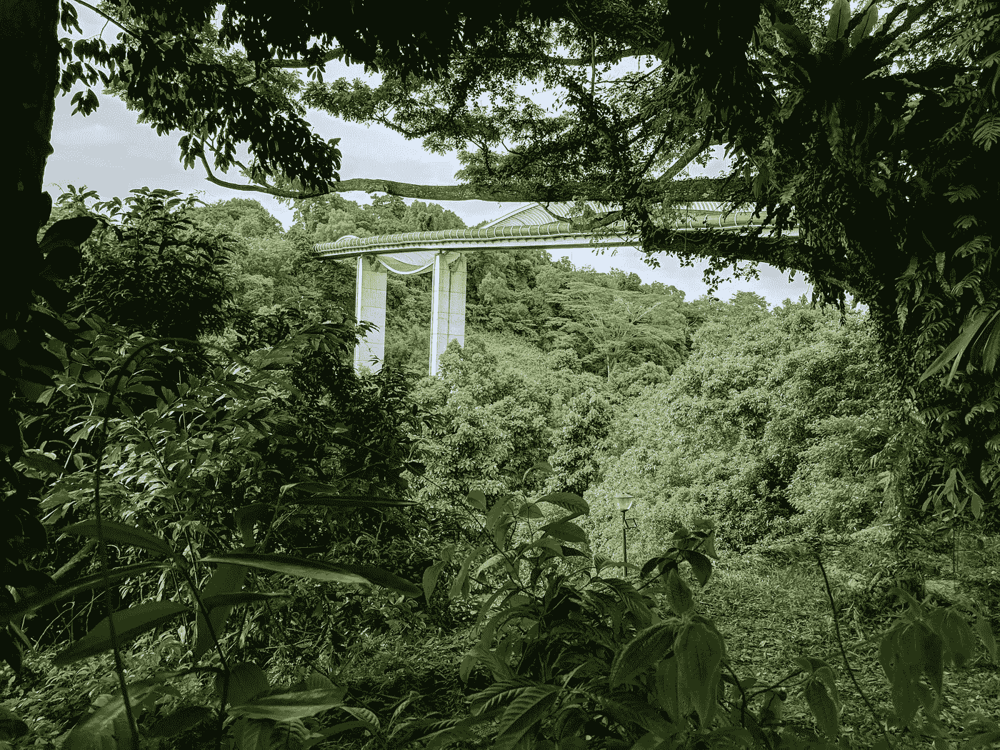

May your path to machine learning be less twisted

我演讲时被问到的最多的事情之一是[谷歌云自动化](https://cloud.google.com/automl/)。让我们使用 AutoML Vision alpha 来构建和部署一个机器学习模型，该模型可以识别不同类型的椅子，以及一些其他项目。我们正在做所有的事情，从原始数据收集一直到为模型服务，以及中间的所有事情！

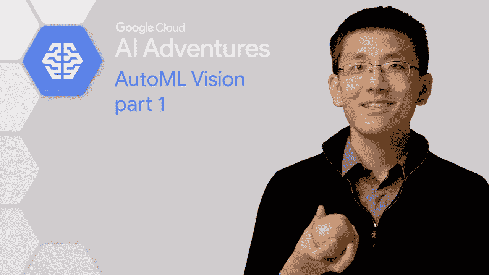

许多人一直嚷嚷着要访问 AutoML Vision alpha，我想对工作流程做一个简单的介绍，向您展示使用它的感觉，即使您还没有离开等待名单。在[第一个视频](https://www.youtube.com/watch?v=kgxfdTh9lz0)中，我们将把数据转换成 AutoML Vision 的正确格式。然后在第二部分的[中，我们将使用它建立一个模型来检测图片中的椅子是什么风格。让我们开始吧。](https://youtu.be/aUfIFoMEIgg)

# 那么……什么是 AutoML？

Cloud Vision API can identify a chair, but it’s generic

AutoML 如此引人注目的原因之一是定制模型。像 [Cloud Vision API](https://cloud.google.com/vision/) 这样的现有模型和服务可以毫无问题地识别出一张给定的图片中可能有一把椅子，但是如果您设计并制造了椅子，并且需要一种方法来对库存中的各种品牌的椅子进行分类，该怎么办呢？可以说，如果能够使用一个“定制”视觉 API 来识别您的 ***特定椅子***不是很好吗？这就是 AutoML Vision 的目标。

This is a yellow chair

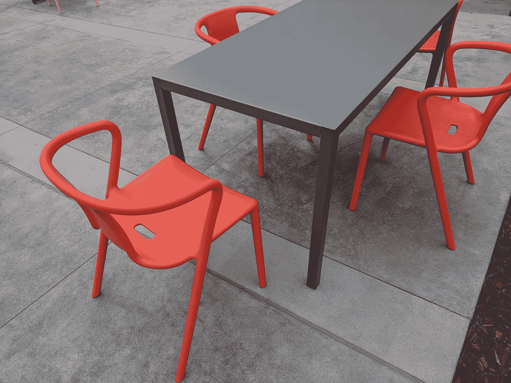

Here are some more chairs :)

**AutoML Vision 将大量带标签的照片作为输入**。你问多少张照片？理想情况下，每个对象数百个就不错了。所以走出去，开始拍照吧。如果你厌倦了点击快门按钮，你可以试试我一直在用的另一种方法。

# 用视频拍照！

为了更容易地为 AutoML Vision 捕获数据，我通过捕获我感兴趣的椅子的*视频*来收集我的训练数据，然后使用`ffmpeg`来提取帧。

我去了谷歌桑尼维尔园区，拍了一些各种不同户外椅子的视频。我还拍了一些他们周围桌子的视频，还有一辆自行车，只是为了让事情更有趣一点。

让我们来看一个例子。

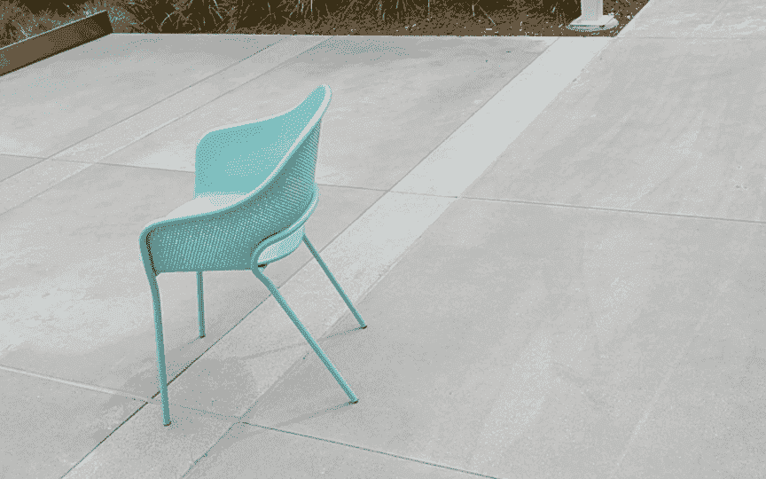

有不同形状、风格和颜色的椅子。没有视频长度超过 30 秒。我们有一张桌子的短片，还有一张自行车的短片。这就是我们将要处理的数据。

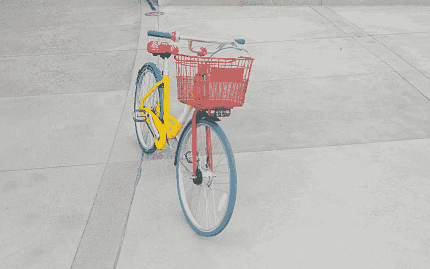

# 分割您的视频

我们想要的最终状态是一个 CSV 文件，每个图像有一行，两列，第一列是图像在 Google 云存储中的位置，第二列是标签，如“红椅子”、“桌子”或“蓝椅子”。

为了便于组织，我将每个视频放在了各自的文件夹中。然后我们可以依次对每个视频文件运行`ffmpeg`。

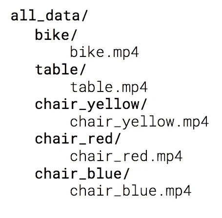

提取帧后，每个标签都有一个文件夹，里面装满了该标签的图像。这是一种组织图片的便捷方式，比用一个巨大的文件夹存放所有图片要简单得多。

`ffmpeg -i chair.mp4 chair%03d.jpg`
(文件名中的`%03d`会给我们 3 位数的填充编号，如`chair003.jpg`、`chair073.jpg`等。如果您有超过 999 张图像，您应该使用`%04d`或其他合适的值)

接下来，我们可以使用`gsutil`将图像上传到 Google 云存储，复制每个标签一个文件夹的文件夹结构:

`gsutil -m cp -r all_data gs://cloudml-demo-vcm/dataset`
(该命令递归复制/上传`all_data`中的整个文件夹结构，并使用`-m`对多个流进行复制/上传)

# 结构化您的数据

AutoML 需要一种方法来知道在哪里可以找到你所有的照片，以及每张照片中的对象。我们需要创建一个 CSV 文件，为我想要包含在数据集中的每张图像列出*路径*和*标签*。有许多方法可以实现这一点，但我选择了旋转本地 Jupyter 笔记本并创建一个熊猫数据帧以导出为 CSV 文件。让我们在下面的视频中浏览一下。

Looking for the code/notebook shown above? It’s [here](https://gist.github.com/yufengg/984ed8c02d95ce7e95e1c39da906ee04)!

好了，现在我们有了一个 CSV 文件，它描述了数据集中所有图像的位置和标签。我们准备好训练我们的模型了！

这是你将图像加载到 AutoML Vision 后的样子。CSV 文件已经通知平台每个图像的正确标签是什么。如果您的图像还没有被标记，那也没关系——UI 中内置的工具可以帮助您完成标记过程，并显示哪些图像仍未被标记。

# 第 2 部分:培训和部署 AutoML Vision

# 训练模型

训练模型就像点击训练一样简单！这是我们一直在做的所有设置的要点。它使 AutoML Vision 能够获取数据，并在先进的图像模型上训练您的数据，并自动计算出适当的超参数，如网络结构。

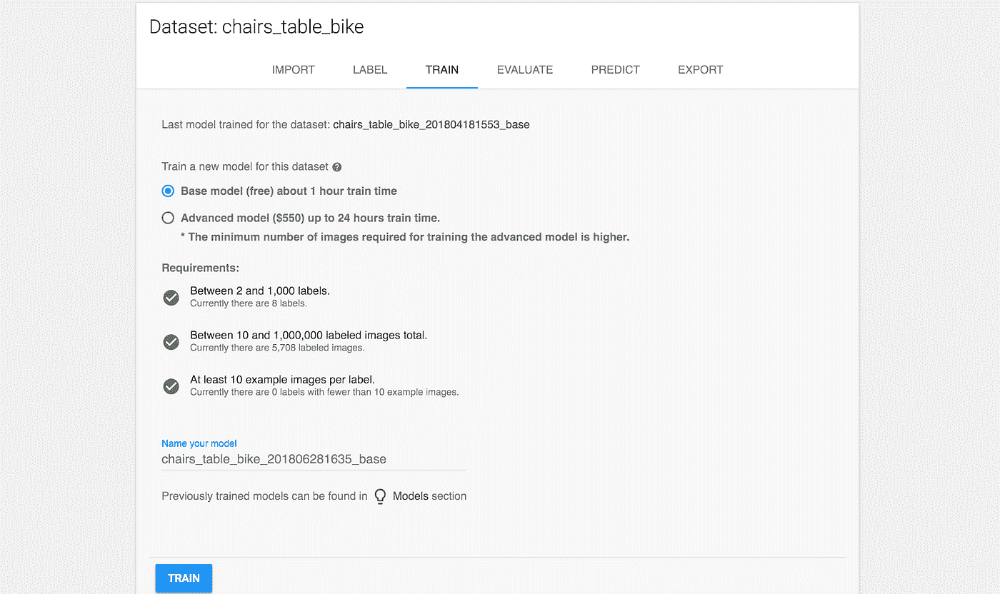

但是在您尝试更高级的模型之前，我建议您先从简单的模型开始，看看它的性能如何。这将为您提供一个基线，您可以用它来比较其他模型的相对性能。

训练开始后，去散散步，或者抓一把 coffee☕.鉴于我们已经提供了这么多数据，这需要一点时间。

# 评估您的模型

一旦训练完成，您将获得关于您的模型的各种统计数据，您可以使用这些数据来查看它的表现，以及是否有一些图像被错误标记，或者其他方面值得纠正，然后再进行重新训练。

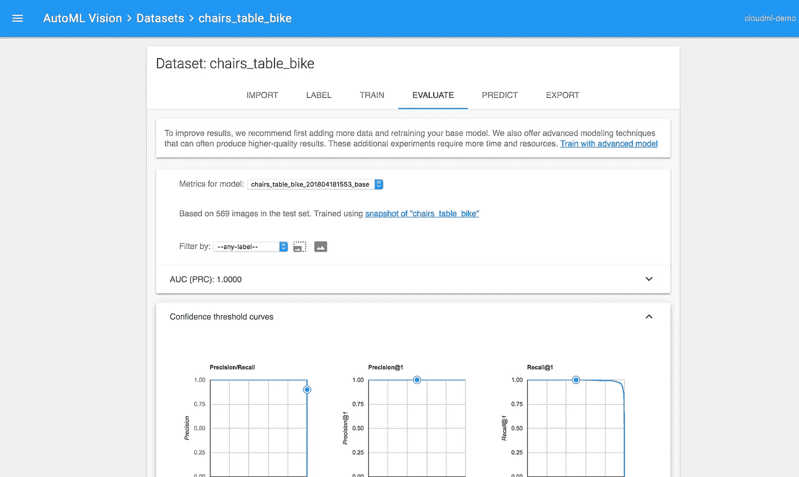

在我们的例子中，由于我们通过设计收集了非常具体、干净的数据，我们得到了一些非常高的指标。然而，真正重要的是它在新的、看不见的数据上的表现。

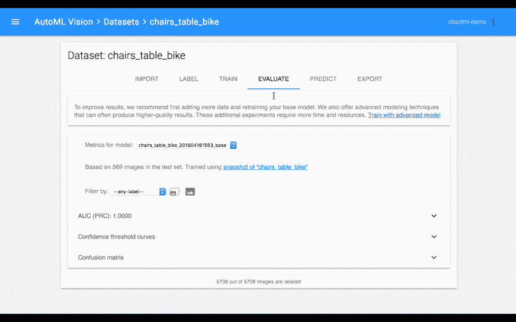

# 预测时间！

我拍了一些照片，试图挑战这个模型，看看它会返回什么。

让我们试试这张图片，它包含了自行车，以及黄色和蓝色的椅子。

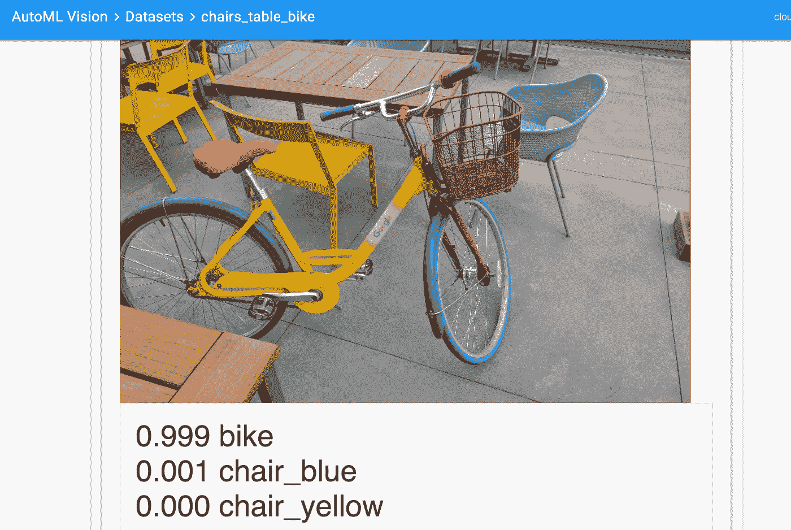

好的，这张图片主要是自行车，但也有一点黄色和蓝色的椅子。它们在背景中，在这张照片中远没有那么突出。

让我们试试另一个。

这张图片大部分是黄色的椅子，但是也有一些蓝色的椅子。模特决定它主要看到黄色的椅子，和一点蓝色的椅子。

这张大部分是蓝色椅子的照片怎么样？

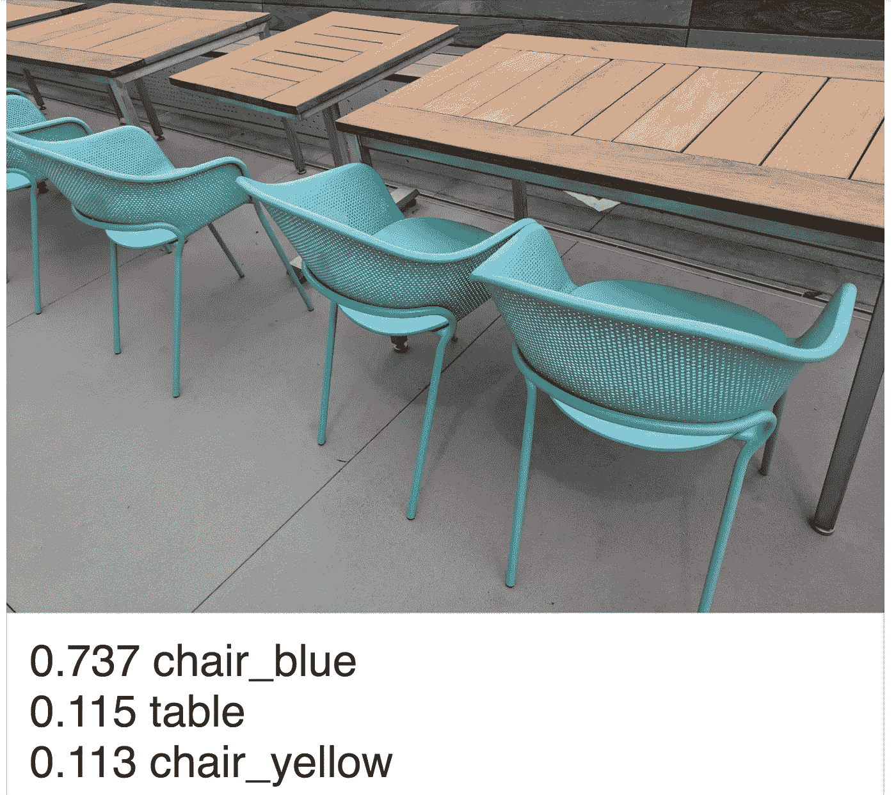

是的，这显示出大部分是蓝色的椅子，有一点桌子，有趣的是，有一点黄色的椅子，这不是预期的。不是所有的事情都是完美的，但是到目前为止，第一个选择已经被证明是相当好的。

最后，这张图片怎么样，和上一张非常相似，但是前面的椅子是黄色的？模特会怎么想？

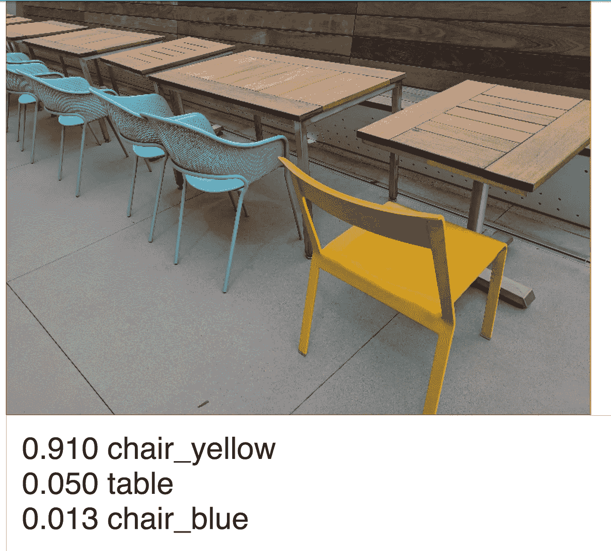

哇，前景中的黄色椅子赢得了大奖！试图找出模型和数据集中的差距，以便更好地理解如何根据您的用例收集更可靠、更有代表性的数据，这可能是一件非常有趣的事情。

# 包扎

值得指出的是，在这一点上，模型可以通过它的 REST API 来调用。该服务利用 Cloud ML Engine 的在线预测功能来提供一个定制的、自动缩放的预测服务，**，并在我们的数据集**上进行训练。

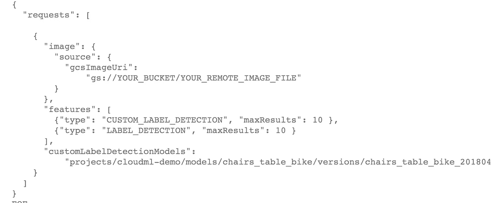

You can call your service via REST API from any server or internet-connected device

所有这一切的巧妙之处在于，一旦你的数据管道都设计好了，训练和部署机器学习模型的过程就完全不用动手了！这使您可以专注于让您的数据处于良好状态，并摆脱构建合适的计算机视觉机器学习模型的挑战。

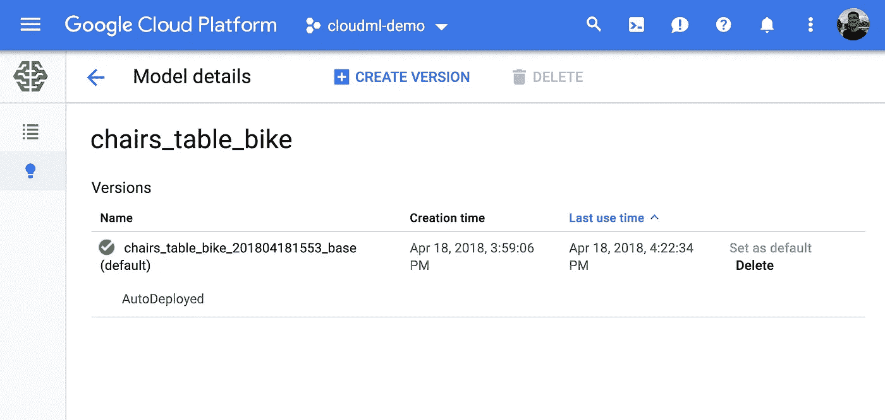

Notice the annotation “AutoDeployed” below the model name

现在，如果你不介意的话，我要去拍一些彩色椅子的视频，这样我就可以为我的 AutoML 视觉模型扩展我的数据集了！

快乐 p̵i̵c̵t̵u̵r̵e̵ *视频*-拍摄和汽车视觉模型训练！

感谢阅读本集[云 AI 冒险](https://goo.gl/UC5usG)。如果你喜欢这个系列，请为这篇文章鼓掌让我知道。如果你想要更多的机器学习动作，一定要关注媒体上的[me](https://medium.com/@yufengg)或订阅 YouTube 频道的[来观看未来的剧集。更多剧集即将推出！](https://goo.gl/S0AS51)

如果你还在读这篇文章，我希望收到你的来信！你有什么样的问题？你希望这个系列探索什么主题？有什么推荐的工具、技巧和窍门可以尝试吗？在下面的评论中分享吧！