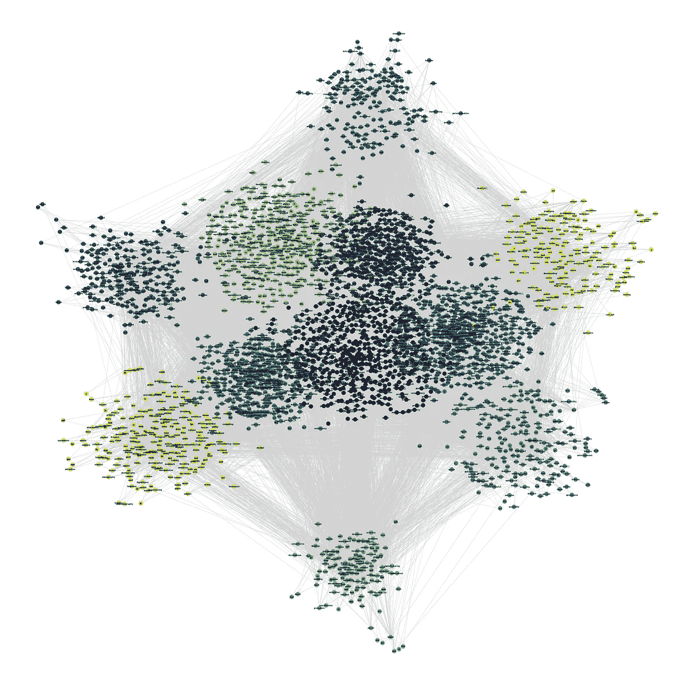
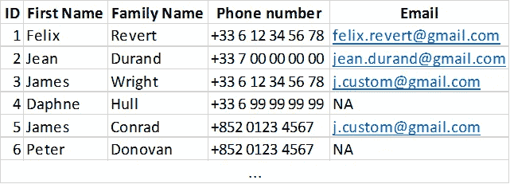
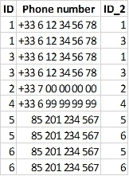
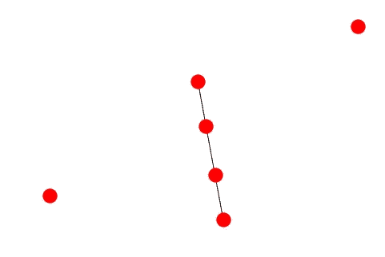
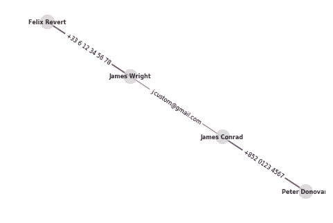

# 使用 pandas 和 networkx 开始使用 Python 进行图表分析

> 原文：<https://towardsdatascience.com/getting-started-with-graph-analysis-in-python-with-pandas-and-networkx-5e2d2f82f18e?source=collection_archive---------2----------------------->

图表分析并不是数据科学的一个新分支，但也不是数据科学家如今常用的“常用”方法。然而，图表可以做一些疯狂的事情。经典的使用案例包括欺诈检测、推荐或社交网络分析。NLP 中的一个非经典用例处理主题抽取([词图](https://safetyapp.shinyapps.io/GoWvis/))。

visualisation of a graph-of-words, where each community represent a different topic

# 考虑一个欺诈检测用例

你有一个客户数据库，并且想知道他们是如何相互联系的。特别是，您知道有些客户涉及复杂的欺诈结构，但在个人层面上可视化数据并不会带来欺诈的证据。诈骗犯看起来和其他普通客户一样。

处理用户之间的联系可以显示出比仅仅通过查看原始数据更多的信息。具体而言，对于通常的基于机器学习的评分模型来说不被认为有风险的特征(电话号码、电子邮件地址、家庭地址)可以在基于图形的评分模型中变成有风险的特征。
*例:三个电话号码相同的人，连接到其他电子邮件地址相同的人是不寻常的，有潜在的风险。电话号码的价值本身并不提供任何信息(因此，即使是最好的深度学习模型也不会从中获取任何价值)，但个人通过电话号码或电子邮件地址的相同价值联系在一起的事实可能是风险的同义词。*

让我们用 Python 来做这件事。

## 设置数据、清理和创建我们的图表

This will be our simulated user database

所以你从熊猫数据框架开始(这基本上是 Python 中的一个 Excel 表格)

好的，数据被载入 *df* 。现在，做些准备。您需要连接拥有相同电话号码和相同电子邮件的个人(由他们的 ID 表示)。我们首先从电话号码开始:

我们的数据看起来像这样:

好吧，我们有一些联系，但是有两个问题:

1.  个人与他们自己联系在一起
2.  当 X 与 Y 相连时，那么 Y 也与 X 相连，我们有两行相同的连接

让我们来清理一下:

我们的数据现在看起来像这样:

太好了，1 和 3 连在一起了，5 和 6 也是。我们对电子邮件地址也做了同样的处理(完整的代码在文章的最后分享)。现在让我们建立一个图表。我在这里只分享简单的代码部分，因为添加不同的链接类型有点棘手。

现在让我们可视化我们的数据。

## 使用 networkx 实现图形可视化

简单的 *nx.draw(G)* 给了我们以下内容:

Wooo 挺有意思的图案！但是等等，我们看不到个体是谁，有什么联系。让我们自定义它:

接得好。4 个人通过 2 个不同的电话号码和 1 个电子邮件地址联系在一起…接下来应该会有更多的调查！

## 真正工业化的下一步

让我们回顾一下我们所做的工作:

1.  从我们的用户数据库创建一个图表
2.  帮助我们看到奇怪模式的自定义可视化

如果你受业务驱动，并希望一些专家使用你所做的，你的下一个重点应该是:

1.  自动执行寻找多名相关人员的过程，或危险模式检测
2.  自动化创建可视化效果和创建带有图形可视化效果和原始数据的定制仪表板的过程

我不会在此详述，但会给你一些如何进行这两个步骤的想法

## 1.危险模式检测

这里有两种方法:

1.  从您认为有风险的个人(或您发现的欺诈者)开始，检查他们与其他个人的关系。联系到机器学习，这将是一种“监督”的方法。为了更进一步，你还可以从机器学习评分开始，识别得分最高的节点，并在图中寻找它们的连接，以捕捉更多的节点
2.  识别不寻常的模式(过多的连接、密集的网络……)。这将是类似于异常/异常值检测的“无监督”方法

在我们的示例中，我们没有已知的欺诈者，因此我们将采用第二种方法。

Networkx 已经实现了这样的算法:*度*()，*中心性*()， *pagerank* ()， *connected_components* ()…我让您定义如何用数学方法定义风险。

## 2.为业务创建可视化和自动化分析

对于大多数数据科学家来说，这听起来很老套，但是在 Excel 中有一种快速的方法。

*xlsxwriter* 包帮助您粘贴风险人物图表中的数据，并将我们创建的图表图像直接粘贴到 Excel 文件中。您将获得每个风险网络的仪表板，如下所示:

对于每个有潜在风险的网络，您可以自动创建仪表板，将其发送给专家，让他们评估/确认风险。您可以在仪表板中添加一些指标:涉及的人数，不同电话号码的数量，电子邮件地址，每个节点的 ML 分数…

我希望这篇文章对你有用，如果有用，考虑至少给 50 次掌声:)

和往常一样，[源代码](https://github.com/FelixChop/MediumArticles/blob/master/Graph_analysis_Python.ipynb)