# 机器学习入门！

> 原文：<https://towardsdatascience.com/getting-started-with-machine-learning-108622a1ef5c?source=collection_archive---------12----------------------->

## “数据”世界和机器学习导论

近年来，关于“机器学习”、“数据分析”、“人工智能”、“深度学习”、“大数据”等术语有很多讨论。数据科学被评为 21 世纪最性感的工作。这些术语中的大多数很少互换使用。然而，每个术语虽然相关，但它们的含义是不同的，并且每个术语都为它们可以应用的各个领域提供了大量的机会。

## **分解“数据”的流行词汇**

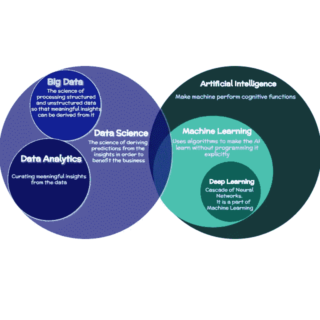

Data buzzwords

每个术语的含义可以借助下面的例子来分解

*考虑一个专门设计来清洁地板的机器人。这个机器人正在工厂旁边的一所房子里使用。由于这个磨坊，白天会有大量灰尘进入室内。晚上工厂关门，因此灰尘相对较少。周末工厂也关门。因此，灰尘在周末也较少。现在，机器人必须明白应该如何、何时以及在哪里清洁地板。*

Robot for cleaning the floor

机器人必须知道工作日白天灰尘较多，夜晚和周末灰尘较少。这个机器人通过一组给定的输入和输出进行学习的过程就是**机器学习。**【7】

既然机器人已经知道何时灰尘更多，它必须做出适当的决定，在白天多打扫，在晚上和周末少打扫。这就是**人工智能**。

机器人在传感器的帮助下收集灰尘堆积较多的区域的数据。传感器通过房屋成员的语音输入(以语音的形式)捕捉数据，通过房屋各个部分的照片(以图像的形式)等捕捉数据。处理这些结构化和非结构化的数据以获得有意义的信息就是**大数据。**【6】

从机器人捕获的数据中获得有意义的见解是数据分析。对某些细节的关注，如一天中不同时间不同的电池消耗模式，房屋角落有更多灰尘等。形成了数据分析的基础，这从业务角度来看非常重要。

比方说，通过数据分析，我们了解机器人不同的电池消耗周期。根据这些信息建立业务模型非常重要。这种数据模式形成了关键决策的基础，如引入在夜间自动触发的电池节电器，这最终有助于业务。这将有助于机器人获得更长的电池寿命。机器人可以以此作为 USP 在市场上推广。因此，基于精选的见解做出商业决策以获得最大利益被称为**数据科学。**【4】

## **潜入机器学习-**

**什么是机器学习？**

通常，机器学习被定义为允许机器(计算机)理解或行动而不必显式地对系统或程序进行硬编码的技术。[11]

考虑以下给人阅读的信息-

*在印度，从六月到九月都会下雨。沿海地区降雨量大，而内陆地区降雨量适中。大部分强降雨发生在七月。在过去的 4 年里(2013-2017 年), 7 月的前 2 周观察到强降雨*

现在，如果我请你，作为一个人，回答以下问题

*今天，即 2018 年 7 月 4 日，孟买下雨的概率有多大？*

显而易见的答案是降雨概率大。现在我们希望机器也能理解和学习这一点。给机器输入一组过去的数据(输入和输出)后，机器应该能够“思考”新输入数据的输出是什么。

通常在机器学习问题中，我们有一组训练数据。该训练数据具有输入和相应的输出。现在，机器将被输入一个机器学习算法来学习这个数据集，并在此基础上形成一个假设。基于这个假设，机器应该能够预测未知输入的输出。

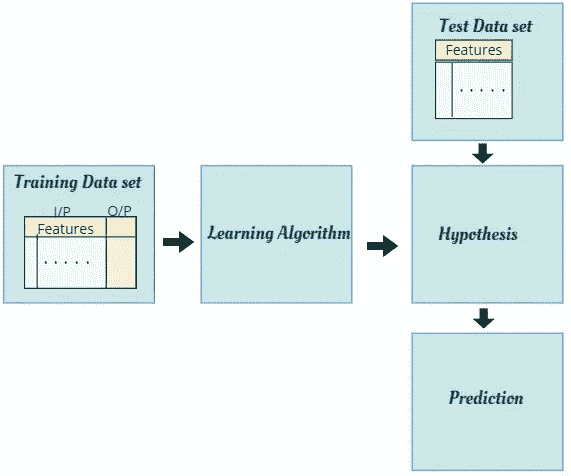

Basic Block diagram of a machine learning algorithm [8]

## **解决机器学习问题的步骤**

机器学习不是一步到位的过程。通常遵循以下步骤来解决机器学习算法[14]。我已经用简单的‘T10’虹膜数据集解释过了。[1]

我修改了数据集中的一些值来解释下面的步骤。点击查看虹膜数据集

1.  **问题定义-**

在从过去的数据集中学习之前，重要的是首先了解我们到底想要学习什么。这个问题可以是分类问题，也可以是回归问题。整个机器学习建模取决于目标或问题定义。在我们的数据集中，我们有花瓣和萼片的长度和宽度。我们必须首先理解我们期望解决这个数据集的什么问题。我们是否必须建立一个假设来预测花瓣长度、萼片长度、萼片宽度和花瓣宽度已知的新花的类别，或者我们是否必须只分析分类是否可能等等。

**2。框架**

下一步是理解我们的特征或属性(通常表示为 X)是什么，以及对于给定的训练数据集，我们的目标或输出(通常表示为 y)是什么。考虑[虹膜数据集](https://archive.ics.uci.edu/ml/datasets/iris)

特征 X =萼片长度(slen)、萼片宽度(swid)、花瓣长度(plen)和花瓣宽度(pwid)

目标 y =类别

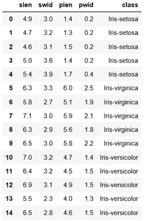

Iris Data Set [1]

**3。导入或获取数据集**

我们必须了解如何将数据导入/获取到我们的程序中。数据可以是结构化或非结构化的，并且可以是逗号分隔的值(。csv)文件或 Excel(。xlsx)表等。对于. csv 文件，可以使用以下命令导入数据集-

dataSet = pandas . read _ CSV(' data frame _ name . CSV ')

Acquiring Data

**4。清洁和精炼**

数据集可能有丢失的值或垃圾值，因此无法处理数据。因此，需要对数据进行预处理。我们必须在采集的数据集中检查以下内容-

*   检查缺少的值-给定数据集中的一些值不可用
*   检查垃圾值——给定数据集中的一些值在逻辑上是不正确的(例如，如果我们在谈论萼片长度，而值是“紫色”)
*   检查异常值(与其他值相比，给定数据集中的一些值超出了范围。例如，如果萼片长度值为{1.5，2.3，3.2，2.2，1.75，15.2，3.2}，那么 15.2 就是异常值。)

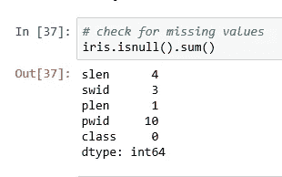

Null values in the data set

**缺失/垃圾值的处理:**

*   删除缺失/无用的值
*   将区间值转换为分类数据
*   使用建模技术
*   替换数据点(插补)

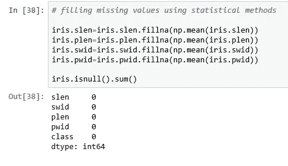

Replacing the null values using statistical methods

*标准化* -在细化的同时也可以执行标准化。例如，如果有一个城市名称列表，那么我们可以有“纽约市”，“纽约市”，“纽约市”。因为所有这三个名字都代表同一个城市，所以我们可以用一个通用的表示法来表示所有这三个名字。同样，日期也可以用日/月/年格式或日/月/年或日/月/YY 等格式书写。只要所有的值都在谈论同一个日期，它们就必须以相同的方式表示。

**5。探索数据**

在获取和处理数据时，是时候探索数据集的属性了。这个过程被称为探索性数据分析(EDA)。它基本上是总结我们正在处理的数据集的过程。[2].

我们必须了解我们处理的是什么类型的数据，因为它对进一步的分析很有用。数据可分类如下-

*数据集中数据的分类-*

数字——数据集中的任何值，如人的身高或项目数量等，都是数字值。

分类数据点，其中可以分类为 A 类和 B 类，称为分类数据点。

A)有序数据-在数据点的分类中，如果类别的排序是可能的，因为类别 A 比类别 B 具有更高的排序，则它是有序数据点。

b)名义上的-在数据点的分类中，如果类别的排序是不可能的，或者如果所有类别被认为是相同的排序，那么它被称为名义上的数据点。

*平衡和不平衡数据集-*

数据集可以是平衡的或非平衡的数据集。假设数据集可以分为 2 类——第 1 类或第 2 类。如果属于类别 1 和类别 2 的数据点数量几乎相等，那么该数据集被称为**平衡**数据集。

类别比率达到 **70-30** 的数据集可以被认为是平衡数据集。

平衡数据集的示例-

如果数据集的类比率大于 70–30，比如说**90–10**，那么数据集被认为是**不平衡数据集**

不平衡数据集的示例-

在解决机器学习算法时，确保我们的数据集是平衡的数据集是极其重要的。否则，无论我们使用哪种算法，都不会得到合适的结果。

不平衡数据集的解决方案-

删除数据点数量较多的几个样本

通过复制或使用统计方法，添加数据点数较少的几个样本

通过获取少量数据点的重复样本，使用批处理执行机器学习

Iris 数据集是平衡数据集，所有 3 个类别具有几乎相同数量的数据点-

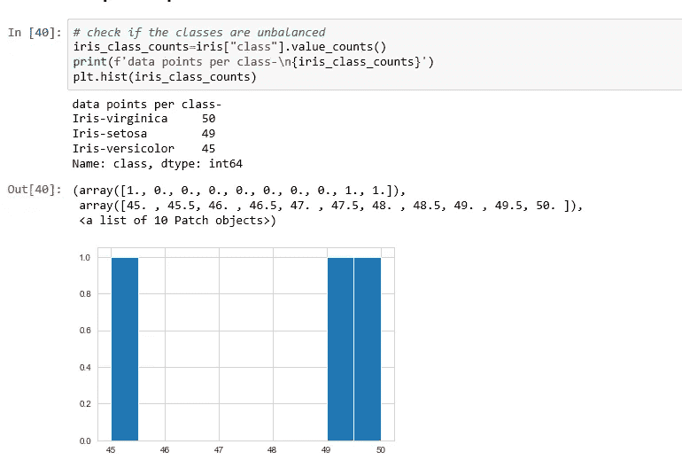

*汇总数据-*

可以使用统计方法和视觉方法来总结数据。

统计方法——包括寻找平均值、中位数、众数、标准差、协方差等。的数据点。统计方法帮助我们理解数据集的范围、中心值等

视觉方法-包括绘制直方图、箱线图、散点图、累积密度函数(CDF)、概率密度函数(PDF)等。可视化方法清楚地显示了数据集的分布方式、异常值、数据集中的位置等。

Plotting PDFs

**6。变换-**

一旦我们处理完数据集，我们就可以转换数据集，以便有效地使用它。我们可以执行特征选择、创建新特征、删除冗余特征等。

数据表的转换包括-

a)创建新功能

有时，可能需要创建新的功能。这可以包括从由现有特征管理的洞察中生成新特征，或者使用统计方法，例如使用现有特征的平均值或中值等。当我们必须减少数据集中的特征或列的数量时，这一步很重要。如果我们有两列“a”和“b ”,它们的数据可以用它们的平均值“c”来更好地表示，那么“a”和“b”可以被丢弃，新生成的“c”可以被添加到数据集中，从而降低数据的维数。可以使用以下技术创建新功能-

a)特征工具——可以使用 H2O、TPOT、Auto- sklearn 等自动化特征工程工具[13]

b)手动创建-通过分组、汇总、派生等。可以生成新的特征

b)编码(分类数据)

如果我们有一个列名是字符串形式的数据集，那么我们必须对这些列进行编码，将它们转换成数值，以便进一步计算。这可以使用以下任何一种编码技术来完成

a)一次热编码-扩展现有数据

Example of One hot encoding

因为一键编码扩展了表格，所以当特征的数量很大时，它不是优选的。

b)标签编码

下面是一个标签编码的例子。我使用了 Sci-kit Learn 的 LabelEncoder 库

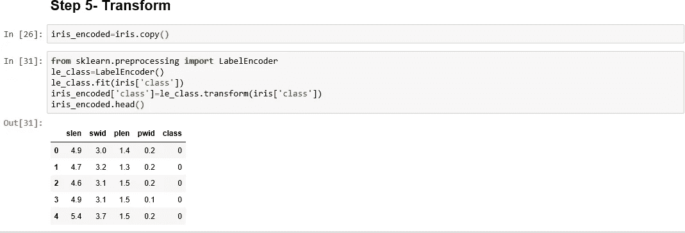

Label Encoding

**7。数据建模-**

这一步包括选择正确的算法来训练我们的数据。必须根据算法是回归问题还是分类问题、精度要求等来选择合适的训练算法。

因为我们的问题是分类问题，所以我选择了决策树算法。

在构建模型时，必须拆分数据集，以便可以在同一个数据集上训练、验证和测试数据。

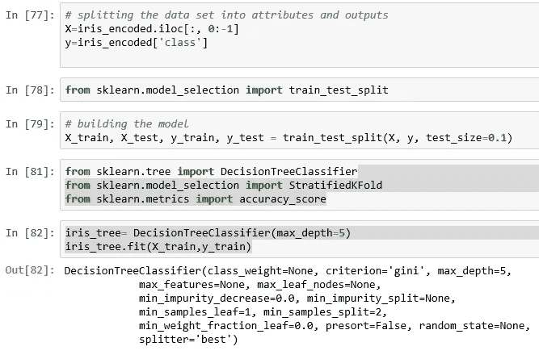

Code snippet for splitting the data into training and testing data sets

*一次保持验证-* 在该方法中，数据被分割，使得 70%的数据可用于训练模型，20%的数据可用于验证模型，10%的数据可用于测试模型

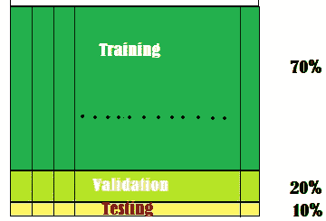

One hold

*K 折交叉验证-* 交叉验证或 K 折验证是机器学习中常用的验证方法。在这种方法中，训练和验证是在迭代中执行的，其中迭代的次数由 k 定义。整个数据集被划分成互补的子集，具有很少的折叠作为训练、很少的验证和很少的测试数据，其中测试数据与训练和验证数据保持分离。对于每次迭代，不同的子集被用于验证。因此，每个子集都用于训练和验证。这减少了可变性。[5]

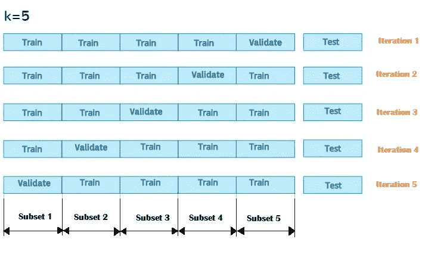

Cross validation

**8。数据验证**

使用验证技术(如上一步中提到的一次保持验证和交叉验证)对照验证数据测试已在训练数据集上训练的数据。可以计算训练和验证数据集的准确性。训练和测试精度要高，相互接近。

Accuracy when Max depth=5

Accuracy when Max depth=10

**9。超参数调谐**

在验证数据集时，我们可以调整超参数以优化模型。该模型将被优化，直到它在训练和验证数据集上都令人满意地执行。

在我们的数据集中，对于 max_depth=5，我们得到了不错的训练(0.998)和验证准确度(0.923)。如果我们没有得到很好的准确性，我们可以改变一些超参数，如决策树中 max_depth 的值或 k(折叠或子集的数量)的值。我们得到了完美的训练集精度，但是验证精度相对较低，max_depth 为 10。因此，我们可以绘制一个图表，找出哪个 max_depth 将提供最佳精度，并将超级参数 max_depth 设置为相应的值。[10]

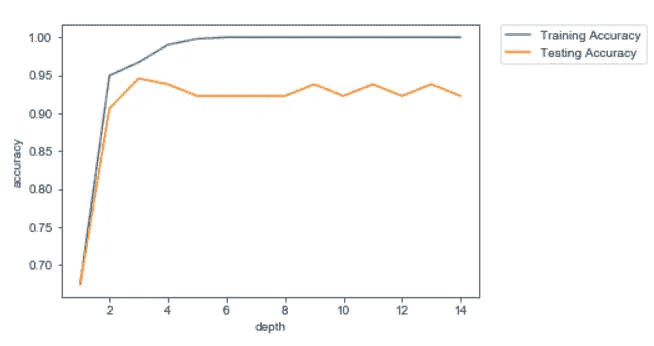

Training and testing accuracy for different max_depths

观察该图可以得出结论，对于 max_depth=3 或 4，测试精度高。因此，我们相应地调整我们的超参数 max_depth。

**10。测试**

一旦数据得到优化，就可以进行测试了。测试数据集与训练和验证数据集分开。它不参与优化过程。这是测试该模型是否适用于一般未知数据集的最后一步。

我们的模型在测试数据上给出了 0.866 的准确度。

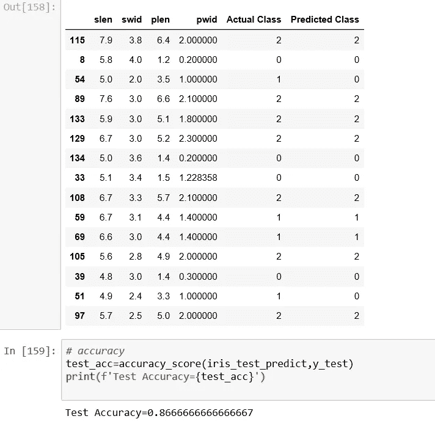

Test data output

查看完整的代码[这里](https://github.com/kavitaanant/GettingStartedWithML)

总结一下，机器学习的工作流程如下-

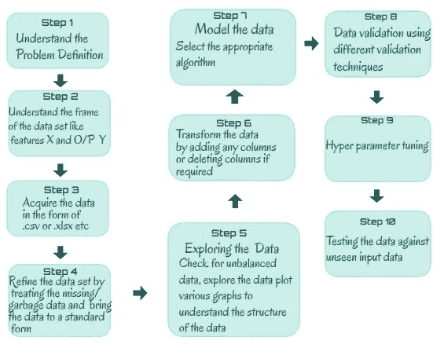

## 参考文献-

[1]虹膜数据集-[https://archive.ics.uci.edu/ml/datasets/iris](https://archive.ics.uci.edu/ml/datasets/iris)

[www.appliedaicourse.com](https://www.appliedaicourse.com/)

[www.dummies.com](https://www.dummies.com/education/math/statistics/types-of-statistical-data-numerical-categorical-and-ordinal/)

[https://youtu.be/w-8MTXT_N6A](https://youtu.be/w-8MTXT_N6A)

[5][https://en . Wikipedia . org/wiki/Cross-validation _(statistics)](https://en.wikipedia.org/wiki/Cross-validation_(statistics))

[6][https://www . simpli learn . com/data-science-vs-big-data-vs-data-analytics-article](https://www.simplilearn.com/data-science-vs-big-data-vs-data-analytics-article)

[7][https://www . machine curve . com/index . PHP/2017/09/30/the-differences-between-artificial-intelligence-machine-learning-more/# now-what-a-data-scientist](https://www.machinecurve.com/index.php/2017/09/30/the-differences-between-artificial-intelligence-machine-learning-more/#now-what-is-a-data-scientist)

[8][http://communication police . blogspot . com/2016/06/machine-learning-supervised unsupervised . html](http://communicationpolice.blogspot.com/2016/06/machine-learning-supervisedunsupervised.html)

[9][https://sci kit-learn . org/stable/modules/generated/sk learn . model _ selection . train _ test _ split . html](https://scikit-learn.org/stable/modules/generated/sklearn.model_selection.train_test_split.html)

[https://matplotlib.org/users/pyplot_tutorial.html](https://matplotlib.org/users/pyplot_tutorial.html)

[11][https://www . coursera . org/lecture/machine-learning/what-is-machine-learning-Ujm7v](https://www.coursera.org/lecture/machine-learning/what-is-machine-learning-Ujm7v)

[12][https://sebastianraschka . com/Articles/2014 _ intro _ supervised _ learning . html](https://sebastianraschka.com/Articles/2014_intro_supervised_learning.html)

[https://www.featuretools.com/](https://www.featuretools.com/)

[14]由 Analytics Vidya 在为期三天的 Data Hack 峰会期间组织的应用机器学习研讨会。日期-2018 年 11 月 24 日，发言人- Amit Kapoor